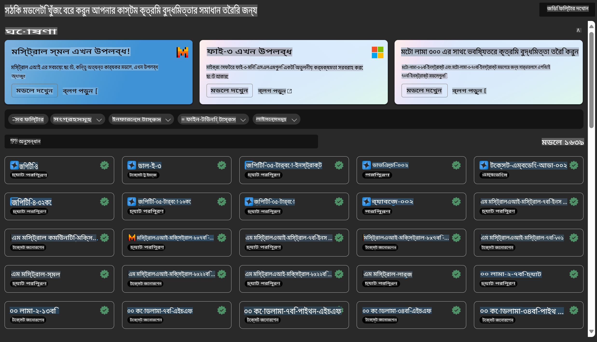

# **Azure Machine Learning Service পরিচিতি**

[Azure Machine Learning](https://ml.azure.com?WT.mc_id=aiml-138114-kinfeylo) একটি ক্লাউড পরিষেবা যা মেশিন লার্নিং (ML) প্রকল্পের জীবনচক্রকে দ্রুততর ও পরিচালনা করার জন্য ডিজাইন করা হয়েছে।

ML পেশাজীবী, ডেটা বিজ্ঞানী, এবং ইঞ্জিনিয়াররা এটি তাদের দৈনন্দিন কাজের প্রবাহে ব্যবহার করতে পারেন:

- মডেল প্রশিক্ষণ ও স্থাপন করা।
- মেশিন লার্নিং অপারেশনস (MLOps) পরিচালনা করা।
- আপনি Azure Machine Learning-এ একটি মডেল তৈরি করতে পারেন অথবা PyTorch, TensorFlow, বা scikit-learn এর মতো ওপেন-সোর্স প্ল্যাটফর্ম থেকে তৈরি মডেল ব্যবহার করতে পারেন।
- MLOps টুল আপনাকে মডেল পর্যবেক্ষণ, পুনরায় প্রশিক্ষণ এবং পুনরায় স্থাপনে সহায়তা করে।

## Azure Machine Learning কাদের জন্য?

**ডেটা বিজ্ঞানী এবং ML ইঞ্জিনিয়াররা**

তারা তাদের দৈনন্দিন কাজের প্রবাহকে দ্রুততর ও স্বয়ংক্রিয় করার জন্য টুল ব্যবহার করতে পারেন।  
Azure ML ন্যায্যতা, ব্যাখ্যাযোগ্যতা, ট্র্যাকিং এবং নিরীক্ষণযোগ্যতার জন্য ফিচার সরবরাহ করে।

**অ্যাপ্লিকেশন ডেভেলপাররা**

তারা মডেলগুলোকে অ্যাপ্লিকেশন বা পরিষেবাগুলোর সাথে সহজেই একীভূত করতে পারেন।

**প্ল্যাটফর্ম ডেভেলপাররা**

তারা একটি শক্তিশালী টুলস সেট ব্যবহার করতে পারেন যা টেকসই Azure Resource Manager API দ্বারা সমর্থিত।  
এই টুলস উন্নত ML টুলিং তৈরি করতে সহায়ক।

**এন্টারপ্রাইজ**

Microsoft Azure ক্লাউডে কাজ করে, এন্টারপ্রাইজগুলো পরিচিত নিরাপত্তা এবং ভূমিকা-ভিত্তিক অ্যাক্সেস নিয়ন্ত্রণ থেকে উপকৃত হয়।  
সুরক্ষিত ডেটা এবং নির্দিষ্ট অপারেশনে অ্যাক্সেস নিয়ন্ত্রণ করতে প্রকল্প সেটআপ করতে পারেন।

## টিমের সকল সদস্যের জন্য উৎপাদনশীলতা
ML প্রকল্পগুলো সাধারণত একটি বৈচিত্র্যময় দক্ষতার টিম প্রয়োজন হয় তা তৈরি ও বজায় রাখতে।

Azure ML টুল সরবরাহ করে যা আপনাকে সক্ষম করে:
- আপনার টিমের সাথে শেয়ার করা নোটবুক, কম্পিউট রিসোর্স, সার্ভারলেস কম্পিউট, ডেটা এবং পরিবেশের মাধ্যমে সহযোগিতা করতে।
- ন্যায্যতা, ব্যাখ্যাযোগ্যতা, ট্র্যাকিং এবং নিরীক্ষণযোগ্যতার সাথে মডেল তৈরি করতে, যা লিনিয়েজ এবং নিরীক্ষা সম্মতির প্রয়োজনীয়তা পূরণ করে।
- দ্রুত ও সহজে স্কেলে ML মডেল স্থাপন করতে এবং সেগুলো দক্ষতার সাথে পরিচালনা ও নিয়ন্ত্রণ করতে MLOps ব্যবহার করতে।
- বিল্ট-ইন গভর্নেন্স, নিরাপত্তা এবং সম্মতির সাথে যেকোনো জায়গায় মেশিন লার্নিং ওয়ার্কলোড চালাতে।

## ক্রস-কমপ্যাটিবল প্ল্যাটফর্ম টুলস

ML টিমের যেকোনো সদস্য তাদের পছন্দের টুল ব্যবহার করে কাজ সম্পন্ন করতে পারেন।  
আপনি দ্রুত পরীক্ষা-নিরীক্ষা, হাইপারপ্যারামিটার টিউনিং, পাইপলাইন তৈরি, বা ইনফারেন্স পরিচালনা করছেন কিনা, আপনি পরিচিত ইন্টারফেস ব্যবহার করতে পারেন, যেমন:
- Azure Machine Learning Studio  
- Python SDK (v2)  
- Azure CLI (v2)  
- Azure Resource Manager REST APIs  

আপনি যখন মডেলগুলোর পরিমার্জন করেন এবং ডেভেলপমেন্ট চক্র জুড়ে সহযোগিতা করেন, তখন Azure Machine Learning studio UI-এর মধ্যে সম্পদ, রিসোর্স, এবং মেট্রিকগুলো শেয়ার ও খুঁজে পেতে পারেন।

## **Azure ML-এ LLM/SLM**

Azure ML-এ অনেক LLM/SLM সম্পর্কিত ফাংশন যুক্ত করা হয়েছে, যা LLMOps এবং SLMOps একত্রিত করে একটি এন্টারপ্রাইজ-ব্যাপী জেনারেটিভ আর্টিফিশিয়াল ইন্টেলিজেন্স প্রযুক্তি প্ল্যাটফর্ম তৈরি করেছে।

### **মডেল ক্যাটালগ**

এন্টারপ্রাইজ ব্যবহারকারীরা বিভিন্ন ব্যবসায়িক দৃশ্যপট অনুযায়ী বিভিন্ন মডেল স্থাপন করতে পারেন Model Catalog-এর মাধ্যমে এবং মডেলকে Model as Service হিসেবে প্রদান করতে পারেন যাতে এন্টারপ্রাইজ ডেভেলপার বা ব্যবহারকারীরা এটি অ্যাক্সেস করতে পারেন।

Azure Machine Learning studio-তে Model Catalog হলো একটি কেন্দ্র যেখানে বিভিন্ন মডেল আবিষ্কার এবং ব্যবহার করা যায়, যা আপনাকে জেনারেটিভ AI অ্যাপ্লিকেশন তৈরি করতে সক্ষম করে।  
Model Catalog-এ শত শত মডেল রয়েছে, যা Azure OpenAI service, Mistral, Meta, Cohere, Nvidia, Hugging Face-এর মতো মডেল প্রদানকারীদের অন্তর্ভুক্ত, এবং Microsoft দ্বারা প্রশিক্ষিত মডেলগুলোও অন্তর্ভুক্ত।  
Microsoft ছাড়া অন্যান্য প্রদানকারীদের মডেল Microsoft-এর Product Terms-এ Non-Microsoft Products হিসেবে সংজ্ঞায়িত এবং মডেলের সাথে প্রদত্ত শর্ত অনুযায়ী ব্যবহার করতে হবে।

### **জব পাইপলাইন**

একটি মেশিন লার্নিং পাইপলাইনের মূল বিষয় হলো একটি সম্পূর্ণ মেশিন লার্নিং কাজকে একাধিক ধাপে বিভক্ত করা।  
প্রতিটি ধাপ একটি ব্যবস্থাযোগ্য উপাদান, যা পৃথকভাবে উন্নত, অপ্টিমাইজ, কনফিগার এবং স্বয়ংক্রিয় করা যায়।  
ধাপগুলো সুস্পষ্ট ইন্টারফেসের মাধ্যমে সংযুক্ত। Azure Machine Learning pipeline service স্বয়ংক্রিয়ভাবে পাইপলাইনের ধাপগুলোর মধ্যে সব নির্ভরতা পরিচালনা করে।

SLM / LLM-এর ফাইন-টিউনিংয়ে, আমরা পাইপলাইনের মাধ্যমে আমাদের ডেটা, প্রশিক্ষণ, এবং জেনারেশন প্রক্রিয়া পরিচালনা করতে পারি।

### **প্রম্পট ফ্লো**

Azure Machine Learning prompt flow ব্যবহারের সুবিধা  
Azure Machine Learning prompt flow এমন কিছু সুবিধা প্রদান করে যা ব্যবহারকারীদের ধারণা থেকে পরীক্ষা-নিরীক্ষা এবং শেষ পর্যন্ত প্রোডাকশন-রেডি LLM-ভিত্তিক অ্যাপ্লিকেশন তৈরিতে সহায়তা করে:

**প্রম্পট ইঞ্জিনিয়ারিংয়ে দক্ষতা**

- ইন্টারেক্টিভ লেখার অভিজ্ঞতা: Azure Machine Learning prompt flow ফ্লো-এর কাঠামোর ভিজ্যুয়াল উপস্থাপনা প্রদান করে, যা ব্যবহারকারীদের তাদের প্রকল্পগুলো সহজেই বুঝতে এবং নেভিগেট করতে সহায়তা করে। এটি একটি নোটবুকের মতো কোডিং অভিজ্ঞতাও প্রদান করে যা ফ্লো ডেভেলপমেন্ট এবং ডিবাগিংকে আরও কার্যকর করে তোলে।  
- প্রম্পট টিউনিংয়ের জন্য ভ্যারিয়েন্ট: ব্যবহারকারীরা একাধিক প্রম্পট ভ্যারিয়েন্ট তৈরি ও তুলনা করতে পারেন, যা একটি পুনরাবৃত্তিমূলক পরিমার্জন প্রক্রিয়াকে সহজ করে তোলে।  

**এন্টারপ্রাইজ প্রস্তুতি LLM-ভিত্তিক অ্যাপ্লিকেশনের জন্য**

- সহযোগিতা: Azure Machine Learning prompt flow টিম সহযোগিতা সমর্থন করে, যেখানে একাধিক ব্যবহারকারী প্রম্পট ইঞ্জিনিয়ারিং প্রকল্পে একসাথে কাজ করতে, জ্ঞান শেয়ার করতে এবং ভার্সন নিয়ন্ত্রণ বজায় রাখতে পারেন।  
- অল-ইন-ওয়ান প্ল্যাটফর্ম: Azure Machine Learning prompt flow প্রম্পট ইঞ্জিনিয়ারিং প্রক্রিয়ার পুরোটা সহজ করে তোলে, উন্নয়ন, মূল্যায়ন, স্থাপন এবং পর্যবেক্ষণ থেকে শুরু করে। ব্যবহারকারীরা সহজেই তাদের ফ্লোগুলোকে Azure Machine Learning এন্ডপয়েন্ট হিসেবে স্থাপন করতে এবং রিয়েল-টাইমে তাদের পারফরম্যান্স পর্যবেক্ষণ করতে পারেন, যা সর্বোত্তম কার্যকারিতা এবং ধারাবাহিক উন্নতি নিশ্চিত করে।  

Azure Machine Learning prompt flow ব্যবহারকারীদের প্রম্পট ইঞ্জিনিয়ারিং দক্ষতা বাড়াতে, কার্যকরভাবে সহযোগিতা করতে, এবং সফল LLM-ভিত্তিক অ্যাপ্লিকেশন ডেভেলপমেন্ট ও স্থাপনের জন্য এন্টারপ্রাইজ-গ্রেড সমাধানগুলো ব্যবহার করতে সক্ষম করে।  

Azure ML-এর কম্পিউটিং শক্তি, ডেটা, এবং বিভিন্ন উপাদান একত্রিত করে, এন্টারপ্রাইজ ডেভেলপাররা সহজেই তাদের নিজস্ব আর্টিফিশিয়াল ইন্টেলিজেন্স অ্যাপ্লিকেশন তৈরি করতে পারেন।  

**অস্বীকৃতি**:  
এই নথি মেশিন-ভিত্তিক এআই অনুবাদ পরিষেবা ব্যবহার করে অনুবাদ করা হয়েছে। আমরা যথাসম্ভব সঠিকতার জন্য চেষ্টা করি, তবে দয়া করে মনে রাখবেন যে স্বয়ংক্রিয় অনুবাদে ভুল বা অসঙ্গতি থাকতে পারে। মূল ভাষায় থাকা মূল নথিটিকে প্রামাণিক উৎস হিসেবে বিবেচনা করা উচিত। গুরুত্বপূর্ণ তথ্যের জন্য, পেশাদার মানব অনুবাদ সুপারিশ করা হয়। এই অনুবাদের ব্যবহার থেকে উদ্ভূত যেকোনো ভুল বোঝাবুঝি বা ভুল ব্যাখ্যার জন্য আমরা দায়ী নই। 