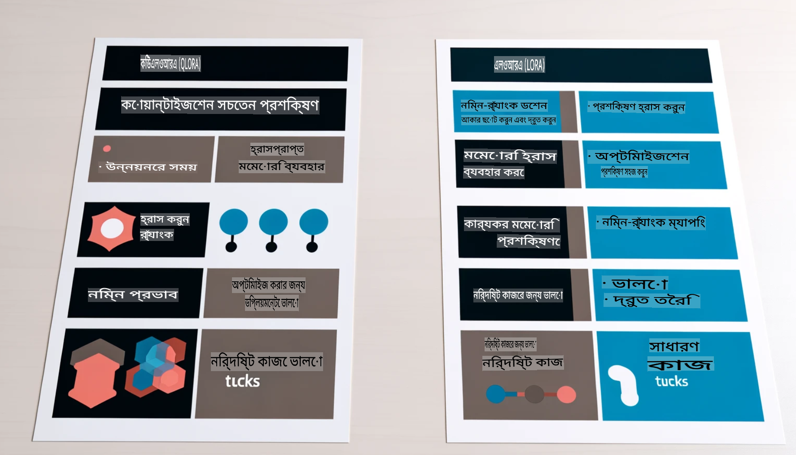

# **Phi-3 কে একটি শিল্প বিশেষজ্ঞে রূপান্তরিত করুন**

Phi-3 মডেলকে শিল্পে প্রয়োগ করতে হলে, মডেলের সাথে শিল্প সম্পর্কিত ব্যবসায়িক ডেটা যোগ করতে হবে। আমাদের কাছে দুটি ভিন্ন পদ্ধতি রয়েছে: প্রথমটি হলো RAG (Retrieval Augmented Generation) এবং দ্বিতীয়টি হলো Fine Tuning।

## **RAG বনাম Fine-Tuning**

### **Retrieval Augmented Generation**

RAG হলো ডেটা পুনরুদ্ধার + টেক্সট জেনারেশন। এন্টারপ্রাইজের কাঠামোগত এবং অ-কাঠামোগত ডেটা ভেক্টর ডেটাবেসে সংরক্ষিত থাকে। প্রাসঙ্গিক বিষয়বস্তু অনুসন্ধানের সময়, সংশ্লিষ্ট সারাংশ এবং বিষয়বস্তু খুঁজে বের করে একটি প্রসঙ্গ তৈরি করা হয় এবং LLM/SLM এর টেক্সট সম্পন্ন করার ক্ষমতার সাথে মিলে বিষয়বস্তু তৈরি করা হয়।

### **Fine-tuning**

Fine-tuning একটি নির্দিষ্ট মডেলের উন্নতির উপর ভিত্তি করে কাজ করে। এটি মডেলের অ্যালগরিদম থেকে শুরু করার প্রয়োজন হয় না, তবে ডেটা ক্রমাগত সঞ্চয় করতে হয়। শিল্প ক্ষেত্রে আরও নির্ভুল শব্দচয়ন এবং ভাষার প্রকাশের প্রয়োজন হলে Fine-tuning সেরা পছন্দ। তবে যদি আপনার ডেটা প্রায়ই পরিবর্তিত হয়, Fine-tuning জটিল হয়ে উঠতে পারে।

### **কিভাবে বেছে নেবেন**

1. যদি আমাদের উত্তরের জন্য বাইরের ডেটার প্রয়োজন হয়, তাহলে RAG হলো সেরা পছন্দ।

2. যদি স্থিতিশীল এবং নির্ভুল শিল্প জ্ঞান আউটপুট করতে হয়, তাহলে Fine-tuning একটি ভালো পছন্দ হবে। RAG প্রাসঙ্গিক বিষয়বস্তু টানতে অগ্রাধিকার দেয়, তবে এটি সব সময় বিশেষায়িত বিষয়গুলো সঠিকভাবে ধরতে পারে না।

3. Fine-tuning এর জন্য উচ্চ-মানের ডেটাসেট প্রয়োজন, এবং যদি এটি একটি ছোট ডেটার পরিসীমা হয়, তাহলে তেমন পার্থক্য দেখা যাবে না। RAG বেশি নমনীয়।

4. Fine-tuning একটি ব্ল্যাক বক্স, এটি একটি রহস্যময় পদ্ধতি, এবং এর অভ্যন্তরীণ প্রক্রিয়া বোঝা কঠিন। কিন্তু RAG ডেটার উৎস খুঁজে বের করা সহজ করে তোলে, যার ফলে ভুল বা বিভ্রান্তিমূলক বিষয়বস্তু সংশোধন করা যায় এবং আরও স্বচ্ছতা প্রদান করা যায়।

### **ব্যবহারের ক্ষেত্র**

1. নির্দিষ্ট পেশাগত শব্দভাণ্ডার এবং প্রকাশের প্রয়োজন এমন উল্লম্ব শিল্পে, ***Fine-tuning*** হবে সেরা পছন্দ।

2. প্রশ্নোত্তর ব্যবস্থা, যেখানে বিভিন্ন জ্ঞানবিন্দুর সমন্বয় প্রয়োজন, ***RAG*** হবে সেরা পছন্দ।

3. স্বয়ংক্রিয় ব্যবসায়িক প্রবাহের সংমিশ্রণ ***RAG + Fine-tuning*** হলো সেরা পছন্দ।

## **RAG কিভাবে ব্যবহার করবেন**

একটি ভেক্টর ডেটাবেস হলো গাণিতিক রূপে সংরক্ষিত ডেটার একটি সংগ্রহ। ভেক্টর ডেটাবেস মেশিন লার্নিং মডেলগুলোর জন্য পূর্ববর্তী ইনপুট মনে রাখা সহজ করে তোলে, যা অনুসন্ধান, সুপারিশ এবং টেক্সট জেনারেশনের মতো ব্যবহারিক ক্ষেত্রে সহায়তা করে। ডেটা নির্দিষ্ট মিলের উপর নির্ভর না করে সাদৃশ্য মেট্রিকের ভিত্তিতে চিহ্নিত করা যায়, যা কম্পিউটার মডেলগুলোকে ডেটার প্রসঙ্গ বুঝতে সাহায্য করে।

ভেক্টর ডেটাবেস হলো RAG বাস্তবায়নের মূল চাবিকাঠি। আমরা text-embedding-3, jina-ai-embedding ইত্যাদি ভেক্টর মডেলের মাধ্যমে ডেটাকে ভেক্টর স্টোরেজে রূপান্তর করতে পারি।

RAG অ্যাপ্লিকেশন তৈরি সম্পর্কে আরও জানুন [https://github.com/microsoft/Phi-3CookBook](https://github.com/microsoft/Phi-3CookBook?WT.mc_id=aiml-138114-kinfeylo)

## **Fine-tuning কিভাবে ব্যবহার করবেন**

Fine-tuning-এ সাধারণত ব্যবহৃত অ্যালগরিদম হলো Lora এবং QLora। কোনটি বেছে নেবেন?
- [এই নমুনা নোটবুক দিয়ে আরও জানুন](../../../../code/04.Finetuning/Phi_3_Inference_Finetuning.ipynb)
- [Python FineTuning এর একটি উদাহরণ](../../../../code/04.Finetuning/FineTrainingScript.py)

### **Lora এবং QLora**

LoRA (Low-Rank Adaptation) এবং QLoRA (Quantized Low-Rank Adaptation) উভয়ই Parameter Efficient Fine Tuning (PEFT) ব্যবহার করে বড় ভাষার মডেল (LLMs) ফাইন-টিউন করার কৌশল। PEFT কৌশলগুলো ঐতিহ্যগত পদ্ধতির তুলনায় মডেলগুলোকে আরও দক্ষতার সাথে প্রশিক্ষণ দিতে ডিজাইন করা হয়েছে।  
LoRA হলো একটি স্বতন্ত্র ফাইন-টিউনিং কৌশল যা ওজন আপডেট ম্যাট্রিক্সে একটি লো-র‍্যাঙ্ক আনুমানিকতা প্রয়োগ করে মেমোরি ব্যবহারে হ্রাস আনে। এটি দ্রুত প্রশিক্ষণের সময় দেয় এবং ঐতিহ্যবাহী ফাইন-টিউনিং পদ্ধতির সাথে কর্মক্ষমতা প্রায় একই রাখে।  

QLoRA হলো LoRA এর একটি বর্ধিত সংস্করণ যা মেমোরি ব্যবহারে আরও হ্রাস আনতে কোয়ান্টাইজেশন কৌশল অন্তর্ভুক্ত করে। QLoRA প্রাক-প্রশিক্ষিত LLM এর ওজন প্যারামিটারগুলোকে ৪-বিট নির্ভুলতায় কোয়ান্টাইজ করে, যা LoRA এর চেয়েও বেশি মেমোরি সাশ্রয়ী। তবে, QLoRA প্রশিক্ষণ প্রায় ৩০% ধীর কারণ এতে অতিরিক্ত কোয়ান্টাইজেশন এবং ডিকোয়ান্টাইজেশন ধাপ অন্তর্ভুক্ত।  

QLoRA কোয়ান্টাইজেশন থেকে উদ্ভূত ত্রুটিগুলো সংশোধনের জন্য LoRA কে একটি সহায়ক হিসাবে ব্যবহার করে। QLoRA তুলনামূলকভাবে ছোট, সহজলভ্য GPU-তে বিলিয়ন প্যারামিটার বিশিষ্ট বিশাল মডেলগুলো ফাইন-টিউন করতে সক্ষম। উদাহরণস্বরূপ, QLoRA এমন একটি ৭০B প্যারামিটার মডেল ফাইন-টিউন করতে পারে যা সাধারণত ৩৬টি GPU প্রয়োজন, কিন্তু এটি শুধুমাত্র ২টি GPU ব্যবহার করেই সম্ভব। 

**অস্বীকৃতি**:  
এই নথিটি মেশিন-ভিত্তিক এআই অনুবাদ পরিষেবা ব্যবহার করে অনুবাদ করা হয়েছে। আমরা যথাসাধ্য নির্ভুলতা বজায় রাখার চেষ্টা করি, তবে দয়া করে মনে রাখবেন যে স্বয়ংক্রিয় অনুবাদে ভুল বা অসঙ্গতি থাকতে পারে। মূল ভাষায় লেখা আসল নথিটিকেই প্রামাণিক উৎস হিসেবে বিবেচনা করা উচিত। গুরুত্বপূর্ণ তথ্যের জন্য পেশাদার মানব অনুবাদের পরামর্শ দেওয়া হয়। এই অনুবাদ ব্যবহার থেকে উদ্ভূত কোনো ভুল বোঝাবুঝি বা ভুল ব্যাখ্যার জন্য আমরা দায়ী নই।