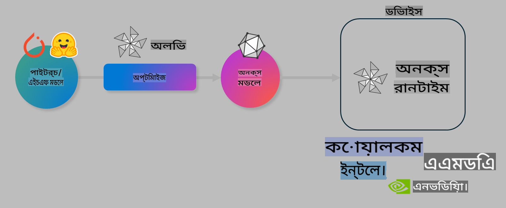

# ল্যাব: অন-ডিভাইস ইনফারেন্সের জন্য AI মডেল অপ্টিমাইজ করুন

## পরিচিতি

> [!IMPORTANT]
> এই ল্যাবের জন্য **Nvidia A10 বা A100 GPU** প্রয়োজন, যার সাথে সংশ্লিষ্ট ড্রাইভার এবং CUDA টুলকিট (সংস্করণ ১২+) ইনস্টল করা থাকতে হবে।

> [!NOTE]
> এটি একটি **৩৫-মিনিটের** ল্যাব, যা আপনাকে OLIVE ব্যবহার করে অন-ডিভাইস ইনফারেন্সের জন্য মডেল অপ্টিমাইজেশনের মূল ধারণাগুলোর হাতে-কলমে পরিচিতি দেবে।

## শেখার লক্ষ্য

এই ল্যাবের শেষে, আপনি OLIVE ব্যবহার করে নিচের কাজগুলো করতে পারবেন:

- AWQ কোয়ান্টাইজেশন পদ্ধতি ব্যবহার করে একটি AI মডেল কোয়ান্টাইজ করা।
- নির্দিষ্ট একটি টাস্কের জন্য AI মডেল ফাইন-টিউন করা।
- ONNX Runtime-এ দক্ষ অন-ডিভাইস ইনফারেন্সের জন্য LoRA অ্যাডাপ্টার (ফাইন-টিউনড মডেল) তৈরি করা।

### Olive কী

Olive (*O*NNX *live*) একটি মডেল অপ্টিমাইজেশন টুলকিট যা একটি CLI সহ আসে। এটি আপনাকে ONNX runtime +++https://onnxruntime.ai+++ এর জন্য মডেল তৈরি করতে সাহায্য করে, যা উচ্চমান এবং পারফরম্যান্স প্রদান করে।



Olive-এর ইনপুট সাধারণত একটি PyTorch বা Hugging Face মডেল এবং আউটপুট একটি অপ্টিমাইজড ONNX মডেল, যা ONNX runtime চালানো একটি ডিভাইসে (ডিপ্লয়মেন্ট টার্গেট) এক্সিকিউট হয়। Olive মডেলটি ডিপ্লয়মেন্ট টার্গেটের AI অ্যাক্সিলারেটর (NPU, GPU, CPU) এর জন্য অপ্টিমাইজ করে, যা Qualcomm, AMD, Nvidia বা Intel-এর মতো হার্ডওয়্যার বিক্রেতারা সরবরাহ করে।

Olive একটি *ওয়ার্কফ্লো* এক্সিকিউট করে, যা একক মডেল অপ্টিমাইজেশন টাস্কের ক্রমানুসারে একটি সিকোয়েন্স। এই টাস্কগুলোকে *পাস* বলা হয়। উদাহরণস্বরূপ পাসের মধ্যে রয়েছে: মডেল কম্প্রেশন, গ্রাফ ক্যাপচার, কোয়ান্টাইজেশন, গ্রাফ অপ্টিমাইজেশন। প্রতিটি পাসে কিছু প্যারামিটার থাকে, যা সেরা মেট্রিক্স (যেমন অ্যাকুরেসি এবং লেটেন্সি) অর্জনের জন্য টিউন করা যায়। Olive একটি সার্চ স্ট্রাটেজি ব্যবহার করে, যা এক বা একাধিক পাস একসঙ্গে অটো-টিউন করতে পারে।

#### Olive-এর সুবিধাসমূহ

- **সময় এবং প্রচেষ্টার সাশ্রয়:** গ্রাফ অপ্টিমাইজেশন, কম্প্রেশন এবং কোয়ান্টাইজেশনের বিভিন্ন কৌশল ম্যানুয়াল এক্সপেরিমেন্টেশনের ঝামেলা এড়ান। আপনার গুণমান এবং পারফরম্যান্স সীমা নির্ধারণ করুন এবং Olive আপনার জন্য সেরা মডেল খুঁজে দেবে।
- **৪০+ বিল্ট-ইন মডেল অপ্টিমাইজেশন উপাদান:** কোয়ান্টাইজেশন, কম্প্রেশন, গ্রাফ অপ্টিমাইজেশন এবং ফাইন-টিউনিংয়ে আধুনিক কৌশলগুলো অন্তর্ভুক্ত।
- **সহজ CLI:** সাধারণ মডেল অপ্টিমাইজেশন টাস্কের জন্য। উদাহরণস্বরূপ: olive quantize, olive auto-opt, olive finetune।
- মডেল প্যাকেজিং এবং ডিপ্লয়মেন্ট অন্তর্ভুক্ত।
- **মাল্টি LoRA সার্ভিং** এর জন্য মডেল তৈরির সাপোর্ট।
- YAML/JSON ব্যবহার করে ওয়ার্কফ্লো তৈরি করুন এবং মডেল অপ্টিমাইজেশন এবং ডিপ্লয়মেন্ট টাস্কগুলো সমন্বয় করুন।
- **Hugging Face** এবং **Azure AI** এর সাথে ইন্টিগ্রেশন।
- বিল্ট-ইন **ক্যাশিং মেকানিজম** খরচ বাঁচানোর জন্য।

## ল্যাব নির্দেশনা
> [!NOTE]
> নিশ্চিত করুন যে আপনি আপনার Azure AI Hub এবং প্রজেক্ট প্রভিশন করেছেন এবং ল্যাব ১ অনুযায়ী A100 কম্পিউট সেটআপ করেছেন।

### ধাপ ০: Azure AI Compute-এ সংযোগ করুন

আপনি **VS Code** এর রিমোট ফিচার ব্যবহার করে Azure AI কম্পিউটের সাথে সংযুক্ত হবেন।

1. আপনার **VS Code** ডেস্কটপ অ্যাপ্লিকেশন খুলুন:
1. **Shift+Ctrl+P** ব্যবহার করে **কমান্ড প্যালেট** খুলুন।
1. কমান্ড প্যালেটে **AzureML - remote: Connect to compute instance in New Window** খুঁজুন।
1. স্ক্রিনে প্রদর্শিত নির্দেশাবলী অনুসরণ করে কম্পিউটের সাথে সংযুক্ত হন। এটি আপনার Azure Subscription, Resource Group, Project এবং Lab 1-এ সেটআপ করা Compute নাম নির্বাচন করার প্রয়োজন হবে।
1. সংযোগ সফল হলে, এটি **Visual Code-এর নিচের বাম দিকে** প্রদর্শিত হবে `><Azure ML: Compute Name`

### ধাপ ১: এই রিপো ক্লোন করুন

VS Code-এ, **Ctrl+J** ব্যবহার করে একটি নতুন টার্মিনাল খুলুন এবং এই রিপো ক্লোন করুন:

টার্মিনালে আপনি এই প্রম্পটটি দেখতে পাবেন:

```
azureuser@computername:~/cloudfiles/code$ 
```
সলিউশন ক্লোন করুন:

```bash
cd ~/localfiles
git clone https://github.com/microsoft/phi-3cookbook.git
```

### ধাপ ২: ফোল্ডার খুলুন

টার্মিনালে নিচের কমান্ডটি চালান, যা প্রাসঙ্গিক ফোল্ডারে VS Code খুলবে:

```bash
code phi-3cookbook/code/04.Finetuning/Olive-lab
```

অথবা, আপনি **File** > **Open Folder** নির্বাচন করে ফোল্ডার খুলতে পারেন।

### ধাপ ৩: নির্ভরশীলতা

Azure AI Compute Instance-এ VS Code-এ একটি টার্মিনাল উইন্ডো খুলুন (**Ctrl+J**) এবং নিচের কমান্ডগুলো চালান নির্ভরশীলতা ইনস্টল করতে:

```bash
conda create -n olive-ai python=3.11 -y
conda activate olive-ai
pip install -r requirements.txt
az extension remove -n azure-cli-ml
az extension add -n ml
```

> [!NOTE]
> সমস্ত নির্ভরশীলতা ইনস্টল করতে ~৫ মিনিট সময় লাগবে।

এই ল্যাবে আপনি Azure AI Model ক্যাটালগ থেকে মডেল ডাউনলোড এবং আপলোড করবেন। মডেল ক্যাটালগে অ্যাক্সেস পেতে, আপনাকে Azure-এ লগইন করতে হবে:

```bash
az login
```

> [!NOTE]
> লগইনের সময় আপনাকে আপনার সাবস্ক্রিপশন নির্বাচন করতে বলা হবে। নিশ্চিত করুন যে আপনি এই ল্যাবের জন্য সরবরাহ করা সাবস্ক্রিপশনটি সেট করেছেন।

### ধাপ ৪: Olive কমান্ডগুলো চালান

Azure AI Compute Instance-এ VS Code-এ একটি টার্মিনাল উইন্ডো খুলুন (**Ctrl+J**) এবং নিশ্চিত করুন যে `olive-ai` কন্ডা এনভায়রনমেন্ট অ্যাক্টিভেট করা হয়েছে:

```bash
conda activate olive-ai
```

এরপর, নিচের Olive কমান্ডগুলো কমান্ড লাইনে চালান।

1. **ডেটা পরিদর্শন করুন:** এই উদাহরণে, আপনি Phi-3.5-Mini মডেলটি ফাইন-টিউন করবেন, যাতে এটি ভ্রমণ সম্পর্কিত প্রশ্নের উত্তর দেওয়ার ক্ষেত্রে বিশেষায়িত হয়। নিচের কোডটি ডেটাসেটের প্রথম কয়েকটি রেকর্ড প্রদর্শন করে, যা JSON লাইন্স ফরম্যাটে রয়েছে:

    ```bash
    head data/data_sample_travel.jsonl
    ```
1. **মডেল কোয়ান্টাইজ করুন:** মডেল ট্রেনিং করার আগে, নিচের কমান্ডটি ব্যবহার করে Active Aware Quantization (AWQ) +++https://arxiv.org/abs/2306.00978+++ পদ্ধতিতে কোয়ান্টাইজ করুন। AWQ ইনফারেন্স চলাকালীন প্রাপ্ত অ্যাক্টিভেশনগুলো বিবেচনা করে মডেলের ওজন কোয়ান্টাইজ করে। এর মানে, কোয়ান্টাইজেশন প্রক্রিয়া অ্যাক্টিভেশনের প্রকৃত ডেটা বিতরণ বিবেচনা করে, যা ঐতিহ্যবাহী ওজন কোয়ান্টাইজেশন পদ্ধতির তুলনায় মডেলের নির্ভুলতা ভালোভাবে সংরক্ষণ করে।

    ```bash
    olive quantize \
       --model_name_or_path microsoft/Phi-3.5-mini-instruct \
       --trust_remote_code \
       --algorithm awq \
       --output_path models/phi/awq \
       --log_level 1
    ```
    
    **~৮ মিনিট** সময় লাগে AWQ কোয়ান্টাইজেশন সম্পন্ন করতে, যা মডেলের আকার **~৭.৫ জিবি থেকে ~২.৫ জিবি** এ কমিয়ে দেয়।
   
   এই ল্যাবে, আমরা আপনাকে দেখাচ্ছি কিভাবে Hugging Face থেকে মডেল ইনপুট করতে হয় (উদাহরণস্বরূপ: `microsoft/Phi-3.5-mini-instruct`). However, Olive also allows you to input models from the Azure AI catalog by updating the `model_name_or_path` argument to an Azure AI asset ID (for example:  `azureml://registries/azureml/models/Phi-3.5-mini-instruct/versions/4`). 

1. **Train the model:** Next, the `olive finetune` কমান্ডটি কোয়ান্টাইজড মডেল ফাইন-টিউন করে। কোয়ান্টাইজেশনের পরে ফাইন-টিউন করার পরিবর্তে কোয়ান্টাইজেশনের *আগে* ফাইন-টিউন করলে ভালো নির্ভুলতা পাওয়া যায়, কারণ ফাইন-টিউন প্রক্রিয়া কোয়ান্টাইজেশন থেকে কিছু ক্ষতি পুনরুদ্ধার করে।

    ```bash
    olive finetune \
        --method lora \
        --model_name_or_path models/phi/awq \
        --data_files "data/data_sample_travel.jsonl" \
        --data_name "json" \
        --text_template "<|user|>\n{prompt}<|end|>\n<|assistant|>\n{response}<|end|>" \
        --max_steps 100 \
        --output_path ./models/phi/ft \
        --log_level 1
    ```
    
    **~৬ মিনিট** সময় লাগে ফাইন-টিউন সম্পন্ন করতে (১০০ স্টেপ সহ)।

1. **অপ্টিমাইজ করুন:** মডেল ট্রেনিং সম্পন্ন হলে, Olive-এর `auto-opt` command, which will capture the ONNX graph and automatically perform a number of optimizations to improve the model performance for CPU by compressing the model and doing fusions. It should be noted, that you can also optimize for other devices such as NPU or GPU by just updating the `--device` and `--provider` আর্গুমেন্ট ব্যবহার করে মডেল অপ্টিমাইজ করুন - তবে এই ল্যাবের জন্য আমরা CPU ব্যবহার করব।

    ```bash
    olive auto-opt \
       --model_name_or_path models/phi/ft/model \
       --adapter_path models/phi/ft/adapter \
       --device cpu \
       --provider CPUExecutionProvider \
       --use_ort_genai \
       --output_path models/phi/onnx-ao \
       --log_level 1
    ```
    
    **~৫ মিনিট** সময় লাগে অপ্টিমাইজেশন সম্পন্ন করতে।

### ধাপ ৫: মডেলের ইনফারেন্স দ্রুত পরীক্ষা

মডেলের ইনফারেন্স পরীক্ষা করতে, আপনার ফোল্ডারে **app.py** নামে একটি পাইথন ফাইল তৈরি করুন এবং নিচের কোডটি কপি-পেস্ট করুন:

```python
import onnxruntime_genai as og
import numpy as np

print("loading model and adapters...", end="", flush=True)
model = og.Model("models/phi/onnx-ao/model")
adapters = og.Adapters(model)
adapters.load("models/phi/onnx-ao/model/adapter_weights.onnx_adapter", "travel")
print("DONE!")

tokenizer = og.Tokenizer(model)
tokenizer_stream = tokenizer.create_stream()

params = og.GeneratorParams(model)
params.set_search_options(max_length=100, past_present_share_buffer=False)
user_input = "what is the best thing to see in chicago"
params.input_ids = tokenizer.encode(f"<|user|>\n{user_input}<|end|>\n<|assistant|>\n")

generator = og.Generator(model, params)

generator.set_active_adapter(adapters, "travel")

print(f"{user_input}")

while not generator.is_done():
    generator.compute_logits()
    generator.generate_next_token()

    new_token = generator.get_next_tokens()[0]
    print(tokenizer_stream.decode(new_token), end='', flush=True)

print("\n")
```

কোডটি চালান:

```bash
python app.py
```

### ধাপ ৬: মডেল Azure AI-তে আপলোড করুন

মডেলটিকে Azure AI মডেল রিপোজিটরিতে আপলোড করলে এটি আপনার ডেভেলপমেন্ট টিমের অন্যান্য সদস্যদের সাথে শেয়ার করা যায় এবং মডেলের ভার্সন কন্ট্রোলও পরিচালিত হয়। মডেল আপলোড করতে নিচের কমান্ডটি চালান:

> [!NOTE]
> `{}` placeholders with the name of your resource group and Azure AI Project Name. 

To find your resource group `"resourceGroup" এবং Azure AI Project নাম আপডেট করুন, নিচের কমান্ডটি চালান

```
az ml workspace show
```

অথবা +++ai.azure.com+++ এ যান এবং **management center** > **project** > **overview** নির্বাচন করুন।

`{}` প্লেসহোল্ডারগুলো আপনার রিসোর্স গ্রুপ এবং Azure AI Project নাম দিয়ে আপডেট করুন।

```bash
az ml model create \
    --name ft-for-travel \
    --version 1 \
    --path ./models/phi/onnx-ao \
    --resource-group {RESOURCE_GROUP_NAME} \
    --workspace-name {PROJECT_NAME}
```
আপনার আপলোড করা মডেলটি দেখতে পারবেন এবং এটি https://ml.azure.com/model/list এ ডিপ্লয় করতে পারবেন।

**অস্বীকৃতি**:  
এই নথিটি মেশিন-ভিত্তিক এআই অনুবাদ পরিষেবা ব্যবহার করে অনুবাদ করা হয়েছে। আমরা যথাসম্ভব সঠিকতার জন্য চেষ্টা করি, তবে দয়া করে মনে রাখুন যে স্বয়ংক্রিয় অনুবাদে ত্রুটি বা অসঙ্গতি থাকতে পারে। মূল ভাষায় থাকা নথিটিকেই প্রামাণিক উৎস হিসেবে বিবেচনা করা উচিত। গুরুত্বপূর্ণ তথ্যের জন্য, পেশাদার মানব অনুবাদ সুপারিশ করা হয়। এই অনুবাদ ব্যবহার থেকে উদ্ভূত যেকোনো ভুল বোঝাবুঝি বা ভুল ব্যাখ্যার জন্য আমরা দায়ী নই। 