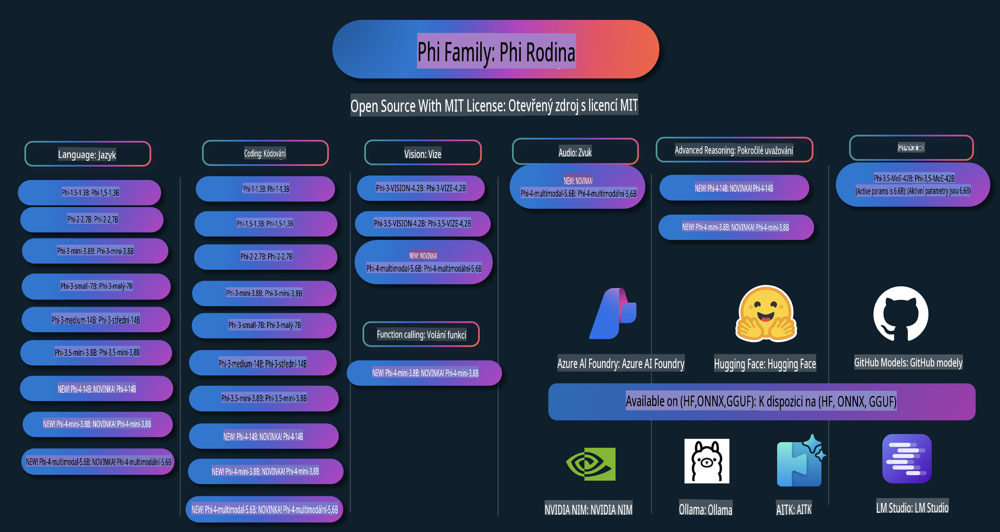

# Phi Cookbook: Praktické příklady s modely Phi od Microsoftu

  

  
  
  

  
  

Phi je série open source AI modelů vyvinutých společností Microsoft.

Phi je v současnosti nejvýkonnější a nejefektivnější malý jazykový model (SLM), který dosahuje skvělých výsledků v oblastech jako jsou vícejazyčné aplikace, logické úvahy, generování textu/chatu, kódování, obrázky, audio a další scénáře.

Model Phi lze nasadit do cloudu nebo na okrajová zařízení, a snadno s ním můžete vytvářet generativní AI aplikace i s omezeným výpočetním výkonem.

Postupujte podle těchto kroků, abyste mohli začít využívat tyto zdroje:  
1. **Forkněte si repozitář**: Klikněte   
2. **Klonujte repozitář**:   `git clone https://github.com/microsoft/PhiCookBook.git`  
3. [**Připojte se ke komunitě Microsoft AI na Discordu a setkejte se s experty a dalšími vývojáři**](https://discord.com/invite/ByRwuEEgH4?WT.mc_id=aiml-137032-kinfeylo)

## Obsah

- Úvod
  - [Vítejte v rodině Phi](./md/01.Introduction/01/01.PhiFamily.md)
  - [Nastavení prostředí](./md/01.Introduction/01/01.EnvironmentSetup.md)
  - [Pochopení klíčových technologií](./md/01.Introduction/01/01.Understandingtech.md)
  - [Bezpečnost AI pro modely Phi](./md/01.Introduction/01/01.AISafety.md)
  - [Podpora hardwaru pro Phi](./md/01.Introduction/01/01.Hardwaresupport.md)
  - [Modely Phi a jejich dostupnost na různých platformách](./md/01.Introduction/01/01.Edgeandcloud.md)
  - [Používání Guidance-ai a Phi](./md/01.Introduction/01/01.Guidance.md)
  - [Modely na GitHub Marketplace](https://github.com/marketplace/models)
  - [Katalog modelů Azure AI](https://ai.azure.com)

- Inference Phi v různých prostředích
    - [Hugging face](./md/01.Introduction/02/01.HF.md)
    - [Modely na GitHubu](./md/01.Introduction/02/02.GitHubModel.md)
    - [Katalog modelů Azure AI Foundry](./md/01.Introduction/02/03.AzureAIFoundry.md)
    - [Ollama](./md/01.Introduction/02/04.Ollama.md)
    - [AI Toolkit VSCode (AITK)](./md/01.Introduction/02/05.AITK.md)
    - [NVIDIA NIM](./md/01.Introduction/02/06.NVIDIA.md)

- Inference rodiny Phi
    - [Inference Phi na iOS](./md/01.Introduction/03/iOS_Inference.md)
    - [Inference Phi na Androidu](./md/01.Introduction/03/Android_Inference.md)
- [Inference Phi na Jetsonu](./md/01.Introduction/03/Jetson_Inference.md)
    - [Inference Phi na AI PC](./md/01.Introduction/03/AIPC_Inference.md)
    - [Inference Phi s frameworkem Apple MLX](./md/01.Introduction/03/MLX_Inference.md)
    - [Inference Phi na lokálním serveru](./md/01.Introduction/03/Local_Server_Inference.md)
    - [Inference Phi na vzdáleném serveru pomocí AI Toolkit](./md/01.Introduction/03/Remote_Interence.md)
    - [Inference Phi v Rustu](./md/01.Introduction/03/Rust_Inference.md)
    - [Inference Phi--Vision lokálně](./md/01.Introduction/03/Vision_Inference.md)
    - [Inference Phi s Kaito AKS, Azure Containers (oficiální podpora)](./md/01.Introduction/03/Kaito_Inference.md)
-  [Kvantifikace rodiny Phi](./md/01.Introduction/04/QuantifyingPhi.md)
    - [Kvantifikace Phi-3.5 / 4 pomocí llama.cpp](./md/01.Introduction/04/UsingLlamacppQuantifyingPhi.md)
    - [Kvantifikace Phi-3.5 / 4 pomocí generativních AI rozšíření pro onnxruntime](./md/01.Introduction/04/UsingORTGenAIQuantifyingPhi.md)
    - [Kvantifikace Phi-3.5 / 4 pomocí Intel OpenVINO](./md/01.Introduction/04/UsingIntelOpenVINOQuantifyingPhi.md)
    - [Kvantifikace Phi-3.5 / 4 pomocí frameworku Apple MLX](./md/01.Introduction/04/UsingAppleMLXQuantifyingPhi.md)

-  Vyhodnocení Phi
    - [Zodpovědná AI](./md/01.Introduction/05/ResponsibleAI.md)
    - [Azure AI Foundry pro vyhodnocení](./md/01.Introduction/05/AIFoundry.md)
    - [Použití Promptflow pro vyhodnocení](./md/01.Introduction/05/Promptflow.md)
 
- RAG s Azure AI Search
    - [Jak používat Phi-4-mini a Phi-4-multimodal (RAG) s Azure AI Search](https://github.com/microsoft/PhiCookBook/blob/main/code/06.E2E/E2E_Phi-4-RAG-Azure-AI-Search.ipynb)

- Ukázky vývoje aplikací Phi
  - Textové a chatovací aplikace
    - Ukázky Phi-4 🆕
      - [📓] [Chat s Phi-4-mini ONNX modelem](./md/02.Application/01.TextAndChat/Phi4/ChatWithPhi4ONNX/README.md)
      - [Chat s lokálním modelem Phi-4 ONNX v .NET](../../md/04.HOL/dotnet/src/LabsPhi4-Chat-01OnnxRuntime)
      - [Chat .NET konzolová aplikace s Phi-4 ONNX pomocí Semantic Kernel](../../md/04.HOL/dotnet/src/LabsPhi4-Chat-02SK)
    - Ukázky Phi-3 / 3.5
      - [Lokální chatbot v prohlížeči s Phi3, ONNX Runtime Web a WebGPU](https://github.com/microsoft/onnxruntime-inference-examples/tree/main/js/chat)
      - [OpenVino Chat](./md/02.Application/01.TextAndChat/Phi3/E2E_OpenVino_Chat.md)
      - [Multi Model - Interaktivní Phi-3-mini a OpenAI Whisper](./md/02.Application/01.TextAndChat/Phi3/E2E_Phi-3-mini_with_whisper.md)
      - [MLFlow - Vytvoření wrapperu a použití Phi-3 s MLFlow](./md//02.Application/01.TextAndChat/Phi3/E2E_Phi-3-MLflow.md)
      - [Optimalizace modelu - Jak optimalizovat model Phi-3-mini pro ONNX Runtime Web pomocí Olive](https://github.com/microsoft/Olive/tree/main/examples/phi3)
      - [WinUI3 aplikace s Phi-3 mini-4k-instruct-onnx](https://github.com/microsoft/Phi3-Chat-WinUI3-Sample/)
      - [Ukázková aplikace pro poznámky s AI ve WinUI3](https://github.com/microsoft/ai-powered-notes-winui3-sample)
      - [Doladění a integrace vlastních modelů Phi-3 s Prompt flow](./md/02.Application/01.TextAndChat/Phi3/E2E_Phi-3-FineTuning_PromptFlow_Integration.md)
      - [Doladění a integrace vlastních modelů Phi-3 s Prompt flow v Azure AI Foundry](./md/02.Application/01.TextAndChat/Phi3/E2E_Phi-3-FineTuning_PromptFlow_Integration_AIFoundry.md)
      - [Vyhodnocení doladěného modelu Phi-3 / Phi-3.5 v Azure AI Foundry se zaměřením na principy zodpovědné AI společnosti Microsoft](./md/02.Application/01.TextAndChat/Phi3/E2E_Phi-3-Evaluation_AIFoundry.md)
- [📓] [Ukázkový příklad jazykové predikce Phi-3.5-mini-instruct (čínština/angličtina)](../../md/02.Application/01.TextAndChat/Phi3/phi3-instruct-demo.ipynb)
      - [Phi-3.5-Instruct WebGPU RAG Chatbot](./md/02.Application/01.TextAndChat/Phi3/WebGPUWithPhi35Readme.md)
      - [Použití GPU ve Windows k vytvoření Prompt Flow řešení s Phi-3.5-Instruct ONNX](./md/02.Application/01.TextAndChat/Phi3/UsingPromptFlowWithONNX.md)
      - [Vytvoření Android aplikace pomocí Microsoft Phi-3.5 tflite](./md/02.Application/01.TextAndChat/Phi3/UsingPhi35TFLiteCreateAndroidApp.md)
      - [Příklad Q&A .NET s lokálním modelem ONNX Phi-3 za použití Microsoft.ML.OnnxRuntime](../../md/04.HOL/dotnet/src/LabsPhi301)
      - [Konzolová chatovací .NET aplikace se Semantic Kernel a Phi-3](../../md/04.HOL/dotnet/src/LabsPhi302)

  - Azure AI Inference SDK Ukázky kódu 
    - Phi-4 Ukázky 🆕
      - [📓] [Generování projektového kódu pomocí Phi-4-multimodal](./md/02.Application/02.Code/Phi4/GenProjectCode/README.md)
    - Phi-3 / 3.5 Ukázky
      - [Vytvořte si vlastní Visual Studio Code GitHub Copilot Chat s rodinou Microsoft Phi-3](./md/02.Application/02.Code/Phi3/VSCodeExt/README.md)
      - [Vytvoření vlastního Visual Studio Code Chat Copilot Agenta s Phi-3.5 za použití GitHub modelů](/md/02.Application/02.Code/Phi3/CreateVSCodeChatAgentWithGitHubModels.md)

  - Pokročilé příklady uvažování
    - Phi-4 Ukázky 🆕
      - [📓] [Phi-4-mini ukázky uvažování](./md/02.Application/03.AdvancedReasoning/Phi4/AdvancedResoningPhi4mini/README.md)
  
  - Dema
      - [Phi-4-mini dema hostovaná na Hugging Face Spaces](https://huggingface.co/spaces/microsoft/phi-4-mini?WT.mc_id=aiml-137032-kinfeylo)
      - [Phi-4-multimodal dema hostovaná na Hugging Face Spaces](https://huggingface.co/spaces/microsoft/phi-4-multimodal?WT.mc_id=aiml-137032-kinfeylo)
  - Ukázky pro Vision
    - Phi-4 Ukázky 🆕
      - [📓] [Použití Phi-4-multimodal k čtení obrázků a generování kódu](./md/02.Application/04.Vision/Phi4/CreateFrontend/README.md) 
    - Phi-3 / 3.5 Ukázky
      -  [📓][Phi-3-vision-Image text to text](../../md/02.Application/04.Vision/Phi3/E2E_Phi-3-vision-image-text-to-text-online-endpoint.ipynb)
      - [Phi-3-vision-ONNX](https://onnxruntime.ai/docs/genai/tutorials/phi3-v.html)
      - [📓][Phi-3-vision CLIP Embedding](../../md/02.Application/04.Vision/Phi3/E2E_Phi-3-vision-image-text-to-text-online-endpoint.ipynb)
      - [DEMO: Phi-3 Recycling](https://github.com/jennifermarsman/PhiRecycling/)
      - [Phi-3-vision - Vizualní jazykový asistent - s Phi3-Vision a OpenVINO](https://docs.openvino.ai/nightly/notebooks/phi-3-vision-with-output.html)
      - [Phi-3 Vision Nvidia NIM](./md/02.Application/04.Vision/Phi3/E2E_Nvidia_NIM_Vision.md)
      - [Phi-3 Vision OpenVino](./md/02.Application/04.Vision/Phi3/E2E_OpenVino_Phi3Vision.md)
      - [📓][Phi-3.5 Vision ukázka pro více snímků nebo obrázků](../../md/02.Application/04.Vision/Phi3/phi3-vision-demo.ipynb)
      - [Phi-3 Vision Lokální ONNX Model za použití Microsoft.ML.OnnxRuntime .NET](../../md/04.HOL/dotnet/src/LabsPhi303)
      - [Menu založené na Phi-3 Vision Lokálním ONNX Modelu za použití Microsoft.ML.OnnxRuntime .NET](../../md/04.HOL/dotnet/src/LabsPhi304)

  - Ukázky pro Audio
    - Phi-4 Ukázky 🆕
      - [📓] [Extrahování audio přepisů pomocí Phi-4-multimodal](./md/02.Application/05.Audio/Phi4/Transciption/README.md)
      - [📓] [Phi-4-multimodal Ukázka pro Audio](../../md/02.Application/05.Audio/Phi4/Siri/demo.ipynb)
      - [📓] [Phi-4-multimodal Ukázka překladu řeči](../../md/02.Application/05.Audio/Phi4/Translate/demo.ipynb)
      - [.NET konzolová aplikace využívající Phi-4-multimodal Audio k analýze audio souboru a generování přepisu](../../md/04.HOL/dotnet/src/LabsPhi4-MultiModal-02Audio)

  - Ukázky MOE
    - Phi-3 / 3.5 Ukázky
      - [📓] [Phi-3.5 Mixture of Experts Models (MoEs) Ukázka pro sociální média](../../md/02.Application/06.MoE/Phi3/phi3_moe_demo.ipynb)
      - [📓] [Vytvoření Retrieval-Augmented Generation (RAG) Pipeline s NVIDIA NIM Phi-3 MOE, Azure AI Search a LlamaIndex](../../md/02.Application/06.MoE/Phi3/azure-ai-search-nvidia-rag.ipynb)
  - Ukázky pro volání funkcí
    - Phi-4 Ukázky 🆕
      -  [📓] [Použití volání funkcí s Phi-4-mini](./md/02.Application/07.FunctionCalling/Phi4/FunctionCallingBasic/README.md)
  - Ukázky pro multimodální mixování
    - Phi-4 Ukázky 🆕
- [📓] [Použití Phi-4-multimodal jako technologický novinář](../../md/02.Application/08.Multimodel/Phi4/TechJournalist/phi_4_mm_audio_text_publish_news.ipynb)  
  - [.NET konzolová aplikace používající Phi-4-multimodal k analýze obrázků](../../md/04.HOL/dotnet/src/LabsPhi4-MultiModal-01Images)

- Doladění vzorků Phi  
  - [Scénáře doladění](./md/03.FineTuning/FineTuning_Scenarios.md)  
  - [Doladění vs RAG](./md/03.FineTuning/FineTuning_vs_RAG.md)  
  - [Doladění: Udělejte z Phi-3 odborníka na průmysl](./md/03.FineTuning/LetPhi3gotoIndustriy.md)  
  - [Doladění Phi-3 pomocí AI Toolkit pro VS Code](./md/03.FineTuning/Finetuning_VSCodeaitoolkit.md)  
  - [Doladění Phi-3 pomocí Azure Machine Learning Service](./md/03.FineTuning/Introduce_AzureML.md)  
  - [Doladění Phi-3 pomocí Lora](./md/03.FineTuning/FineTuning_Lora.md)  
  - [Doladění Phi-3 pomocí QLora](./md/03.FineTuning/FineTuning_Qlora.md)  
  - [Doladění Phi-3 pomocí Azure AI Foundry](./md/03.FineTuning/FineTuning_AIFoundry.md)  
  - [Doladění Phi-3 pomocí Azure ML CLI/SDK](./md/03.FineTuning/FineTuning_MLSDK.md)  
  - [Doladění s Microsoft Olive](./md/03.FineTuning/FineTuning_MicrosoftOlive.md)  
  - [Doladění s Microsoft Olive – Praktická laboratoř](./md/03.FineTuning/olive-lab/readme.md)  
  - [Doladění Phi-3-vision pomocí Weights and Bias](./md/03.FineTuning/FineTuning_Phi-3-visionWandB.md)  
  - [Doladění Phi-3 pomocí Apple MLX Framework](./md/03.FineTuning/FineTuning_MLX.md)  
  - [Doladění Phi-3-vision (oficiální podpora)](./md/03.FineTuning/FineTuning_Vision.md)  
  - [Doladění Phi-3 s Kaito AKS, Azure Containers (oficiální podpora)](./md/03.FineTuning/FineTuning_Kaito.md)  
  - [Doladění Phi-3 a 3.5 Vision](https://github.com/2U1/Phi3-Vision-Finetune)

- Praktické laboratoře  
  - [Zkoumání nejmodernějších modelů: LLMs, SLMs, lokální vývoj a další](https://github.com/microsoft/aitour-exploring-cutting-edge-models)  
  - [Odemknutí potenciálu NLP: Doladění s Microsoft Olive](https://github.com/azure/Ignite_FineTuning_workshop)

- Akademické výzkumné práce a publikace  
  - [Textbooks Are All You Need II: phi-1.5 technická zpráva](https://arxiv.org/abs/2309.05463)  
  - [Phi-3 Technická zpráva: Vysoce schopný jazykový model lokálně na vašem telefonu](https://arxiv.org/abs/2404.14219)  
  - [Phi-4 Technická zpráva](https://arxiv.org/abs/2412.08905)  
  - [Optimalizace malých jazykových modelů pro funkční volání ve vozidlech](https://arxiv.org/abs/2501.02342)  
  - [(WhyPHI) Doladění PHI-3 pro odpovědi na otázky s výběrem z možností: Metodologie, výsledky a výzvy](https://arxiv.org/abs/2501.01588)

## Použití modelů Phi  

### Phi na Azure AI Foundry  

Můžete se naučit, jak používat Microsoft Phi a jak vytvářet kompletní řešení na různých hardwarových zařízeních. Chcete-li si Phi vyzkoušet, začněte s modely a přizpůsobte Phi pro své scénáře pomocí [Azure AI Foundry Azure AI Model Catalog](https://aka.ms/phi3-azure-ai). Více se dozvíte v úvodu [Azure AI Foundry](/md/02.QuickStart/AzureAIFoundry_QuickStart.md).  

**Playground**  
Každý model má vlastní prostředí pro testování: [Azure AI Playground](https://aka.ms/try-phi3).  

### Phi na GitHub Modelech  

Můžete se naučit, jak používat Microsoft Phi a jak vytvářet kompletní řešení na různých hardwarových zařízeních. Chcete-li si Phi vyzkoušet, začněte s modelem a přizpůsobte Phi pro své scénáře pomocí [GitHub Model Catalog](https://github.com/marketplace/models?WT.mc_id=aiml-137032-kinfeylo). Více se dozvíte v úvodu [GitHub Model Catalog](/md/02.QuickStart/GitHubModel_QuickStart.md).  

**Playground**  
Každý model má vyhrazené [hřiště pro testování modelu](/md/02.QuickStart/GitHubModel_QuickStart.md).

### Phi na Hugging Face

Model můžete najít také na [Hugging Face](https://huggingface.co/microsoft)

**Hřiště**  
[Hugging Chat hřiště](https://huggingface.co/chat/models/microsoft/Phi-3-mini-4k-instruct)

## Odpovědná AI

Microsoft se zavazuje pomáhat svým zákazníkům používat naše AI produkty odpovědně, sdílet své poznatky a budovat důvěryhodná partnerství prostřednictvím nástrojů, jako jsou Poznámky o transparentnosti a Hodnocení dopadu. Mnoho těchto zdrojů lze najít na [https://aka.ms/RAI](https://aka.ms/RAI).  
Přístup společnosti Microsoft k odpovědné AI je založen na našich zásadách AI: spravedlnost, spolehlivost a bezpečnost, soukromí a zabezpečení, inkluzivita, transparentnost a odpovědnost.

Velké modely pro zpracování přirozeného jazyka, obrazu a řeči – jako ty použité v tomto příkladu – se mohou potenciálně chovat nespravedlivě, nespolehlivě nebo urážlivě, což může způsobit škody. Přečtěte si [Poznámku o transparentnosti služby Azure OpenAI](https://learn.microsoft.com/legal/cognitive-services/openai/transparency-note?tabs=text), abyste byli informováni o rizicích a omezeních.

Doporučeným přístupem k omezení těchto rizik je zahrnout do své architektury bezpečnostní systém, který dokáže detekovat a předcházet škodlivému chování. [Azure AI Content Safety](https://learn.microsoft.com/azure/ai-services/content-safety/overview) poskytuje nezávislou vrstvu ochrany, která dokáže detekovat škodlivý obsah generovaný uživateli i AI v aplikacích a službách. Azure AI Content Safety zahrnuje textové a obrazové API, která umožňují detekovat škodlivý materiál. V rámci Azure AI Foundry umožňuje služba Content Safety zobrazit, prozkoumat a vyzkoušet ukázkový kód pro detekci škodlivého obsahu napříč různými modalitami. Následující [dokumentace rychlého startu](https://learn.microsoft.com/azure/ai-services/content-safety/quickstart-text?tabs=visual-studio%2Clinux&pivots=programming-language-rest) vás provede vytvořením požadavků na tuto službu.

Dalším aspektem, který je třeba vzít v úvahu, je celkový výkon aplikace. U multimodálních a multimodelových aplikací chápeme výkon jako schopnost systému fungovat podle vašich očekávání a očekávání uživatelů, včetně prevence generování škodlivých výstupů. Je důležité posoudit výkon vaší aplikace pomocí [Hodnotitelů výkonu a kvality a Hodnotitelů rizik a bezpečnosti](https://learn.microsoft.com/azure/ai-studio/concepts/evaluation-metrics-built-in). Máte také možnost vytvořit a vyhodnotit [vlastní hodnotitele](https://learn.microsoft.com/azure/ai-studio/how-to/develop/evaluate-sdk#custom-evaluators).

Vaši AI aplikaci můžete vyhodnotit ve svém vývojovém prostředí pomocí [Azure AI Evaluation SDK](https://microsoft.github.io/promptflow/index.html). Na základě testovací sady dat nebo cíle jsou generace vaší generativní AI aplikace kvantitativně měřeny pomocí vestavěných nebo vámi zvolených vlastních hodnotitelů. Pro začátek s Azure AI Evaluation SDK k vyhodnocení vašeho systému můžete sledovat [průvodce rychlým startem](https://learn.microsoft.com/azure/ai-studio/how-to/develop/flow-evaluate-sdk). Po provedení hodnotícího běhu můžete [vizualizovat výsledky v Azure AI Foundry](https://learn.microsoft.com/azure/ai-studio/how-to/evaluate-flow-results).

## Ochranné známky

Tento projekt může obsahovat ochranné známky nebo loga projektů, produktů či služeb. Použití ochranných známek nebo log Microsoftu je povoleno pouze v souladu s [Pokyny pro používání ochranných známek a značek Microsoftu](https://www.microsoft.com/legal/intellectualproperty/trademarks/usage/general).  
Použití ochranných známek nebo log Microsoftu v upravených verzích tohoto projektu nesmí způsobit záměnu nebo naznačovat sponzorství ze strany Microsoftu. Jakékoliv použití ochranných známek nebo log třetích stran podléhá zásadám těchto třetích stran.

**Upozornění**:  
Tento dokument byl přeložen pomocí strojových AI překladatelských služeb. Ačkoli se snažíme o přesnost, mějte na paměti, že automatizované překlady mohou obsahovat chyby nebo nepřesnosti. Původní dokument v jeho rodném jazyce by měl být považován za závazný zdroj. Pro důležité informace se doporučuje profesionální lidský překlad. Nenese odpovědnost za jakékoli nedorozumění nebo nesprávné výklady vyplývající z použití tohoto překladu.