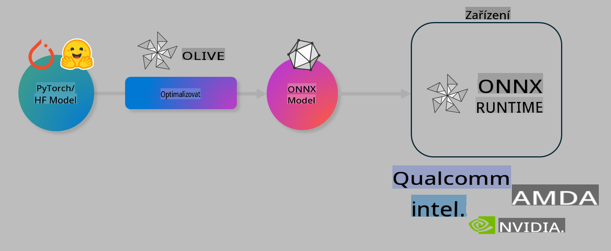

# Lab. Optimalizace AI modelů pro inferenci na zařízení

## Úvod

> [!IMPORTANT]
> Tento lab vyžaduje **Nvidia A10 nebo A100 GPU** s odpovídajícími ovladači a nainstalovaným CUDA toolkitem (verze 12+).

> [!NOTE]
> Tento lab trvá **35 minut** a poskytne vám praktický úvod do základních konceptů optimalizace modelů pro inferenci na zařízení pomocí nástroje OLIVE.

## Cíle výuky

Na konci tohoto labu budete schopni použít OLIVE k:

- Kvantizaci AI modelu pomocí metody kvantizace AWQ.
- Doladění AI modelu pro specifický úkol.
- Generování LoRA adaptérů (doladěného modelu) pro efektivní inferenci na zařízení pomocí ONNX Runtime.

### Co je Olive

Olive (*O*NNX *live*) je nástroj pro optimalizaci modelů s doprovodným CLI, který vám umožňuje připravit modely pro ONNX runtime +++https://onnxruntime.ai+++ s vysokou kvalitou a výkonem.



Vstupem pro Olive je obvykle model PyTorch nebo Hugging Face a výstupem je optimalizovaný ONNX model, který se spouští na zařízení (cílová platforma) s běžícím ONNX runtime. Olive optimalizuje model pro AI akcelerátor cílové platformy (NPU, GPU, CPU) od dodavatelů hardwaru, jako jsou Qualcomm, AMD, Nvidia nebo Intel.

Olive provádí *workflow*, což je uspořádaná sekvence jednotlivých úkolů optimalizace modelu nazývaných *passes*. Příklady těchto úkolů zahrnují: komprese modelu, zachycení grafu, kvantizace, optimalizace grafu. Každý úkol má sadu parametrů, které lze ladit za účelem dosažení nejlepších metrik, například přesnosti a latence, které jsou hodnoceny příslušným hodnotitelem. Olive využívá strategii hledání, která pomocí algoritmu hledání automaticky ladí jednotlivé úkoly nebo jejich sady.

#### Výhody Olive

- **Minimalizace frustrace a času** stráveného ručním experimentováním s různými technikami optimalizace grafu, komprese a kvantizace. Definujte své požadavky na kvalitu a výkon a nechte Olive najít nejlepší model za vás.
- **Více než 40 vestavěných komponent pro optimalizaci modelů**, které pokrývají nejmodernější techniky v oblasti kvantizace, komprese, optimalizace grafu a doladění.
- **Jednoduché CLI** pro běžné úkoly optimalizace modelu. Například olive quantize, olive auto-opt, olive finetune.
- Vestavěné balení a nasazení modelů.
- Podpora generování modelů pro **Multi LoRA serving**.
- Možnost sestavení workflow pomocí YAML/JSON pro orchestraci úkolů optimalizace a nasazení modelů.
- Integrace s **Hugging Face** a **Azure AI**.
- Vestavěný mechanismus **cachování** pro **úsporu nákladů**.

## Instrukce k labu
> [!NOTE]
> Ujistěte se, že jste vytvořili svůj Azure AI Hub a Projekt a nastavili svůj A100 výpočetní uzel podle Labu 1.

### Krok 0: Připojení k Azure AI Compute

Připojíte se k Azure AI compute pomocí funkce vzdáleného přístupu v **VS Code.**

1. Otevřete desktopovou aplikaci **VS Code**:
1. Otevřete **příkazovou paletu** pomocí **Shift+Ctrl+P**.
1. V příkazové paletě vyhledejte **AzureML - remote: Connect to compute instance in New Window**.
1. Postupujte podle pokynů na obrazovce pro připojení k Compute. To zahrnuje výběr vašeho Azure Subscription, Resource Group, Projektu a názvu Compute, které jste nastavili v Labu 1.
1. Jakmile se připojíte ke svému Azure ML Compute uzlu, bude to zobrazeno v **levém dolním rohu Visual Code** `><Azure ML: Compute Name`.

### Krok 1: Naklonujte tento repozitář

Ve VS Code můžete otevřít nový terminál pomocí **Ctrl+J** a naklonovat tento repozitář:

V terminálu byste měli vidět výzvu

```
azureuser@computername:~/cloudfiles/code$ 
```
Naklonujte řešení 

```bash
cd ~/localfiles
git clone https://github.com/microsoft/phi-3cookbook.git
```

### Krok 2: Otevřete složku ve VS Code

Pro otevření VS Code ve správné složce spusťte následující příkaz v terminálu, který otevře nové okno:

```bash
code phi-3cookbook/code/04.Finetuning/Olive-lab
```

Alternativně můžete složku otevřít výběrem **File** > **Open Folder**.

### Krok 3: Závislosti

Otevřete okno terminálu ve VS Code na vašem Azure AI Compute uzlu (tip: **Ctrl+J**) a spusťte následující příkazy pro instalaci závislostí:

```bash
conda create -n olive-ai python=3.11 -y
conda activate olive-ai
pip install -r requirements.txt
az extension remove -n azure-cli-ml
az extension add -n ml
```

> [!NOTE]
> Instalace všech závislostí zabere ~5 minut.

V tomto labu budete stahovat a nahrávat modely do katalogu modelů Azure AI. Abyste mohli přistupovat ke katalogu modelů, budete se muset přihlásit do Azure pomocí:

```bash
az login
```

> [!NOTE]
> Při přihlášení budete vyzváni k výběru svého předplatného. Ujistěte se, že vyberete předplatné poskytnuté pro tento lab.

### Krok 4: Spuštění příkazů Olive

Otevřete okno terminálu ve VS Code na vašem Azure AI Compute uzlu (tip: **Ctrl+J**) a ujistěte se, že je aktivováno prostředí `olive-ai` conda:

```bash
conda activate olive-ai
```

Dále spusťte následující příkazy Olive v příkazové řádce.

1. **Prozkoumejte data:** V tomto příkladu budete doladit model Phi-3.5-Mini tak, aby byl specializovaný na odpovídání na otázky týkající se cestování. Následující kód zobrazí prvních pár záznamů datové sady, která je ve formátu JSON lines:

    ```bash
    head data/data_sample_travel.jsonl
    ```
1. **Kvantizace modelu:** Před trénováním modelu nejprve proveďte kvantizaci pomocí následujícího příkazu, který využívá techniku nazvanou Active Aware Quantization (AWQ) +++https://arxiv.org/abs/2306.00978+++. AWQ kvantizuje váhy modelu s ohledem na aktivace produkované během inference. To znamená, že proces kvantizace bere v úvahu skutečné rozložení dat v aktivacích, což vede k lepšímu zachování přesnosti modelu ve srovnání s tradičními metodami kvantizace vah.

    ```bash
    olive quantize \
       --model_name_or_path microsoft/Phi-3.5-mini-instruct \
       --trust_remote_code \
       --algorithm awq \
       --output_path models/phi/awq \
       --log_level 1
    ```
    
    Kvantizace AWQ trvá **~8 minut** a **zmenší velikost modelu z ~7.5 GB na ~2.5 GB**.
   
   V tomto labu vám ukážeme, jak zadat modely z Hugging Face (například: `microsoft/Phi-3.5-mini-instruct`). However, Olive also allows you to input models from the Azure AI catalog by updating the `model_name_or_path` argument to an Azure AI asset ID (for example:  `azureml://registries/azureml/models/Phi-3.5-mini-instruct/versions/4`). 

1. **Train the model:** Next, the `olive finetune` příkaz doladí kvantizovaný model. Kvantizace modelu *před* doladěním namísto po něm poskytuje lepší přesnost, protože proces doladění obnoví část ztrát z kvantizace.

    ```bash
    olive finetune \
        --method lora \
        --model_name_or_path models/phi/awq \
        --data_files "data/data_sample_travel.jsonl" \
        --data_name "json" \
        --text_template "<|user|>\n{prompt}<|end|>\n<|assistant|>\n{response}<|end|>" \
        --max_steps 100 \
        --output_path ./models/phi/ft \
        --log_level 1
    ```
    
    Doladění (se 100 kroky) trvá **~6 minut**.

1. **Optimalizace:** S natrénovaným modelem nyní model optimalizujete pomocí Olive příkazu `auto-opt` command, which will capture the ONNX graph and automatically perform a number of optimizations to improve the model performance for CPU by compressing the model and doing fusions. It should be noted, that you can also optimize for other devices such as NPU or GPU by just updating the `--device` and `--provider` - pro účely tohoto labu použijeme CPU.

    ```bash
    olive auto-opt \
       --model_name_or_path models/phi/ft/model \
       --adapter_path models/phi/ft/adapter \
       --device cpu \
       --provider CPUExecutionProvider \
       --use_ort_genai \
       --output_path models/phi/onnx-ao \
       --log_level 1
    ```
    
    Optimalizace trvá **~5 minut**.

### Krok 5: Rychlý test inference modelu

Pro testování inference modelu vytvořte ve své složce Python soubor s názvem **app.py** a zkopírujte a vložte následující kód:

```python
import onnxruntime_genai as og
import numpy as np

print("loading model and adapters...", end="", flush=True)
model = og.Model("models/phi/onnx-ao/model")
adapters = og.Adapters(model)
adapters.load("models/phi/onnx-ao/model/adapter_weights.onnx_adapter", "travel")
print("DONE!")

tokenizer = og.Tokenizer(model)
tokenizer_stream = tokenizer.create_stream()

params = og.GeneratorParams(model)
params.set_search_options(max_length=100, past_present_share_buffer=False)
user_input = "what is the best thing to see in chicago"
params.input_ids = tokenizer.encode(f"<|user|>\n{user_input}<|end|>\n<|assistant|>\n")

generator = og.Generator(model, params)

generator.set_active_adapter(adapters, "travel")

print(f"{user_input}")

while not generator.is_done():
    generator.compute_logits()
    generator.generate_next_token()

    new_token = generator.get_next_tokens()[0]
    print(tokenizer_stream.decode(new_token), end='', flush=True)

print("\n")
```

Spusťte kód pomocí:

```bash
python app.py
```

### Krok 6: Nahrání modelu do Azure AI

Nahráním modelu do úložiště modelů Azure AI umožníte jeho sdílení s ostatními členy vašeho vývojového týmu a zajistíte také správu verzí modelu. Pro nahrání modelu spusťte následující příkaz:

> [!NOTE]
> Aktualizujte `{}` placeholders with the name of your resource group and Azure AI Project Name. 

To find your resource group `"resourceGroup" a název projektu Azure AI a spusťte následující příkaz.

```
az ml workspace show
```

Nebo přejděte na +++ai.azure.com+++ a vyberte **management center** **project** **overview**.

Aktualizujte zástupné znaky `{}` názvem vaší resource group a názvem projektu Azure AI.

```bash
az ml model create \
    --name ft-for-travel \
    --version 1 \
    --path ./models/phi/onnx-ao \
    --resource-group {RESOURCE_GROUP_NAME} \
    --workspace-name {PROJECT_NAME}
```
Poté můžete vidět svůj nahraný model a nasadit jej na adrese https://ml.azure.com/model/list

**Upozornění**:  
Tento dokument byl přeložen pomocí strojových AI překladových služeb. Ačkoliv se snažíme o přesnost, mějte prosím na paměti, že automatické překlady mohou obsahovat chyby nebo nepřesnosti. Původní dokument v jeho původním jazyce by měl být považován za závazný zdroj. Pro důležité informace doporučujeme profesionální lidský překlad. Neneseme odpovědnost za jakékoliv nedorozumění nebo nesprávné interpretace vyplývající z použití tohoto překladu.