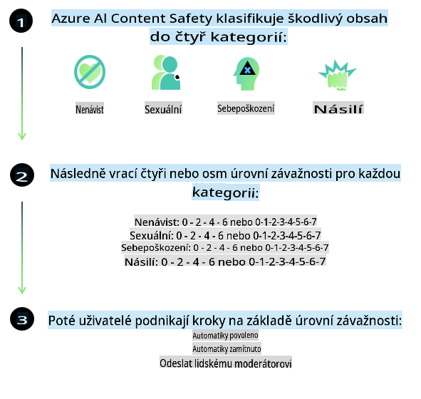
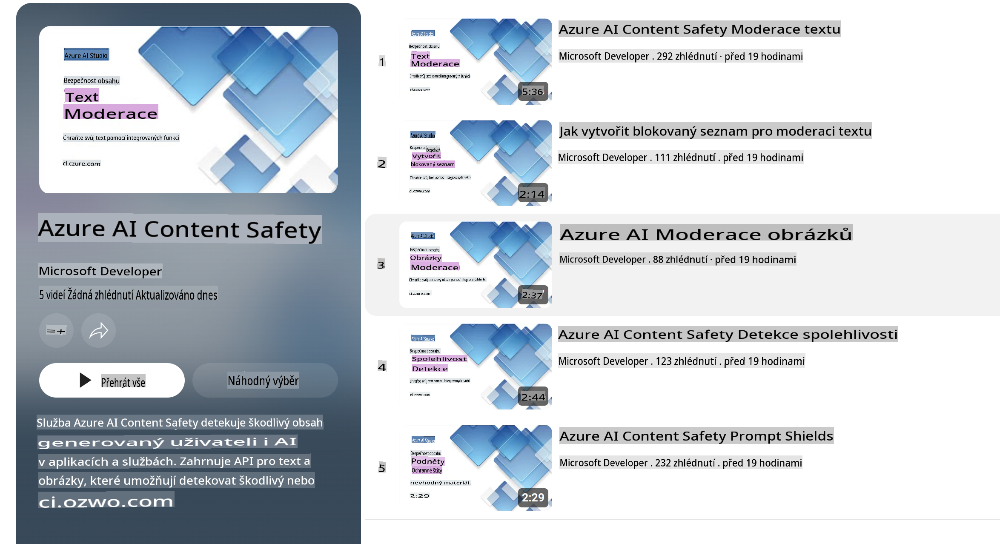

# Bezpečnost AI pro modely Phi
Rodina modelů Phi byla vyvinuta v souladu s [Microsoft Responsible AI Standard](https://query.prod.cms.rt.microsoft.com/cms/api/am/binary/RE5cmFl), což je soubor požadavků napříč společností založený na šesti principech: odpovědnost, transparentnost, spravedlnost, spolehlivost a bezpečnost, soukromí a zabezpečení, a inkluzivita, které tvoří [principy zodpovědné AI společnosti Microsoft](https://www.microsoft.com/ai/responsible-ai).

Stejně jako u předchozích modelů Phi byl přijat víceúrovňový přístup k hodnocení bezpečnosti a bezpečnostnímu post-tréninku, přičemž byla zohledněna vícejazyčná schopnost této verze. Náš přístup k bezpečnostnímu tréninku a hodnocení, včetně testování v různých jazycích a kategoriích rizik, je popsán v [Phi Safety Post-Training Paper](https://arxiv.org/abs/2407.13833). I když modely Phi těží z tohoto přístupu, vývojáři by měli aplikovat osvědčené postupy zodpovědné AI, včetně mapování, měření a zmírňování rizik spojených s jejich konkrétním případem použití a kulturním či jazykovým kontextem.

## Osvědčené postupy

Stejně jako jiné modely, i rodina modelů Phi se může chovat způsoby, které jsou nespravedlivé, nespolehlivé nebo urážlivé.

Mezi omezené chování SLM a LLM, na které byste si měli dát pozor, patří:

- **Kvalita služby:** Modely Phi jsou primárně trénovány na anglických textech. Jazyky jiné než angličtina budou mít horší výkon. Varianty angličtiny, které jsou méně zastoupené v tréninkových datech, mohou mít horší výkon než standardní americká angličtina.
- **Reprezentace škod a podpora stereotypů:** Tyto modely mohou nadměrně nebo nedostatečně reprezentovat určité skupiny lidí, vymazávat zastoupení některých skupin nebo posilovat ponižující či negativní stereotypy. Navzdory bezpečnostnímu post-tréninku mohou tato omezení přetrvávat kvůli rozdílným úrovním zastoupení různých skupin nebo přítomnosti příkladů negativních stereotypů v tréninkových datech, které odrážejí reálné vzory a společenské předsudky.
- **Nevhodný nebo urážlivý obsah:** Tyto modely mohou generovat i jiné typy nevhodného nebo urážlivého obsahu, což může znamenat, že nejsou vhodné k nasazení v citlivých kontextech bez dalších zmírňujících opatření specifických pro daný případ použití.
- **Spolehlivost informací:** Jazykové modely mohou generovat nesmyslný obsah nebo vytvářet obsah, který může znít rozumně, ale je nepřesný nebo zastaralý.
- **Omezený rozsah pro kód:** Většina tréninkových dat Phi-3 je založena na Pythonu a používá běžné balíčky jako "typing, math, random, collections, datetime, itertools". Pokud model generuje Pythonové skripty využívající jiné balíčky nebo skripty v jiných jazycích, důrazně doporučujeme uživatelům ručně ověřit všechny použití API.

Vývojáři by měli aplikovat osvědčené postupy zodpovědné AI a jsou odpovědní za to, že konkrétní případ použití bude v souladu s příslušnými zákony a předpisy (např. soukromí, obchod, atd.).

## Úvahy o zodpovědné AI

Stejně jako jiné jazykové modely mohou modely série Phi potenciálně vykazovat chování, které je nespravedlivé, nespolehlivé nebo urážlivé. Mezi omezené chování, na které je třeba si dát pozor, patří:

**Kvalita služby:** Modely Phi jsou primárně trénovány na anglických textech. Jazyky jiné než angličtina budou mít horší výkon. Varianty angličtiny, které jsou méně zastoupené v tréninkových datech, mohou mít horší výkon než standardní americká angličtina.

**Reprezentace škod a podpora stereotypů:** Tyto modely mohou nadměrně nebo nedostatečně reprezentovat určité skupiny lidí, vymazávat zastoupení některých skupin nebo posilovat ponižující či negativní stereotypy. Navzdory bezpečnostnímu post-tréninku mohou tato omezení přetrvávat kvůli rozdílným úrovním zastoupení různých skupin nebo přítomnosti příkladů negativních stereotypů v tréninkových datech, které odrážejí reálné vzory a společenské předsudky.

**Nevhodný nebo urážlivý obsah:** Tyto modely mohou generovat i jiné typy nevhodného nebo urážlivého obsahu, což může znamenat, že nejsou vhodné k nasazení v citlivých kontextech bez dalších zmírňujících opatření specifických pro daný případ použití.

**Spolehlivost informací:** Jazykové modely mohou generovat nesmyslný obsah nebo vytvářet obsah, který může znít rozumně, ale je nepřesný nebo zastaralý.

**Omezený rozsah pro kód:** Většina tréninkových dat Phi-3 je založena na Pythonu a používá běžné balíčky jako "typing, math, random, collections, datetime, itertools". Pokud model generuje Pythonové skripty využívající jiné balíčky nebo skripty v jiných jazycích, důrazně doporučujeme uživatelům ručně ověřit všechny použití API.

Vývojáři by měli aplikovat osvědčené postupy zodpovědné AI a jsou odpovědní za to, že konkrétní případ použití bude v souladu s příslušnými zákony a předpisy (např. soukromí, obchod, atd.). Důležité oblasti k zvážení zahrnují:

**Přidělování:** Modely nemusí být vhodné pro scénáře, které by mohly mít zásadní dopad na právní status nebo přidělování zdrojů či životních příležitostí (např. bydlení, zaměstnání, úvěry, atd.) bez dalších hodnocení a technik pro odstranění předsudků.

**Vysoce rizikové scénáře:** Vývojáři by měli posoudit vhodnost použití modelů ve vysoce rizikových scénářích, kde by nespravedlivé, nespolehlivé nebo urážlivé výstupy mohly být velmi nákladné nebo způsobit škody. To zahrnuje poskytování rad v citlivých nebo expertních oblastech, kde je přesnost a spolehlivost zásadní (např. právní nebo zdravotní rady). Další ochranná opatření by měla být implementována na úrovni aplikace podle kontextu nasazení.

**Dezinformace:** Modely mohou generovat nepřesné informace. Vývojáři by měli dodržovat osvědčené postupy pro transparentnost a informovat koncové uživatele, že komunikují se systémem AI. Na úrovni aplikace mohou vývojáři vytvářet mechanismy zpětné vazby a procesy pro zakotvení odpovědí ve specifických kontextových informacích, což je technika známá jako Retrieval Augmented Generation (RAG).

**Generování škodlivého obsahu:** Vývojáři by měli posoudit výstupy ve svém kontextu a využít dostupné bezpečnostní klasifikátory nebo vlastní řešení vhodná pro jejich případ použití.

**Zneužití:** Jiné formy zneužití, jako je podvod, spam nebo produkce malwaru, mohou být možné, a vývojáři by měli zajistit, že jejich aplikace neporušují platné zákony a předpisy.

### Doladění a bezpečnost obsahu AI

Po doladění modelu důrazně doporučujeme využít opatření [Azure AI Content Safety](https://learn.microsoft.com/azure/ai-services/content-safety/overview) k monitorování obsahu generovaného modely, identifikaci a blokování potenciálních rizik, hrozeb a problémů s kvalitou.

[Azure AI Content Safety](https://learn.microsoft.com/azure/ai-services/content-safety/overview) podporuje textový i obrazový obsah. Může být nasazen v cloudu, odpojených kontejnerech i na edge/vestavěných zařízeních.

## Přehled Azure AI Content Safety

Azure AI Content Safety není univerzální řešení; lze jej přizpůsobit tak, aby odpovídalo specifickým politikám podniků. Navíc jeho vícejazyčné modely umožňují porozumět více jazykům současně.

- **Azure AI Content Safety**
- **Microsoft Developer**
- **5 videí**

Služba Azure AI Content Safety detekuje škodlivý obsah generovaný uživateli i AI v aplikacích a službách. Obsahuje API pro text i obraz, které umožňují detekovat škodlivý nebo nevhodný materiál.

[AI Content Safety Playlist](https://www.youtube.com/playlist?list=PLlrxD0HtieHjaQ9bJjyp1T7FeCbmVcPkQ)

**Upozornění**:  
Tento dokument byl přeložen pomocí strojových překladatelských služeb AI. Přestože se snažíme o přesnost, mějte na paměti, že automatizované překlady mohou obsahovat chyby nebo nepřesnosti. Původní dokument v jeho rodném jazyce by měl být považován za autoritativní zdroj. Pro důležité informace se doporučuje profesionální lidský překlad. Nezodpovídáme za žádná nedorozumění nebo nesprávné výklady vyplývající z použití tohoto překladu.