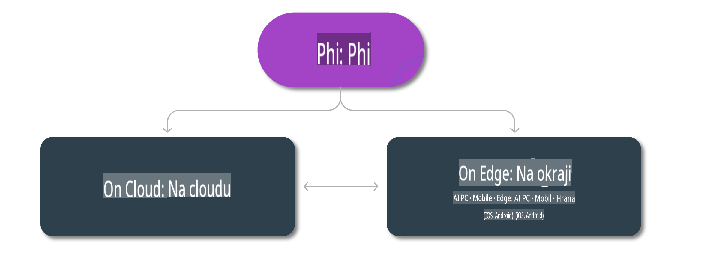

# Modely Phi a dostupnost na různých platformách

## Scénáře Edge a Cloud

## Dostupnost modelů a zdroje

| | | | | | | | | |
|-|-|-|-|-|-|-|-|-|
|Model|Vstup|Délka obsahu|Azure AI (MaaS)|Azure ML (MaaP)|ONNX|Hugging Face|Ollama|Nvidia NIM|
|Phi-3-vision-128k-instruct|Text+Obrázek|128k|[Playground a nasazení](https://ai.azure.com/explore/models/Phi-3-vision-128k-instruct/version/2/registry/azureml)|[Playground, nasazení a doladění](https://ml.azure.com/registries/azureml/models/Phi-3-vision-128k-instruct/version/2)|[CUDA](https://huggingface.co/microsoft/Phi-3-vision-128k-instruct-onnx-cuda/tree/main),[CPU](https://huggingface.co/microsoft/Phi-3-vision-128k-instruct-onnx-cpu/tree/main), [DirectML](https://huggingface.co/microsoft/Phi-3-vision-128k-instruct-onnx-directml/tree/main)|[Stáhnout](https://huggingface.co/microsoft/Phi-3-vision-128k-instruct)|-NA-|[NIM API](https://build.nvidia.com/microsoft/phi-3-vision-128k-instruct)|
|Phi-3-mini-4k-instruct|Text|4k|[Playground a nasazení](https://aka.ms/phi3-mini-4k-azure-ml)|[Playground, nasazení](https://aka.ms/phi3-mini-4k-azure-ml) a doladění|[CUDA](https://huggingface.co/microsoft/Phi-3-mini-4k-instruct-onnx), [Web](https://huggingface.co/microsoft/Phi-3-mini-4k-instruct-onnx)|[Playground a stáhnout](https://huggingface.co/chat/models/microsoft/Phi-3-mini-4k-instruct)|[GGUF](https://huggingface.co/microsoft/Phi-3-mini-4k-instruct-gguf)|[NIM API](https://build.nvidia.com/microsoft/phi-3-mini-4k)|
|Phi-3-mini-128k-instruct|Text|128k|[Playground a nasazení](https://ai.azure.com/explore/models/Phi-3-mini-128k-instruct/version/9/registry/azureml)|[Playground, nasazení](https://ai.azure.com/explore/models/Phi-3-mini-128k-instruct/version/9/registry/azureml) a doladění|[CUDA](https://huggingface.co/microsoft/Phi-3-mini-128k-instruct-onnx)|[Stáhnout](https://huggingface.co/microsoft/Phi-3-mini-128k-instruct-onnx)|-NA-|[NIM API](https://build.nvidia.com/microsoft/phi-3-mini)|
|Phi-3-small-8k-instruct|Text|8k|[Playground a nasazení](https://ml.azure.com/registries/azureml/models/Phi-3-small-8k-instruct/version/2)|[Playground, nasazení](https://ai.azure.com/explore/models/Phi-3-small-8k-instruct/version/2/registry/azureml) a doladění|[CUDA](https://huggingface.co/microsoft/Phi-3-small-8k-instruct-onnx-cuda)|[Stáhnout](https://huggingface.co/microsoft/Phi-3-small-8k-instruct-onnx-cuda)|-NA-|[NIM API](https://build.nvidia.com/microsoft/phi-3-small-8k-instruct?docker=false)|
|Phi-3-small-128k-instruct|Text|128k|[Playground a nasazení](https://ai.azure.com/explore/models/Phi-3-small-128k-instruct/version/2/registry/azureml)|[Playground, nasazení](https://ml.azure.com/registries/azureml/models/Phi-3-small-128k-instruct/version/2) a doladění|[CUDA](https://huggingface.co/microsoft/Phi-3-medium-128k-instruct-onnx-cuda)|[Stáhnout](https://huggingface.co/microsoft/Phi-3-small-128k-instruct)|-NA-|[NIM API](https://build.nvidia.com/microsoft/phi-3-small-128k-instruct?docker=false)|
|Phi-3-medium-4k-instruct|Text|4k|[Playground a nasazení](https://huggingface.co/microsoft/Phi-3-medium-4k-instruct)|[Playground, nasazení](https://ml.azure.com/registries/azureml/models/Phi-3-medium-4k-instruct/version/2) a doladění|[CUDA](https://huggingface.co/microsoft/Phi-3-medium-4k-instruct-onnx-cuda/tree/main), [CPU](https://huggingface.co/microsoft/Phi-3-medium-4k-instruct-onnx-cpu/tree/main), [DirectML](https://huggingface.co/microsoft/Phi-3-medium-4k-instruct-onnx-directml/tree/main)|[Stáhnout](https://huggingface.co/microsoft/Phi-3-medium-4k-instruct)|-NA-|[NIM API](https://build.nvidia.com/microsoft/phi-3-medium-4k-instruct?docker=false)|
|Phi-3-medium-128k-instruct|Text|128k|[Playground a nasazení](https://ai.azure.com/explore/models/Phi-3-medium-128k-instruct/version/2)|[Playground, nasazení](https://ml.azure.com/registries/azureml/models/Phi-3-medium-128k-instruct/version/2) a doladění|[CUDA](https://huggingface.co/microsoft/Phi-3-medium-128k-instruct-onnx-cuda/tree/main), [CPU](https://huggingface.co/microsoft/Phi-3-medium-128k-instruct-onnx-cpu/tree/main), [DirectML](https://huggingface.co/microsoft/Phi-3-medium-128k-instruct-onnx-directml/tree/main)|[Stáhnout](https://huggingface.co/microsoft/Phi-3-medium-128k-instruct)|-NA-|-NA-|

**Upozornění**:  
Tento dokument byl přeložen pomocí strojových překladových služeb založených na umělé inteligenci. Ačkoli se snažíme o přesnost, mějte na paměti, že automatické překlady mohou obsahovat chyby nebo nepřesnosti. Původní dokument v jeho rodném jazyce by měl být považován za autoritativní zdroj. Pro kritické informace se doporučuje profesionální lidský překlad. Neodpovídáme za jakékoli nedorozumění nebo nesprávné interpretace vyplývající z použití tohoto překladu.