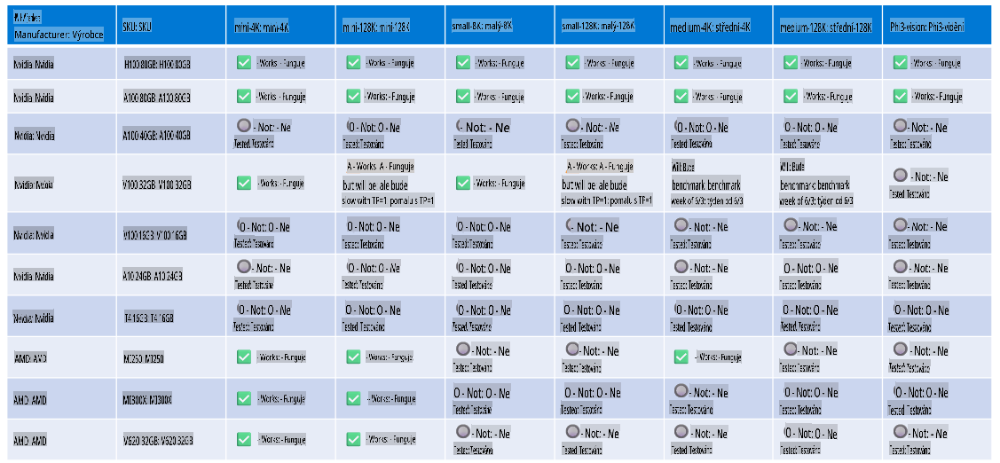

# Podpora hardwaru Phi

Microsoft Phi byl optimalizován pro ONNX Runtime a podporuje Windows DirectML. Funguje dobře na různých typech hardwaru, včetně GPU, CPU a dokonce i mobilních zařízení.

## Hardwarová zařízení  
Konkrétně podporovaný hardware zahrnuje:

- GPU SKU: RTX 4090 (DirectML)  
- GPU SKU: 1 A100 80GB (CUDA)  
- CPU SKU: Standard F64s v2 (64 vCPU, 128 GiB paměti)  

## Mobilní SKU  

- Android - Samsung Galaxy S21  
- Apple iPhone 14 nebo vyšší s procesorem A16/A17  

## Specifikace hardwaru Phi  

- Minimální požadovaná konfigurace.  
- Windows: GPU kompatibilní s DirectX 12 a minimálně 4 GB kombinované paměti RAM  

CUDA: NVIDIA GPU s Compute Capability >= 7.02  



## Spuštění onnxruntime na více GPU  

V současnosti jsou dostupné Phi ONNX modely pouze pro 1 GPU. Je možné podporovat více GPU pro Phi model, ale ORT se 2 GPU nezaručuje, že poskytne vyšší propustnost ve srovnání se 2 instancemi ORT. Nejnovější aktualizace naleznete na [ONNX Runtime](https://onnxruntime.ai/).  

Na [Build 2024 tým GenAI ONNX](https://youtu.be/WLW4SE8M9i8?si=EtG04UwDvcjunyfC) oznámil, že povolili multi-instance namísto multi-GPU pro Phi modely.  

V současné době to umožňuje spustit jednu instanci onnxruntime nebo onnxruntime-genai s proměnnou prostředí CUDA_VISIBLE_DEVICES takto.  

```Python
CUDA_VISIBLE_DEVICES=0 python infer.py
CUDA_VISIBLE_DEVICES=1 python infer.py
```  

Neváhejte dále prozkoumat Phi na [Azure AI Foundry](https://ai.azure.com).  

**Upozornění**:  
Tento dokument byl přeložen pomocí strojových překladatelských služeb založených na umělé inteligenci. Ačkoli se snažíme o přesnost, mějte na paměti, že automatické překlady mohou obsahovat chyby nebo nepřesnosti. Původní dokument v jeho původním jazyce by měl být považován za autoritativní zdroj. Pro důležité informace se doporučuje profesionální lidský překlad. Neodpovídáme za žádná nedorozumění nebo nesprávné interpretace vyplývající z použití tohoto překladu.