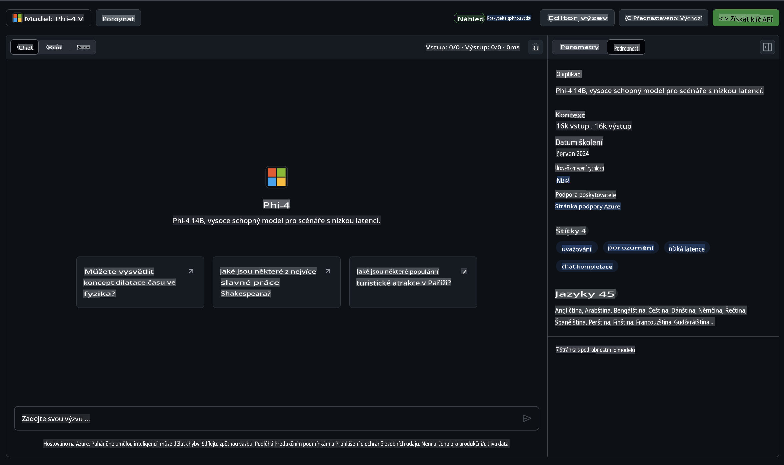

## Phi Family v GitHub modelech

Vítejte na [GitHub modelech](https://github.com/marketplace/models)! Máme vše připravené, abyste mohli prozkoumat AI modely hostované na Azure AI.


Pro více informací o modelech dostupných na GitHub modelech se podívejte na [GitHub Model Marketplace](https://github.com/marketplace/models).

## Dostupné modely

Každý model má svůj vlastní playground a ukázkový kód.



### Phi Family v katalogu GitHub modelů

- [Phi-4](https://github.com/marketplace/models/azureml/Phi-4)

- [Phi-3.5-MoE instruct (128k)](https://github.com/marketplace/models/azureml/Phi-3-5-MoE-instruct)

- [Phi-3.5-vision instruct (128k)](https://github.com/marketplace/models/azureml/Phi-3-5-vision-instruct)

- [Phi-3.5-mini instruct (128k)](https://github.com/marketplace/models/azureml/Phi-3-5-mini-instruct)

- [Phi-3-Medium-128k-Instruct](https://github.com/marketplace/models/azureml/Phi-3-medium-128k-instruct)

- [Phi-3-medium-4k-instruct](https://github.com/marketplace/models/azureml/Phi-3-medium-4k-instruct)

- [Phi-3-mini-128k-instruct](https://github.com/marketplace/models/azureml/Phi-3-mini-128k-instruct)

- [Phi-3-mini-4k-instruct](https://github.com/marketplace/models/azureml/Phi-3-mini-4k-instruct)

- [Phi-3-small-128k-instruct](https://github.com/marketplace/models/azureml/Phi-3-small-128k-instruct)

- [Phi-3-small-8k-instruct](https://github.com/marketplace/models/azureml/Phi-3-small-8k-instruct)

## Začínáme

Máme pro vás připraveno několik základních příkladů, které můžete rovnou spustit. Najdete je ve složce se vzorovými příklady. Pokud chcete přejít přímo ke svému oblíbenému programovacímu jazyku, příklady jsou dostupné v následujících jazycích:

- Python  
- JavaScript  
- C#  
- Java  
- cURL  

Pro spouštění příkladů a modelů je také připraveno speciální prostředí Codespaces.


## Ukázkový kód

Níže jsou uvedeny ukázky kódu pro několik případů použití. Pro další informace o Azure AI Inference SDK si projděte kompletní dokumentaci a příklady.

## Nastavení

1. Vytvořte osobní přístupový token  
Nemusíte tokenu přidělovat žádná oprávnění. Mějte na paměti, že token bude odeslán do služby Microsoft.

Pro použití níže uvedených úryvků kódu vytvořte proměnnou prostředí a nastavte svůj token jako klíč pro klientský kód.

Pokud používáte bash:  
```
export GITHUB_TOKEN="<your-github-token-goes-here>"
```  
Pokud používáte PowerShell:  

```
$Env:GITHUB_TOKEN="<your-github-token-goes-here>"
```  

Pokud používáte příkazový řádek Windows:  

```
set GITHUB_TOKEN=<your-github-token-goes-here>
```  

## Ukázka pro Python

### Instalace závislostí  
Nainstalujte Azure AI Inference SDK pomocí pip (vyžaduje: Python >=3.8):  

```
pip install azure-ai-inference
```  

### Spuštění základního příkladu kódu  

Tento příklad ukazuje základní volání API pro dokončení chatu. Využívá inference endpoint GitHub AI modelu a váš GitHub token. Volání je synchronní.  

```python
import os
from azure.ai.inference import ChatCompletionsClient
from azure.ai.inference.models import SystemMessage, UserMessage
from azure.core.credentials import AzureKeyCredential

endpoint = "https://models.inference.ai.azure.com"
model_name = "Phi-4"
token = os.environ["GITHUB_TOKEN"]

client = ChatCompletionsClient(
    endpoint=endpoint,
    credential=AzureKeyCredential(token),
)

response = client.complete(
    messages=[
        UserMessage(content="I have $20,000 in my savings account, where I receive a 4% profit per year and payments twice a year. Can you please tell me how long it will take for me to become a millionaire? Also, can you please explain the math step by step as if you were explaining it to an uneducated person?"),
    ],
    temperature=0.4,
    top_p=1.0,
    max_tokens=2048,
    model=model_name
)

print(response.choices[0].message.content)
```  

### Spuštění vícekolového rozhovoru  

Tento příklad ukazuje vícekolový rozhovor pomocí API pro dokončení chatu. Při použití modelu v chatovací aplikaci budete muset spravovat historii rozhovoru a posílat modelu nejnovější zprávy.  

```
import os
from azure.ai.inference import ChatCompletionsClient
from azure.ai.inference.models import AssistantMessage, SystemMessage, UserMessage
from azure.core.credentials import AzureKeyCredential

token = os.environ["GITHUB_TOKEN"]
endpoint = "https://models.inference.ai.azure.com"
# Replace Model_Name
model_name = "Phi-4"

client = ChatCompletionsClient(
    endpoint=endpoint,
    credential=AzureKeyCredential(token),
)

messages = [
    SystemMessage(content="You are a helpful assistant."),
    UserMessage(content="What is the capital of France?"),
    AssistantMessage(content="The capital of France is Paris."),
    UserMessage(content="What about Spain?"),
]

response = client.complete(messages=messages, model=model_name)

print(response.choices[0].message.content)
```  

### Streamování výstupu  

Pro lepší uživatelský zážitek budete chtít streamovat odpověď modelu, aby se první token objevil co nejdříve a uživatel nemusel čekat na dlouhé odpovědi.  

```
import os
from azure.ai.inference import ChatCompletionsClient
from azure.ai.inference.models import SystemMessage, UserMessage
from azure.core.credentials import AzureKeyCredential

token = os.environ["GITHUB_TOKEN"]
endpoint = "https://models.inference.ai.azure.com"
# Replace Model_Name
model_name = "Phi-4"

client = ChatCompletionsClient(
    endpoint=endpoint,
    credential=AzureKeyCredential(token),
)

response = client.complete(
    stream=True,
    messages=[
        SystemMessage(content="You are a helpful assistant."),
        UserMessage(content="Give me 5 good reasons why I should exercise every day."),
    ],
    model=model_name,
)

for update in response:
    if update.choices:
        print(update.choices[0].delta.content or "", end="")

client.close()
```  

## Bezplatné použití a limity pro GitHub modely  

  

[Limity pro playground a bezplatné API použití](https://docs.github.com/en/github-models/prototyping-with-ai-models#rate-limits) jsou navrženy tak, aby vám pomohly experimentovat s modely a prototypovat vaši AI aplikaci. Pro použití nad rámec těchto limitů a pro škálování vaší aplikace musíte zřídit prostředky z Azure účtu a autentizovat se odtud namísto GitHub osobního přístupového tokenu. Nemusíte měnit nic jiného ve svém kódu. Použijte tento odkaz, abyste zjistili, jak překročit limity bezplatného tarifu v Azure AI.  

### Upozornění  

Pamatujte, že při interakci s modelem experimentujete s AI, takže jsou možné chyby v obsahu.  

Tato funkce podléhá různým limitům (včetně požadavků za minutu, požadavků za den, tokenů na požadavek a souběžných požadavků) a není určena pro produkční použití.  

GitHub Models používá Azure AI Content Safety. Tyto filtry nelze v rámci zkušenosti s GitHub Models vypnout. Pokud se rozhodnete používat modely prostřednictvím placené služby, nakonfigurujte si obsahové filtry podle svých požadavků.  

Tato služba podléhá podmínkám GitHub Pre-release Terms.  

**Upozornění**:  
Tento dokument byl přeložen pomocí strojových AI překladových služeb. I když se snažíme o přesnost, vezměte prosím na vědomí, že automatizované překlady mohou obsahovat chyby nebo nepřesnosti. Původní dokument v jeho původním jazyce by měl být považován za závazný zdroj. Pro důležité informace se doporučuje profesionální lidský překlad. Nezodpovídáme za jakékoli nedorozumění nebo nesprávné interpretace vyplývající z použití tohoto překladu.