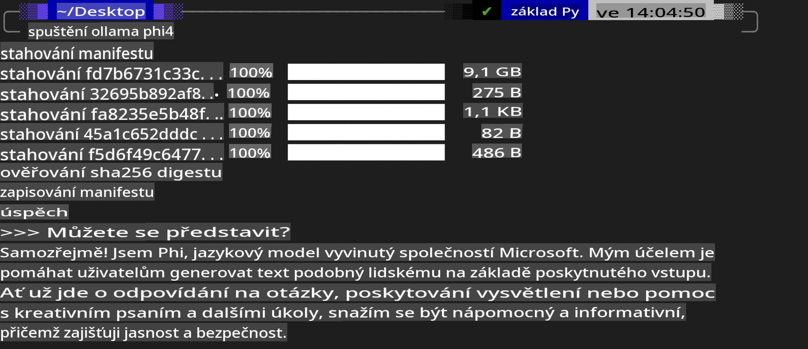
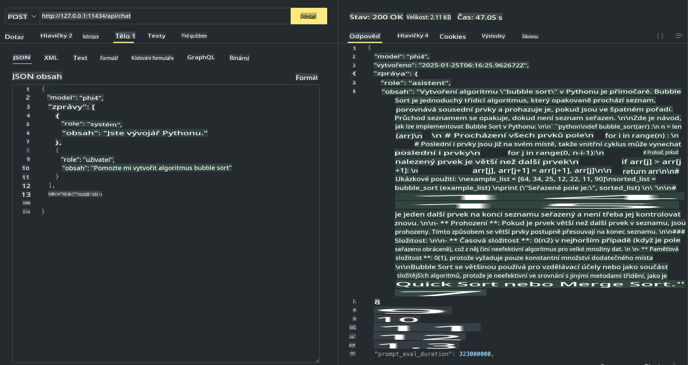

## Phi Family v Ollama

[Ollama](https://ollama.com) umožňuje více lidem snadno nasazovat open source LLM nebo SLM pomocí jednoduchých skriptů a také vytvářet API pro podporu lokálních aplikací typu Copilot.

## **1. Instalace**

Ollama podporuje běh na Windows, macOS a Linuxu. Ollama můžete nainstalovat prostřednictvím tohoto odkazu ([https://ollama.com/download](https://ollama.com/download)). Po úspěšné instalaci můžete přímo pomocí skriptu Ollama volat Phi-3 přes terminálové okno. Všechny [dostupné knihovny v Ollama](https://ollama.com/library) si můžete prohlédnout zde. Pokud tento repozitář otevřete v Codespace, Ollama bude již nainstalovaná.

```bash

ollama run phi4

```

> [!NOTE]
> Model bude při prvním spuštění nejprve stažen. Samozřejmě můžete přímo specifikovat již stažený model Phi-4. Jako příklad použijeme WSL pro spuštění příkazu. Po úspěšném stažení modelu můžete přímo interagovat v terminálu.



## **2. Volání API phi-4 z Ollama**

Pokud chcete volat API Phi-4 generované Ollama, můžete použít tento příkaz v terminálu ke spuštění serveru Ollama.

```bash

ollama serve

```

> [!NOTE]
> Pokud používáte macOS nebo Linux, můžete narazit na následující chybu **"Error: listen tcp 127.0.0.1:11434: bind: address already in use"**. Tato chyba se může objevit při spuštění příkazu. Chybu můžete ignorovat, protože obvykle znamená, že server již běží, nebo můžete Ollama zastavit a znovu spustit:

**macOS**

```bash

brew services restart ollama

```

**Linux**

```bash

sudo systemctl stop ollama

```

Ollama podporuje dvě API: generate a chat. Modelové API, které Ollama poskytuje, můžete volat podle svých potřeb odesláním požadavků na lokální službu běžící na portu 11434.

**Chat**

```bash

curl http://127.0.0.1:11434/api/chat -d '{
  "model": "phi3",
  "messages": [
    {
      "role": "system",
      "content": "Your are a python developer."
    },
    {
      "role": "user",
      "content": "Help me generate a bubble algorithm"
    }
  ],
  "stream": false
  
}'

This is the result in Postman



## Additional Resources

Check the list of available models in Ollama in [their library](https://ollama.com/library).

Pull your model from the Ollama server using this command

```bash
ollama pull phi4
```

Run the model using this command

```bash
ollama run phi4
```

***Note:*** Visit this link [https://github.com/ollama/ollama/blob/main/docs/api.md](https://github.com/ollama/ollama/blob/main/docs/api.md) to learn more

## Calling Ollama from Python

You can use `requests` or `urllib3` to make requests to the local server endpoints used above. However, a popular way to use Ollama in Python is via the [openai](https://pypi.org/project/openai/) SDK, since Ollama provides OpenAI-compatible server endpoints as well.

Here is an example for phi3-mini:

```python
import openai

client = openai.OpenAI(
    base_url="http://localhost:11434/v1",
    api_key="nokeyneeded",
)

response = client.chat.completions.create(
    model="phi4",
    temperature=0.7,
    n=1,
    messages=[
        {"role": "system", "content": "You are a helpful assistant."},
        {"role": "user", "content": "Write a haiku about a hungry cat"},
    ],
)

print("Response:")
print(response.choices[0].message.content)
```

## Calling Ollama from JavaScript 

```javascript
// Příklad shrnutí souboru pomocí Phi-4
script({
    model: "ollama:phi4",
    title: "Shrnutí s Phi-4",
    system: ["system"],
})

// Příklad shrnutí
const file = def("FILE", env.files)
$`Shrň ${file} do jednoho odstavce.`
```

## Calling Ollama from C#

Create a new C# Console application and add the following NuGet package:

```bash
dotnet add package Microsoft.SemanticKernel --version 1.34.0
```

Then replace this code in the `Program.cs` file

```csharp
using Microsoft.SemanticKernel;
using Microsoft.SemanticKernel.ChatCompletion;

// přidání služby pro chat completion pomocí lokálního endpointu Ollama serveru
#pragma warning disable SKEXP0001, SKEXP0003, SKEXP0010, SKEXP0011, SKEXP0050, SKEXP0052
builder.AddOpenAIChatCompletion(
    modelId: "phi4",
    endpoint: new Uri("http://localhost:11434/"),
    apiKey: "non required");

// jednoduchý dotaz na chatovací službu
string prompt = "Napiš vtip o koťatech";
var response = await kernel.InvokePromptAsync(prompt);
Console.WriteLine(response.GetValue<string>());
```

Run the app with the command:

```bash
dotnet run

**Upozornění**:  
Tento dokument byl přeložen pomocí strojových AI překladových služeb. I když se snažíme o přesnost, mějte prosím na paměti, že automatické překlady mohou obsahovat chyby nebo nepřesnosti. Původní dokument v jeho původním jazyce by měl být považován za závazný zdroj. Pro důležité informace se doporučuje profesionální lidský překlad. Nezodpovídáme za žádná nedorozumění nebo nesprávné interpretace vyplývající z použití tohoto překladu.