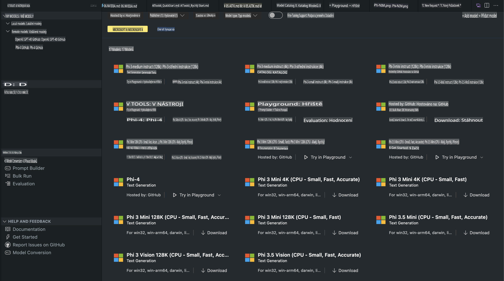
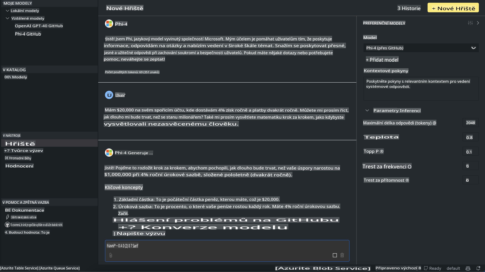

# Phi Family v AITK

[AI Toolkit pro VS Code](https://marketplace.visualstudio.com/items?itemName=ms-windows-ai-studio.windows-ai-studio) usnadňuje vývoj aplikací využívajících generativní AI tím, že spojuje špičkové nástroje pro vývoj AI a modely z katalogu Azure AI Foundry a dalších katalogů, jako je Hugging Face. Můžete procházet katalog AI modelů, který je poháněn GitHub Models a Azure AI Foundry Model Catalogs, stahovat je lokálně nebo vzdáleně, jemně ladit, testovat a používat je ve své aplikaci.

Náhled AI Toolkit běží lokálně. Lokální inference nebo jemné ladění závisí na vybraném modelu, může být nutné mít GPU, jako je NVIDIA CUDA GPU. S AITK můžete také přímo spouštět GitHub Models.

## Začínáme

[Zjistěte více o instalaci Windows Subsystem for Linux](https://learn.microsoft.com/windows/wsl/install?WT.mc_id=aiml-137032-kinfeylo)

a [změně výchozí distribuce](https://learn.microsoft.com/windows/wsl/install#change-the-default-linux-distribution-installed).

[GitHub repozitář AI Toolkit](https://github.com/microsoft/vscode-ai-toolkit/)

- Windows, Linux, macOS
  
- Pro jemné ladění na Windows i Linuxu budete potřebovat Nvidia GPU. Navíc **Windows** vyžaduje subsystem pro Linux s distribucí Ubuntu 18.4 nebo vyšší. [Zjistěte více o instalaci Windows Subsystem for Linux](https://learn.microsoft.com/windows/wsl/install) a [změně výchozí distribuce](https://learn.microsoft.com/windows/wsl/install#change-the-default-linux-distribution-installed).

### Instalace AI Toolkit

AI Toolkit je distribuován jako [rozšíření pro Visual Studio Code](https://code.visualstudio.com/docs/setup/additional-components#_vs-code-extensions), takže nejprve musíte nainstalovat [VS Code](https://code.visualstudio.com/docs/setup/windows?WT.mc_id=aiml-137032-kinfeylo) a poté stáhnout AI Toolkit z [VS Marketplace](https://marketplace.visualstudio.com/items?itemName=ms-windows-ai-studio.windows-ai-studio).
[AI Toolkit je dostupný na Visual Studio Marketplace](https://marketplace.visualstudio.com/items?itemName=ms-windows-ai-studio.windows-ai-studio) a lze jej nainstalovat jako jakékoli jiné rozšíření pro VS Code. 

Pokud nejste obeznámeni s instalací rozšíření pro VS Code, postupujte podle těchto kroků:

### Přihlášení

1. V postranním panelu VS Code vyberte **Rozšíření**
2. Do vyhledávacího pole rozšíření napište "AI Toolkit"
3. Vyberte "AI Toolkit for Visual Studio Code"
4. Klikněte na **Instalovat**

Nyní jste připraveni používat rozšíření!

Budete vyzváni k přihlášení do GitHubu, takže prosím klikněte na "Povolit" pro pokračování. Budete přesměrováni na přihlašovací stránku GitHub.

Přihlaste se a postupujte podle kroků procesu. Po úspěšném dokončení budete přesměrováni zpět do VS Code.

Jakmile bude rozšíření nainstalováno, uvidíte ikonu AI Toolkit v postranním panelu.

Pojďme prozkoumat dostupné akce!

### Dostupné akce

Hlavní postranní panel AI Toolkit je organizován do sekcí  

- **Modely**
- **Zdroje**
- **Hřiště**  
- **Jemné ladění**
- **Hodnocení**

Tyto sekce jsou dostupné v části Zdroje. Pro začátek vyberte **Model Catalog**.

### Stažení modelu z katalogu

Po spuštění AI Toolkit z postranního panelu VS Code můžete vybrat z následujících možností:



- Najděte podporovaný model v **Model Catalog** a stáhněte jej lokálně
- Otestujte inferenci modelu na **Model Playground**
- Jemně dolaďte model lokálně nebo vzdáleně v **Model Fine-tuning**
- Nasazujte jemně doladěné modely do cloudu pomocí příkazové palety pro AI Toolkit
- Hodnocení modelů

> [!NOTE]
>
> **GPU vs CPU**
>
> Všimnete si, že karty modelů zobrazují velikost modelu, platformu a typ akcelerátoru (CPU, GPU). Pro optimalizovaný výkon na **zařízeních Windows, která mají alespoň jednu GPU**, vybírejte verze modelů, které cílí pouze na Windows.
>
> To zajistí, že budete mít model optimalizovaný pro akcelerátor DirectML.
>
> Názvy modelů mají formát:
>
> - `{model_name}-{accelerator}-{quantization}-{format}`.
>
> Chcete-li zjistit, zda máte GPU na svém zařízení s Windows, otevřete **Správce úloh** a poté vyberte kartu **Výkon**. Pokud máte GPU, budou uvedeny pod názvy jako "GPU 0" nebo "GPU 1".

### Spuštění modelu na hřišti

Po nastavení všech parametrů klikněte na **Generate Project**.

Jakmile se model stáhne, vyberte **Load in Playground** na kartě modelu v katalogu:

- Zahajte stažení modelu
- Nainstalujte všechny požadované předpoklady a závislosti
- Vytvořte pracovní prostor VS Code



### Použití REST API ve vaší aplikaci 

AI Toolkit obsahuje lokální REST API webový server **na portu 5272**, který používá [formát OpenAI chat completions](https://platform.openai.com/docs/api-reference/chat/create). 

To vám umožňuje testovat vaši aplikaci lokálně, aniž byste se museli spoléhat na cloudovou AI modelovou službu. Například následující JSON soubor ukazuje, jak nakonfigurovat tělo požadavku:

```json
{
    "model": "Phi-4",
    "messages": [
        {
            "role": "user",
            "content": "what is the golden ratio?"
        }
    ],
    "temperature": 0.7,
    "top_p": 1,
    "top_k": 10,
    "max_tokens": 100,
    "stream": true
}
```

Můžete testovat REST API pomocí nástrojů jako [Postman](https://www.postman.com/) nebo utilitky CURL (Client URL):

```bash
curl -vX POST http://127.0.0.1:5272/v1/chat/completions -H 'Content-Type: application/json' -d @body.json
```

### Použití OpenAI klientské knihovny pro Python

```python
from openai import OpenAI

client = OpenAI(
    base_url="http://127.0.0.1:5272/v1/", 
    api_key="x" # required for the API but not used
)

chat_completion = client.chat.completions.create(
    messages=[
        {
            "role": "user",
            "content": "what is the golden ratio?",
        }
    ],
    model="Phi-4",
)

print(chat_completion.choices[0].message.content)
```

### Použití klientské knihovny Azure OpenAI pro .NET

Přidejte [klientskou knihovnu Azure OpenAI pro .NET](https://www.nuget.org/packages/Azure.AI.OpenAI/) do svého projektu pomocí NuGet:

```bash
dotnet add {project_name} package Azure.AI.OpenAI --version 1.0.0-beta.17
```

Do svého projektu přidejte soubor C# s názvem **OverridePolicy.cs** a vložte následující kód:

```csharp
// OverridePolicy.cs
using Azure.Core.Pipeline;
using Azure.Core;

internal partial class OverrideRequestUriPolicy(Uri overrideUri)
    : HttpPipelineSynchronousPolicy
{
    private readonly Uri _overrideUri = overrideUri;

    public override void OnSendingRequest(HttpMessage message)
    {
        message.Request.Uri.Reset(_overrideUri);
    }
}
```

Dále vložte následující kód do svého souboru **Program.cs**:

```csharp
// Program.cs
using Azure.AI.OpenAI;

Uri localhostUri = new("http://localhost:5272/v1/chat/completions");

OpenAIClientOptions clientOptions = new();
clientOptions.AddPolicy(
    new OverrideRequestUriPolicy(localhostUri),
    Azure.Core.HttpPipelinePosition.BeforeTransport);
OpenAIClient client = new(openAIApiKey: "unused", clientOptions);

ChatCompletionsOptions options = new()
{
    DeploymentName = "Phi-4",
    Messages =
    {
        new ChatRequestSystemMessage("You are a helpful assistant. Be brief and succinct."),
        new ChatRequestUserMessage("What is the golden ratio?"),
    }
};

StreamingResponse<StreamingChatCompletionsUpdate> streamingChatResponse
    = await client.GetChatCompletionsStreamingAsync(options);

await foreach (StreamingChatCompletionsUpdate chatChunk in streamingChatResponse)
{
    Console.Write(chatChunk.ContentUpdate);
}
```


## Jemné ladění s AI Toolkit

- Začněte s objevováním modelů a hřištěm.
- Jemné ladění modelů a inference pomocí místních výpočetních prostředků.
- Vzdálené jemné ladění a inference pomocí prostředků Azure.

[Jemné ladění s AI Toolkit](../../03.FineTuning/Finetuning_VSCodeaitoolkit.md)

## Zdroje otázek a odpovědí pro AI Toolkit

Podívejte se na naši [stránku otázek a odpovědí](https://github.com/microsoft/vscode-ai-toolkit/blob/main/archive/QA.md) pro nejčastější problémy a jejich řešení.

**Upozornění**:  
Tento dokument byl přeložen pomocí strojových AI překladatelských služeb. I když se snažíme o přesnost, mějte na paměti, že automatické překlady mohou obsahovat chyby nebo nepřesnosti. Původní dokument v jeho rodném jazyce by měl být považován za závazný zdroj. Pro důležité informace se doporučuje profesionální lidský překlad. Neodpovídáme za žádná nedorozumění nebo nesprávné interpretace vyplývající z použití tohoto překladu.