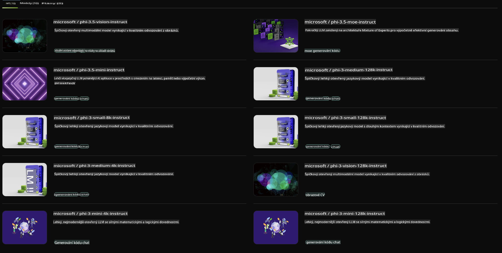

## Phi Family v NVIDIA NIM

NVIDIA NIM je sada snadno použitelných mikroslužeb navržených pro urychlení nasazení generativních AI modelů v cloudu, datových centrech a pracovních stanicích. NIMy jsou rozděleny podle rodiny modelů a jednotlivých modelů. Například NVIDIA NIM pro velké jazykové modely (LLMs) přináší špičkové LLMs do podnikových aplikací, poskytujících bezkonkurenční schopnosti zpracování a porozumění přirozenému jazyku.

NIM usnadňuje IT a DevOps týmům hostování velkých jazykových modelů (LLMs) ve vlastních spravovaných prostředích, přičemž vývojářům stále nabízí standardizovaná API umožňující vytvářet výkonné kopiloty, chatboty a AI asistenty, které mohou transformovat jejich podnikání. Díky špičkové akceleraci GPU od NVIDIA a škálovatelnému nasazení nabízí NIM nejrychlejší cestu k inferenci s bezkonkurenčním výkonem.

S NVIDIA NIM můžete provádět inference modelů z rodiny Phi.



### **Ukázky - Phi-3-Vision v NVIDIA NIM**

Představte si, že máte obrázek (`demo.png`) a chcete vygenerovat Python kód, který tento obrázek zpracuje a uloží jeho novou verzi (`phi-3-vision.jpg`).

Výše uvedený kód tento proces automatizuje tím, že:

1. Nastaví prostředí a potřebné konfigurace.
2. Vytvoří výzvu, která modelu zadá pokyn k vygenerování požadovaného Python kódu.
3. Odešle výzvu modelu a shromáždí vygenerovaný kód.
4. Extrahuje a spustí vygenerovaný kód.
5. Zobrazí původní a zpracované obrázky.

Tento přístup využívá sílu AI k automatizaci úkolů zpracování obrázků, což usnadňuje a urychluje dosažení vašich cílů.

[Ukázkové řešení kódu](../../../../../code/06.E2E/E2E_Nvidia_NIM_Phi3_Vision.ipynb)

Pojďme si krok za krokem rozebrat, co celý kód dělá:

1. **Instalace požadovaného balíčku**:
    ```python
    !pip install langchain_nvidia_ai_endpoints -U
    ```
    Tento příkaz instaluje balíček `langchain_nvidia_ai_endpoints` a zajistí, že je v nejnovější verzi.

2. **Import potřebných modulů**:
    ```python
    from langchain_nvidia_ai_endpoints import ChatNVIDIA
    import getpass
    import os
    import base64
    ```
    Tyto importy přinášejí potřebné moduly pro interakci s NVIDIA AI endpoints, bezpečné zpracování hesel, práci s operačním systémem a kódování/dekódování dat ve formátu base64.

3. **Nastavení API klíče**:
    ```python
    if not os.getenv("NVIDIA_API_KEY"):
        os.environ["NVIDIA_API_KEY"] = getpass.getpass("Enter your NVIDIA API key: ")
    ```
    Tento kód kontroluje, zda je nastavena proměnná prostředí `NVIDIA_API_KEY`. Pokud ne, vyzve uživatele k bezpečnému zadání jejich API klíče.

4. **Definice modelu a cesty k obrázku**:
    ```python
    model = 'microsoft/phi-3-vision-128k-instruct'
    chat = ChatNVIDIA(model=model)
    img_path = './imgs/demo.png'
    ```
    Nastaví model, který se má použít, vytvoří instanci `ChatNVIDIA` se specifikovaným modelem a definuje cestu k souboru obrázku.

5. **Vytvoření textové výzvy**:
    ```python
    text = "Please create Python code for image, and use plt to save the new picture under imgs/ and name it phi-3-vision.jpg."
    ```
    Definuje textovou výzvu, která modelu zadá pokyn k vygenerování Python kódu pro zpracování obrázku.

6. **Zakódování obrázku do base64**:
    ```python
    with open(img_path, "rb") as f:
        image_b64 = base64.b64encode(f.read()).decode()
    image = f''
    ```
    Tento kód načte soubor obrázku, zakóduje jej do base64 a vytvoří HTML značku obrázku s zakódovanými daty.

7. **Kombinace textu a obrázku do výzvy**:
    ```python
    prompt = f"{text} {image}"
    ```
    Kombinuje textovou výzvu a HTML značku obrázku do jednoho řetězce.

8. **Generování kódu pomocí ChatNVIDIA**:
    ```python
    code = ""
    for chunk in chat.stream(prompt):
        print(chunk.content, end="")
        code += chunk.content
    ```
    Tento kód odešle výzvu modelu `ChatNVIDIA` a získá odpověď obsahující vygenerovaný Python kód.

9. **Extrahování Python kódu z vygenerovaného obsahu**:
    ```python
    begin = code.index('```python') + 9
    code = code[begin:]
    end = code.index('```')
    code = code[:end]
    ```
    Tento krok extrahuje samotný Python kód z vygenerovaného obsahu odstraněním formátování Markdown.

10. **Spuštění vygenerovaného kódu**:
    ```python
    import subprocess
    result = subprocess.run(["python", "-c", code], capture_output=True)
    ```
    Tento krok spustí extrahovaný Python kód jako podproces a zachytí jeho výstup.

11. **Zobrazení obrázků**:
    ```python
    from IPython.display import Image, display
    display(Image(filename='./imgs/phi-3-vision.jpg'))
    display(Image(filename='./imgs/demo.png'))
    ```
    Tyto řádky zobrazí obrázky pomocí modulu `IPython.display`.

**Prohlášení:**  
Tento dokument byl přeložen pomocí strojových překladových služeb založených na umělé inteligenci. Přestože usilujeme o přesnost, mějte prosím na paměti, že automatické překlady mohou obsahovat chyby nebo nepřesnosti. Původní dokument v jeho rodném jazyce by měl být považován za závazný zdroj. Pro důležité informace se doporučuje profesionální lidský překlad. Neodpovídáme za žádná nedorozumění nebo nesprávné výklady vyplývající z použití tohoto překladu.