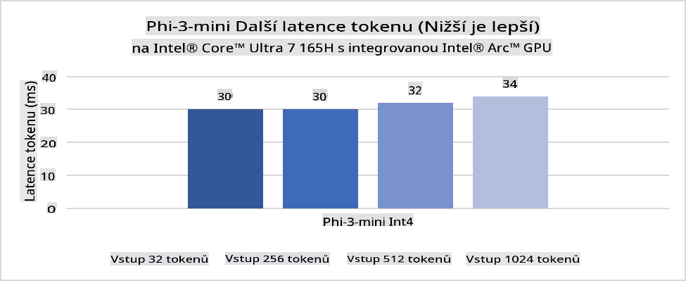
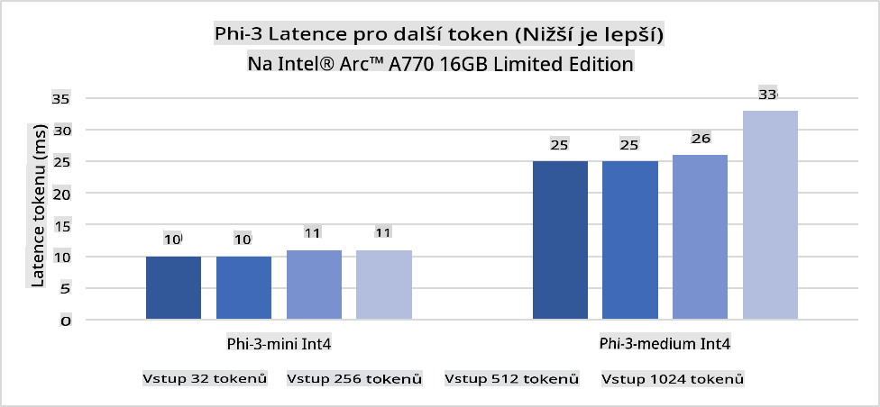
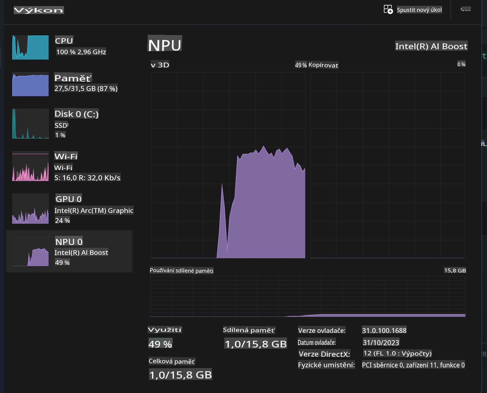
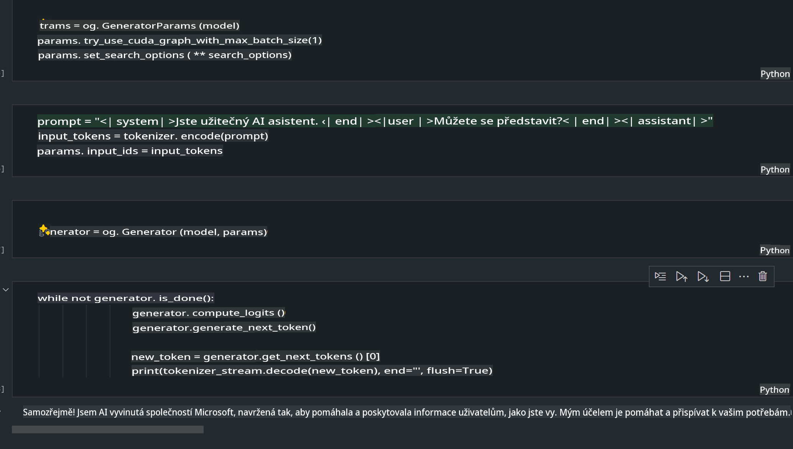
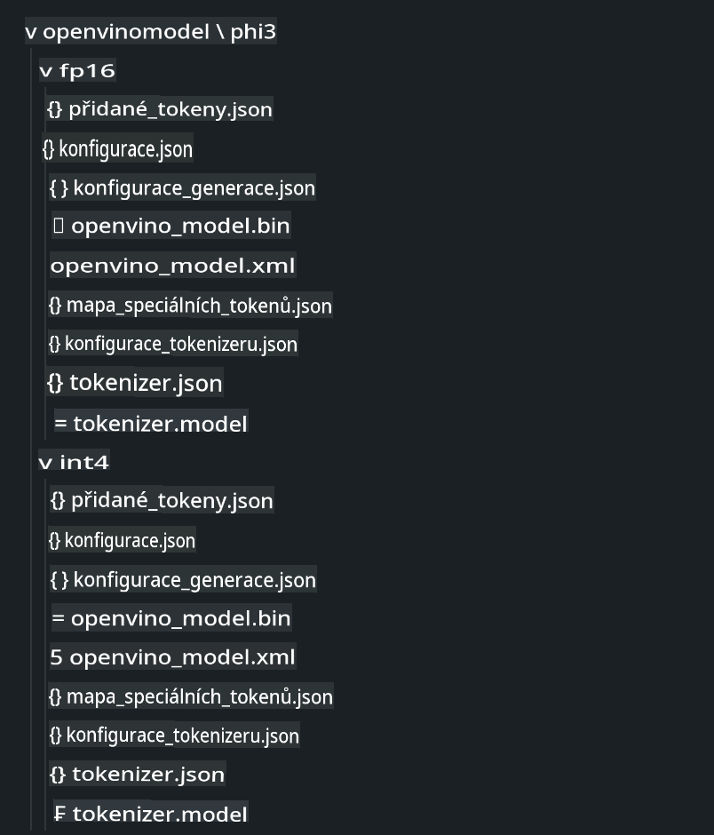
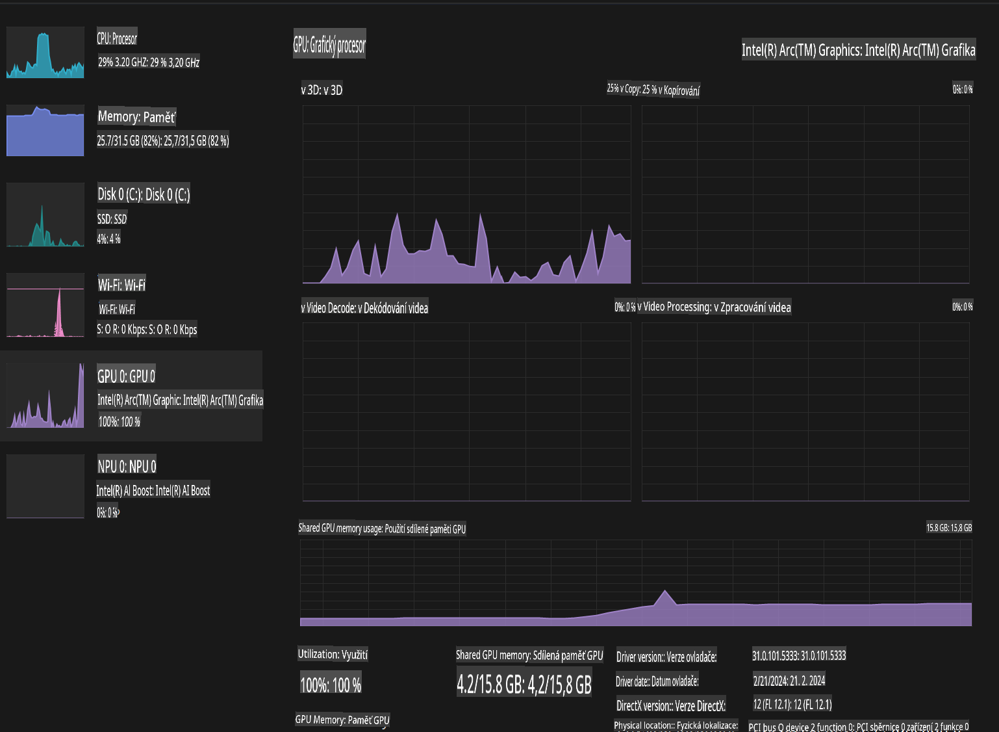

# **Inference Phi-3 v AI PC**

S rozvojem generativní AI a zlepšením hardwarových schopností zařízení na okraji (edge devices) je stále více generativních AI modelů integrováno do zařízení Bring Your Own Device (BYOD). AI PC patří mezi tyto modely. Od roku 2024 spolupracují Intel, AMD a Qualcomm s výrobci PC na zavádění AI PC, které umožňují nasazení lokalizovaných generativních AI modelů prostřednictvím hardwarových úprav. V této diskusi se zaměříme na Intel AI PC a prozkoumáme, jak nasadit Phi-3 na Intel AI PC.

### Co je NPU

NPU (Neural Processing Unit) je specializovaný procesor nebo výpočetní jednotka na větším SoC, navržená specificky pro akceleraci operací neuronových sítí a úkolů AI. Na rozdíl od univerzálních CPU a GPU jsou NPU optimalizovány pro datově orientované paralelní výpočty, což je činí vysoce efektivními při zpracování velkého množství multimediálních dat, jako jsou videa a obrázky, a při zpracování dat pro neuronové sítě. Jsou obzvláště vhodné pro AI úkoly, jako je rozpoznávání řeči, rozmazávání pozadí při videohovorech a úpravy fotografií či videí, jako je detekce objektů.

## NPU vs GPU

I když mnoho úloh AI a strojového učení běží na GPU, existuje zásadní rozdíl mezi GPU a NPU.
GPU jsou známé svými schopnostmi paralelního výpočtu, ale ne všechny GPU jsou stejně efektivní mimo zpracování grafiky. NPU jsou naopak speciálně navrženy pro komplexní výpočty spojené s operacemi neuronových sítí, což je činí velmi efektivními pro AI úkoly.

Stručně řečeno, NPU jsou matematickými experty, kteří zrychlují AI výpočty, a hrají klíčovou roli v nastupující éře AI PC!

***Tento příklad je založen na nejnovějším procesoru Intel Core Ultra***

## **1. Použití NPU pro spuštění modelu Phi-3**

Zařízení Intel® NPU je AI inference akcelerátor integrovaný do klientských CPU Intel, počínaje generací procesorů Intel® Core™ Ultra (dříve známé jako Meteor Lake). Umožňuje energeticky efektivní provádění úkolů umělých neuronových sítí.





**Intel NPU Acceleration Library**

Knihovna Intel NPU Acceleration Library [https://github.com/intel/intel-npu-acceleration-library](https://github.com/intel/intel-npu-acceleration-library) je Python knihovna navržená ke zvýšení efektivity vašich aplikací využitím výkonu Intel Neural Processing Unit (NPU) pro provádění rychlých výpočtů na kompatibilním hardwaru.

Příklad Phi-3-mini na AI PC poháněném procesory Intel® Core™ Ultra.


Instalace Python knihovny pomocí pip

```bash

   pip install intel-npu-acceleration-library

```

***Poznámka*** Projekt je stále ve vývoji, ale referenční model je již velmi kompletní.

### **Spuštění Phi-3 s Intel NPU Acceleration Library**

Použití Intel NPU akcelerace touto knihovnou neovlivňuje tradiční proces kódování. Stačí použít tuto knihovnu k kvantizaci původního modelu Phi-3, například FP16, INT8, INT4, například 

```python
from transformers import AutoTokenizer, pipeline,TextStreamer
from intel_npu_acceleration_library import NPUModelForCausalLM, int4
from intel_npu_acceleration_library.compiler import CompilerConfig
import warnings

model_id = "microsoft/Phi-3-mini-4k-instruct"

compiler_conf = CompilerConfig(dtype=int4)
model = NPUModelForCausalLM.from_pretrained(
    model_id, use_cache=True, config=compiler_conf, attn_implementation="sdpa"
).eval()

tokenizer = AutoTokenizer.from_pretrained(model_id)

text_streamer = TextStreamer(tokenizer, skip_prompt=True)
```

Po úspěšné kvantifikaci pokračujte v provádění a volejte NPU ke spuštění modelu Phi-3.

```python
generation_args = {
   "max_new_tokens": 1024,
   "return_full_text": False,
   "temperature": 0.3,
   "do_sample": False,
   "streamer": text_streamer,
}

pipe = pipeline(
   "text-generation",
   model=model,
   tokenizer=tokenizer,
)

query = "<|system|>You are a helpful AI assistant.<|end|><|user|>Can you introduce yourself?<|end|><|assistant|>"

with warnings.catch_warnings():
    warnings.simplefilter("ignore")
    pipe(query, **generation_args)
```

Při spouštění kódu můžeme sledovat stav běhu NPU prostřednictvím Správce úloh.



***Ukázky*** : [AIPC_NPU_DEMO.ipynb](../../../../../code/03.Inference/AIPC/AIPC_NPU_DEMO.ipynb)

## **2. Použití DirectML + ONNX Runtime pro spuštění modelu Phi-3**

### **Co je DirectML**

[DirectML](https://github.com/microsoft/DirectML) je vysoce výkonná, hardwarově akcelerovaná knihovna DirectX 12 pro strojové učení. DirectML poskytuje akceleraci GPU pro běžné úlohy strojového učení napříč širokou škálou podporovaného hardwaru a ovladačů, včetně všech GPU kompatibilních s DirectX 12 od výrobců jako AMD, Intel, NVIDIA a Qualcomm.

Když se používá samostatně, API DirectML je nízkoúrovňová knihovna DirectX 12 vhodná pro vysoce výkonné aplikace s nízkou latencí, jako jsou frameworky, hry a další aplikace v reálném čase. Bezproblémová interoperabilita DirectML s Direct3D 12, nízká režie a shoda napříč hardwarem činí DirectML ideálním pro akceleraci strojového učení tam, kde je žádoucí vysoký výkon a spolehlivost výsledků napříč hardwarem je klíčová.

***Poznámka*** : Nejnovější DirectML již podporuje NPU(https://devblogs.microsoft.com/directx/introducing-neural-processor-unit-npu-support-in-directml-developer-preview/)

### DirectML a CUDA z hlediska schopností a výkonu:

**DirectML** je knihovna strojového učení vyvinutá společností Microsoft. Je navržena k akceleraci úloh strojového učení na zařízeních s Windows, včetně stolních počítačů, notebooků a edge zařízení.
- DX12-Based: DirectML je postaven na DirectX 12 (DX12), což poskytuje širokou podporu hardwaru napříč GPU, včetně NVIDIA i AMD.
- Širší podpora: Díky využití DX12 může DirectML pracovat s jakýmkoliv GPU, které podporuje DX12, dokonce i s integrovanými GPU.
- Zpracování obrázků: DirectML zpracovává obrázky a další data pomocí neuronových sítí, což ho činí vhodným pro úkoly jako rozpoznávání obrázků, detekce objektů a další.
- Snadné nastavení: Nastavení DirectML je jednoduché a nevyžaduje specifické SDK nebo knihovny od výrobců GPU.
- Výkon: V některých případech DirectML dosahuje dobrého výkonu a může být rychlejší než CUDA, zejména u určitých úloh.
- Omezení: Nicméně existují případy, kdy může být DirectML pomalejší, zejména u float16 s velkými dávkami.

**CUDA** je paralelní výpočetní platforma a programovací model od NVIDIA. Umožňuje vývojářům využívat výkon NVIDIA GPU pro obecné výpočty, včetně strojového učení a vědeckých simulací.
- Specifické pro NVIDIA: CUDA je úzce integrována s NVIDIA GPU a je specificky navržena pro ně.
- Vysoce optimalizovaná: Nabízí vynikající výkon pro úkoly akcelerované GPU, zejména při použití NVIDIA GPU.
- Široce používaná: Mnoho frameworků a knihoven pro strojové učení (jako TensorFlow a PyTorch) má podporu CUDA.
- Přizpůsobení: Vývojáři mohou doladit nastavení CUDA pro specifické úkoly, což může vést k optimálnímu výkonu.
- Omezení: Závislost CUDA na hardwaru NVIDIA může být omezující, pokud chcete širší kompatibilitu napříč různými GPU.

### Volba mezi DirectML a CUDA

Volba mezi DirectML a CUDA závisí na konkrétním použití, dostupnosti hardwaru a preferencích.
Pokud hledáte širší kompatibilitu a snadné nastavení, DirectML může být dobrou volbou. Pokud však máte NVIDIA GPU a potřebujete vysoce optimalizovaný výkon, CUDA zůstává silným kandidátem. Stručně řečeno, oba mají své silné a slabé stránky, proto při rozhodování zvažte své požadavky a dostupný hardware.

### **Generativní AI s ONNX Runtime**

V éře AI je přenositelnost AI modelů velmi důležitá. ONNX Runtime umožňuje snadné nasazení trénovaných modelů na různá zařízení. Vývojáři se nemusí zabývat rámcem inference a mohou použít jednotné API pro dokončení inference modelu. V éře generativní AI byl ONNX Runtime také optimalizován (https://onnxruntime.ai/docs/genai/). Prostřednictvím optimalizovaného ONNX Runtime lze kvantizovaný generativní AI model spustit na různých terminálech. V Generative AI s ONNX Runtime můžete provádět inference AI modelu pomocí API pro Python, C#, C / C++. Samozřejmě, nasazení na iPhone může využívat Generative AI API ONNX Runtime v C++.

[Ukázkový kód](https://github.com/Azure-Samples/Phi-3MiniSamples/tree/main/onnx)

***Kompilace generativní AI s ONNX Runtime knihovnou***

```bash

winget install --id=Kitware.CMake  -e

git clone https://github.com/microsoft/onnxruntime.git

cd .\onnxruntime\

./build.bat --build_shared_lib --skip_tests --parallel --use_dml --config Release

cd ../

git clone https://github.com/microsoft/onnxruntime-genai.git

cd .\onnxruntime-genai\

mkdir ort

cd ort

mkdir include

mkdir lib

copy ..\onnxruntime\include\onnxruntime\core\providers\dml\dml_provider_factory.h ort\include

copy ..\onnxruntime\include\onnxruntime\core\session\onnxruntime_c_api.h ort\include

copy ..\onnxruntime\build\Windows\Release\Release\*.dll ort\lib

copy ..\onnxruntime\build\Windows\Release\Release\onnxruntime.lib ort\lib

python build.py --use_dml


```

**Instalace knihovny**

```bash

pip install .\onnxruntime_genai_directml-0.3.0.dev0-cp310-cp310-win_amd64.whl

```

Toto je výsledek běhu.



***Ukázky*** : [AIPC_DirectML_DEMO.ipynb](../../../../../code/03.Inference/AIPC/AIPC_DirectML_DEMO.ipynb)

## **3. Použití Intel OpenVino pro spuštění modelu Phi-3**

### **Co je OpenVINO**

[OpenVINO](https://github.com/openvinotoolkit/openvino) je open-source nástrojová sada pro optimalizaci a nasazení modelů hlubokého učení. Poskytuje zvýšený výkon hlubokého učení pro modely zaměřené na vidění, zvuk a jazyk z populárních frameworků jako TensorFlow, PyTorch a dalších. Začněte s OpenVINO. OpenVINO lze také použít v kombinaci s CPU a GPU ke spuštění modelu Phi-3.

***Poznámka***: Aktuálně OpenVINO nepodporuje NPU.

### **Instalace OpenVINO knihovny**

```bash

 pip install git+https://github.com/huggingface/optimum-intel.git

 pip install git+https://github.com/openvinotoolkit/nncf.git

 pip install openvino-nightly

```

### **Spuštění Phi-3 s OpenVINO**

Stejně jako u NPU OpenVINO dokončuje volání generativních AI modelů spuštěním kvantitativních modelů. Nejprve je třeba kvantizovat model Phi-3 a dokončit kvantizaci modelu na příkazovém řádku pomocí optimum-cli.

**INT4**

```bash

optimum-cli export openvino --model "microsoft/Phi-3-mini-4k-instruct" --task text-generation-with-past --weight-format int4 --group-size 128 --ratio 0.6  --sym  --trust-remote-code ./openvinomodel/phi3/int4

```

**FP16**

```bash

optimum-cli export openvino --model "microsoft/Phi-3-mini-4k-instruct" --task text-generation-with-past --weight-format fp16 --trust-remote-code ./openvinomodel/phi3/fp16

```

převedený formát, například takto:



Načtěte cesty k modelům (model_dir), související konfigurace (ov_config = {"PERFORMANCE_HINT": "LATENCY", "NUM_STREAMS": "1", "CACHE_DIR": ""}) a zařízení akcelerovaná hardwarem (GPU.0) prostřednictvím OVModelForCausalLM.

```python

ov_model = OVModelForCausalLM.from_pretrained(
     model_dir,
     device='GPU.0',
     ov_config=ov_config,
     config=AutoConfig.from_pretrained(model_dir, trust_remote_code=True),
     trust_remote_code=True,
)

```

Při spouštění kódu můžeme sledovat stav běhu GPU prostřednictvím Správce úloh.



***Ukázky*** : [AIPC_OpenVino_Demo.ipynb](../../../../../code/03.Inference/AIPC/AIPC_OpenVino_Demo.ipynb)

### ***Poznámka*** : Výše uvedené tři metody mají každá své výhody, ale doporučuje se použít akceleraci NPU pro inference na AI PC.

**Upozornění**:  
Tento dokument byl přeložen pomocí strojových AI překladatelských služeb. I když se snažíme o přesnost, mějte prosím na paměti, že automatizované překlady mohou obsahovat chyby nebo nepřesnosti. Původní dokument v jeho původním jazyce by měl být považován za závazný zdroj. Pro kritické informace se doporučuje profesionální lidský překlad. Nenese zodpovědnost za jakékoli nedorozumění nebo nesprávné výklady vyplývající z použití tohoto překladu.