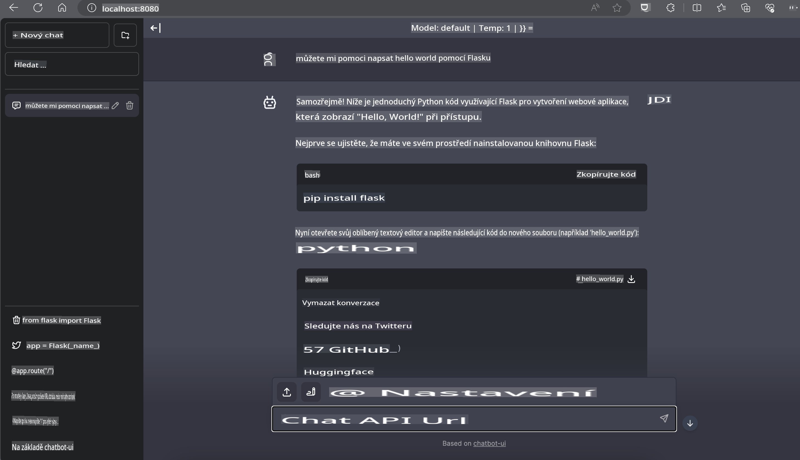

# **Inference Phi-3 na Nvidia Jetson**

Nvidia Jetson je řada vestavěných výpočetních desek od společnosti Nvidia. Modely Jetson TK1, TX1 a TX2 obsahují procesor Tegra (nebo SoC) od Nvidie, který integruje centrální procesorovou jednotku (CPU) s architekturou ARM. Jetson je systém s nízkou spotřebou energie a je navržen pro urychlení aplikací strojového učení. Nvidia Jetson je využíván profesionálními vývojáři k vytváření průlomových AI produktů napříč všemi odvětvími a studenty či nadšenci pro praktické učení AI a tvorbu úžasných projektů. SLM je nasazováno v zařízeních na okraji sítě, jako je Jetson, což umožňuje lepší implementaci průmyslových generativních AI scénářů.

## Nasazení na NVIDIA Jetson:
Vývojáři pracující na autonomní robotice a vestavěných zařízeních mohou využít Phi-3 Mini. Relativně malá velikost Phi-3 je ideální pro nasazení na okraji sítě. Parametry byly během tréninku pečlivě vyladěny, což zajišťuje vysokou přesnost odpovědí.

### Optimalizace TensorRT-LLM:
Knihovna [TensorRT-LLM od NVIDIA](https://github.com/NVIDIA/TensorRT-LLM?WT.mc_id=aiml-138114-kinfeylo) optimalizuje inferenci velkých jazykových modelů. Podporuje dlouhé kontextové okno Phi-3 Mini, čímž zlepšuje jak propustnost, tak latenci. Optimalizace zahrnují techniky jako LongRoPE, FP8 a dávkování za běhu.

### Dostupnost a nasazení:
Vývojáři mohou prozkoumat Phi-3 Mini s kontextovým oknem 128K na [NVIDIA AI](https://www.nvidia.com/en-us/ai-data-science/generative-ai/). Je dodáván jako NVIDIA NIM, mikroservis se standardním API, který lze nasadit kdekoli. Navíc [implementace TensorRT-LLM na GitHubu](https://github.com/NVIDIA/TensorRT-LLM).

## **1. Příprava**

a. Jetson Orin NX / Jetson NX

b. JetPack 5.1.2+
   
c. Cuda 11.8
   
d. Python 3.8+

## **2. Spuštění Phi-3 na Jetsonu**

Můžeme si vybrat [Ollama](https://ollama.com) nebo [LlamaEdge](https://llamaedge.com)

Pokud chcete použít gguf v cloudu i na zařízeních na okraji sítě současně, LlamaEdge lze chápat jako WasmEdge (WasmEdge je lehký, výkonný, škálovatelný runtime WebAssembly vhodný pro cloudové nativní, okrajové a decentralizované aplikace. Podporuje serverless aplikace, vestavěné funkce, mikroservisy, chytré kontrakty a IoT zařízení. Pomocí LlamaEdge můžete nasadit kvantitativní model gguf do zařízení na okraji sítě i do cloudu.


Zde jsou kroky k použití:

1. Instalace a stažení příslušných knihoven a souborů

```bash

curl -sSf https://raw.githubusercontent.com/WasmEdge/WasmEdge/master/utils/install.sh | bash -s -- --plugin wasi_nn-ggml

curl -LO https://github.com/LlamaEdge/LlamaEdge/releases/latest/download/llama-api-server.wasm

curl -LO https://github.com/LlamaEdge/chatbot-ui/releases/latest/download/chatbot-ui.tar.gz

tar xzf chatbot-ui.tar.gz

```

**Poznámka**: llama-api-server.wasm a chatbot-ui musí být ve stejném adresáři

2. Spuštění skriptů v terminálu

```bash

wasmedge --dir .:. --nn-preload default:GGML:AUTO:{Your gguf path} llama-api-server.wasm -p phi-3-chat

```

Zde je výsledek spuštění:



***Ukázkový kód*** [Phi-3 mini WASM Notebook Sample](https://github.com/Azure-Samples/Phi-3MiniSamples/tree/main/wasm)

Shrnuto, Phi-3 Mini představuje pokrok v jazykovém modelování, kombinující efektivitu, kontextovou vnímavost a optimalizační schopnosti NVIDIA. Ať už vytváříte roboty nebo aplikace na okraji sítě, Phi-3 Mini je mocný nástroj, který stojí za pozornost.

**Prohlášení:**  
Tento dokument byl přeložen pomocí strojových AI překladatelských služeb. Ačkoli se snažíme o přesnost, mějte prosím na paměti, že automatické překlady mohou obsahovat chyby nebo nepřesnosti. Původní dokument v jeho původním jazyce by měl být považován za autoritativní zdroj. Pro důležité informace doporučujeme profesionální lidský překlad. Neodpovídáme za žádná nedorozumění nebo nesprávné interpretace vyplývající z použití tohoto překladu.