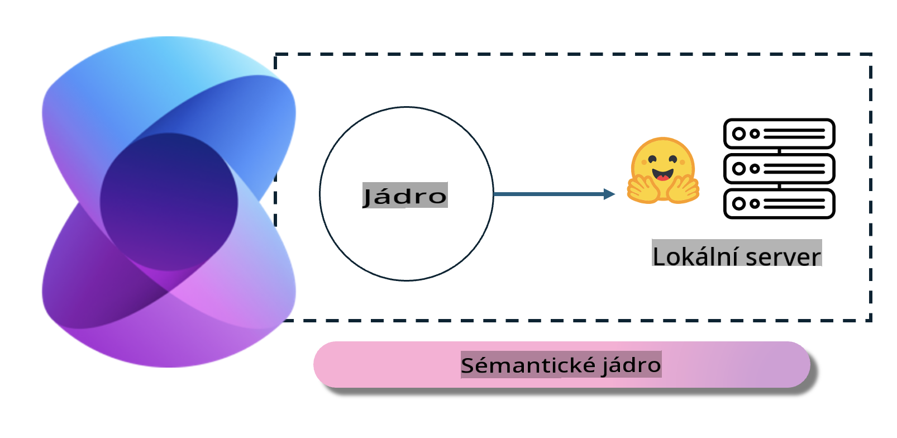
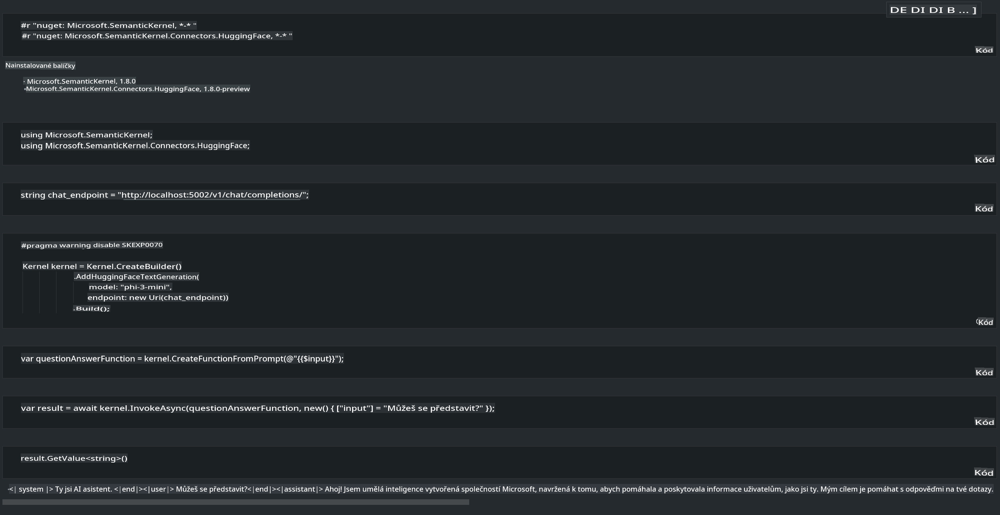

# **Inference Phi-3 na místním serveru**

Phi-3 lze nasadit na místním serveru. Uživatelé si mohou vybrat řešení [Ollama](https://ollama.com) nebo [LM Studio](https://llamaedge.com), případně si mohou napsat vlastní kód. Služby Phi-3 běžící lokálně lze propojit pomocí [Semantic Kernel](https://github.com/microsoft/semantic-kernel?WT.mc_id=aiml-138114-kinfeylo) nebo [Langchain](https://www.langchain.com/) pro vytváření aplikací typu Copilot.

## **Použití Semantic Kernel pro přístup k Phi-3-mini**

V aplikaci Copilot vytváříme aplikace pomocí Semantic Kernel / LangChain. Tento typ aplikačního rámce je obecně kompatibilní s Azure OpenAI Service / OpenAI modely a zároveň podporuje open source modely na Hugging Face a lokální modely. Co ale dělat, pokud chceme použít Semantic Kernel pro přístup k Phi-3-mini? Na příkladu s .NET jej můžeme zkombinovat s Hugging Face Connector v Semantic Kernel. Ve výchozím nastavení odpovídá id modelu na Hugging Face (při prvním použití se model stáhne z Hugging Face, což trvá delší dobu). Můžete se také připojit k vlastní lokální službě. Ve srovnání s těmito dvěma možnostmi doporučujeme použít druhou variantu, protože nabízí vyšší míru autonomie, zejména v podnikových aplikacích.

Z obrázku je patrné, že přístup k lokálním službám prostřednictvím Semantic Kernel umožňuje snadné propojení s vlastním serverem modelu Phi-3-mini. Zde je ukázka výsledku běhu:

***Ukázkový kód*** https://github.com/kinfey/Phi3MiniSamples/tree/main/semantickernel

**Prohlášení:**  
Tento dokument byl přeložen pomocí strojových AI překladových služeb. Ačkoli se snažíme o přesnost, mějte prosím na paměti, že automatizované překlady mohou obsahovat chyby nebo nepřesnosti. Původní dokument v jeho rodném jazyce by měl být považován za autoritativní zdroj. Pro důležité informace se doporučuje profesionální lidský překlad. Nenese zodpovědnost za jakékoli nedorozumění nebo nesprávné interpretace vyplývající z použití tohoto překladu.