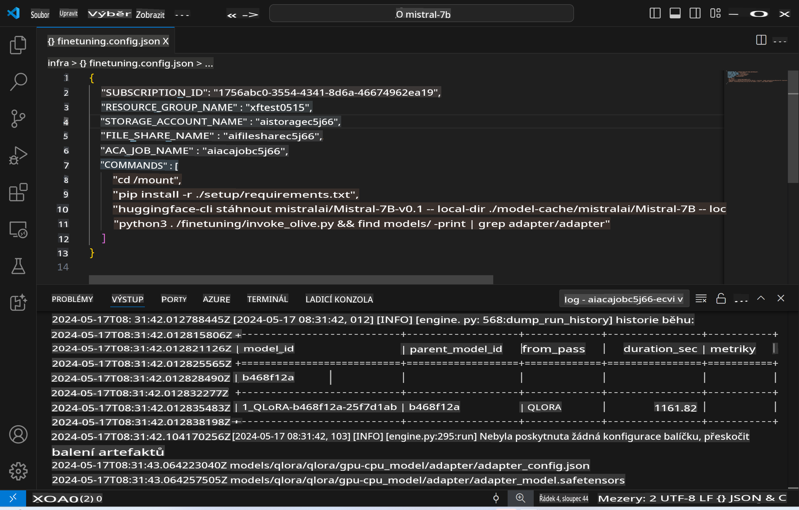
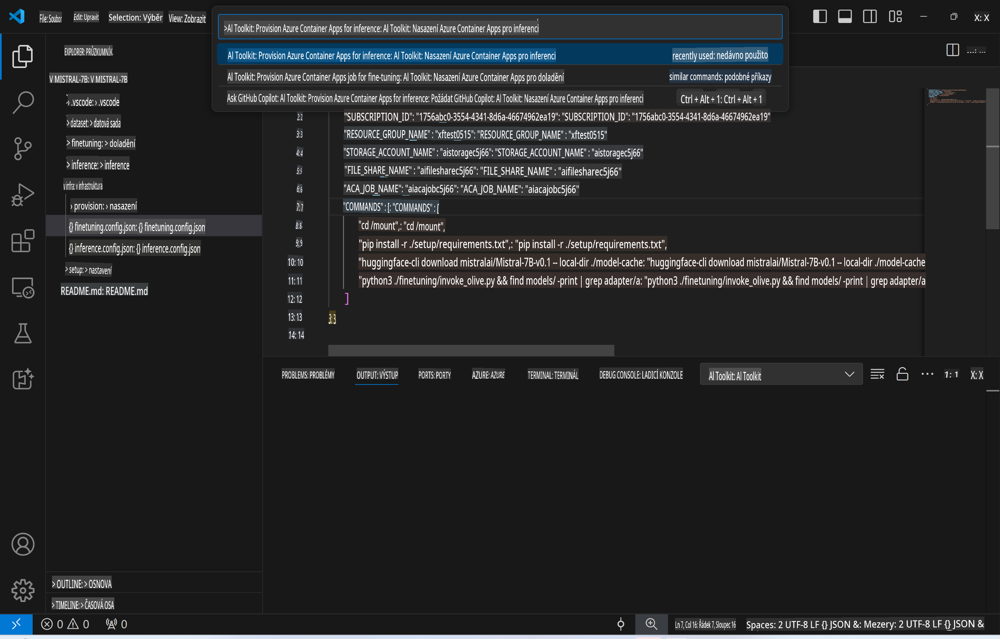
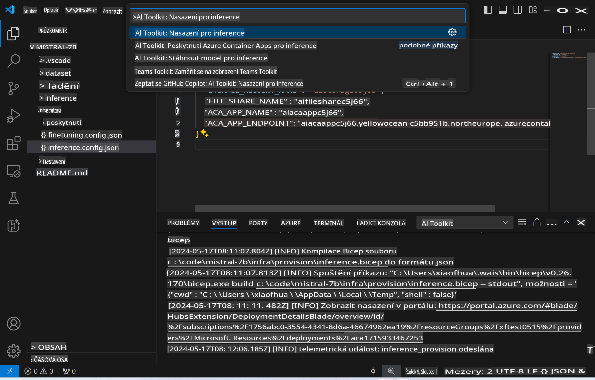
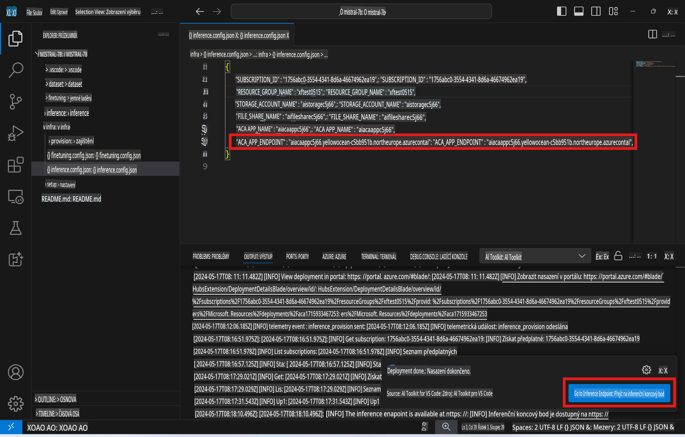

# Vzdálené inferencování s doladěným modelem

Po dokončení trénování adaptérů v vzdáleném prostředí můžete použít jednoduchou aplikaci Gradio k interakci s modelem.



### Zajištění Azure prostředků
Pro nastavení vzdáleného inferencování je potřeba připravit Azure prostředky spuštěním příkazu `AI Toolkit: Provision Azure Container Apps for inference` z příkazové palety. Během tohoto procesu budete vyzváni k výběru svého Azure předplatného a skupiny prostředků.  


Ve výchozím nastavení by měly předplatné a skupina prostředků pro inferenci odpovídat těm, které byly použity pro doladění. Inferencování využije stejné prostředí Azure Container App a přistupuje k modelu a adaptérům modelu uloženým v Azure Files, které byly vytvořeny během kroku doladění.

## Použití AI Toolkit

### Nasazení pro inferenci  
Pokud potřebujete upravit kód pro inferenci nebo znovu načíst inferenční model, spusťte příkaz `AI Toolkit: Deploy for inference`. Tento příkaz synchronizuje váš nejnovější kód s ACA a restartuje repliku.  



Po úspěšném dokončení nasazení je model připraven k vyhodnocení prostřednictvím tohoto endpointu.

### Přístup k inferenčnímu API

K inferenčnímu API se dostanete kliknutím na tlačítko "*Go to Inference Endpoint*", které se zobrazí v oznámení VSCode. Alternativně můžete webový API endpoint najít pod `ACA_APP_ENDPOINT` v `./infra/inference.config.json` a také v panelu výstupu.



> **Poznámka:** Endpoint pro inferenci může potřebovat několik minut, než bude plně funkční.

## Komponenty pro inferenci zahrnuté v šabloně
 
| Složka | Obsah |
| ------ |--------- |
| `infra` | Obsahuje všechny potřebné konfigurace pro vzdálené operace. |
| `infra/provision/inference.parameters.json` | Obsahuje parametry pro bicep šablony, používané pro zajištění Azure prostředků pro inferenci. |
| `infra/provision/inference.bicep` | Obsahuje šablony pro zajištění Azure prostředků pro inferenci. |
| `infra/inference.config.json` | Konfigurační soubor, vytvořený příkazem `AI Toolkit: Provision Azure Container Apps for inference`. Používá se jako vstup pro další příkazy v příkazové paletě. |

### Použití AI Toolkit pro konfiguraci zajištění Azure prostředků
Nakonfigurujte [AI Toolkit](https://marketplace.visualstudio.com/items?itemName=ms-windows-ai-studio.windows-ai-studio)

Zajistěte Azure Container Apps pro inferenci ` command.

You can find configuration parameters in `./infra/provision/inference.parameters.json` file. Here are the details:
| Parameter | Description |
| --------- |------------ |
| `defaultCommands` | This is the commands to initiate a web API. |
| `maximumInstanceCount` | This parameter sets the maximum capacity of GPU instances. |
| `location` | This is the location where Azure resources are provisioned. The default value is the same as the chosen resource group's location. |
| `storageAccountName`, `fileShareName` `acaEnvironmentName`, `acaEnvironmentStorageName`, `acaAppName`,  `acaLogAnalyticsName` | These parameters are used to name the Azure resources for provision. By default, they will be same to the fine-tuning resource name. You can input a new, unused resource name to create your own custom-named resources, or you can input the name of an already existing Azure resource if you'd prefer to use that. For details, refer to the section [Using existing Azure Resources](../../../../../md/01.Introduction/03). |

### Using Existing Azure Resources

By default, the inference provision use the same Azure Container App Environment, Storage Account, Azure File Share, and Azure Log Analytics that were used for fine-tuning. A separate Azure Container App is created solely for the inference API. 

If you have customized the Azure resources during the fine-tuning step or want to use your own existing Azure resources for inference, specify their names in the `./infra/inference.parameters.json` soubor. Poté spusťte příkaz `AI Toolkit: Provision Azure Container Apps for inference` z příkazové palety. Tento příkaz aktualizuje všechny specifikované prostředky a vytvoří ty, které chybí.

Například pokud již máte existující prostředí Azure Container, váš soubor `./infra/finetuning.parameters.json` by měl vypadat takto:

```json
{
    "$schema": "https://schema.management.azure.com/schemas/2019-04-01/deploymentParameters.json#",
    "contentVersion": "1.0.0.0",
    "parameters": {
      ...
      "acaEnvironmentName": {
        "value": "<your-aca-env-name>"
      },
      "acaEnvironmentStorageName": {
        "value": null
      },
      ...
    }
  }
```

### Manuální zajištění  
Pokud dáváte přednost manuální konfiguraci Azure prostředků, můžete použít poskytnuté bicep soubory ve složce `./infra/provision` folders. If you have already set up and configured all the Azure resources without using the AI Toolkit command palette, you can simply enter the resource names in the `inference.config.json` soubor.

Například:

```json
{
  "SUBSCRIPTION_ID": "<your-subscription-id>",
  "RESOURCE_GROUP_NAME": "<your-resource-group-name>",
  "STORAGE_ACCOUNT_NAME": "<your-storage-account-name>",
  "FILE_SHARE_NAME": "<your-file-share-name>",
  "ACA_APP_NAME": "<your-aca-name>",
  "ACA_APP_ENDPOINT": "<your-aca-endpoint>"
}
```

**Prohlášení**:  
Tento dokument byl přeložen pomocí strojových AI překladatelských služeb. Ačkoliv se snažíme o přesnost, mějte na paměti, že automatické překlady mohou obsahovat chyby nebo nepřesnosti. Původní dokument v jeho rodném jazyce by měl být považován za závazný zdroj. Pro kritické informace se doporučuje profesionální lidský překlad. Nejsme zodpovědní za jakékoliv nedorozumění nebo nesprávné interpretace vyplývající z použití tohoto překladu.