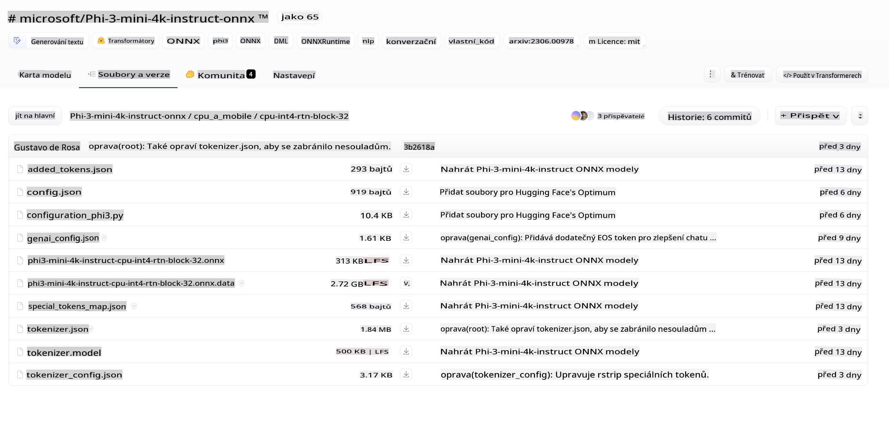
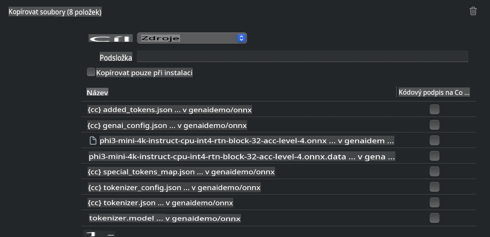
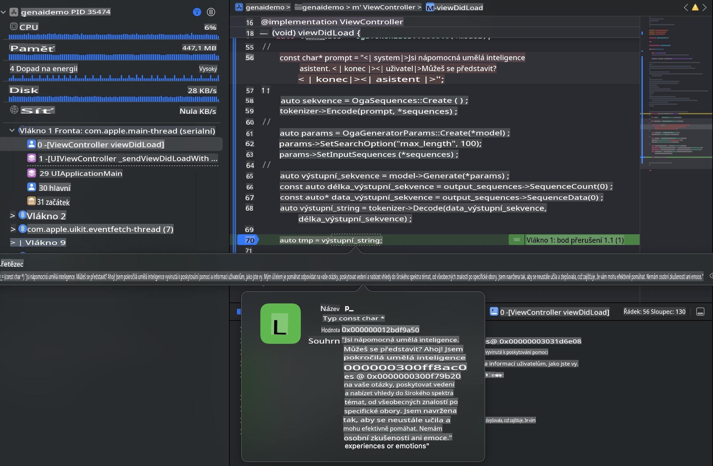

# **Inference Phi-3 na iOS**

Phi-3-mini je nová řada modelů od Microsoftu, která umožňuje nasazení velkých jazykových modelů (LLMs) na edge zařízeních a IoT zařízeních. Phi-3-mini je dostupný pro nasazení na iOS, Android a edge zařízení, což umožňuje nasazení generativní AI v BYOD prostředích. Následující příklad ukazuje, jak nasadit Phi-3-mini na iOS.

## **1. Příprava**

- **a.** macOS 14+
- **b.** Xcode 15+
- **c.** iOS SDK 17.x (iPhone 14 A16 nebo novější)
- **d.** Nainstalujte Python 3.10+ (doporučuje se Conda)
- **e.** Nainstalujte Python knihovnu: `python-flatbuffers`
- **f.** Nainstalujte CMake

### Semantic Kernel a inference

Semantic Kernel je aplikační framework, který vám umožňuje vytvářet aplikace kompatibilní s Azure OpenAI Service, modely OpenAI a dokonce i lokálními modely. Přístup k lokálním službám přes Semantic Kernel umožňuje snadnou integraci s vaším vlastním Phi-3-mini model serverem.

### Volání kvantizovaných modelů pomocí Ollama nebo LlamaEdge

Mnoho uživatelů dává přednost používání kvantizovaných modelů pro lokální provoz. [Ollama](https://ollama.com) a [LlamaEdge](https://llamaedge.com) umožňují uživatelům volat různé kvantizované modely:

#### **Ollama**

Můžete spustit `ollama run phi3` přímo nebo jej nakonfigurovat offline. Vytvořte Modelfile s cestou k vašemu `gguf` souboru. Ukázkový kód pro spuštění kvantizovaného modelu Phi-3-mini:

```gguf
FROM {Add your gguf file path}
TEMPLATE \"\"\"<|user|> .Prompt<|end|> <|assistant|>\"\"\"
PARAMETER stop <|end|>
PARAMETER num_ctx 4096
```

#### **LlamaEdge**

Pokud chcete použít `gguf` současně v cloudu i na edge zařízeních, LlamaEdge je skvělá volba.

## **2. Kompilace ONNX Runtime pro iOS**

```bash

git clone https://github.com/microsoft/onnxruntime.git

cd onnxruntime

./build.sh --build_shared_lib --ios --skip_tests --parallel --build_dir ./build_ios --ios --apple_sysroot iphoneos --osx_arch arm64 --apple_deploy_target 17.5 --cmake_generator Xcode --config Release

cd ../

```

### **Poznámka**

- **a.** Před kompilací se ujistěte, že je Xcode správně nakonfigurován a nastavte jej jako aktivní vývojářský adresář v terminálu:

    ```bash
    sudo xcode-select -switch /Applications/Xcode.app/Contents/Developer
    ```

- **b.** ONNX Runtime je potřeba zkompilovat pro různé platformy. Pro iOS můžete kompilovat pro `arm64` or `x86_64`.

- **c.** Doporučuje se použít nejnovější iOS SDK pro kompilaci. Nicméně, pokud potřebujete kompatibilitu se staršími SDK, můžete použít i starší verzi.

## **3. Kompilace generativní AI s ONNX Runtime pro iOS**

> **Poznámka:** Vzhledem k tomu, že generativní AI s ONNX Runtime je ve fázi preview, mějte na paměti možné změny.

```bash

git clone https://github.com/microsoft/onnxruntime-genai
 
cd onnxruntime-genai
 
mkdir ort
 
cd ort
 
mkdir include
 
mkdir lib
 
cd ../
 
cp ../onnxruntime/include/onnxruntime/core/session/onnxruntime_c_api.h ort/include
 
cp ../onnxruntime/build_ios/Release/Release-iphoneos/libonnxruntime*.dylib* ort/lib
 
export OPENCV_SKIP_XCODEBUILD_FORCE_TRYCOMPILE_DEBUG=1
 
python3 build.py --parallel --build_dir ./build_ios --ios --ios_sysroot iphoneos --ios_arch arm64 --ios_deployment_target 17.5 --cmake_generator Xcode --cmake_extra_defines CMAKE_XCODE_ATTRIBUTE_CODE_SIGNING_ALLOWED=NO

```

## **4. Vytvoření aplikace v Xcode**

Pro vývoj aplikace jsem zvolil Objective-C, protože při použití generativní AI s ONNX Runtime C++ API je Objective-C lépe kompatibilní. Samozřejmě můžete provádět příslušné volání také pomocí Swift bridging.


## **5. Zkopírování ONNX kvantizovaného INT4 modelu do projektu aplikace**

Je třeba importovat INT4 kvantizační model ve formátu ONNX, který je třeba nejprve stáhnout.



Po stažení je nutné jej přidat do adresáře Resources projektu v Xcode.



## **6. Přidání C++ API do ViewControllers**

> **Poznámka:**

- **a.** Přidejte příslušné C++ hlavičkové soubory do projektu.

  

- **b.** Zahrňte `onnxruntime-genai` dynamic library in Xcode.

  

- **c.** Use the C Samples code for testing. You can also add additional features like ChatUI for more functionality.

- **d.** Since you need to use C++ in your project, rename `ViewController.m` to `ViewController.mm`, abyste povolili podporu Objective-C++.

```objc

    NSString *llmPath = [[NSBundle mainBundle] resourcePath];
    char const *modelPath = llmPath.cString;

    auto model =  OgaModel::Create(modelPath);

    auto tokenizer = OgaTokenizer::Create(*model);

    const char* prompt = "<|system|>You are a helpful AI assistant.<|end|><|user|>Can you introduce yourself?<|end|><|assistant|>";

    auto sequences = OgaSequences::Create();
    tokenizer->Encode(prompt, *sequences);

    auto params = OgaGeneratorParams::Create(*model);
    params->SetSearchOption("max_length", 100);
    params->SetInputSequences(*sequences);

    auto output_sequences = model->Generate(*params);
    const auto output_sequence_length = output_sequences->SequenceCount(0);
    const auto* output_sequence_data = output_sequences->SequenceData(0);
    auto out_string = tokenizer->Decode(output_sequence_data, output_sequence_length);
    
    auto tmp = out_string;

```

## **7. Spuštění aplikace**

Jakmile je nastavení dokončeno, můžete spustit aplikaci a zobrazit výsledky inference modelu Phi-3-mini.



Pro další ukázkový kód a podrobné instrukce navštivte [Phi-3 Mini Samples repository](https://github.com/Azure-Samples/Phi-3MiniSamples/tree/main/ios).

**Upozornění**:  
Tento dokument byl přeložen pomocí strojových překladových služeb AI. I když se snažíme o přesnost, vezměte prosím na vědomí, že automatizované překlady mohou obsahovat chyby nebo nepřesnosti. Původní dokument v jeho rodném jazyce by měl být považován za autoritativní zdroj. Pro kritické informace se doporučuje profesionální lidský překlad. Neodpovídáme za žádné nedorozumění nebo nesprávné interpretace vyplývající z použití tohoto překladu.