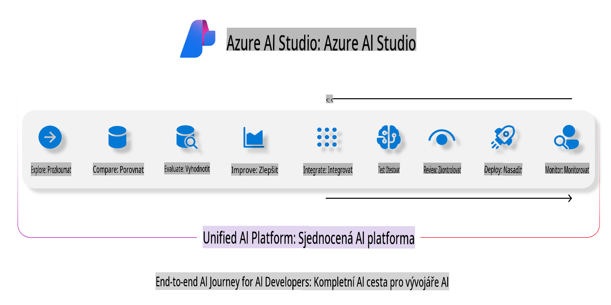
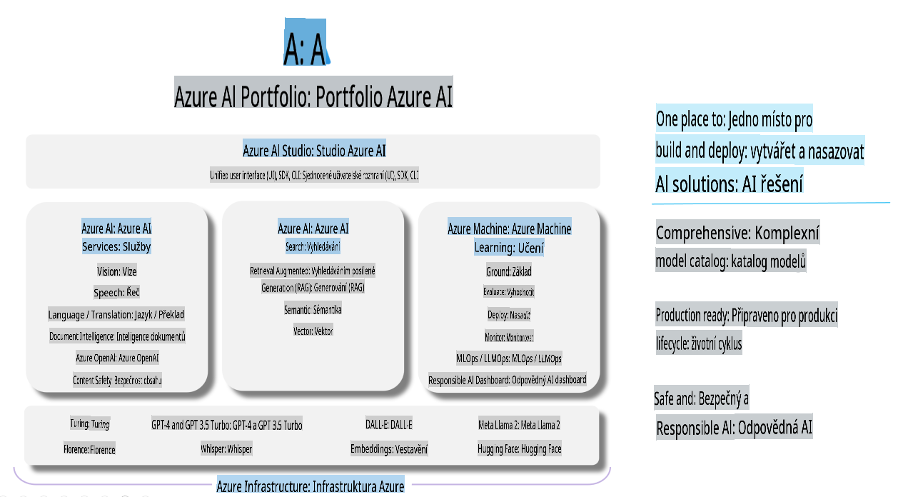

# **Použití Azure AI Foundry k hodnocení**

Jak hodnotit svou generativní AI aplikaci pomocí [Azure AI Foundry](https://ai.azure.com?WT.mc_id=aiml-138114-kinfeylo). Ať už posuzujete jednostranné nebo vícestranné konverzace, Azure AI Foundry nabízí nástroje pro hodnocení výkonu a bezpečnosti modelu.

## Jak hodnotit generativní AI aplikace pomocí Azure AI Foundry
Podrobné pokyny naleznete v [dokumentaci Azure AI Foundry](https://learn.microsoft.com/azure/ai-studio/how-to/evaluate-generative-ai-app?WT.mc_id=aiml-138114-kinfeylo).

Zde jsou kroky, jak začít:

## Hodnocení generativních AI modelů v Azure AI Foundry

**Předpoklady**

- Testovací datová sada ve formátu CSV nebo JSON.
- Nasazený generativní AI model (například Phi-3, GPT 3.5, GPT 4 nebo Davinci modely).
- Runtime s výpočetní instancí pro spuštění hodnocení.

## Vestavěné metriky hodnocení

Azure AI Foundry umožňuje hodnotit jak jednostranné, tak složité vícestranné konverzace.  
Pro scénáře Retrieval Augmented Generation (RAG), kde je model založen na konkrétních datech, můžete hodnotit výkon pomocí vestavěných metrik hodnocení.  
Kromě toho můžete hodnotit obecné scénáře jednostranného zodpovídání dotazů (non-RAG).

## Vytvoření hodnocení

V uživatelském rozhraní Azure AI Foundry přejděte na stránku Evaluate nebo Prompt Flow.  
Postupujte podle průvodce vytvořením hodnocení, abyste nastavili hodnocení. Můžete volitelně zadat název hodnocení.  
Vyberte scénář, který odpovídá cílům vaší aplikace.  
Zvolte jednu nebo více metrik hodnocení pro posouzení výstupu modelu.

## Vlastní hodnoticí tok (volitelné)

Pro větší flexibilitu můžete vytvořit vlastní hodnoticí tok. Přizpůsobte proces hodnocení svým konkrétním požadavkům.

## Zobrazení výsledků

Po spuštění hodnocení zaznamenávejte, zobrazujte a analyzujte podrobné metriky hodnocení v Azure AI Foundry. Získejte přehled o schopnostech a omezeních vaší aplikace.

**Poznámka** Azure AI Foundry je momentálně ve veřejném preview, proto jej používejte pro experimentální a vývojové účely. Pro produkční pracovní zátěže zvažte jiné možnosti. Pro více informací a podrobné pokyny navštivte oficiální [dokumentaci AI Foundry](https://learn.microsoft.com/azure/ai-studio/?WT.mc_id=aiml-138114-kinfeylo).

**Upozornění**:  
Tento dokument byl přeložen pomocí strojových AI překladatelských služeb. Přestože usilujeme o přesnost, mějte na paměti, že automatické překlady mohou obsahovat chyby nebo nepřesnosti. Původní dokument v jeho rodném jazyce by měl být považován za závazný zdroj. Pro důležité informace se doporučuje profesionální lidský překlad. Neodpovídáme za žádná nedorozumění nebo nesprávné výklady vyplývající z použití tohoto překladu.