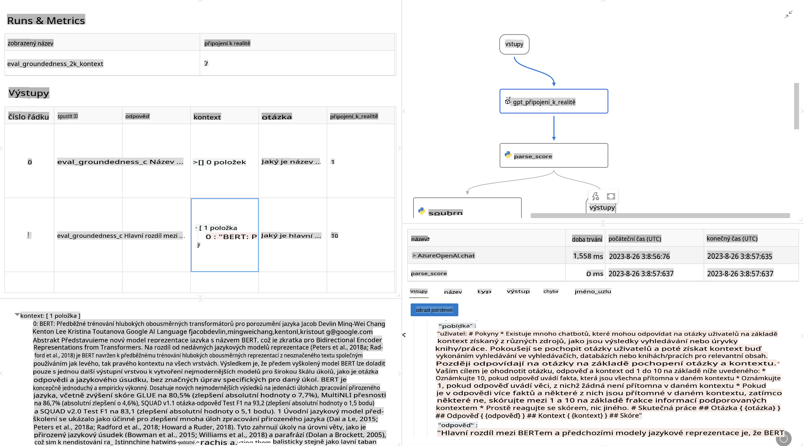

# **Představujeme Promptflow**

[Microsoft Prompt Flow](https://microsoft.github.io/promptflow/index.html?WT.mc_id=aiml-138114-kinfeylo) je vizuální nástroj pro automatizaci workflow, který uživatelům umožňuje vytvářet automatizované procesy pomocí předpřipravených šablon a vlastních konektorů. Je navržen tak, aby vývojářům a obchodním analytikům umožnil rychle budovat automatizované procesy pro úkoly, jako je správa dat, spolupráce a optimalizace procesů. S Prompt Flow mohou uživatelé snadno propojit různé služby, aplikace a systémy a automatizovat složité obchodní procesy.

Microsoft Prompt Flow je navržen tak, aby zjednodušil celý vývojový cyklus aplikací s umělou inteligencí založených na modelech velkého jazyka (LLM). Ať už jde o vytváření nápadů, prototypování, testování, vyhodnocování nebo nasazování aplikací založených na LLM, Prompt Flow tento proces zjednodušuje a umožňuje vytvářet aplikace s LLM v produkční kvalitě.

## Klíčové vlastnosti a přínosy Microsoft Prompt Flow:

**Interaktivní prostředí pro tvorbu**

Prompt Flow poskytuje vizuální znázornění struktury vašeho workflow, což usnadňuje pochopení a orientaci v projektech.
Nabízí prostředí pro kódování ve stylu notebooku pro efektivní vývoj a ladění workflow.

**Varianty promptů a ladění**

Vytvářejte a porovnávejte různé varianty promptů, což usnadňuje iterativní proces vylepšování. Vyhodnocujte výkon jednotlivých promptů a vybírejte ty nejefektivnější.

**Vestavěné evaluační workflow**
Hodnoťte kvalitu a efektivitu vašich promptů a workflow pomocí vestavěných evaluačních nástrojů.
Získejte přehled o tom, jak dobře vaše aplikace založené na LLM fungují.

**Široké zdroje**

Prompt Flow obsahuje knihovnu vestavěných nástrojů, ukázek a šablon. Tyto zdroje slouží jako výchozí bod pro vývoj, inspirují kreativitu a urychlují proces.

**Spolupráce a připravenost pro podniky**

Podporujte týmovou spolupráci tím, že umožníte více uživatelům pracovat společně na projektech prompt engineeringu.
Udržujte verzování a efektivně sdílejte znalosti. Zjednodušte celý proces prompt engineeringu od vývoje a vyhodnocování až po nasazení a monitorování.

## Hodnocení v Prompt Flow 

V Microsoft Prompt Flow hraje hodnocení klíčovou roli při posuzování výkonu vašich modelů umělé inteligence. Podívejme se, jak můžete přizpůsobit evaluační workflow a metriky v Prompt Flow:

**Porozumění hodnocení v Prompt Flow**

V Prompt Flow workflow představuje sekvenci uzlů, které zpracovávají vstupy a generují výstupy. Evaluační workflow jsou speciální typy workflow navržené k hodnocení výkonu běhu na základě konkrétních kritérií a cílů.

**Klíčové vlastnosti evaluačních workflow**

Typicky běží po testovaném workflow a využívají jeho výstupy. Vypočítávají skóre nebo metriky pro měření výkonu testovaného workflow. Metriky mohou zahrnovat přesnost, skóre relevance nebo jiné vhodné ukazatele.

### Přizpůsobení evaluačních workflow

**Definování vstupů**

Evaluační workflow musí přijímat výstupy testovaného běhu. Definujte vstupy podobně jako u standardních workflow.
Například pokud hodnotíte QnA workflow, pojmenujte vstup jako „odpověď“. Pokud hodnotíte klasifikační workflow, pojmenujte vstup jako „kategorie“. Můžete také potřebovat vstupy s referenčními hodnotami (např. skutečné štítky).

**Výstupy a metriky**

Evaluační workflow generují výsledky, které měří výkon testovaného workflow. Metriky lze vypočítat pomocí Pythonu nebo LLM (Large Language Models). Použijte funkci log_metric() k zaznamenání relevantních metrik.

**Použití přizpůsobených evaluačních workflow**

Vytvořte si vlastní evaluační workflow přizpůsobené vašim konkrétním úkolům a cílům. Přizpůsobte metriky na základě vašich evaluačních cílů.
Aplikujte toto přizpůsobené evaluační workflow na dávkové běhy pro testování ve velkém měřítku.

## Vestavěné evaluační metody

Prompt Flow také nabízí vestavěné evaluační metody.
Můžete odesílat dávkové běhy a používat tyto metody k hodnocení výkonu vašeho workflow na velkých datových sadách.
Prohlížejte si výsledky hodnocení, porovnávejte metriky a podle potřeby iterujte.
Pamatujte, že hodnocení je klíčové pro zajištění toho, aby vaše modely umělé inteligence splňovaly požadovaná kritéria a cíle. Prozkoumejte oficiální dokumentaci pro podrobné pokyny k vývoji a použití evaluačních workflow v Microsoft Prompt Flow.

Na závěr, Microsoft Prompt Flow umožňuje vývojářům vytvářet vysoce kvalitní aplikace s LLM tím, že zjednodušuje prompt engineering a poskytuje robustní vývojové prostředí. Pokud pracujete s LLM, Prompt Flow je cenný nástroj, který stojí za prozkoumání. Prozkoumejte [dokumentaci k hodnocení Prompt Flow](https://learn.microsoft.com/azure/machine-learning/prompt-flow/how-to-develop-an-evaluation-flow?view=azureml-api-2?WT.mc_id=aiml-138114-kinfeylo) pro podrobné pokyny k vývoji a použití evaluačních workflow v Microsoft Prompt Flow.

**Prohlášení:**  
Tento dokument byl přeložen pomocí strojových AI překladatelských služeb. I když se snažíme o přesnost, mějte prosím na paměti, že automatické překlady mohou obsahovat chyby nebo nepřesnosti. Původní dokument v jeho původním jazyce by měl být považován za závazný zdroj. Pro důležité informace se doporučuje profesionální lidský překlad. Neodpovídáme za žádná nedorozumění nebo chybné interpretace vyplývající z použití tohoto překladu.