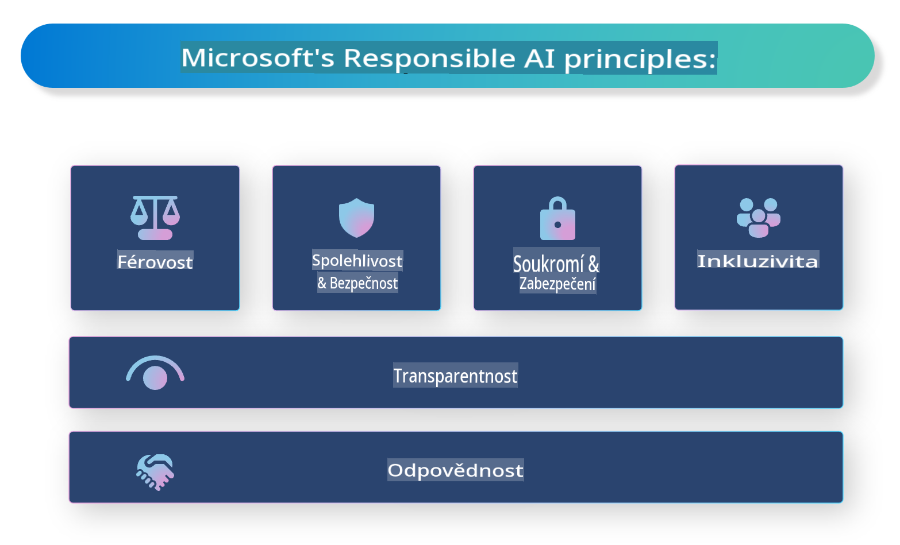

# **Představení odpovědné AI**

[Microsoft Responsible AI](https://www.microsoft.com/ai/responsible-ai?WT.mc_id=aiml-138114-kinfeylo) je iniciativa, která si klade za cíl pomoci vývojářům a organizacím vytvářet AI systémy, které jsou transparentní, důvěryhodné a odpovědné. Tato iniciativa poskytuje doporučení a zdroje pro vývoj odpovědných AI řešení, která jsou v souladu s etickými principy, jako jsou soukromí, spravedlnost a transparentnost. Prozkoumáme také některé výzvy a osvědčené postupy spojené s budováním odpovědných AI systémů.

## Přehled Microsoft Responsible AI 

**Etické principy** 

Microsoft Responsible AI se řídí souborem etických principů, jako jsou soukromí, spravedlnost, transparentnost, odpovědnost a bezpečnost. Tyto principy jsou navrženy tak, aby zajistily, že AI systémy budou vyvíjeny etickým a odpovědným způsobem.

**Transparentní AI**

Microsoft Responsible AI klade důraz na důležitost transparentnosti v AI systémech. To zahrnuje poskytování jasných vysvětlení, jak AI modely fungují, a zajištění, že zdroje dat a algoritmy jsou veřejně dostupné.

**Odpovědná AI** 

[Microsoft Responsible AI](https://www.microsoft.com/ai/responsible-ai?WT.mc_id=aiml-138114-kinfeylo) podporuje vývoj odpovědných AI systémů, které dokážou poskytnout vhled do toho, jak modely AI přijímají rozhodnutí. To může uživatelům pomoci lépe porozumět a důvěřovat výstupům AI systémů.

**Inkluzivita** 

AI systémy by měly být navrženy tak, aby přinášely užitek všem. Microsoft se snaží vytvářet inkluzivní AI, která zohledňuje různé perspektivy a vyhýbá se předsudkům nebo diskriminaci.

**Spolehlivost a bezpečnost**

Zajištění spolehlivosti a bezpečnosti AI systémů je klíčové. Microsoft se zaměřuje na budování robustních modelů, které fungují konzistentně a vyhýbají se škodlivým výsledkům.

**Spravedlnost v AI** 

Microsoft Responsible AI uznává, že AI systémy mohou reprodukovat předsudky, pokud jsou trénovány na zaujatých datech nebo algoritmech. Tato iniciativa poskytuje doporučení pro vývoj spravedlivých AI systémů, které nediskriminují na základě faktorů, jako je rasa, pohlaví nebo věk.

**Soukromí a bezpečnost** 

Microsoft Responsible AI zdůrazňuje důležitost ochrany soukromí uživatelů a bezpečnosti dat v AI systémech. To zahrnuje implementaci silného šifrování dat a řízení přístupu, stejně jako pravidelné audity AI systémů kvůli zranitelnostem.

**Odpovědnost a zodpovědnost** 

Microsoft Responsible AI podporuje odpovědnost a zodpovědnost při vývoji a nasazení AI. To zahrnuje zajištění toho, že vývojáři a organizace si uvědomují potenciální rizika spojená s AI systémy a podnikají kroky k jejich zmírnění.

## Osvědčené postupy pro budování odpovědných AI systémů

**Vyvíjejte AI modely s využitím rozmanitých datových sad** 

Aby se předešlo předsudkům v AI systémech, je důležité používat rozmanité datové sady, které reprezentují různé perspektivy a zkušenosti.

**Používejte techniky vysvětlitelné AI** 

Techniky vysvětlitelné AI mohou uživatelům pomoci pochopit, jak AI modely přijímají rozhodnutí, což může zvýšit důvěru v systém.

**Pravidelně provádějte audity AI systémů kvůli zranitelnostem** 

Pravidelné audity AI systémů mohou pomoci identifikovat potenciální rizika a zranitelnosti, které je třeba řešit.

**Implementujte silné šifrování dat a řízení přístupu** 

Šifrování dat a řízení přístupu mohou pomoci chránit soukromí a bezpečnost uživatelů v AI systémech.

**Dodržujte etické principy při vývoji AI** 

Dodržování etických principů, jako je spravedlnost, transparentnost a odpovědnost, může pomoci vybudovat důvěru v AI systémy a zajistit, že jsou vyvíjeny odpovědným způsobem.

## Používání AI Foundry pro odpovědnou AI 

[Azure AI Foundry](https://ai.azure.com?WT.mc_id=aiml-138114-kinfeylo) je výkonná platforma, která umožňuje vývojářům a organizacím rychle vytvářet inteligentní, moderní, připravené pro trh a odpovědné aplikace. Zde jsou některé klíčové funkce a schopnosti Azure AI Foundry:

**Předem připravená API a modely** 

Azure AI Foundry poskytuje předem připravená a přizpůsobitelná API a modely. Ty pokrývají širokou škálu AI úloh, včetně generativní AI, zpracování přirozeného jazyka pro konverzace, vyhledávání, monitorování, překladů, řeči, vizuálních úloh a rozhodování.

**Prompt Flow** 

Prompt Flow v Azure AI Foundry umožňuje vytvářet konverzační AI zážitky. Umožňuje navrhovat a spravovat konverzační toky, což usnadňuje budování chatbotů, virtuálních asistentů a dalších interaktivních aplikací.

**Retrieval Augmented Generation (RAG)** 

RAG je technika, která kombinuje přístupy založené na vyhledávání a generování. Zlepšuje kvalitu generovaných odpovědí tím, že využívá jak existující znalosti (vyhledávání), tak kreativní generování (generování).

**Hodnocení a monitorování metrik pro generativní AI** 

Azure AI Foundry poskytuje nástroje pro hodnocení a monitorování generativních AI modelů. Můžete hodnotit jejich výkon, spravedlnost a další důležité metriky, abyste zajistili odpovědné nasazení. Pokud jste navíc vytvořili dashboard, můžete použít rozhraní bez nutnosti kódování v Azure Machine Learning Studio k přizpůsobení a vytvoření Responsible AI Dashboardu a přidružené hodnotící karty na základě [Responsible AI Toolbox](https://responsibleaitoolbox.ai/?WT.mc_id=aiml-138114-kinfeylo) Python knihoven. Tato hodnotící karta vám pomůže sdílet klíčové poznatky týkající se spravedlnosti, důležitosti funkcí a dalších aspektů odpovědného nasazení s technickými i netechnickými účastníky.

Pro použití AI Foundry s odpovědnou AI můžete dodržovat tyto osvědčené postupy:

**Definujte problém a cíle vašeho AI systému**

Před zahájením vývoje je důležité jasně definovat problém nebo cíl, který má váš AI systém řešit. To vám pomůže identifikovat data, algoritmy a zdroje potřebné k vytvoření efektivního modelu.

**Shromažďujte a předzpracovávejte relevantní data** 

Kvalita a množství dat použitých při trénování AI systému může mít významný dopad na jeho výkon. Proto je důležité shromažďovat relevantní data, čistit je, předzpracovávat a zajistit, že reprezentují populaci nebo problém, který se snažíte vyřešit.

**Zvolte vhodné hodnotící algoritmy** 

Existuje mnoho hodnotících algoritmů. Je důležité zvolit ten nejvhodnější na základě vašich dat a problému.

**Hodnoťte a interpretujte model** 

Jakmile vytvoříte AI model, je důležité hodnotit jeho výkon pomocí vhodných metrik a interpretovat výsledky transparentním způsobem. To vám pomůže identifikovat případné předsudky nebo omezení modelu a provést potřebná zlepšení.

**Zajistěte transparentnost a vysvětlitelnost** 

AI systémy by měly být transparentní a vysvětlitelné, aby uživatelé mohli pochopit, jak fungují a jak jsou přijímána rozhodnutí. To je obzvláště důležité u aplikací, které mají významný dopad na lidské životy, jako je zdravotnictví, finance a právní systémy.

**Monitorujte a aktualizujte model** 

AI systémy by měly být průběžně monitorovány a aktualizovány, aby zůstaly přesné a efektivní v průběhu času. To vyžaduje průběžnou údržbu, testování a přeškolování modelu.

Závěrem, Microsoft Responsible AI je iniciativa, která si klade za cíl pomoci vývojářům a organizacím budovat AI systémy, které jsou transparentní, důvěryhodné a odpovědné. Pamatujte, že implementace odpovědné AI je klíčová, a Azure AI Foundry usiluje o to, aby byla pro organizace praktická. Dodržováním etických principů a osvědčených postupů můžeme zajistit, že AI systémy budou vyvíjeny a nasazovány odpovědným způsobem, který prospívá celé společnosti.

**Upozornění**:  
Tento dokument byl přeložen pomocí strojových AI překladatelských služeb. I když usilujeme o přesnost, vezměte prosím na vědomí, že automatické překlady mohou obsahovat chyby nebo nepřesnosti. Původní dokument v jeho rodném jazyce by měl být považován za autoritativní zdroj. Pro důležité informace se doporučuje profesionální lidský překlad. Nejsme zodpovědní za jakékoli nedorozumění nebo nesprávné interpretace vyplývající z použití tohoto překladu.