# Vylepšení a integrace vlastních Phi-3 modelů s Prompt flow v Azure AI Foundry

Tento komplexní příklad (E2E) je založen na průvodci "[Vylepšení a integrace vlastních Phi-3 modelů s Prompt Flow v Azure AI Foundry](https://techcommunity.microsoft.com/t5/educator-developer-blog/fine-tune-and-integrate-custom-phi-3-models-with-prompt-flow-in/ba-p/4191726?WT.mc_id=aiml-137032-kinfeylo)" z Microsoft Tech Community. Popisuje procesy vylepšování, nasazování a integrace vlastních Phi-3 modelů s Prompt flow v Azure AI Foundry. 
Na rozdíl od E2E příkladu "[Vylepšení a integrace vlastních Phi-3 modelů s Prompt Flow](./E2E_Phi-3-FineTuning_PromptFlow_Integration.md)", který vyžadoval spuštění kódu lokálně, se tento tutoriál zaměřuje výhradně na vylepšení a integraci modelu přímo v Azure AI / ML Studiu.

## Přehled

V tomto E2E příkladu se naučíte, jak vylepšit model Phi-3 a integrovat ho s Prompt flow v Azure AI Foundry. Využitím Azure AI / ML Studia vytvoříte workflow pro nasazení a použití vlastních AI modelů. Tento příklad je rozdělen do tří scénářů:

**Scénář 1: Nastavení Azure zdrojů a příprava na vylepšení**

**Scénář 2: Vylepšení modelu Phi-3 a jeho nasazení v Azure Machine Learning Studiu**

**Scénář 3: Integrace s Prompt flow a komunikace s vaším vlastním modelem v Azure AI Foundry**

Níže je přehled tohoto E2E příkladu.

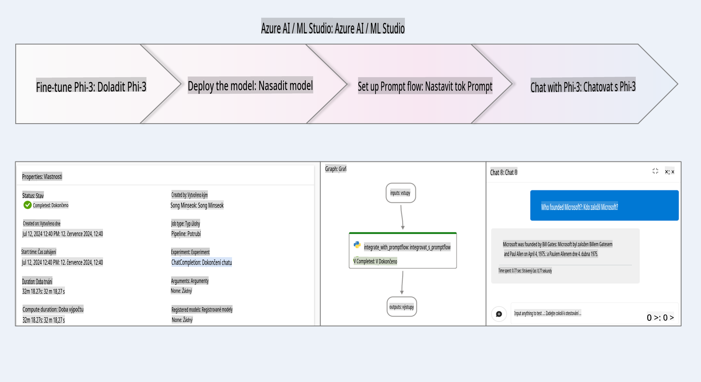

### Obsah

1. **[Scénář 1: Nastavení Azure zdrojů a příprava na vylepšení](../../../../../../md/02.Application/01.TextAndChat/Phi3)**
    - [Vytvoření Azure Machine Learning Workspace](../../../../../../md/02.Application/01.TextAndChat/Phi3)
    - [Žádost o GPU kvóty v Azure Subscription](../../../../../../md/02.Application/01.TextAndChat/Phi3)
    - [Přidání role](../../../../../../md/02.Application/01.TextAndChat/Phi3)
    - [Nastavení projektu](../../../../../../md/02.Application/01.TextAndChat/Phi3)
    - [Příprava datasetu na vylepšení](../../../../../../md/02.Application/01.TextAndChat/Phi3)

1. **[Scénář 2: Vylepšení modelu Phi-3 a jeho nasazení v Azure Machine Learning Studiu](../../../../../../md/02.Application/01.TextAndChat/Phi3)**
    - [Vylepšení modelu Phi-3](../../../../../../md/02.Application/01.TextAndChat/Phi3)
    - [Nasazení vylepšeného modelu Phi-3](../../../../../../md/02.Application/01.TextAndChat/Phi3)

1. **[Scénář 3: Integrace s Prompt flow a komunikace s vaším vlastním modelem v Azure AI Foundry](../../../../../../md/02.Application/01.TextAndChat/Phi3)**
    - [Integrace vlastního modelu Phi-3 s Prompt flow](../../../../../../md/02.Application/01.TextAndChat/Phi3)
    - [Komunikace s vaším vlastním modelem Phi-3](../../../../../../md/02.Application/01.TextAndChat/Phi3)

## Scénář 1: Nastavení Azure zdrojů a příprava na vylepšení

### Vytvoření Azure Machine Learning Workspace

1. Do **vyhledávacího pole** v horní části portálové stránky zadejte *azure machine learning* a z nabízených možností vyberte **Azure Machine Learning**.

    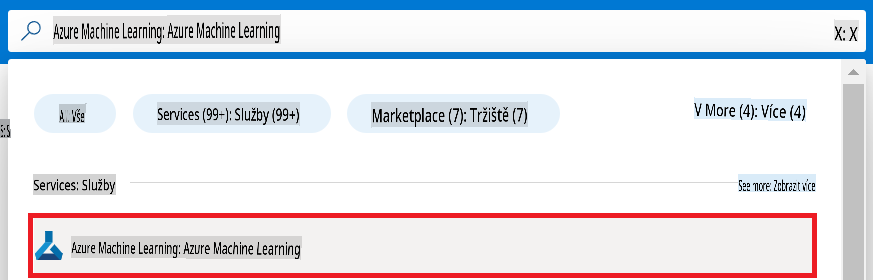

2. Z nabídky navigace vyberte **+ Vytvořit**.

3. V nabídce navigace vyberte **Nový workspace**.

    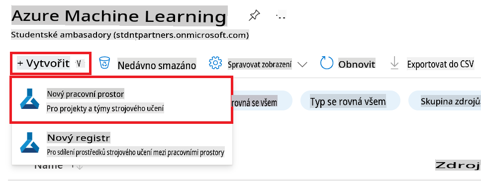

4. Proveďte následující kroky:

    - Vyberte svůj Azure **Subscription**.
    - Vyberte **Resource group** (vytvořte novou, pokud je to potřeba).
    - Zadejte **Workspace Name**. Musí být unikátní.
    - Vyberte **Region**, který chcete použít.
    - Vyberte **Storage account** (vytvořte nový, pokud je to potřeba).
    - Vyberte **Key vault** (vytvořte nový, pokud je to potřeba).
    - Vyberte **Application insights** (vytvořte nový, pokud je to potřeba).
    - Vyberte **Container registry** (vytvořte nový, pokud je to potřeba).

    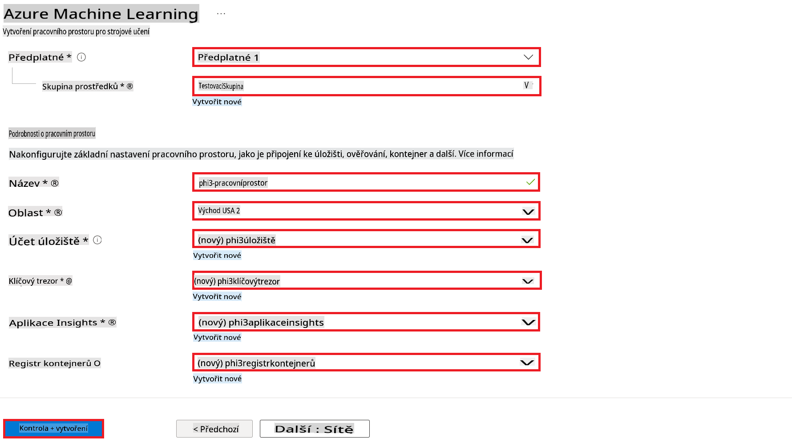

5. Vyberte **Review + Create**.

6. Vyberte **Create**.

### Žádost o GPU kvóty v Azure Subscription

V tomto tutoriálu se naučíte, jak vylepšit a nasadit Phi-3 model s využitím GPU. Pro vylepšení použijete GPU *Standard_NC24ads_A100_v4*, které vyžaduje žádost o kvótu. Pro nasazení použijete GPU *Standard_NC6s_v3*, které také vyžaduje žádost o kvótu.

> [!NOTE]
>
> Pouze Pay-As-You-Go subscription (standardní typ předplatného) jsou způsobilé pro alokaci GPU; předplatné založené na výhodách aktuálně nejsou podporovány.

1. Navštivte [Azure ML Studio](https://ml.azure.com/home?wt.mc_id=studentamb_279723).

1. Proveďte následující kroky pro žádost o kvótu *Standard NCADSA100v4 Family*:

    - Vyberte **Quota** z levého panelu.
    - Vyberte **Virtual machine family**. Například vyberte **Standard NCADSA100v4 Family Cluster Dedicated vCPUs**, což zahrnuje GPU *Standard_NC24ads_A100_v4*.
    - Vyberte **Request quota** z nabídky navigace.

        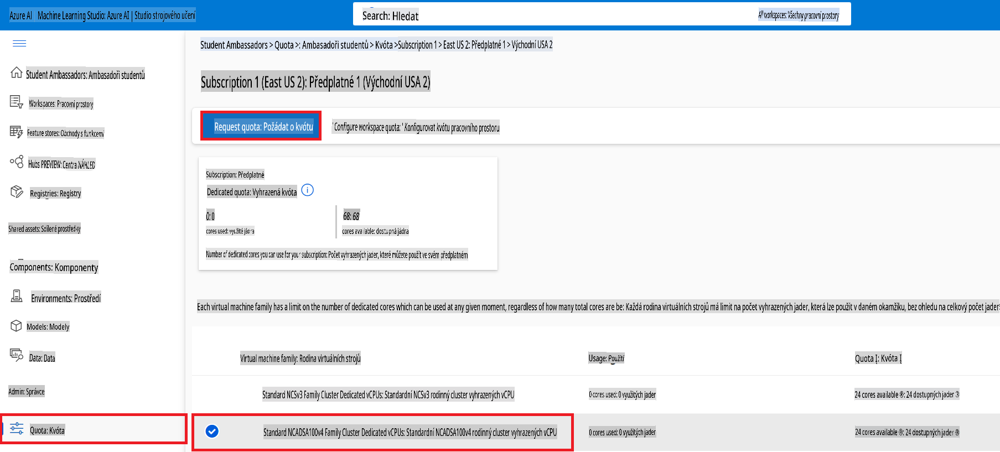

    - Na stránce Request quota zadejte **New cores limit**, který chcete použít. Například 24.
    - Na stránce Request quota vyberte **Submit** pro odeslání žádosti o GPU kvótu.

1. Proveďte následující kroky pro žádost o kvótu *Standard NCSv3 Family*:

    - Vyberte **Quota** z levého panelu.
    - Vyberte **Virtual machine family**. Například vyberte **Standard NCSv3 Family Cluster Dedicated vCPUs**, což zahrnuje GPU *Standard_NC6s_v3*.
    - Vyberte **Request quota** z nabídky navigace.
    - Na stránce Request quota zadejte **New cores limit**, který chcete použít. Například 24.
    - Na stránce Request quota vyberte **Submit** pro odeslání žádosti o GPU kvótu.

### Přidání role

Pro vylepšení a nasazení vašich modelů musíte nejprve vytvořit User Assigned Managed Identity (UAI) a přiřadit jí odpovídající oprávnění. Tato UAI bude použita pro autentizaci během nasazování.

#### Vytvoření User Assigned Managed Identity (UAI)

1. Do **vyhledávacího pole** v horní části portálové stránky zadejte *managed identities* a z nabízených možností vyberte **Managed Identities**.

    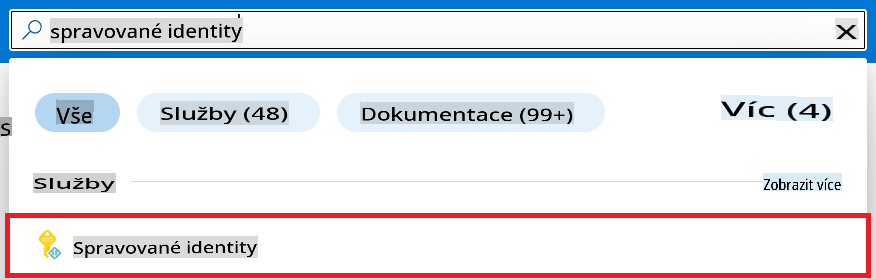

1. Vyberte **+ Vytvořit**.

    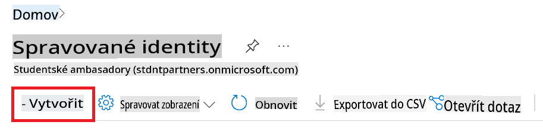

1. Proveďte následující kroky:

    - Vyberte svůj Azure **Subscription**.
    - Vyberte **Resource group** (vytvořte novou, pokud je to potřeba).
    - Vyberte **Region**, který chcete použít.
    - Zadejte **Name**. Musí být unikátní.

    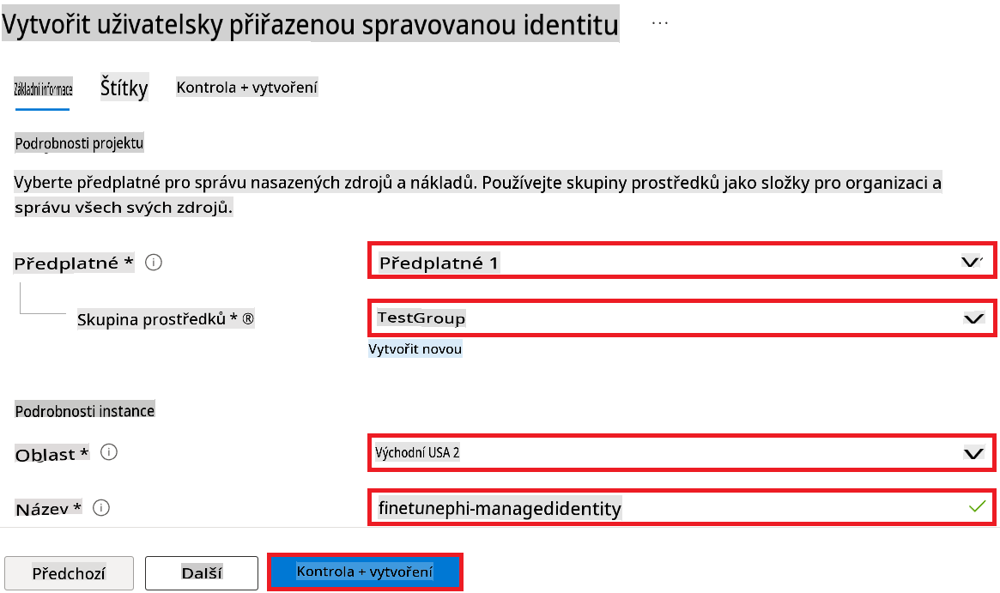

1. Vyberte **Review + create**.

1. Vyberte **+ Create**.

#### Přidání role Contributor k Managed Identity

1. Přejděte k Managed Identity zdroji, který jste vytvořili.

1. Vyberte **Azure role assignments** z levého panelu.

1. Vyberte **+Add role assignment** z nabídky navigace.

1. Na stránce Add role assignment proveďte následující kroky:
    - Nastavte **Scope** na **Resource group**.
    - Vyberte svůj Azure **Subscription**.
    - Vyberte **Resource group**, kterou chcete použít.
    - Nastavte **Role** na **Contributor**.

    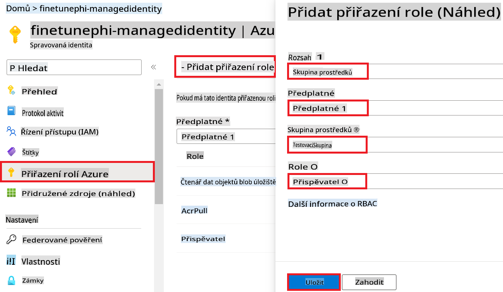

2. Vyberte **Save**.

#### Přidání role Storage Blob Data Reader k Managed Identity

1. Do **vyhledávacího pole** v horní části portálové stránky zadejte *storage accounts* a z nabízených možností vyberte **Storage accounts**.

    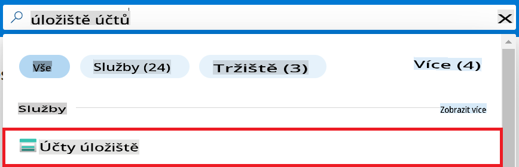

1. Vyberte úložiště, které je spojeno s Azure Machine Learning workspace, které jste vytvořili. Například *finetunephistorage*.

1. Proveďte následující kroky pro navigaci na stránku Add role assignment:

    - Přejděte do Azure Storage účtu, který jste vytvořili.
    - Vyberte **Access Control (IAM)** z levého panelu.
    - Vyberte **+ Add** z nabídky navigace.
    - Vyberte **Add role assignment** z nabídky navigace.

    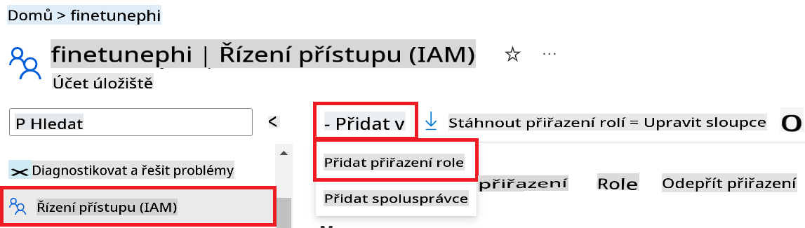

1. Na stránce Add role assignment proveďte následující kroky:

    - Na stránce Role zadejte *Storage Blob Data Reader* do **vyhledávacího pole** a vyberte **Storage Blob Data Reader** z nabízených možností.
    - Na stránce Role vyberte **Next**.
    - Na stránce Members nastavte **Assign access to** na **Managed identity**.
    - Na stránce Members vyberte **+ Select members**.
    - Na stránce Select managed identities vyberte svůj Azure **Subscription**.
    - Na stránce Select managed identities vyberte **Managed identity**, kterou jste vytvořili. Například *finetunephi-managedidentity*.
    - Na stránce Select managed identities vyberte **Select**.

    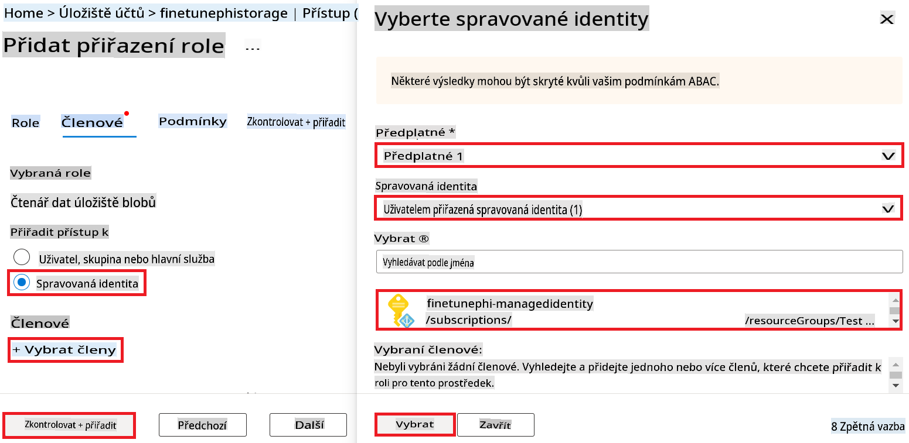

1. Vyberte **Review + assign**.

#### Přidání role AcrPull k Managed Identity

1. Do **vyhledávacího pole** v horní části portálové stránky zadejte *container registries* a z nabízených možností vyberte **Container registries**.

    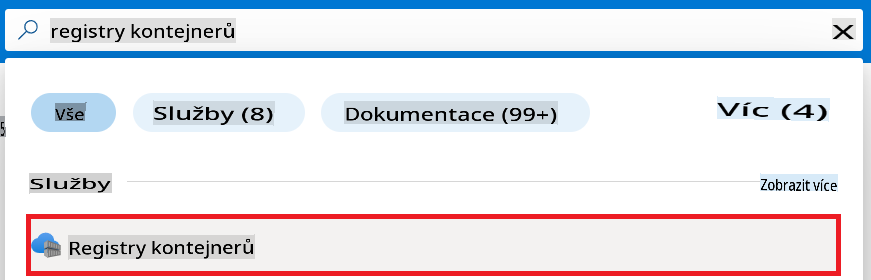

1. Vyberte registr kontejnerů, který je spojen s Azure Machine Learning workspace. Například *finetunephicontainerregistry*.

1. Proveďte následující kroky pro navigaci na stránku Add role assignment:

    - Vyberte **Access Control (IAM)** z levého panelu.
    - Vyberte **+ Add** z nabídky navigace.
    - Vyberte **Add role assignment** z nabídky navigace.

1. Na stránce Add role assignment proveďte následující kroky:

    - Na stránce Role zadejte *AcrPull* do **vyhledávacího pole** a vyberte **AcrPull** z nabízených možností.
    - Na stránce Role vyberte **Next**.
    - Na stránce Members nastavte **Assign access to** na **Managed identity**.
    - Na stránce Members vyberte **+ Select members**.
    - Na stránce Select managed identities vyberte svůj Azure **Subscription**.
    - Na stránce Select managed identities vyberte **Managed identity**, kterou jste vytvořili. Například *finetunephi-managedidentity*.
    - Na stránce Select managed identities vyberte **Select**.
    - Vyberte **Review + assign**.

### Nastavení projektu

Pro stažení datasetů potřebných k vylepšení nastavíte lokální prostředí.

V tomto cvičení:

- Vytvoříte složku pro práci.
- Vytvoříte virtuální prostředí.
- Nainstalujete potřebné balíčky.
- Vytvoříte soubor *download_dataset.py* pro stažení datasetu.

#### Vytvoření složky pro práci

1. Otevřete terminálové okno a zadejte následující příkaz pro vytvoření složky s názvem *finetune-phi* ve výchozí cestě.

    ```console
    mkdir finetune-phi
    ```

2. Zadejte následující příkaz v terminálu pro přechod do složky *finetune-phi*, kterou jste vytvořili.

    ```console
    cd finetune-phi
    ```

#### Vytvoření virtuálního prostředí

1. Zadejte následující příkaz v terminálu pro vytvoření virtuálního prostředí s názvem *.venv*.

    ```console
    python -m venv .venv
    ```

2. Zadejte následující příkaz v terminálu pro aktivaci virtuálního prostředí.

    ```console
    .venv\Scripts\activate.bat
    ```

> [!NOTE]
> Pokud vše funguje správně, měli byste vidět *(.venv)* před příkazovým řádkem.

#### Instalace potřebných balíčků

1. Zadejte následující příkazy v terminálu pro instalaci potřebných balíčků.

    ```console
    pip install datasets==2.19.1
    ```

#### Vytvoření `download_dataset.py`

> [!NOTE]
> Kompletní struktura složek:
>
> ```text
> └── YourUserName
> .    └── finetune-phi
> .        └── download_dataset.py
> ```

1. Otevřete **Visual Studio Code**.

1. Vyberte **Soubor** z horního menu.

1. Vyberte **Otevřít složku**.

1. Vyberte složku *finetune-phi*, kterou jste vytvořili, umístěnou v *C:\Users\yourUserName\finetune-phi*.

    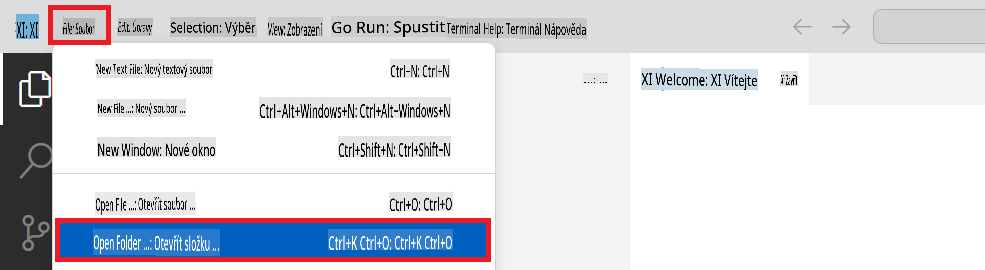

1. V levém panelu Visual Studio Code klikněte pravým tlačítkem a vyberte **Nový soubor** pro vytvoření nového souboru s názvem *download_dataset.py*.

    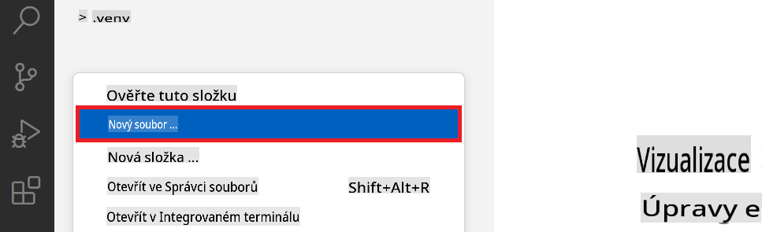

### Příprava datasetu na vylepšení

V tomto cvičení spustíte soubor *download_dataset.py* pro stažení datasetu *ultrachat_200k* do svého lokálního prostředí. Tento dataset následně použijete k vylepšení modelu Phi-3 v Azure Machine Learning.

V tomto cvičení:

- Přidáte kód do souboru *download_dataset.py* pro stažení datasetu.
- Spustíte soubor *download_dataset.py* pro stažení datasetu do svého lokálního prostředí.

#### Stažení datasetu pomocí *download_dataset.py*

1. Otevřete soubor *download_dataset.py* ve Visual Studio Code.

1. Přidejte následující kód do souboru *download_dataset.py*.

    ```python
    import json
    import os
    from datasets import load_dataset

    def load_and_split_dataset(dataset_name, config_name, split_ratio):
        """
        Load and split a dataset.
        """
        # Load the dataset with the specified name, configuration, and split ratio
        dataset = load_dataset(dataset_name, config_name, split=split_ratio)
        print(f"Original dataset size: {len(dataset)}")
        
        # Split the dataset into train and test sets (80% train, 20% test)
        split_dataset = dataset.train_test_split(test_size=0.2)
        print(f"Train dataset size: {len(split_dataset['train'])}")
        print(f"Test dataset size: {len(split_dataset['test'])}")
        
        return split_dataset

    def save_dataset_to_jsonl(dataset, filepath):
        """
        Save a dataset to a JSONL file.
        """
        # Create the directory if it does not exist
        os.makedirs(os.path.dirname(filepath), exist_ok=True)
        
        # Open the file in write mode
        with open(filepath, 'w', encoding='utf-8') as f:
            # Iterate over each record in the dataset
            for record in dataset:
                # Dump the record as a JSON object and write it to the file
                json.dump(record, f)
                # Write a newline character to separate records
                f.write('\n')
        
        print(f"Dataset saved to {filepath}")

    def main():
        """
        Main function to load, split, and save the dataset.
        """
        # Load and split the ULTRACHAT_200k dataset with a specific configuration and split ratio
        dataset = load_and_split_dataset("HuggingFaceH4/ultrachat_200k", 'default', 'train_sft[:1%]')
        
        # Extract the train and test datasets from the split
        train_dataset = dataset['train']
        test_dataset = dataset['test']

        # Save the train dataset to a JSONL file
        save_dataset_to_jsonl(train_dataset, "data/train_data.jsonl")
        
        # Save the test dataset to a separate JSONL file
        save_dataset_to_jsonl(test_dataset, "data/test_data.jsonl")

    if __name__ == "__main__":
        main()

    ```

1. Zadejte následující příkaz v terminálu pro spuštění skriptu a stažení datasetu do svého lokálního prostředí.

    ```console
    python download_dataset.py
    ```

1. Ověřte, že dataset byl úspěšně uložen do vašeho lokálního adresáře *finetune-phi/data*.

> [!NOTE]
>
> #### Poznámka k velikosti datasetu a době vylepšení
>
> V tomto tutoriálu použijete pouze 1 % datasetu (`split='train[:1%]'`). To výrazně snižuje množství dat, což urychluje proces nahrávání i vylepšování. Můžete upravit procento pro nalezení správné rovnováhy mezi dobou tr
1. Navštivte [Azure ML Studio](https://ml.azure.com/home?wt.mc_id=studentamb_279723).

1. Vyberte **Compute** z levého panelu.

1. Vyberte **Compute clusters** z navigační nabídky.

1. Vyberte **+ New**.

    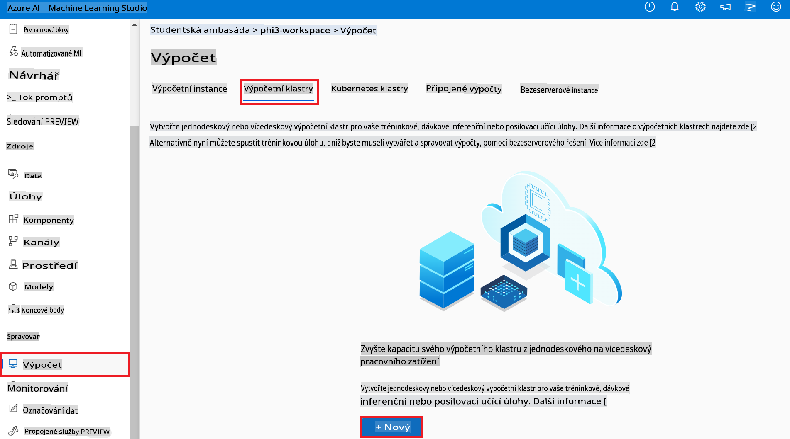

1. Proveďte následující kroky:

    - Vyberte **Region**, který chcete použít.
    - Nastavte **Virtual machine tier** na **Dedicated**.
    - Nastavte **Virtual machine type** na **GPU**.
    - Nastavte filtr **Virtual machine size** na **Select from all options**.
    - Nastavte **Virtual machine size** na **Standard_NC24ads_A100_v4**.

    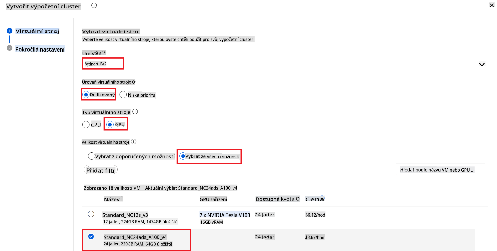

1. Vyberte **Next**.

1. Proveďte následující kroky:

    - Zadejte **Compute name**. Musí to být unikátní hodnota.
    - Nastavte **Minimum number of nodes** na **0**.
    - Nastavte **Maximum number of nodes** na **1**.
    - Nastavte **Idle seconds before scale down** na **120**.

    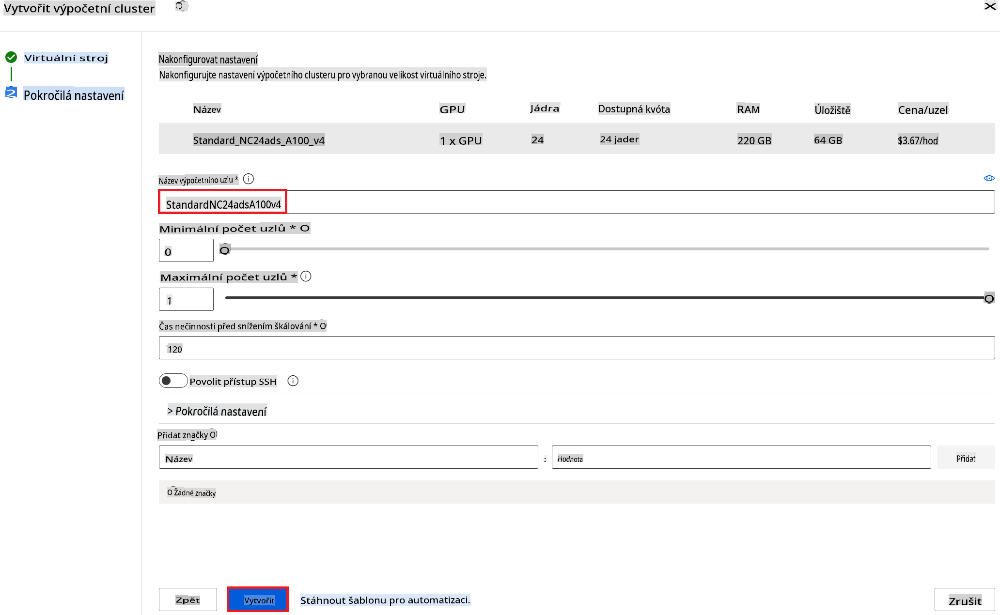

1. Vyberte **Create**.

#### Jemné doladění modelu Phi-3

1. Navštivte [Azure ML Studio](https://ml.azure.com/home?wt.mc_id=studentamb_279723).

1. Vyberte Azure Machine Learning workspace, který jste vytvořili.

    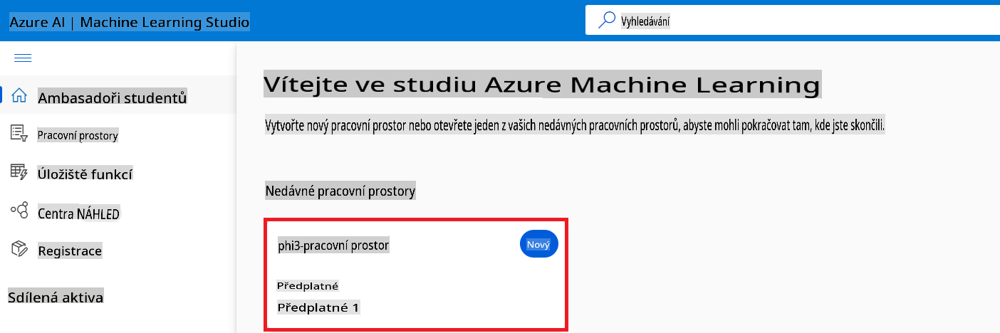

1. Proveďte následující kroky:

    - Vyberte **Model catalog** z levého panelu.
    - Zadejte *phi-3-mini-4k* do **vyhledávacího pole** a vyberte **Phi-3-mini-4k-instruct** z nabízených možností.

    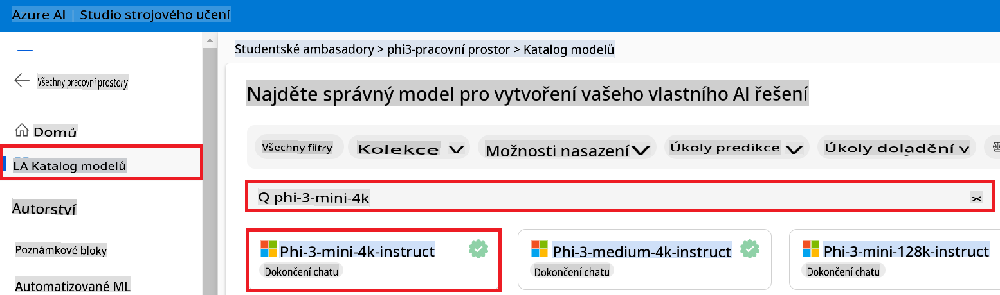

1. Vyberte **Fine-tune** z navigační nabídky.

    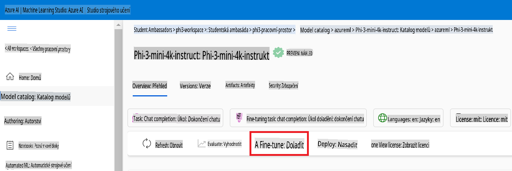

1. Proveďte následující kroky:

    - Nastavte **Select task type** na **Chat completion**.
    - Vyberte **+ Select data** pro nahrání **Training data**.
    - Nastavte typ nahrání validačních dat na **Provide different validation data**.
    - Vyberte **+ Select data** pro nahrání **Validation data**.

    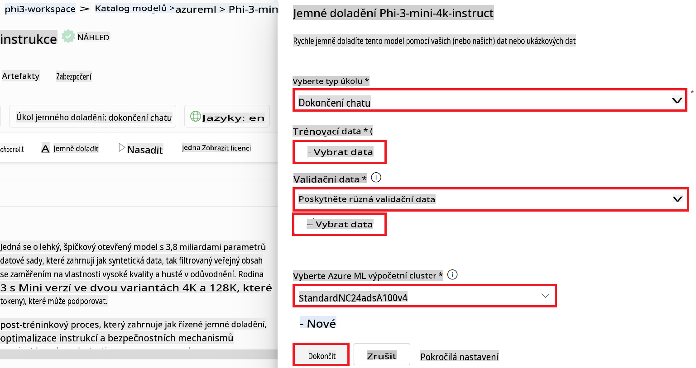

    > [!TIP]
    >
    > Můžete vybrat **Advanced settings** pro přizpůsobení konfigurací, jako jsou **learning_rate** a **lr_scheduler_type**, aby byl proces jemného doladění optimalizován podle vašich konkrétních potřeb.

1. Vyberte **Finish**.

1. V tomto cvičení jste úspěšně provedli jemné doladění modelu Phi-3 pomocí Azure Machine Learning. Vezměte na vědomí, že proces jemného doladění může trvat značnou dobu. Po spuštění úlohy jemného doladění musíte počkat na její dokončení. Stav úlohy jemného doladění můžete sledovat v záložce Jobs na levé straně vašeho Azure Machine Learning Workspace. V další sérii nasadíte jemně doladěný model a integrujete ho s Prompt Flow.

    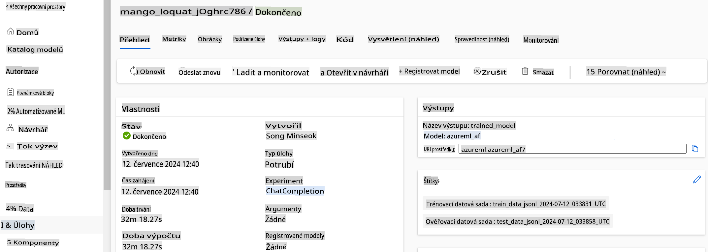

### Nasazení jemně doladěného modelu Phi-3

Pro integraci jemně doladěného modelu Phi-3 s Prompt Flow je nutné model nasadit, aby byl dostupný pro real-time inference. Tento proces zahrnuje registraci modelu, vytvoření online endpointu a nasazení modelu.

V tomto cvičení:

- Zaregistrujete jemně doladěný model v Azure Machine Learning workspace.
- Vytvoříte online endpoint.
- Nasadíte registrovaný jemně doladěný model Phi-3.

#### Registrace jemně doladěného modelu

1. Navštivte [Azure ML Studio](https://ml.azure.com/home?wt.mc_id=studentamb_279723).

1. Vyberte Azure Machine Learning workspace, který jste vytvořili.

    

1. Vyberte **Models** z levého panelu.
1. Vyberte **+ Register**.
1. Vyberte **From a job output**.

    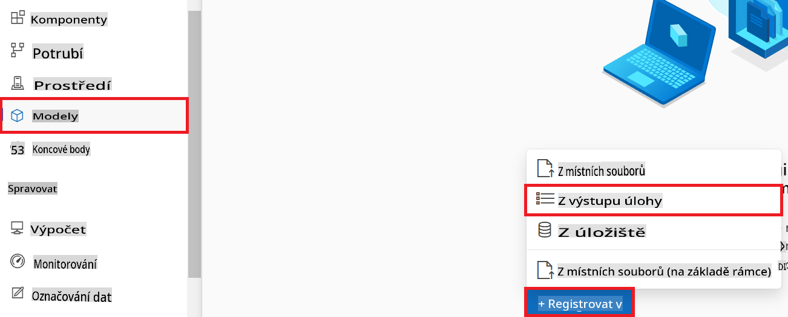

1. Vyberte úlohu, kterou jste vytvořili.

    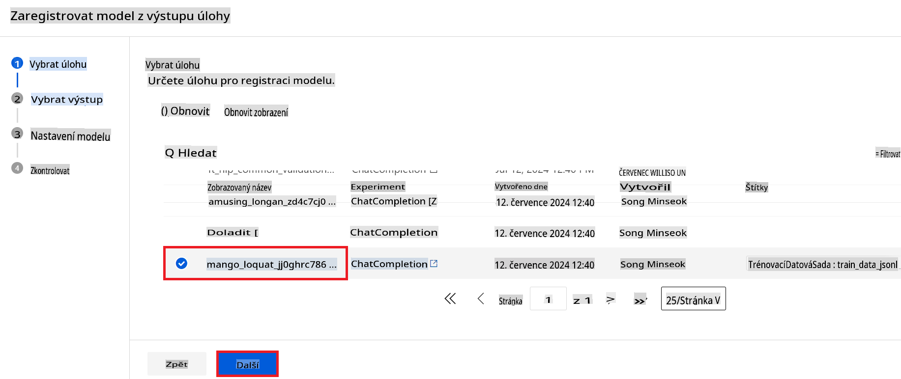

1. Vyberte **Next**.

1. Nastavte **Model type** na **MLflow**.

1. Ujistěte se, že je vybrána možnost **Job output**; měla by být automaticky vybrána.

    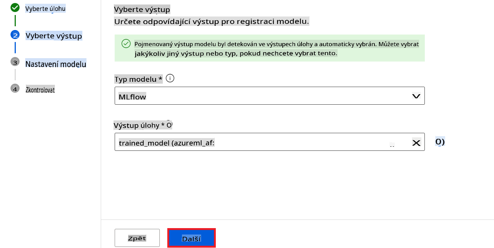

2. Vyberte **Next**.

3. Vyberte **Register**.

    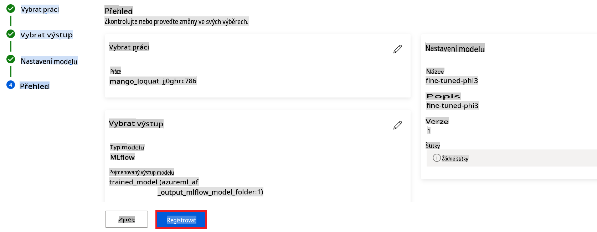

4. Svůj registrovaný model můžete zobrazit v nabídce **Models** z levého panelu.

    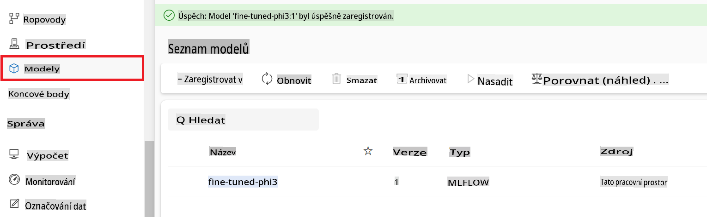

#### Nasazení jemně doladěného modelu

1. Přejděte do Azure Machine Learning workspace, který jste vytvořili.

1. Vyberte **Endpoints** z levého panelu.

1. Vyberte **Real-time endpoints** z navigační nabídky.

    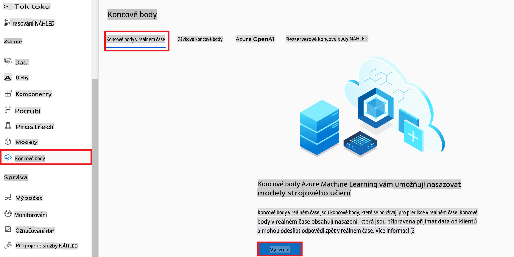

1. Vyberte **Create**.

1. Vyberte registrovaný model, který jste vytvořili.

    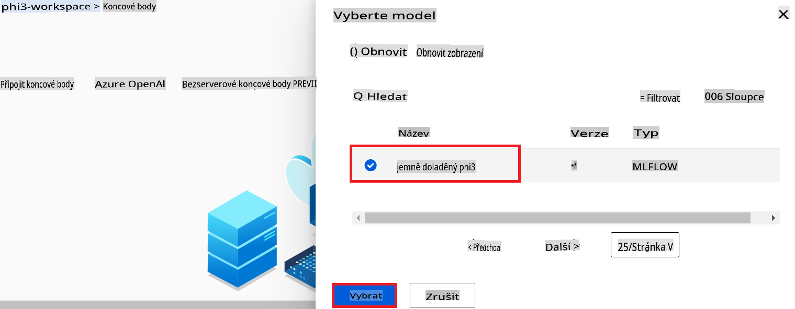

1. Vyberte **Select**.

1. Proveďte následující kroky:

    - Nastavte **Virtual machine** na *Standard_NC6s_v3*.
    - Nastavte **Instance count** podle potřeby, například *1*.
    - Nastavte **Endpoint** na **New** pro vytvoření endpointu.
    - Zadejte **Endpoint name**. Musí to být unikátní hodnota.
    - Zadejte **Deployment name**. Musí to být unikátní hodnota.

    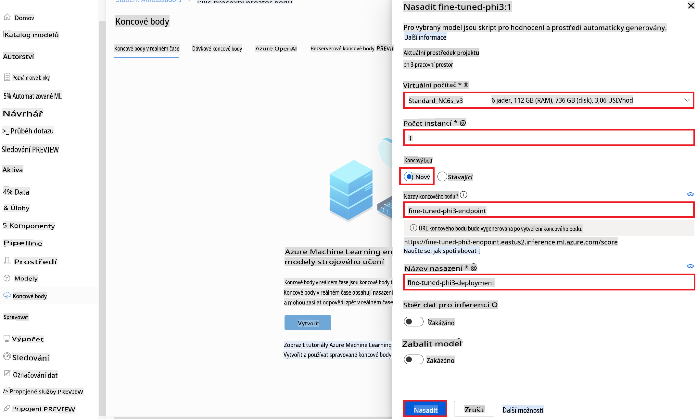

1. Vyberte **Deploy**.

> [!WARNING]
> Aby nedošlo k dodatečným poplatkům na vašem účtu, nezapomeňte odstranit vytvořený endpoint v Azure Machine Learning workspace.
>

#### Zkontrolujte stav nasazení v Azure Machine Learning Workspace

1. Přejděte do Azure Machine Learning workspace, který jste vytvořili.

1. Vyberte **Endpoints** z levého panelu.

1. Vyberte endpoint, který jste vytvořili.

    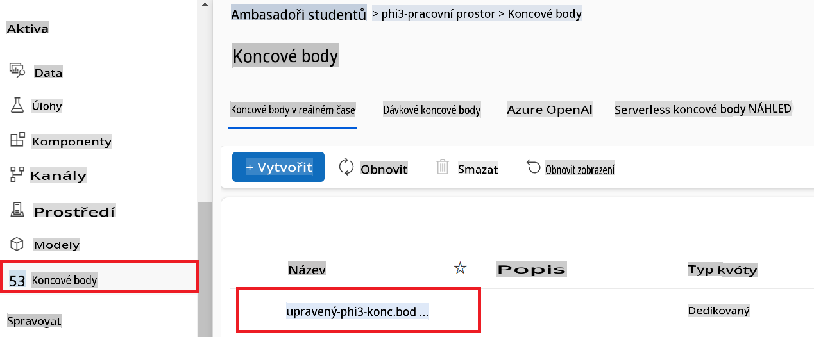

1. Na této stránce můžete spravovat endpointy během procesu nasazení.

> [!NOTE]
> Po dokončení nasazení se ujistěte, že **Live traffic** je nastaveno na **100%**. Pokud není, vyberte **Update traffic** pro úpravu nastavení provozu. Všimněte si, že model nelze testovat, pokud je provoz nastaven na 0%.
>
> 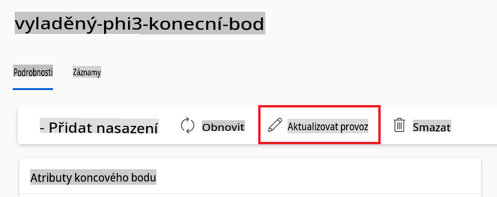
>
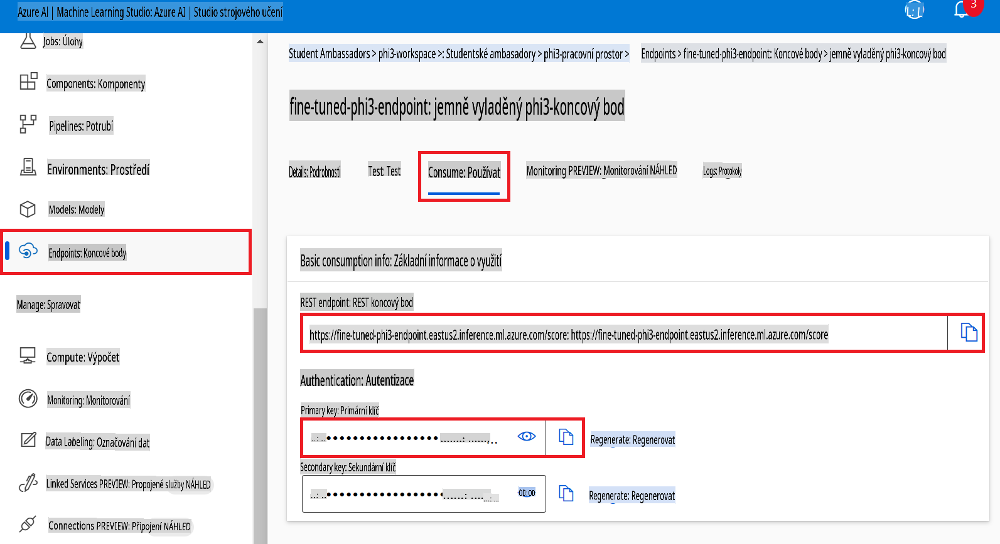

#### Přidání vlastního připojení

1. Navštivte [Azure AI Foundry](https://ai.azure.com/?WT.mc_id=aiml-137032-kinfeylo).

1. Přejděte na projekt Azure AI Foundry, který jste vytvořili.

1. V projektu, který jste vytvořili, vyberte **Nastavení** z levého panelu.

1. Zvolte **+ Nové připojení**.

    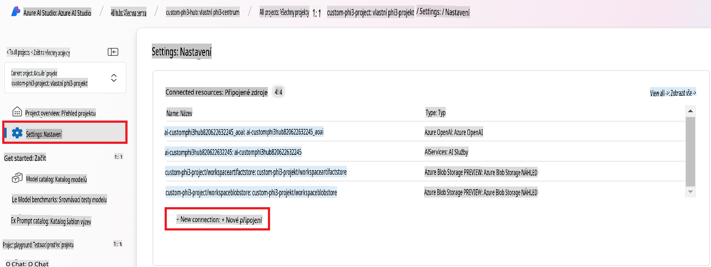

1. Vyberte **Vlastní klíče** z navigačního menu.

    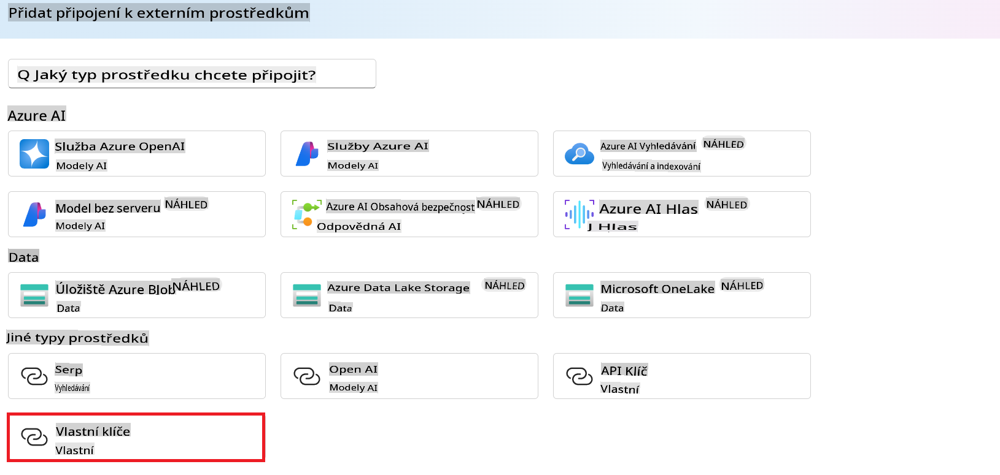

1. Proveďte následující kroky:

    - Vyberte **+ Přidat dvojici klíč-hodnota**.
    - Do pole pro název klíče zadejte **endpoint** a vložte URI koncového bodu, které jste zkopírovali z Azure ML Studio, do pole pro hodnotu.
    - Opět vyberte **+ Přidat dvojici klíč-hodnota**.
    - Do pole pro název klíče zadejte **key** a vložte klíč, který jste zkopírovali z Azure ML Studio, do pole pro hodnotu.
    - Po přidání klíčů zvolte **je tajné**, aby byl klíč skrytý.

    

1. Zvolte **Přidat připojení**.

#### Vytvoření Prompt flow

Přidali jste vlastní připojení v Azure AI Foundry. Nyní vytvoříme Prompt flow pomocí následujících kroků. Poté připojíte tento Prompt flow k vlastnímu připojení, abyste mohli v Prompt flow využít model upravený na míru.

1. Přejděte na projekt Azure AI Foundry, který jste vytvořili.

1. Vyberte **Prompt flow** z levého panelu.

1. Zvolte **+ Vytvořit** z navigačního menu.

    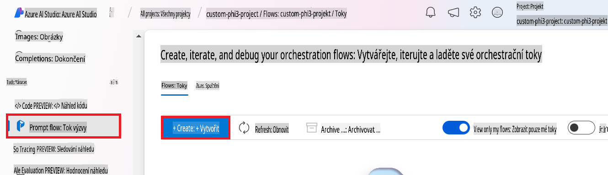

1. Vyberte **Chat flow** z navigačního menu.

    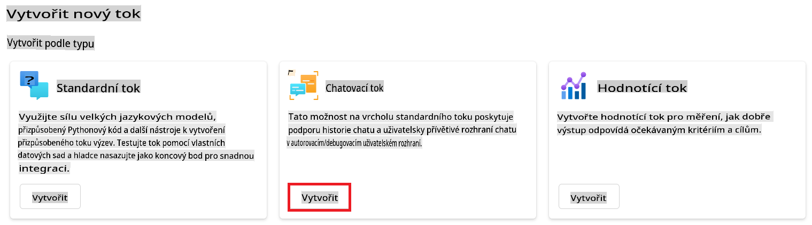

1. Zadejte **Název složky**, kterou chcete použít.

    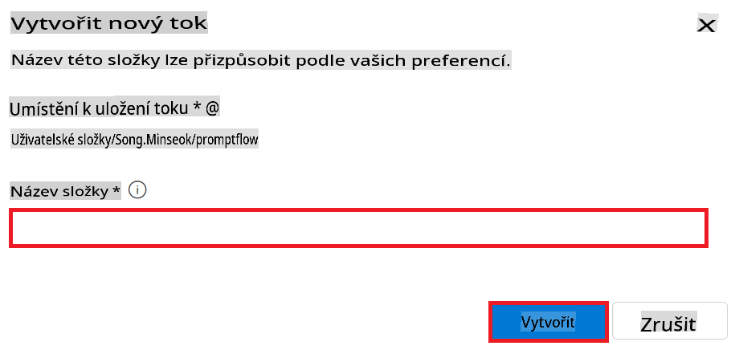

2. Vyberte **Vytvořit**.

#### Nastavení Prompt flow pro komunikaci s vlastním modelem Phi-3

Je potřeba integrovat upravený model Phi-3 do Prompt flow. Stávající Prompt flow však není navržen pro tento účel. Proto je nutné Prompt flow přepracovat, aby bylo možné integrovat vlastní model.

1. V Prompt flow proveďte následující kroky pro přestavbu stávajícího toku:

    - Vyberte **Režim syrového souboru**.
    - Odstraňte veškerý stávající kód v souboru *flow.dag.yml*.
    - Přidejte následující kód do souboru *flow.dag.yml*.

        ```yml
        inputs:
          input_data:
            type: string
            default: "Who founded Microsoft?"

        outputs:
          answer:
            type: string
            reference: ${integrate_with_promptflow.output}

        nodes:
        - name: integrate_with_promptflow
          type: python
          source:
            type: code
            path: integrate_with_promptflow.py
          inputs:
            input_data: ${inputs.input_data}
        ```

    - Vyberte **Uložit**.

    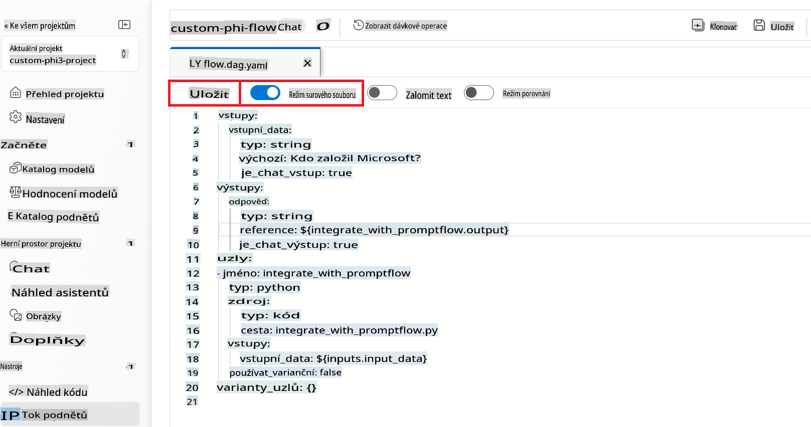

1. Přidejte následující kód do souboru *integrate_with_promptflow.py*, abyste mohli použít vlastní model Phi-3 v Prompt flow.

    ```python
    import logging
    import requests
    from promptflow import tool
    from promptflow.connections import CustomConnection

    # Logging setup
    logging.basicConfig(
        format="%(asctime)s - %(levelname)s - %(name)s - %(message)s",
        datefmt="%Y-%m-%d %H:%M:%S",
        level=logging.DEBUG
    )
    logger = logging.getLogger(__name__)

    def query_phi3_model(input_data: str, connection: CustomConnection) -> str:
        """
        Send a request to the Phi-3 model endpoint with the given input data using Custom Connection.
        """

        # "connection" is the name of the Custom Connection, "endpoint", "key" are the keys in the Custom Connection
        endpoint_url = connection.endpoint
        api_key = connection.key

        headers = {
            "Content-Type": "application/json",
            "Authorization": f"Bearer {api_key}"
        }
        data = {
            "input_data": {
                "input_string": [
                    {"role": "user", "content": input_data}
                ],
                "parameters": {
                    "temperature": 0.7,
                    "max_new_tokens": 128
                }
            }
        }
        try:
            response = requests.post(endpoint_url, json=data, headers=headers)
            response.raise_for_status()
            
            # Log the full JSON response
            logger.debug(f"Full JSON response: {response.json()}")

            result = response.json()["output"]
            logger.info("Successfully received response from Azure ML Endpoint.")
            return result
        except requests.exceptions.RequestException as e:
            logger.error(f"Error querying Azure ML Endpoint: {e}")
            raise

    @tool
    def my_python_tool(input_data: str, connection: CustomConnection) -> str:
        """
        Tool function to process input data and query the Phi-3 model.
        """
        return query_phi3_model(input_data, connection)

    ```

    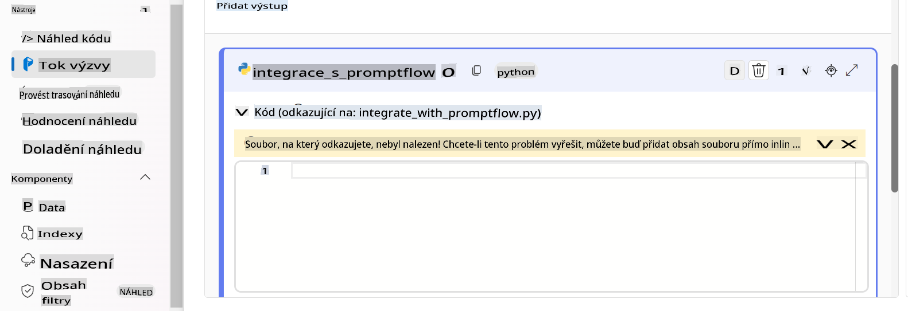

> [!NOTE]
> Pro podrobnější informace o používání Prompt flow v Azure AI Foundry můžete navštívit [Prompt flow v Azure AI Foundry](https://learn.microsoft.com/azure/ai-studio/how-to/prompt-flow).

1. Vyberte **Chat input**, **Chat output**, abyste povolili komunikaci s modelem.

    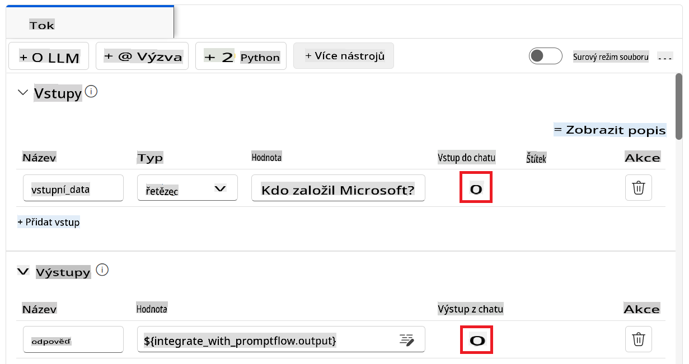

1. Nyní jste připraveni komunikovat s vlastním modelem Phi-3. V další cvičení se naučíte, jak spustit Prompt flow a použít jej ke komunikaci s upraveným modelem Phi-3.

> [!NOTE]
>
> Přestavěný tok by měl vypadat jako na obrázku níže:
>
> 
>

### Komunikace s vlastním modelem Phi-3

Nyní, když jste upravili a integrovali vlastní model Phi-3 s Prompt flow, jste připraveni začít s ním komunikovat. Toto cvičení vás provede procesem nastavení a spuštění konverzace s vaším modelem pomocí Prompt flow. Díky těmto krokům budete moci plně využít schopnosti svého upraveného modelu Phi-3 pro různé úkoly a konverzace.

- Komunikujte s vlastním modelem Phi-3 pomocí Prompt flow.

#### Spuštění Prompt flow

1. Vyberte **Spustit výpočetní relace**, abyste spustili Prompt flow.

    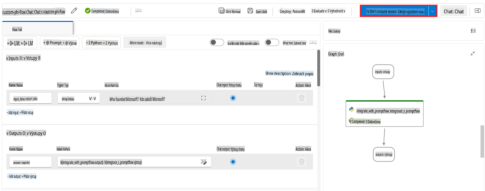

1. Vyberte **Ověřit a analyzovat vstup**, abyste obnovili parametry.

    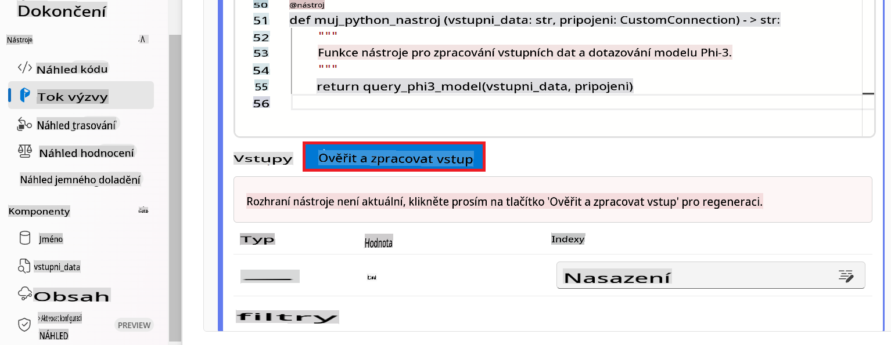

1. Vyberte **Hodnotu** připojení k vlastnímu připojení, které jste vytvořili. Například *connection*.

    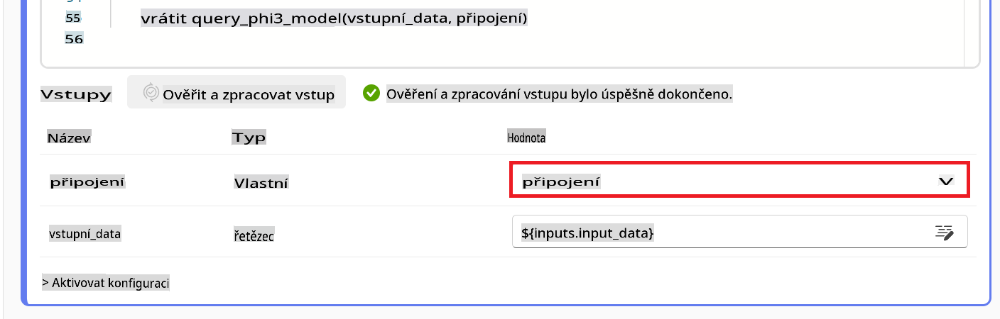

#### Komunikace s vlastním modelem

1. Vyberte **Chat**.

    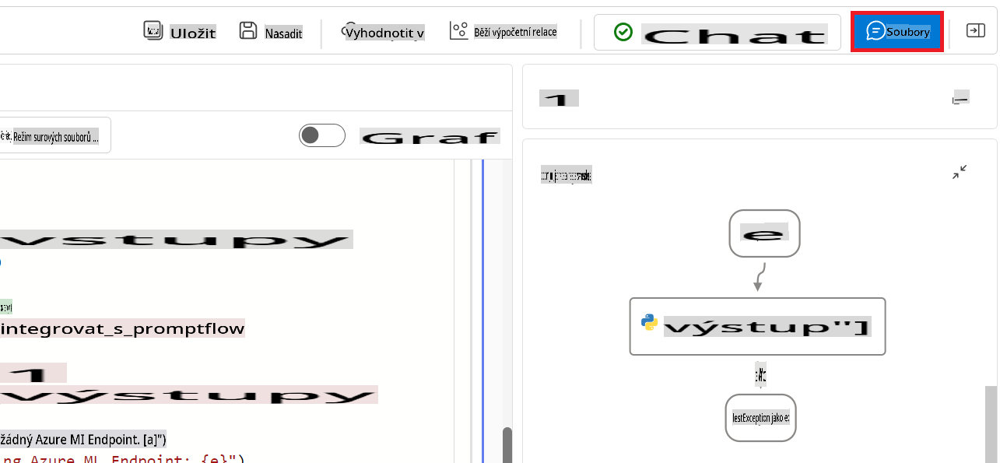

1. Zde je příklad výsledků: Nyní můžete komunikovat s vlastním modelem Phi-3. Doporučuje se pokládat otázky na základě dat použitých pro jemné doladění.

    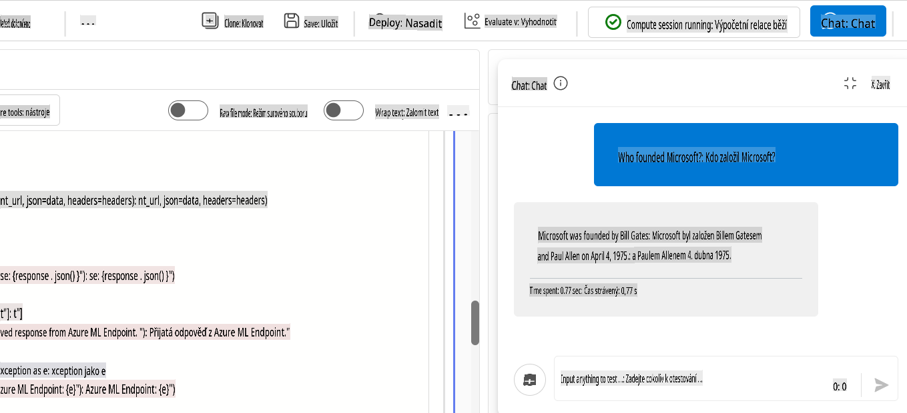

**Prohlášení**:  
Tento dokument byl přeložen pomocí strojových AI překladatelských služeb. Ačkoli se snažíme o přesnost, mějte prosím na paměti, že automatické překlady mohou obsahovat chyby nebo nepřesnosti. Původní dokument v jeho původním jazyce by měl být považován za závazný zdroj. Pro kritické informace se doporučuje profesionální lidský překlad. Nezodpovídáme za jakékoli nedorozumění nebo nesprávné interpretace vyplývající z použití tohoto překladu.