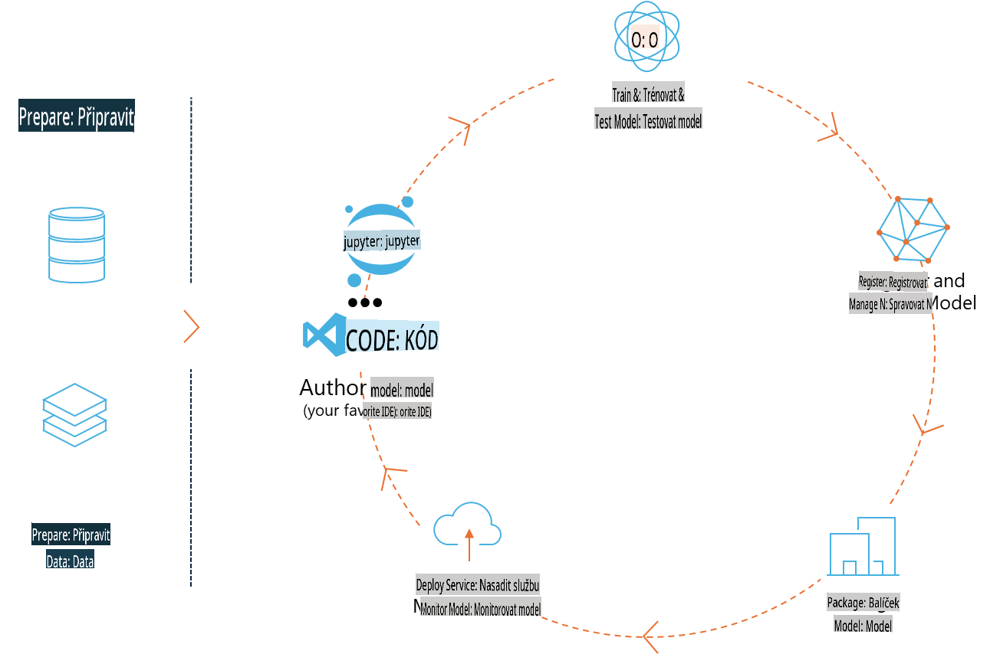
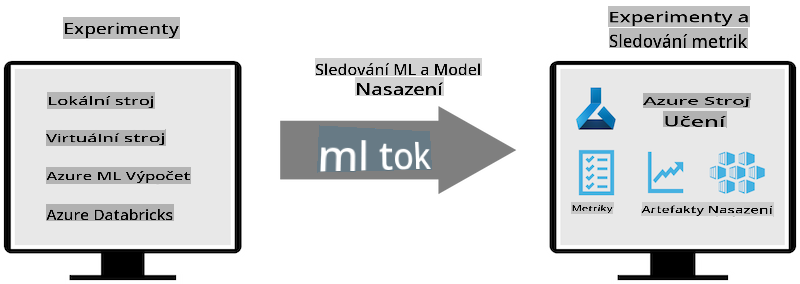
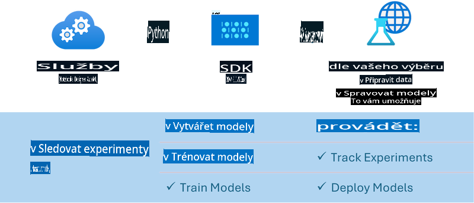

# MLflow

[MLflow](https://mlflow.org/) je open-source platforma navržená pro správu životního cyklu strojového učení od začátku do konce.



MLFlow se používá k řízení životního cyklu ML, včetně experimentování, reprodukovatelnosti, nasazení a centrálního registru modelů. V současnosti MLFlow nabízí čtyři komponenty:

- **MLflow Tracking:** Zaznamenávání a dotazování experimentů, kódu, konfigurací dat a výsledků.
- **MLflow Projects:** Balíčkování kódu pro datovou vědu ve formátu, který umožňuje reprodukovat spuštění na jakékoli platformě.
- **Mlflow Models:** Nasazování modelů strojového učení v různých prostředích pro poskytování služeb.
- **Model Registry:** Ukládání, anotace a správa modelů v centrálním úložišti.

Obsahuje funkce pro sledování experimentů, balíčkování kódu do reprodukovatelných spuštění a sdílení a nasazování modelů. MLFlow je integrován do Databricks a podporuje širokou škálu knihoven ML, což z něj činí knihovně nezávislou platformu. Může být použit s jakoukoli knihovnou strojového učení a v jakémkoli programovacím jazyce, protože poskytuje REST API a CLI pro pohodlné použití.



Klíčové vlastnosti MLFlow zahrnují:

- **Sledování experimentů:** Zaznamenávání a porovnávání parametrů a výsledků.
- **Správa modelů:** Nasazování modelů na různé platformy pro poskytování služeb a inferenci.
- **Registr modelů:** Spolupráce na správě životního cyklu MLFlow modelů, včetně verzování a anotací.
- **Projekty:** Balíčkování ML kódu pro sdílení nebo použití v produkci.

MLFlow také podporuje MLOps cyklus, který zahrnuje přípravu dat, registraci a správu modelů, balíčkování modelů pro spuštění, nasazování služeb a monitorování modelů. Jeho cílem je zjednodušit proces přechodu od prototypu k produkčnímu workflow, zejména v cloudových a edge prostředích.

## E2E scénář – Vytvoření wrapperu a použití Phi-3 jako MLFlow modelu

V tomto E2E příkladu ukážeme dva různé přístupy k vytvoření wrapperu kolem malého jazykového modelu Phi-3 (SLM) a jeho spuštění jako MLFlow modelu buď lokálně, nebo v cloudu, např. v pracovním prostoru Azure Machine Learning.



| Projekt | Popis | Umístění |
| ------------ | ----------- | -------- |
| Transformer Pipeline | Transformer Pipeline je nejjednodušší možnost, jak vytvořit wrapper, pokud chcete použít HuggingFace model s experimentální funkcí transformers od MLFlow. | [**TransformerPipeline.ipynb**](../../../../../../code/06.E2E/E2E_Phi-3-MLflow_TransformerPipeline.ipynb) |
| Vlastní Python Wrapper | V době psaní tohoto textu nepodporovala pipeline transformers generování wrapperu MLFlow pro HuggingFace modely ve formátu ONNX, dokonce ani s experimentálním balíčkem optimum pro Python. V takových případech můžete vytvořit vlastní Python wrapper pro MLFlow mód. | [**CustomPythonWrapper.ipynb**](../../../../../../code/06.E2E/E2E_Phi-3-MLflow_CustomPythonWrapper.ipynb) |

## Projekt: Transformer Pipeline

1. Budete potřebovat příslušné Python balíčky z MLFlow a HuggingFace:

    ``` Python
    import mlflow
    import transformers
    ```

2. Poté byste měli inicializovat transformer pipeline s odkazem na cílový Phi-3 model v registru HuggingFace. Jak je vidět z modelové karty _Phi-3-mini-4k-instruct_, jeho úkolem je „Text Generation“:

    ``` Python
    pipeline = transformers.pipeline(
        task = "text-generation",
        model = "microsoft/Phi-3-mini-4k-instruct"
    )
    ```

3. Nyní můžete uložit transformer pipeline vašeho Phi-3 modelu do MLFlow formátu a přidat další detaily, jako je cílová cesta artefaktů, specifická nastavení konfigurace modelu a typ inference API:

    ``` Python
    model_info = mlflow.transformers.log_model(
        transformers_model = pipeline,
        artifact_path = "phi3-mlflow-model",
        model_config = model_config,
        task = "llm/v1/chat"
    )
    ```

## Projekt: Vlastní Python Wrapper

1. Zde můžeme využít [ONNX Runtime generate() API](https://github.com/microsoft/onnxruntime-genai) od Microsoftu pro inferenci ONNX modelu a kódování/decoding tokenů. Musíte zvolit balíček _onnxruntime_genai_ pro váš cílový výpočetní zdroj, v níže uvedeném příkladu je cílová CPU:

    ``` Python
    import mlflow
    from mlflow.models import infer_signature
    import onnxruntime_genai as og
    ```

1. Naše vlastní třída implementuje dvě metody: _load_context()_ pro inicializaci **ONNX modelu** Phi-3 Mini 4K Instruct, **parametrů generátoru** a **tokenizéru**; a _predict()_ pro generování výstupních tokenů na základě zadaného promptu:

    ``` Python
    class Phi3Model(mlflow.pyfunc.PythonModel):
        def load_context(self, context):
            # Retrieving model from the artifacts
            model_path = context.artifacts["phi3-mini-onnx"]
            model_options = {
                 "max_length": 300,
                 "temperature": 0.2,         
            }
        
            # Defining the model
            self.phi3_model = og.Model(model_path)
            self.params = og.GeneratorParams(self.phi3_model)
            self.params.set_search_options(**model_options)
            
            # Defining the tokenizer
            self.tokenizer = og.Tokenizer(self.phi3_model)
    
        def predict(self, context, model_input):
            # Retrieving prompt from the input
            prompt = model_input["prompt"][0]
            self.params.input_ids = self.tokenizer.encode(prompt)
    
            # Generating the model's response
            response = self.phi3_model.generate(self.params)
    
            return self.tokenizer.decode(response[0][len(self.params.input_ids):])
    ```

1. Nyní můžete použít funkci _mlflow.pyfunc.log_model()_ k vytvoření vlastního Python wrapperu (ve formátu pickle) pro model Phi-3 spolu s původním ONNX modelem a potřebnými závislostmi:

    ``` Python
    model_info = mlflow.pyfunc.log_model(
        artifact_path = artifact_path,
        python_model = Phi3Model(),
        artifacts = {
            "phi3-mini-onnx": "cpu_and_mobile/cpu-int4-rtn-block-32-acc-level-4",
        },
        input_example = input_example,
        signature = infer_signature(input_example, ["Run"]),
        extra_pip_requirements = ["torch", "onnxruntime_genai", "numpy"],
    )
    ```

## Podpisy generovaných MLFlow modelů

1. Ve třetím kroku projektu Transformer Pipeline jsme nastavili úkol MLFlow modelu na „_llm/v1/chat_“. Taková instrukce generuje API wrapper modelu, kompatibilní s OpenAI’s Chat API, jak je uvedeno níže:

    ``` Python
    {inputs: 
      ['messages': Array({content: string (required), name: string (optional), role: string (required)}) (required), 'temperature': double (optional), 'max_tokens': long (optional), 'stop': Array(string) (optional), 'n': long (optional), 'stream': boolean (optional)],
    outputs: 
      ['id': string (required), 'object': string (required), 'created': long (required), 'model': string (required), 'choices': Array({finish_reason: string (required), index: long (required), message: {content: string (required), name: string (optional), role: string (required)} (required)}) (required), 'usage': {completion_tokens: long (required), prompt_tokens: long (required), total_tokens: long (required)} (required)],
    params: 
      None}
    ```

1. Výsledkem je, že můžete zadat svůj prompt v následujícím formátu:

    ``` Python
    messages = [{"role": "user", "content": "What is the capital of Spain?"}]
    ```

1. Poté použijte post-processing kompatibilní s OpenAI API, např. _response[0][‘choices’][0][‘message’][‘content’]_, abyste svůj výstup upravili do něčeho jako:

    ``` JSON
    Question: What is the capital of Spain?
    
    Answer: The capital of Spain is Madrid. It is the largest city in Spain and serves as the political, economic, and cultural center of the country. Madrid is located in the center of the Iberian Peninsula and is known for its rich history, art, and architecture, including the Royal Palace, the Prado Museum, and the Plaza Mayor.
    
    Usage: {'prompt_tokens': 11, 'completion_tokens': 73, 'total_tokens': 84}
    ```

1. Ve třetím kroku projektu Vlastní Python Wrapper umožňujeme balíčku MLFlow generovat podpis modelu z daného příkladu vstupu. Podpis našeho MLFlow wrapperu bude vypadat takto:

    ``` Python
    {inputs: 
      ['prompt': string (required)],
    outputs: 
      [string (required)],
    params: 
      None}
    ```

1. Proto musí náš prompt obsahovat klíč slovníku „prompt“, podobně jako toto:

    ``` Python
    {"prompt": "<|system|>You are a stand-up comedian.<|end|><|user|>Tell me a joke about atom<|end|><|assistant|>",}
    ```

1. Výstup modelu pak bude poskytnut ve formátu řetězce:

    ``` JSON
    Alright, here's a little atom-related joke for you!
    
    Why don't electrons ever play hide and seek with protons?
    
    Because good luck finding them when they're always "sharing" their electrons!
    
    Remember, this is all in good fun, and we're just having a little atomic-level humor!
    ```

**Upozornění**:  
Tento dokument byl přeložen pomocí strojových AI překladatelských služeb. Přestože se snažíme o přesnost, mějte prosím na paměti, že automatizované překlady mohou obsahovat chyby nebo nepřesnosti. Původní dokument v jeho rodném jazyce by měl být považován za autoritativní zdroj. Pro kritické informace doporučujeme profesionální lidský překlad. Nezodpovídáme za žádné nedorozumění nebo nesprávné interpretace vyplývající z použití tohoto překladu.