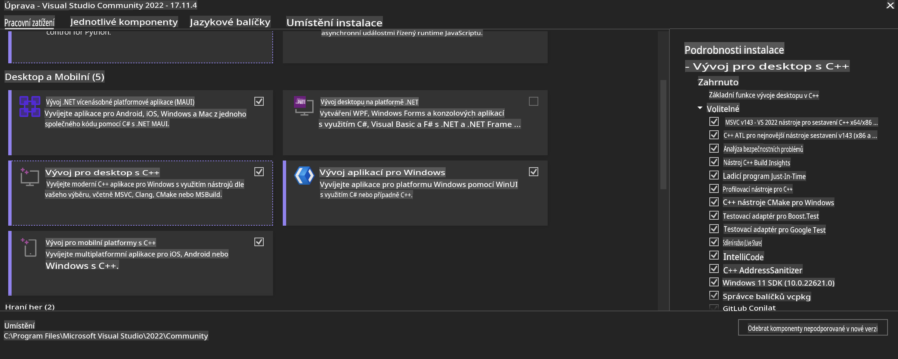
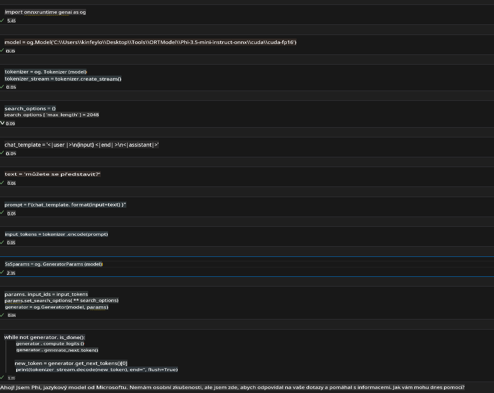
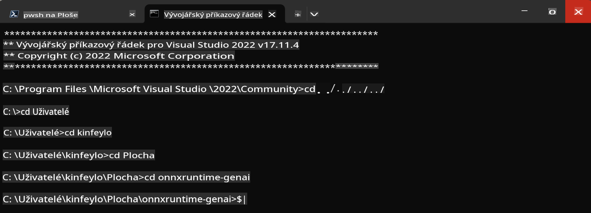

# **Pokyny pro OnnxRuntime GenAI Windows GPU**

Tento návod obsahuje kroky pro nastavení a použití ONNX Runtime (ORT) s GPU na Windows. Je navržen tak, aby vám pomohl využít akceleraci GPU pro vaše modely a zlepšit tak jejich výkon a efektivitu.

Dokument obsahuje pokyny k:

- Nastavení prostředí: Instrukce k instalaci potřebných závislostí, jako jsou CUDA, cuDNN a ONNX Runtime.
- Konfiguraci: Jak nakonfigurovat prostředí a ONNX Runtime pro efektivní využití GPU zdrojů.
- Optimalizační tipy: Doporučení, jak doladit nastavení GPU pro dosažení optimálního výkonu.

### **1. Python 3.10.x / 3.11.8**

   ***Poznámka*** Doporučuje se použít [miniforge](https://github.com/conda-forge/miniforge/releases/latest/download/Miniforge3-Windows-x86_64.exe) jako vaše Python prostředí.

   ```bash

   conda create -n pydev python==3.11.8

   conda activate pydev

   ```

   ***Připomínka*** Pokud máte nainstalovanou jakoukoli knihovnu ONNX pro Python, odinstalujte ji.

### **2. Instalace CMake pomocí winget**

   ```bash

   winget install -e --id Kitware.CMake

   ```

### **3. Instalace Visual Studio 2022 - Desktop Development with C++**

   ***Poznámka*** Pokud nechcete kompilovat, můžete tento krok přeskočit.



### **4. Instalace NVIDIA ovladačů**

1. **NVIDIA GPU ovladač**  [https://www.nvidia.com/en-us/drivers/](https://www.nvidia.com/en-us/drivers/)

2. **NVIDIA CUDA 12.4** [https://developer.nvidia.com/cuda-12-4-0-download-archive](https://developer.nvidia.com/cuda-12-4-0-download-archive)

3. **NVIDIA CUDNN 9.4**  [https://developer.nvidia.com/cudnn-downloads](https://developer.nvidia.com/cudnn-downloads)

***Připomínka*** Použijte výchozí nastavení při instalaci.

### **5. Nastavení prostředí NVIDIA**

Zkopírujte knihovny, binární soubory a hlavičkové soubory z NVIDIA CUDNN 9.4 do odpovídajících složek NVIDIA CUDA 12.4.

- Zkopírujte soubory z *'C:\Program Files\NVIDIA\CUDNN\v9.4\bin\12.6'* do *'C:\Program Files\NVIDIA GPU Computing Toolkit\CUDA\v12.4\bin'*

- Zkopírujte soubory z *'C:\Program Files\NVIDIA\CUDNN\v9.4\include\12.6'* do *'C:\Program Files\NVIDIA GPU Computing Toolkit\CUDA\v12.4\include'*

- Zkopírujte soubory z *'C:\Program Files\NVIDIA\CUDNN\v9.4\lib\12.6'* do *'C:\Program Files\NVIDIA GPU Computing Toolkit\CUDA\v12.4\lib\x64'*

### **6. Stažení Phi-3.5-mini-instruct-onnx**

   ```bash

   winget install -e --id Git.Git

   winget install -e --id GitHub.GitLFS

   git lfs install

   git clone https://huggingface.co/microsoft/Phi-3.5-mini-instruct-onnx

   ```

### **7. Spuštění InferencePhi35Instruct.ipynb**

   Otevřete [Notebook](../../../../../../code/09.UpdateSamples/Aug/ortgpu-phi35-instruct.ipynb) a spusťte jej.



### **8. Kompilace ORT GenAI GPU**

   ***Poznámka*** 
   
   1. Nejprve odinstalujte všechny knihovny související s onnx, onnxruntime a onnxruntime-genai.

   ```bash

   pip list 
   
   ```

   Poté odinstalujte všechny knihovny onnxruntime, například:

   ```bash

   pip uninstall onnxruntime

   pip uninstall onnxruntime-genai

   pip uninstall onnxruntume-genai-cuda
   
   ```

   2. Zkontrolujte podporu rozšíření Visual Studio.

   Zkontrolujte složku C:\Program Files\NVIDIA GPU Computing Toolkit\CUDA\v12.4\extras a ujistěte se, že obsahuje složku C:\Program Files\NVIDIA GPU Computing Toolkit\CUDA\v12.4\extras\visual_studio_integration. 

   Pokud chybí, zkontrolujte jiné složky ovladačů CUDA Toolkit a zkopírujte složku visual_studio_integration a její obsah do C:\Program Files\NVIDIA GPU Computing Toolkit\CUDA\v12.4\extras\visual_studio_integration.

   - Pokud nechcete kompilovat, můžete tento krok přeskočit.

   ```bash

   git clone https://github.com/microsoft/onnxruntime-genai

   ```

   - Stáhněte [https://github.com/microsoft/onnxruntime/releases/download/v1.19.2/onnxruntime-win-x64-gpu-1.19.2.zip](https://github.com/microsoft/onnxruntime/releases/download/v1.19.2/onnxruntime-win-x64-gpu-1.19.2.zip)

   - Rozbalte onnxruntime-win-x64-gpu-1.19.2.zip, přejmenujte jej na **ort** a zkopírujte složku ort do onnxruntime-genai.

   - Pomocí Windows Terminal přejděte do Developer Command Prompt for VS 2022 a poté do složky onnxruntime-genai.



   - Kompilujte pomocí svého Python prostředí.

   ```bash

   cd onnxruntime-genai

   python build.py --use_cuda  --cuda_home "C:\Program Files\NVIDIA GPU Computing Toolkit\CUDA\v12.4" --config Release
 

   cd build/Windows/Release/Wheel

   pip install .whl

   ```

**Prohlášení**:  
Tento dokument byl přeložen pomocí strojových AI překladových služeb. Přestože usilujeme o přesnost, vezměte prosím na vědomí, že automatické překlady mohou obsahovat chyby nebo nepřesnosti. Původní dokument v jeho původním jazyce by měl být považován za autoritativní zdroj. Pro důležité informace se doporučuje profesionální lidský překlad. Neodpovídáme za jakékoli nedorozumění nebo nesprávné interpretace vyplývající z použití tohoto překladu.