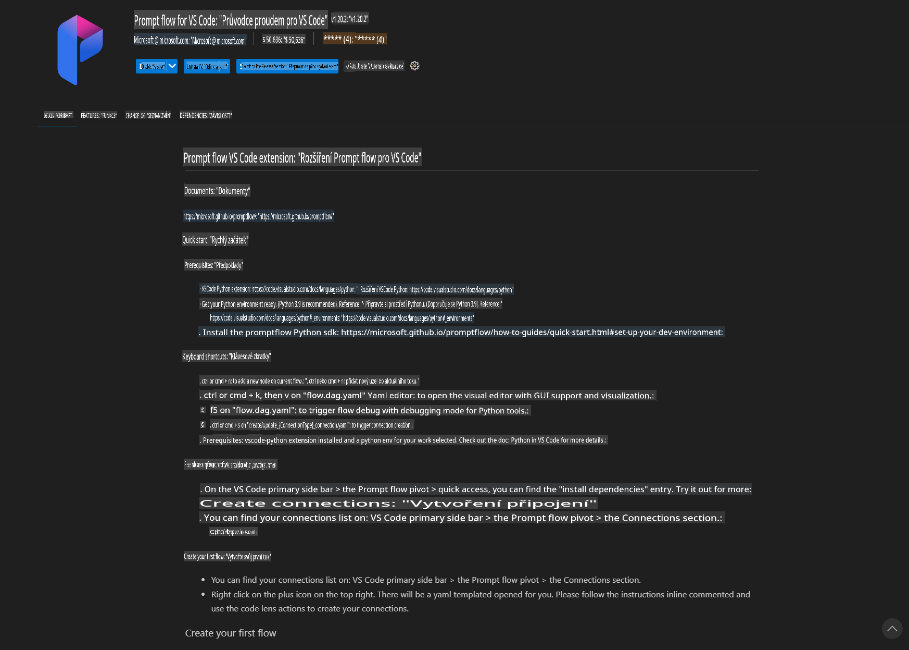
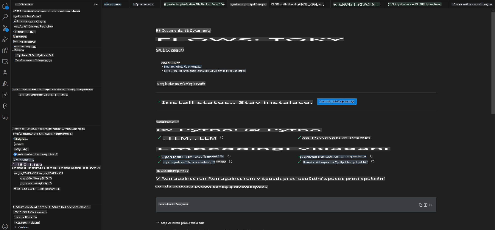
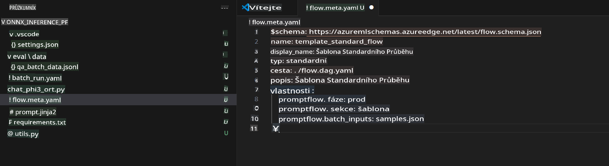
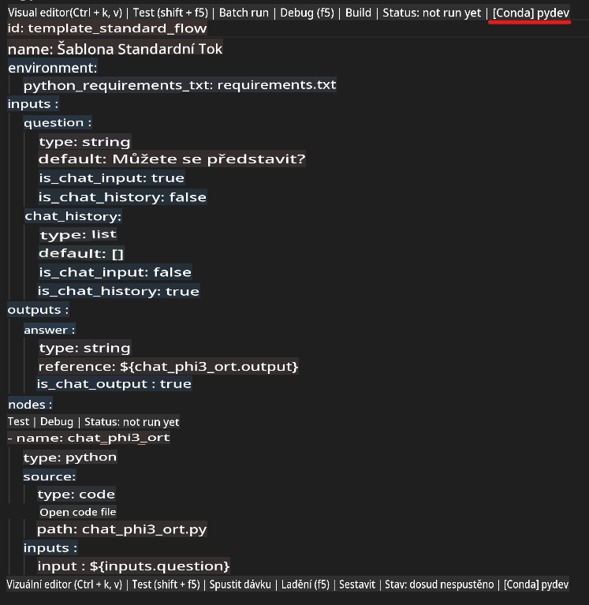
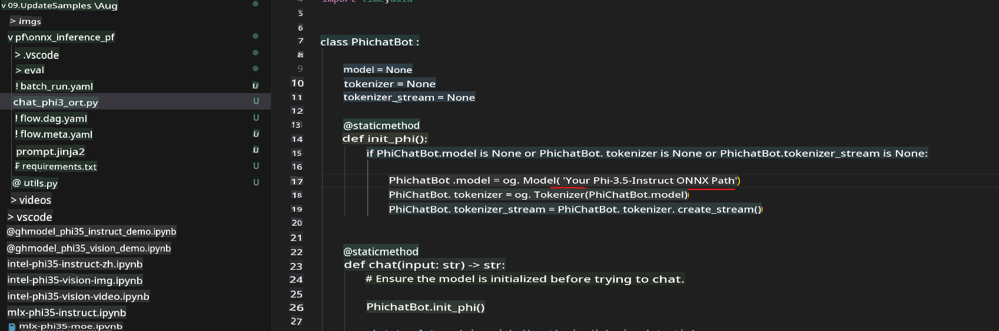
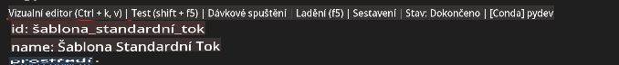
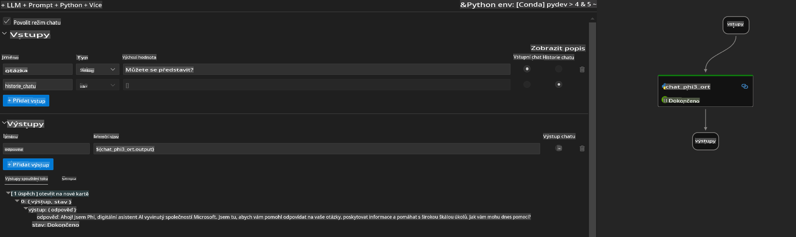
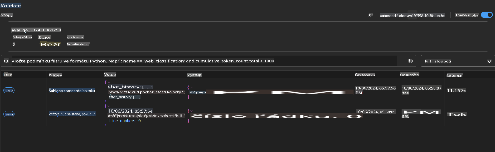

# Použití Windows GPU k vytvoření Prompt flow řešení s Phi-3.5-Instruct ONNX

Tento dokument je příkladem, jak používat PromptFlow s ONNX (Open Neural Network Exchange) pro vývoj AI aplikací založených na modelech Phi-3.

PromptFlow je sada vývojářských nástrojů navržených tak, aby zjednodušila celý vývojový cyklus AI aplikací založených na velkých jazykových modelech (LLM), od nápadů a prototypování až po testování a vyhodnocení.

Integrací PromptFlow s ONNX mohou vývojáři:

- Optimalizovat výkon modelu: Využít ONNX pro efektivní inferenci a nasazení modelů.
- Zjednodušit vývoj: Používat PromptFlow pro správu pracovního postupu a automatizaci opakujících se úkolů.
- Zlepšit spolupráci: Umožnit lepší spolupráci mezi členy týmu díky sjednocenému vývojovému prostředí.

**Prompt flow** je sada vývojářských nástrojů navržená tak, aby zjednodušila celý vývojový cyklus AI aplikací založených na velkých jazykových modelech (LLM), od nápadů, prototypování, testování, vyhodnocení až po nasazení do produkce a monitorování. Usnadňuje práci s návrhem promptů a umožňuje vám vytvářet LLM aplikace s produkční kvalitou.

Prompt flow se dokáže propojit s OpenAI, Azure OpenAI Service a přizpůsobitelnými modely (Huggingface, lokální LLM/SLM). Naším cílem je nasadit kvantizovaný ONNX model Phi-3.5 do lokálních aplikací. Prompt flow nám pomůže lépe plánovat naše podnikání a dokončit lokální řešení založené na Phi-3.5. V tomto příkladu zkombinujeme knihovnu ONNX Runtime GenAI a vytvoříme Prompt flow řešení založené na Windows GPU.

## **Instalace**

### **ONNX Runtime GenAI pro Windows GPU**

Přečtěte si tento návod pro nastavení ONNX Runtime GenAI pro Windows GPU [klikněte zde](./ORTWindowGPUGuideline.md)

### **Nastavení Prompt flow ve VSCode**

1. Nainstalujte rozšíření Prompt flow pro VS Code



2. Po instalaci rozšíření Prompt flow pro VS Code klikněte na rozšíření a vyberte **Installation dependencies**. Postupujte podle tohoto návodu a nainstalujte Prompt flow SDK do svého prostředí.



3. Stáhněte si [Ukázkový kód](../../../../../../code/09.UpdateSamples/Aug/pf/onnx_inference_pf) a otevřete tento příklad ve VS Code.



4. Otevřete **flow.dag.yaml** a vyberte své Python prostředí.



   Otevřete **chat_phi3_ort.py** a změňte umístění vašeho Phi-3.5-instruct ONNX modelu.



5. Spusťte svůj Prompt flow pro testování.

Otevřete **flow.dag.yaml** a klikněte na vizuální editor.



Po kliknutí na něj spusťte test.



1. Můžete spustit dávku v terminálu a zkontrolovat více výsledků.

```bash

pf run create --file batch_run.yaml --stream --name 'Your eval qa name'    

```

Výsledky si můžete prohlédnout ve svém výchozím prohlížeči.



**Upozornění**:  
Tento dokument byl přeložen pomocí strojových AI překladových služeb. Přestože usilujeme o přesnost, mějte prosím na paměti, že automatizované překlady mohou obsahovat chyby nebo nepřesnosti. Původní dokument v jeho rodném jazyce by měl být považován za závazný zdroj. Pro důležité informace se doporučuje profesionální lidský překlad. Nezodpovídáme za jakékoli nedorozumění nebo mylné výklady vyplývající z použití tohoto překladu.