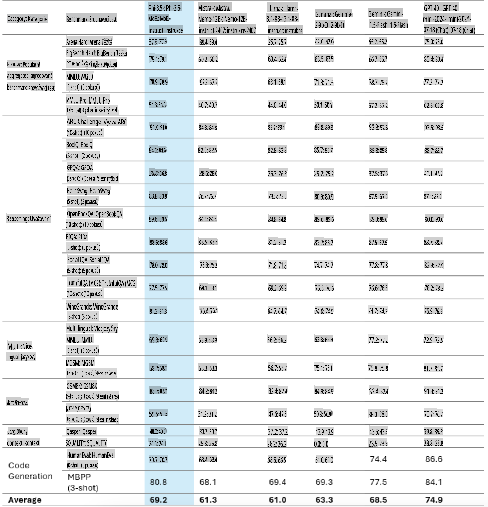
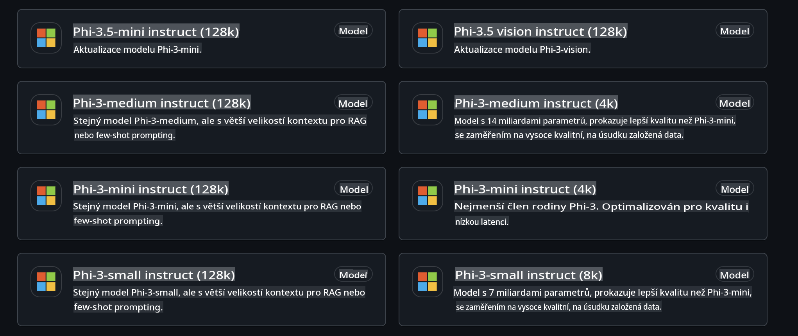
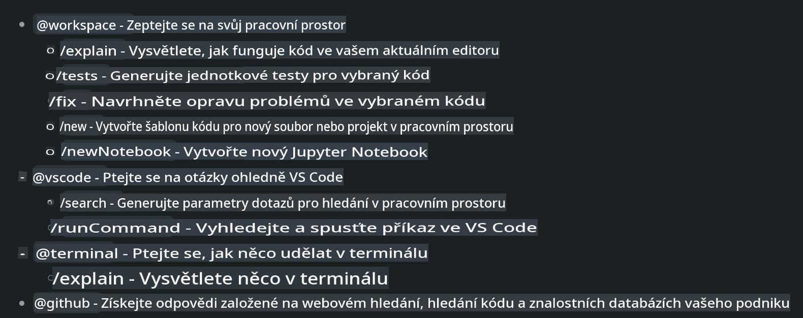
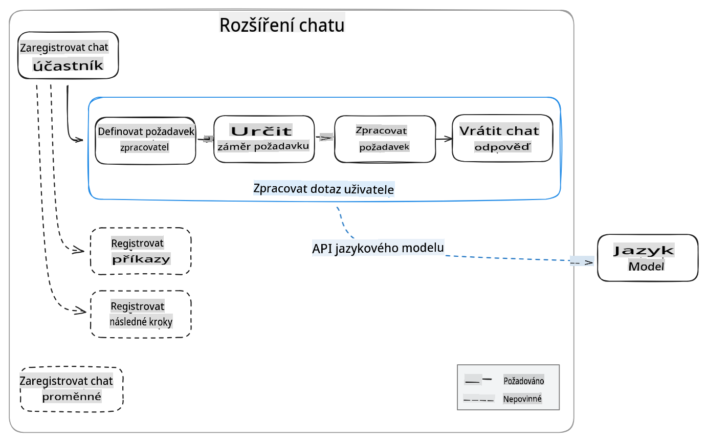
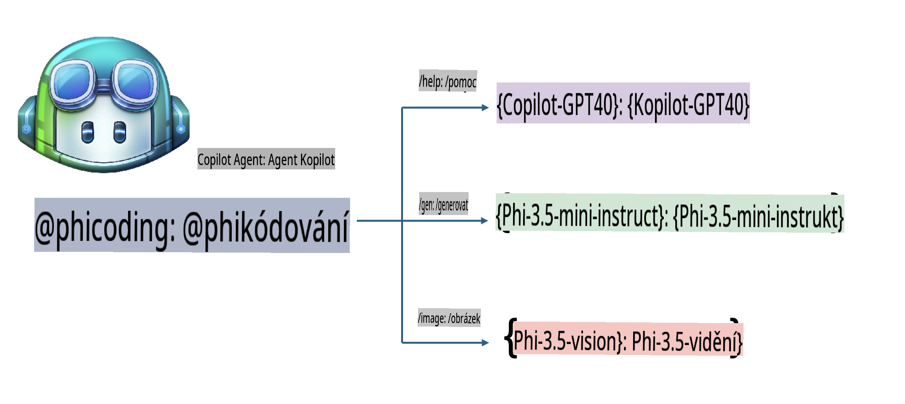
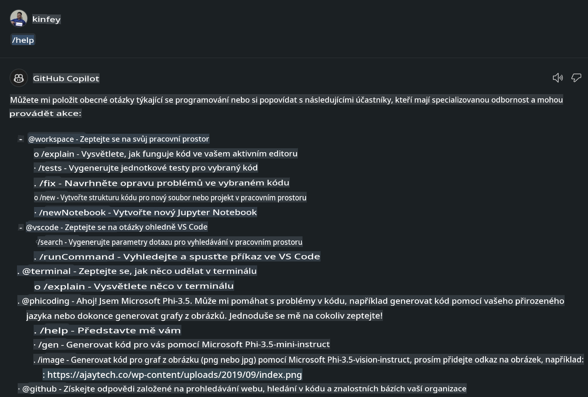
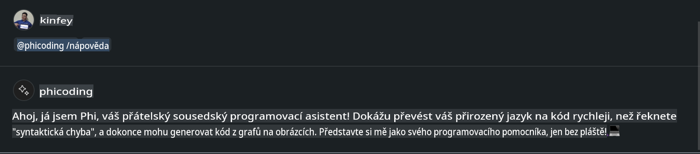
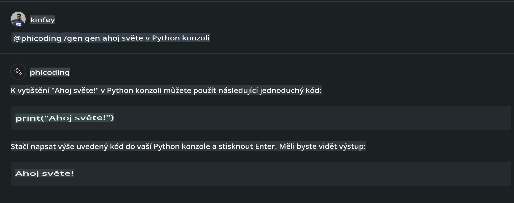
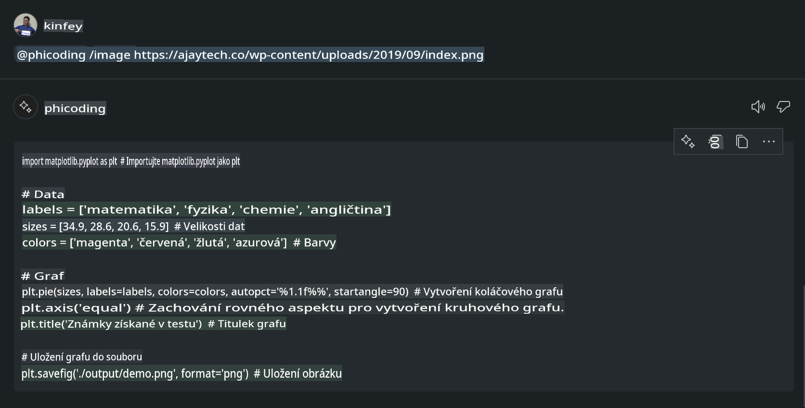

# **Vytvořte si vlastního Visual Studio Code Chat Copilot Agenta s Phi-3.5 od GitHub Models**

Používáte Visual Studio Code Copilot? Zejména v chatu můžete využít různé agenty k vylepšení schopnosti vytvářet, psát a spravovat projekty ve Visual Studio Code. Visual Studio Code poskytuje API, které umožňuje firmám a jednotlivcům vytvářet různé agenty podle jejich potřeb a rozšiřovat jejich schopnosti v různých specializovaných oblastech. V tomto článku se zaměříme na **Phi-3.5-mini-instruct (128k)** a **Phi-3.5-vision-instruct (128k)** od GitHub Models pro vytvoření vlastního agenta pro Visual Studio Code.

## **O Phi-3.5 na GitHub Models**

Víme, že Phi-3/3.5-mini-instruct v rodině Phi-3/3.5 má silné schopnosti porozumění kódu a jeho generování a má výhodu oproti Gemma-2-9b a Mistral-Nemo-12B-instruct-2407.



Nejnovější GitHub Models již poskytují přístup k modelům Phi-3.5-mini-instruct (128k) a Phi-3.5-vision-instruct (128k). Vývojáři k nim mohou přistupovat prostřednictvím OpenAI SDK, Azure AI Inference SDK a REST API.



***Poznámka:*** Doporučuje se použít Azure AI Inference SDK, protože umožňuje lepší přepínání s Azure Model Catalog v produkčním prostředí.

Níže jsou uvedeny výsledky **Phi-3.5-mini-instruct (128k)** a **Phi-3.5-vision-instruct (128k)** ve scénáři generování kódu po propojení s GitHub Models, což také připravuje půdu pro následující příklady.

**Demo: GitHub Models Phi-3.5-mini-instruct (128k) generuje kód na základě výzvy** ([klikněte na tento odkaz](../../../../../../code/09.UpdateSamples/Aug/ghmodel_phi35_instruct_demo.ipynb))

**Demo: GitHub Models Phi-3.5-vision-instruct (128k) generuje kód z obrázku** ([klikněte na tento odkaz](../../../../../../code/09.UpdateSamples/Aug/ghmodel_phi35_vision_demo.ipynb))


## **O GitHub Copilot Chat Agentovi**

GitHub Copilot Chat Agent dokáže dokončovat různé úkoly v různých projektových scénářích na základě kódu. Systém má čtyři agenty: workspace, github, terminal, vscode.



Přidáním názvu agenta s ‘@’ můžete rychle dokončit odpovídající práci. Pro podniky, pokud přidáte vlastní obsah související s obchodem, jako jsou požadavky, psaní kódu, testovací specifikace a vydávání, můžete mít výkonnější privátní podnikové funkce založené na GitHub Copilot.

Visual Studio Code Chat Agent nyní oficiálně vydal své API, což umožňuje podnikům nebo podnikovým vývojářům vyvíjet agenty na základě různých softwarových obchodních ekosystémů. Na základě vývojové metody rozšíření Visual Studio Code můžete snadno přistupovat k rozhraní API Visual Studio Code Chat Agent. Můžeme vyvíjet podle tohoto procesu.



Scénář vývoje může podporovat přístup k API modelů třetích stran (jako jsou GitHub Models, Azure Model Catalog a vlastní služby založené na open source modelech) a také použití modelů gpt-35-turbo, gpt-4 a gpt-4o poskytovaných GitHub Copilot.

## **Přidejte agenta @phicoding na základě Phi-3.5**

Snažíme se integrovat programovací schopnosti Phi-3.5 k dokončení psaní kódu, generování kódu z obrázků a dalších úkolů. Vytvoříme agenta postaveného kolem Phi-3.5 - @PHI. Níže jsou uvedeny některé funkce:

1. Generujte úvodní text pomocí GPT-4o poskytovaného GitHub Copilot prostřednictvím příkazu **@phicoding /help**.

2. Generujte kód pro různé programovací jazyky pomocí **Phi-3.5-mini-instruct (128k)** prostřednictvím příkazu **@phicoding /gen**.

3. Generujte kód na základě **Phi-3.5-vision-instruct (128k)** a dokončujte obrázky prostřednictvím příkazu **@phicoding /image**.



## **Související kroky**

1. Nainstalujte podporu pro vývoj rozšíření Visual Studio Code pomocí npm.

```bash

npm install --global yo generator-code 

```

2. Vytvořte plugin pro rozšíření Visual Studio Code (použijte vývojový režim TypeScript, název: phiext).

```bash

yo code 

```

3. Otevřete vytvořený projekt a upravte package.json. Zde jsou příslušné pokyny a konfigurace, včetně konfigurace GitHub Models. Ujistěte se, že jste zde přidali svůj token GitHub Models.

```json

{
  "name": "phiext",
  "displayName": "phiext",
  "description": "",
  "version": "0.0.1",
  "engines": {
    "vscode": "^1.93.0"
  },
  "categories": [
    "AI",
    "Chat"
  ],
  "activationEvents": [],
  "enabledApiProposals": [
      "chatVariableResolver"
  ],
  "main": "./dist/extension.js",
  "contributes": {
    "chatParticipants": [
        {
            "id": "chat.phicoding",
            "name": "phicoding",
            "description": "Hey! I am Microsoft Phi-3.5, She can help me with coding problems, such as generation code with your natural language, or even generation code about chart from images. Just ask me anything!",
            "isSticky": true,
            "commands": [
                {
                    "name": "help",
                    "description": "Introduce myself to you"
                },
                {
                    "name": "gen",
                    "description": "Generate code for you with Microsoft Phi-3.5-mini-instruct"
                },
                {
                    "name": "image",
                    "description": "Generate code for chart from image(png or jpg) with Microsoft Phi-3.5-vision-instruct, please add image url like this : https://ajaytech.co/wp-content/uploads/2019/09/index.png"
                }
            ]
        }
    ],
    "commands": [
        {
            "command": "phicoding.namesInEditor",
            "title": "Use Microsoft Phi 3.5 in Editor"
        }
    ],
    "configuration": {
      "type": "object",
      "title": "githubmodels",
      "properties": {
        "githubmodels.endpoint": {
          "type": "string",
          "default": "https://models.inference.ai.azure.com",
          "description": "Your GitHub Models Endpoint",
          "order": 0
        },
        "githubmodels.api_key": {
          "type": "string",
          "default": "Your GitHub Models Token",
          "description": "Your GitHub Models Token",
          "order": 1
        },
        "githubmodels.phi35instruct": {
          "type": "string",
          "default": "Phi-3.5-mini-instruct",
          "description": "Your Phi-35-Instruct Model",
          "order": 2
        },
        "githubmodels.phi35vision": {
          "type": "string",
          "default": "Phi-3.5-vision-instruct",
          "description": "Your Phi-35-Vision Model",
          "order": 3
        }
      }
    }
  },
  "scripts": {
    "vscode:prepublish": "npm run package",
    "compile": "webpack",
    "watch": "webpack --watch",
    "package": "webpack --mode production --devtool hidden-source-map",
    "compile-tests": "tsc -p . --outDir out",
    "watch-tests": "tsc -p . -w --outDir out",
    "pretest": "npm run compile-tests && npm run compile && npm run lint",
    "lint": "eslint src",
    "test": "vscode-test"
  },
  "devDependencies": {
    "@types/vscode": "^1.93.0",
    "@types/mocha": "^10.0.7",
    "@types/node": "20.x",
    "@typescript-eslint/eslint-plugin": "^8.3.0",
    "@typescript-eslint/parser": "^8.3.0",
    "eslint": "^9.9.1",
    "typescript": "^5.5.4",
    "ts-loader": "^9.5.1",
    "webpack": "^5.94.0",
    "webpack-cli": "^5.1.4",
    "@vscode/test-cli": "^0.0.10",
    "@vscode/test-electron": "^2.4.1"
  },
  "dependencies": {
    "@types/node-fetch": "^2.6.11",
    "node-fetch": "^3.3.2",
    "@azure-rest/ai-inference": "latest",
    "@azure/core-auth": "latest",
    "@azure/core-sse": "latest"
  }
}


```

4. Upravte src/extension.ts.

```typescript

// The module 'vscode' contains the VS Code extensibility API
// Import the module and reference it with the alias vscode in your code below
import * as vscode from 'vscode';
import ModelClient from "@azure-rest/ai-inference";
import { AzureKeyCredential } from "@azure/core-auth";


interface IPhiChatResult extends vscode.ChatResult {
    metadata: {
        command: string;
    };
}


const MODEL_SELECTOR: vscode.LanguageModelChatSelector = { vendor: 'copilot', family: 'gpt-4o' };

function isValidImageUrl(url: string): boolean {
    const regex = /^(https?:\/\/.*\.(?:png|jpg))$/i;
    return regex.test(url);
}
  

// This method is called when your extension is activated
// Your extension is activated the very first time the command is executed
export function activate(context: vscode.ExtensionContext) {

    const codinghandler: vscode.ChatRequestHandler = async (request: vscode.ChatRequest, context: vscode.ChatContext, stream: vscode.ChatResponseStream, token: vscode.CancellationToken): Promise<IPhiChatResult> => {


        const config : any = vscode.workspace.getConfiguration('githubmodels');
        const endPoint: string = config.get('endpoint');
        const apiKey: string = config.get('api_key');
        const phi35instruct: string = config.get('phi35instruct');
        const phi35vision: string = config.get('phi35vision');
        
        if (request.command === 'help') {

            const content = "Welcome to Coding assistant with Microsoft Phi-3.5"; 
            stream.progress(content);


            try {
                const [model] = await vscode.lm.selectChatModels(MODEL_SELECTOR);
                if (model) {
                    const messages = [
                        vscode.LanguageModelChatMessage.User("Please help me express this content in a humorous way: I am a programming assistant who can help you convert natural language into code and generate code based on the charts in the images. output format like this : Hey I am Phi ......")
                    ];
                    const chatResponse = await model.sendRequest(messages, {}, token);
                    for await (const fragment of chatResponse.text) {
                        stream.markdown(fragment);
                    }
                }
            } catch(err) {
                console.log(err);
            }


            return { metadata: { command: 'help' } };

        }

        
        if (request.command === 'gen') {

            const content = "Welcome to use phi-3.5 to generate code";

            stream.progress(content);

            const client = new ModelClient(endPoint, new AzureKeyCredential(apiKey));

            const response = await client.path("/chat/completions").post({
              body: {
                messages: [
                  { role:"system", content: "You are a coding assistant.Help answer all code generation questions." },
                  { role:"user", content: request.prompt }
                ],
                model: phi35instruct,
                temperature: 0.4,
                max_tokens: 1000,
                top_p: 1.
              }
            });

            stream.markdown(response.body.choices[0].message.content);

            return { metadata: { command: 'gen' } };

        }


        
        if (request.command === 'image') {


            const content = "Welcome to use phi-3.5 to generate code from image(png or jpg),image url like this:https://ajaytech.co/wp-content/uploads/2019/09/index.png";

            stream.progress(content);

            if (!isValidImageUrl(request.prompt)) {
                stream.markdown('Please provide a valid image URL');
                return { metadata: { command: 'image' } };
            }
            else
            {

                const client = new ModelClient(endPoint, new AzureKeyCredential(apiKey));
    
                const response = await client.path("/chat/completions").post({
                    body: {
                      messages: [
                        { role: "system", content: "You are a helpful assistant that describes images in details." },
                        { role: "user", content: [
                            { type: "text", text: "Please generate code according to the chart in the picture according to the following requirements\n1. Keep all information in the chart, including data and text\n2. Do not generate additional information that is not included in the chart\n3. Please extract data from the picture, do not generate it from csv\n4. Please save the regenerated chart as a chart and save it to ./output/demo.png"},
                            { type: "image_url", image_url: {url: request.prompt}
                            }
                          ]
                        }
                      ],
                      model: phi35vision,
                      temperature: 0.4,
                      max_tokens: 2048,
                      top_p: 1.
                    }
                  });
    
                
                stream.markdown(response.body.choices[0].message.content);
    
                return { metadata: { command: 'image' } };
            }


        }


        return { metadata: { command: '' } };
    };


    const phi_ext = vscode.chat.createChatParticipant("chat.phicoding", codinghandler);

    phi_ext.iconPath = new vscode.ThemeIcon('sparkle');


    phi_ext.followupProvider = {
        provideFollowups(result: IPhiChatResult, context: vscode.ChatContext, token: vscode.CancellationToken) {
            return [{
                prompt: 'Let us coding with Phi-3.5 😋😋😋😋',
                label: vscode.l10n.t('Enjoy coding with Phi-3.5'),
                command: 'help'
            } satisfies vscode.ChatFollowup];
        }
    };

    context.subscriptions.push(phi_ext);
}

// This method is called when your extension is deactivated
export function deactivate() {}


```

6. Spuštění.

***/help***



***@phicoding /help***



***@phicoding /gen***



***@phicoding /image***



Můžete si stáhnout ukázkový kód: [klikněte zde](../../../../../../code/09.UpdateSamples/Aug/vscode).

## **Zdroje**

1. Zaregistrujte se na GitHub Models [https://gh.io/models](https://gh.io/models)

2. Naučte se vývoj rozšíření pro Visual Studio Code [https://code.visualstudio.com/api/get-started/your-first-extension](https://code.visualstudio.com/api/get-started/your-first-extension)

3. Zjistěte více o Visual Studio Code Copilot Chat API [https://code.visualstudio.com/api/extension-guides/chat](https://code.visualstudio.com/api/extension-guides/chat)

**Prohlášení:**  
Tento dokument byl přeložen pomocí strojových překladatelských služeb založených na umělé inteligenci. I když se snažíme o přesnost, mějte prosím na paměti, že automatické překlady mohou obsahovat chyby nebo nepřesnosti. Původní dokument v jeho rodném jazyce by měl být považován za závazný zdroj. Pro důležité informace se doporučuje profesionální překlad od člověka. Nezodpovídáme za žádná nedorozumění nebo nesprávné výklady vyplývající z použití tohoto překladu.