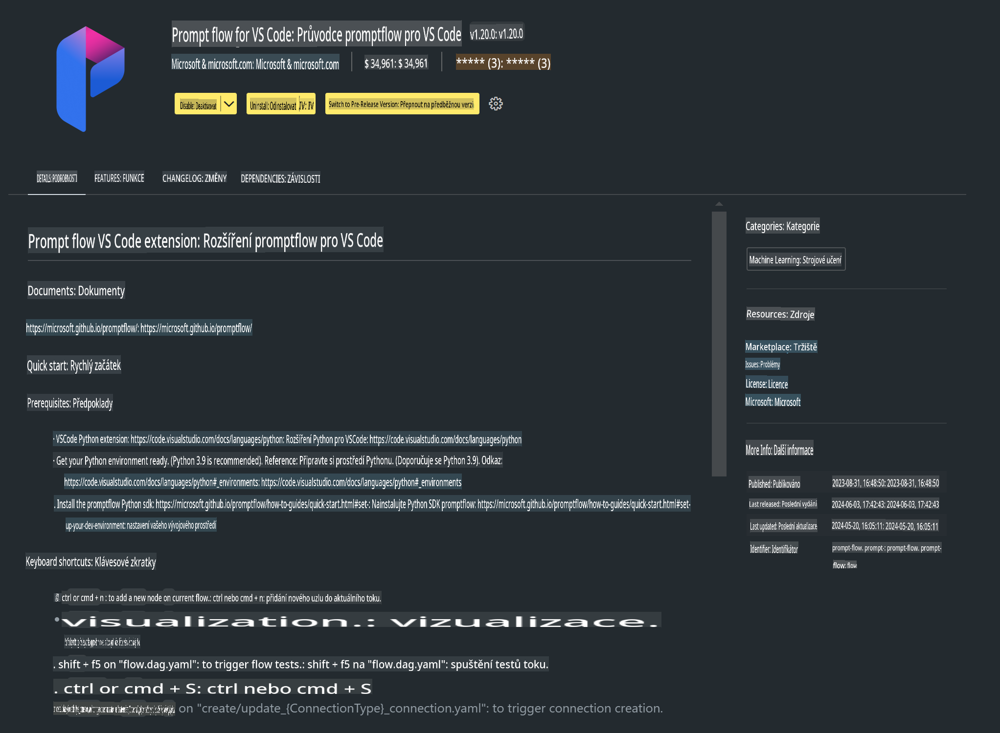

# **Lab 0 - Instalace**

Když vstoupíme do Labu, musíme nastavit příslušné prostředí:

### **1. Python 3.11+**

Doporučuje se použít miniforge pro nastavení vašeho Python prostředí.

Pro nastavení miniforge se podívejte na [https://github.com/conda-forge/miniforge](https://github.com/conda-forge/miniforge)

Po nastavení miniforge spusťte následující příkaz v PowerShellu:

```bash

conda create -n pyenv python==3.11.8 -y

conda activate pyenv

```

### **2. Instalace Prompt flow SDK**

V Labu 1 budeme používat Prompt flow, takže je potřeba nainstalovat Prompt flow SDK.

```bash

pip install promptflow --upgrade

```

Můžete ověřit Prompt flow SDK tímto příkazem:

```bash

pf --version

```

### **3. Instalace rozšíření Prompt flow pro Visual Studio Code**



### **4. Knihovna pro akceleraci Intel NPU**

Procesory nové generace od Intelu podporují NPU. Pokud chcete lokálně spouštět LLMs / SLMs pomocí NPU, můžete použít ***Intel NPU Acceleration Library***. Pro více informací si přečtěte [https://github.com/microsoft/PhiCookBook/blob/main/md/01.Introduction/03/AIPC_Inference.md](https://github.com/microsoft/PhiCookBook/blob/main/md/01.Introduction/03/AIPC_Inference.md).

Nainstalujte Intel NPU Acceleration Library v bash:

```bash

pip install intel-npu-acceleration-library

```

***Poznámka***: Tato knihovna podporuje transformery ve verzi ***4.40.2***, prosím ověřte verzi.

### **5. Ostatní Python knihovny**

Vytvořte soubor requirements.txt a přidejte tento obsah:

```txt

notebook
numpy 
scipy 
scikit-learn 
matplotlib 
pandas 
pillow 
graphviz

```

### **6. Instalace NVM**

Nainstalujte nvm v PowerShellu:

```bash

winget install -e --id CoreyButler.NVMforWindows

```

Nainstalujte nodejs 18.20:

```bash

nvm install 18.20.0

nvm use 18.20.0

```

### **7. Instalace podpory pro vývoj ve Visual Studio Code**

```bash

npm install --global yo generator-code

```

Gratulujeme! Úspěšně jste nastavili SDK. Nyní přejděte k praktickým krokům.

**Upozornění**:  
Tento dokument byl přeložen pomocí strojových AI překladatelských služeb. I když se snažíme o přesnost, vezměte prosím na vědomí, že automatizované překlady mohou obsahovat chyby nebo nepřesnosti. Původní dokument v jeho původním jazyce by měl být považován za autoritativní zdroj. Pro důležité informace se doporučuje profesionální lidský překlad. Neodpovídáme za žádné nedorozumění nebo nesprávné interpretace vyplývající z použití tohoto překladu.