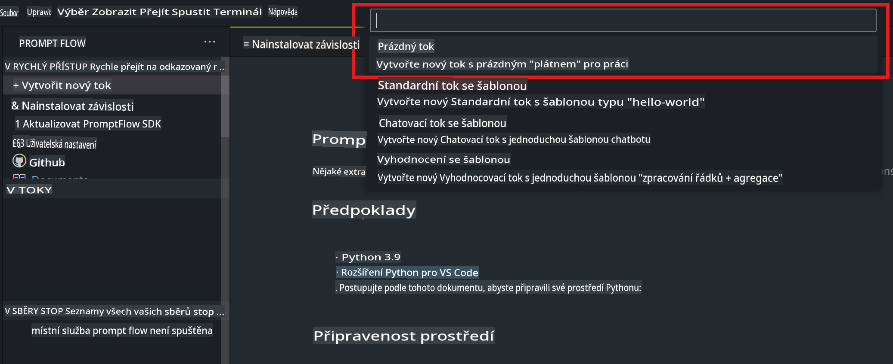
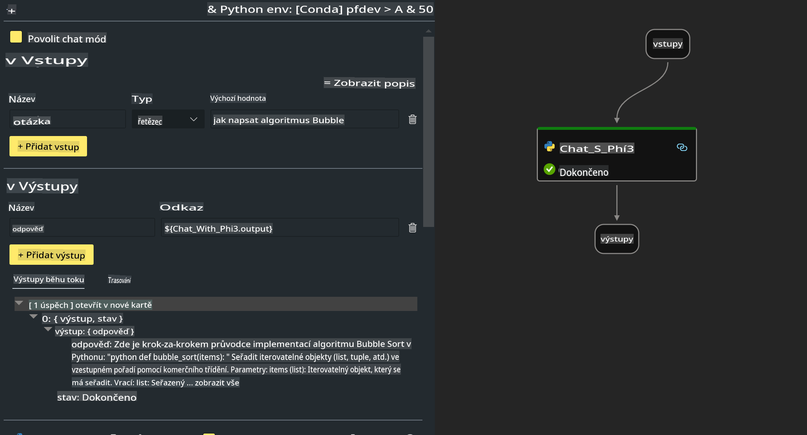

# **Lab 2 - Spuštění Prompt flow s Phi-3-mini v AIPC**

## **Co je Prompt flow**

Prompt flow je sada vývojářských nástrojů navržených k usnadnění kompletního vývojového cyklu AI aplikací založených na LLM, od nápadu, prototypování, testování, hodnocení až po nasazení do produkce a monitorování. Výrazně zjednodušuje práci s návrhem promptů a umožňuje vytvářet LLM aplikace v produkční kvalitě.

S Prompt flow můžete:

- Vytvářet workflowy, které propojují LLM, prompty, Python kód a další nástroje do spustitelného pracovního procesu.

- Snadno ladit a iterovat své workflowy, zejména interakce s LLM.

- Hodnotit své workflowy, vypočítávat metriky kvality a výkonu s většími datovými sadami.

- Integrovat testování a hodnocení do vašeho CI/CD systému pro zajištění kvality workflowu.

- Nasazovat workflowy na vybranou platformu nebo je snadno integrovat do kódu vaší aplikace.

- (Volitelné, ale vysoce doporučené) Spolupracovat s týmem pomocí cloudové verze Prompt flow v Azure AI.

## **Co je AIPC**

AI PC obsahuje CPU, GPU a NPU, přičemž každá z těchto komponent má specifické schopnosti pro akceleraci AI. NPU, neboli neuronová procesorová jednotka, je specializovaný akcelerátor, který zpracovává úlohy umělé inteligence (AI) a strojového učení (ML) přímo na vašem PC, místo aby posílal data ke zpracování do cloudu. GPU a CPU mohou také zpracovávat tyto úlohy, ale NPU je obzvláště vhodné pro výpočty AI s nízkou spotřebou energie. AI PC představuje zásadní změnu v tom, jak naše počítače fungují. Nejde o řešení problému, který předtím neexistoval, ale spíše o výrazné zlepšení každodenního používání PC.

Jak to funguje? Ve srovnání s generativní AI a masivními velkými jazykovými modely (LLM) trénovanými na obrovském množství veřejných dat je AI, která bude fungovat na vašem PC, dostupnější na téměř všech úrovních. Tento koncept je snadněji pochopitelný a díky tomu, že je trénován na vašich datech, aniž by bylo nutné přistupovat ke cloudu, jsou jeho výhody okamžitě přitažlivější pro širší okruh uživatelů.

V krátkodobém horizontu zahrnuje svět AI PC osobní asistenty a menší AI modely běžící přímo na vašem PC, které využívají vaše data k tomu, aby nabídly osobní, soukromé a bezpečnější AI vylepšení pro věci, které děláte každý den – zaznamenávání poznámek z meetingů, organizování fantasy fotbalové ligy, automatizaci úprav fotografií a videí nebo plánování dokonalého itineráře pro rodinné setkání na základě časů příjezdů a odjezdů všech zúčastněných.

## **Vytváření generativních kódových workflowů na AIPC**

***Note***: Pokud jste nedokončili instalaci prostředí, navštivte [Lab 0 - Installations](./01.Installations.md).

1. Otevřete rozšíření Prompt flow ve Visual Studio Code a vytvořte prázdný projekt workflowu.



2. Přidejte vstupní a výstupní parametry a přidejte Python kód jako nový workflow.



Můžete se řídit touto strukturou (flow.dag.yaml) pro sestavení svého workflowu:

```yaml

inputs:
  question:
    type: string
    default: how to write Bubble Algorithm
outputs:
  answer:
    type: string
    reference: ${Chat_With_Phi3.output}
nodes:
- name: Chat_With_Phi3
  type: python
  source:
    type: code
    path: Chat_With_Phi3.py
  inputs:
    question: ${inputs.question}


```

3. Přidejte kód do souboru ***Chat_With_Phi3.py***.

```python


from promptflow.core import tool

# import torch
from transformers import AutoTokenizer, pipeline,TextStreamer
import intel_npu_acceleration_library as npu_lib

import warnings

import asyncio
import platform

class Phi3CodeAgent:
    
    model = None
    tokenizer = None
    text_streamer = None
    
    model_id = "microsoft/Phi-3-mini-4k-instruct"

    @staticmethod
    def init_phi3():
        
        if Phi3CodeAgent.model is None or Phi3CodeAgent.tokenizer is None or Phi3CodeAgent.text_streamer is None:
            Phi3CodeAgent.model = npu_lib.NPUModelForCausalLM.from_pretrained(
                                    Phi3CodeAgent.model_id,
                                    torch_dtype="auto",
                                    dtype=npu_lib.int4,
                                    trust_remote_code=True
                                )
            Phi3CodeAgent.tokenizer = AutoTokenizer.from_pretrained(Phi3CodeAgent.model_id)
            Phi3CodeAgent.text_streamer = TextStreamer(Phi3CodeAgent.tokenizer, skip_prompt=True)

    

    @staticmethod
    def chat_with_phi3(prompt):
        
        Phi3CodeAgent.init_phi3()

        messages = "<|system|>You are a AI Python coding assistant. Please help me to generate code in Python.The answer only genertated Python code, but any comments and instructions do not need to be generated<|end|><|user|>" + prompt +"<|end|><|assistant|>"


        generation_args = {
            "max_new_tokens": 1024,
            "return_full_text": False,
            "temperature": 0.3,
            "do_sample": False,
            "streamer": Phi3CodeAgent.text_streamer,
        }

        pipe = pipeline(
            "text-generation",
            model=Phi3CodeAgent.model,
            tokenizer=Phi3CodeAgent.tokenizer,
            # **generation_args
        )

        result = ''

        with warnings.catch_warnings():
            warnings.simplefilter("ignore")
            response = pipe(messages, **generation_args)
            result =response[0]['generated_text']
            return result


@tool
def my_python_tool(question: str) -> str:
    if platform.system() == 'Windows':
        asyncio.set_event_loop_policy(asyncio.WindowsSelectorEventLoopPolicy())
    return Phi3CodeAgent.chat_with_phi3(question)


```

4. Otestujte workflow pomocí Debug nebo Run a ověřte, zda generovaný kód funguje správně.


5. Spusťte workflow jako vývojové API v terminálu.

```

pf flow serve --source ./ --port 8080 --host localhost   

```

Můžete jej otestovat v Postmanu / Thunder Client.

### **Poznámky**

1. První spuštění trvá dlouho. Doporučuje se stáhnout model phi-3 pomocí Hugging Face CLI.

2. S ohledem na omezený výpočetní výkon Intel NPU se doporučuje používat Phi-3-mini-4k-instruct.

3. Používáme akceleraci Intel NPU pro kvantizaci INT4 konverze, ale pokud službu znovu spustíte, musíte smazat složky cache a nc_workshop.

## **Zdroje**

1. Naučte se Promptflow [https://microsoft.github.io/promptflow/](https://microsoft.github.io/promptflow/)

2. Naučte se Intel NPU Acceleration [https://github.com/intel/intel-npu-acceleration-library](https://github.com/intel/intel-npu-acceleration-library)

3. Ukázkový kód ke stažení [Local NPU Agent Sample Code](../../../../../../../../../code/07.Lab/01/AIPC)

**Prohlášení**:  
Tento dokument byl přeložen pomocí strojových AI překladových služeb. Přestože usilujeme o přesnost, vezměte prosím na vědomí, že automatizované překlady mohou obsahovat chyby nebo nepřesnosti. Původní dokument v jeho původním jazyce by měl být považován za závazný zdroj. Pro důležité informace se doporučuje profesionální lidský překlad. Neodpovídáme za jakékoli nedorozumění nebo nesprávné výklady vyplývající z použití tohoto překladu.