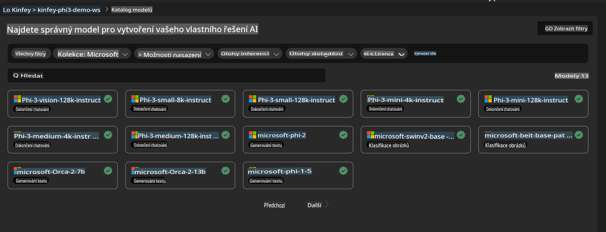
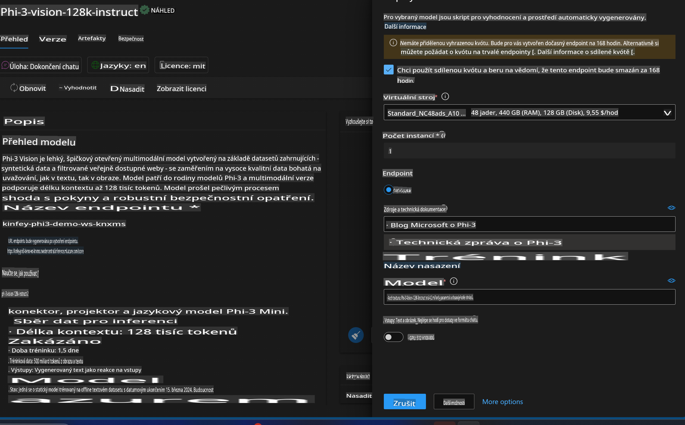
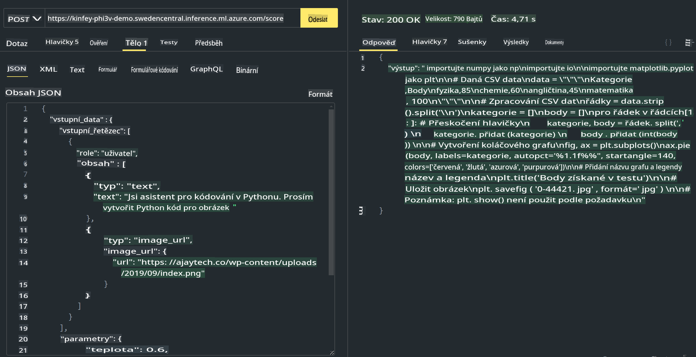

# **Lab 3 - Nasazení Phi-3-Vision na Azure Machine Learning Service**

Používáme NPU k dokončení produkčního nasazení lokálního kódu, a poté chceme prostřednictvím něj zavést schopnost implementovat PHI-3-VISION, aby bylo možné generovat kód z obrázků.

V tomto úvodu si rychle vytvoříme službu Model As Service Phi-3 Vision v Azure Machine Learning Service.

***Poznámka***: Phi-3 Vision vyžaduje výpočetní výkon, aby mohl rychleji generovat obsah. Potřebujeme cloudový výpočetní výkon, který nám s tím pomůže.

### **1. Vytvoření Azure Machine Learning Service**

Musíme vytvořit Azure Machine Learning Service v Azure Portal. Pokud chcete zjistit, jak na to, navštivte tento odkaz [https://learn.microsoft.com/azure/machine-learning/quickstart-create-resources?view=azureml-api-2](https://learn.microsoft.com/azure/machine-learning/quickstart-create-resources?view=azureml-api-2)

### **2. Výběr Phi-3 Vision v Azure Machine Learning Service**



### **3. Nasazení Phi-3-Vision v Azure**



### **4. Testování Endpointu v Postman**



***Poznámka***

1. Přenášené parametry musí zahrnovat Authorization, azureml-model-deployment a Content-Type. Pro získání těchto informací je nutné zkontrolovat údaje o nasazení.

2. Při přenosu parametrů potřebuje Phi-3-Vision odkaz na obrázek. Postupujte podle metody GPT-4-Vision pro přenos parametrů, například

```json

{
  "input_data":{
    "input_string":[
      {
        "role":"user",
        "content":[ 
          {
            "type": "text",
            "text": "You are a Python coding assistant.Please create Python code for image "
          },
          {
              "type": "image_url",
              "image_url": {
                "url": "https://ajaytech.co/wp-content/uploads/2019/09/index.png"
              }
          }
        ]
      }
    ],
    "parameters":{
          "temperature": 0.6,
          "top_p": 0.9,
          "do_sample": false,
          "max_new_tokens": 2048
    }
  }
}

```

3. Použijte metodu Post k volání **/score**

**Gratulujeme**! Dokončili jste rychlé nasazení PHI-3-VISION a vyzkoušeli jste, jak generovat kód z obrázků. Dále můžeme kombinovat aplikace s NPU a cloudem.

**Prohlášení:**  
Tento dokument byl přeložen pomocí strojových překladatelských služeb AI. Přestože se snažíme o přesnost, mějte prosím na paměti, že automatické překlady mohou obsahovat chyby nebo nepřesnosti. Původní dokument v jeho původním jazyce by měl být považován za závazný zdroj. Pro důležité informace se doporučuje profesionální lidský překlad. Nenese odpovědnost za žádné nedorozumění nebo nesprávné interpretace vyplývající z použití tohoto překladu.