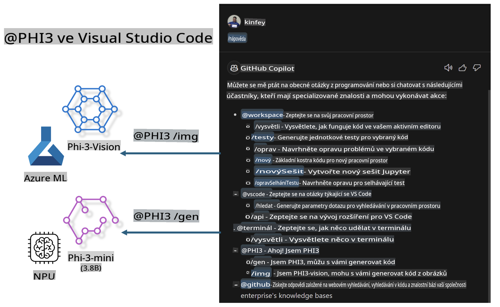

# **Vytvořte si vlastní Visual Studio Code GitHub Copilot Chat s Microsoft Phi-3 Family**

Použili jste pracovní agenta v GitHub Copilot Chat? Chcete si vytvořit vlastního týmového kódového agenta? Tento praktický workshop má za cíl spojit open source model pro vytvoření podnikové úrovně kódového obchodního agenta.

## **Základ**

### **Proč zvolit Microsoft Phi-3**

Phi-3 je rodina modelů, která zahrnuje phi-3-mini, phi-3-small a phi-3-medium, založené na různých tréninkových parametrech pro generování textu, dokončování dialogů a generování kódu. Existuje také phi-3-vision založený na Vision. Je vhodný pro podniky nebo různé týmy, které chtějí vytvořit offline generativní AI řešení.

Doporučeno přečíst tento odkaz [https://github.com/microsoft/PhiCookBook/blob/main/md/01.Introduction/01/01.PhiFamily.md](https://github.com/microsoft/PhiCookBook/blob/main/md/01.Introduction/01/01.PhiFamily.md)

### **Microsoft GitHub Copilot Chat**

Rozšíření GitHub Copilot Chat poskytuje rozhraní pro chat, které vám umožňuje interagovat s GitHub Copilot a dostávat odpovědi na otázky související s kódováním přímo ve VS Code, aniž byste museli procházet dokumentaci nebo hledat na online fórech.

Copilot Chat může využívat zvýraznění syntaxe, odsazení a další formátovací prvky pro větší přehlednost vygenerované odpovědi. V závislosti na typu otázky od uživatele může výsledek obsahovat odkazy na kontext, který Copilot použil k vytvoření odpovědi, jako jsou zdrojové soubory nebo dokumentace, nebo tlačítka pro přístup k funkcím VS Code.

- Copilot Chat se integruje do vašeho vývojářského toku a poskytuje pomoc tam, kde ji potřebujete:

- Zahajte inline konverzaci přímo z editoru nebo terminálu, když potřebujete pomoc při kódování.

- Použijte Chat view, abyste měli po ruce AI asistenta, který vám pomůže kdykoliv.

- Spusťte Quick Chat, abyste mohli položit rychlou otázku a vrátit se zpět k práci.

GitHub Copilot Chat můžete využít v různých scénářích, jako například:

- Odpovídání na otázky týkající se nejlepšího řešení problému

- Vysvětlení cizího kódu a navrhování vylepšení

- Navrhování oprav kódu

- Generování unit testů

- Generování dokumentace ke kódu

Doporučeno přečíst tento odkaz [https://code.visualstudio.com/docs/copilot/copilot-chat](https://code.visualstudio.com/docs/copilot/copilot-chat?WT.mc_id=aiml-137032-kinfeylo)

### **Microsoft GitHub Copilot Chat @workspace**

Použití **@workspace** v Copilot Chat vám umožňuje klást otázky ohledně celé vaší kódové základny. Na základě otázky Copilot inteligentně získá relevantní soubory a symboly, které pak odkazuje ve své odpovědi jako odkazy a příklady kódu.

Pro zodpovězení vaší otázky prohledává **@workspace** stejné zdroje, které by vývojář použil při procházení kódové základny ve VS Code:

- Všechny soubory v pracovním prostoru, kromě souborů ignorovaných pomocí souboru .gitignore

- Strukturu adresářů s vnořenými složkami a názvy souborů

- Index vyhledávání kódu GitHub, pokud je pracovní prostor úložištěm GitHub a je indexován vyhledáváním kódu

- Symboly a definice v pracovním prostoru

- Aktuálně vybraný text nebo viditelný text v aktivním editoru

Poznámka: .gitignore je ignorován, pokud máte otevřený soubor nebo máte vybraný text v ignorovaném souboru.

Doporučeno přečíst tento odkaz [[https://code.visualstudio.com/docs/copilot/copilot-chat](https://code.visualstudio.com/docs/copilot/workspace-context?WT.mc_id=aiml-137032-kinfeylo)]

## **Více o tomto workshopu**

GitHub Copilot výrazně zlepšil efektivitu programování podniků a každý podnik doufá, že si přizpůsobí relevantní funkce GitHub Copilot. Mnoho podniků přizpůsobilo rozšíření podobná GitHub Copilot na základě svých obchodních scénářů a open source modelů. Pro podniky jsou přizpůsobená rozšíření snazší na kontrolu, ale to také ovlivňuje uživatelský zážitek. Koneckonců, GitHub Copilot má silnější funkce při řešení obecných scénářů a odbornosti. Pokud by bylo možné zachovat konzistentní zážitek, bylo by lepší přizpůsobit si vlastní rozšíření. GitHub Copilot Chat poskytuje relevantní API pro podniky k rozšíření v rámci zážitku z chatu. Udržení konzistentního zážitku a přitom mít přizpůsobené funkce je lepší uživatelský zážitek.

Tento workshop hlavně využívá model Phi-3 v kombinaci s lokálním NPU a hybridem Azure k vytvoření vlastního Agenta v GitHub Copilot Chat ***@PHI3***, který pomáhá podnikovým vývojářům dokončit generování kódu ***(@PHI3 /gen)*** a generovat kód na základě obrázků ***(@PHI3 /img)***.

### ***Poznámka:*** 

Tento workshop je aktuálně implementován na AIPC procesorech Intel a Apple Silicon. Budeme pokračovat v aktualizaci verze Qualcomm NPU.

## **Workshop**

| Název | Popis | AIPC | Apple |
| ------------ | ----------- | -------- |-------- |
| Lab0 - Instalace(✅) | Konfigurace a instalace souvisejících prostředí a nástrojů | [Go](./HOL/AIPC/01.Installations.md) |[Go](./HOL/Apple/01.Installations.md) |
| Lab1 - Spuštění Prompt flow s Phi-3-mini (✅) | V kombinaci s AIPC / Apple Silicon, použití lokálního NPU pro vytvoření generování kódu pomocí Phi-3-mini | [Go](./HOL/AIPC/02.PromptflowWithNPU.md) |  [Go](./HOL/Apple/02.PromptflowWithMLX.md) |
| Lab2 - Nasazení Phi-3-vision na Azure Machine Learning Service(✅) | Generování kódu nasazením Model Catalog Azure Machine Learning Service - Phi-3-vision image | [Go](./HOL/AIPC/03.DeployPhi3VisionOnAzure.md) |[Go](./HOL/Apple/03.DeployPhi3VisionOnAzure.md) |
| Lab3 - Vytvoření @phi-3 agenta v GitHub Copilot Chat(✅)  | Vytvoření vlastního Phi-3 agenta v GitHub Copilot Chat pro dokončení generování kódu, generování kódu z obrázků, RAG, atd. | [Go](./HOL/AIPC/04.CreatePhi3AgentInVSCode.md) | [Go](./HOL/Apple/04.CreatePhi3AgentInVSCode.md) |
| Ukázkový kód (✅)  | Stažení ukázkového kódu | [Go](../../../../../../../code/07.Lab/01/AIPC) | [Go](../../../../../../../code/07.Lab/01/Apple) |

## **Zdroje**

1. Phi-3 Cookbook [https://github.com/microsoft/Phi-3CookBook](https://github.com/microsoft/Phi-3CookBook)

2. Více o GitHub Copilot [https://learn.microsoft.com/training/paths/copilot/](https://learn.microsoft.com/training/paths/copilot/?WT.mc_id=aiml-137032-kinfeylo)

3. Více o GitHub Copilot Chat [https://learn.microsoft.com/training/paths/accelerate-app-development-using-github-copilot/](https://learn.microsoft.com/training/paths/accelerate-app-development-using-github-copilot/?WT.mc_id=aiml-137032-kinfeylo)

4. Více o GitHub Copilot Chat API [https://code.visualstudio.com/api/extension-guides/chat](https://code.visualstudio.com/api/extension-guides/chat?WT.mc_id=aiml-137032-kinfeylo)

5. Více o Azure AI Foundry [https://learn.microsoft.com/training/paths/create-custom-copilots-ai-studio/](https://learn.microsoft.com/training/paths/create-custom-copilots-ai-studio/?WT.mc_id=aiml-137032-kinfeylo)

6. Více o Model Catalog Azure AI Foundry [https://learn.microsoft.com/azure/ai-studio/how-to/model-catalog-overview](https://learn.microsoft.com/azure/ai-studio/how-to/model-catalog-overview)

**Prohlášení:**  
Tento dokument byl přeložen pomocí strojových AI překladatelských služeb. Ačkoli se snažíme o přesnost, mějte prosím na paměti, že automatické překlady mohou obsahovat chyby nebo nepřesnosti. Původní dokument v jeho původním jazyce by měl být považován za závazný zdroj. Pro důležité informace doporučujeme profesionální lidský překlad. Neneseme odpovědnost za jakékoli nedorozumění nebo nesprávné interpretace vyplývající z použití tohoto překladu.