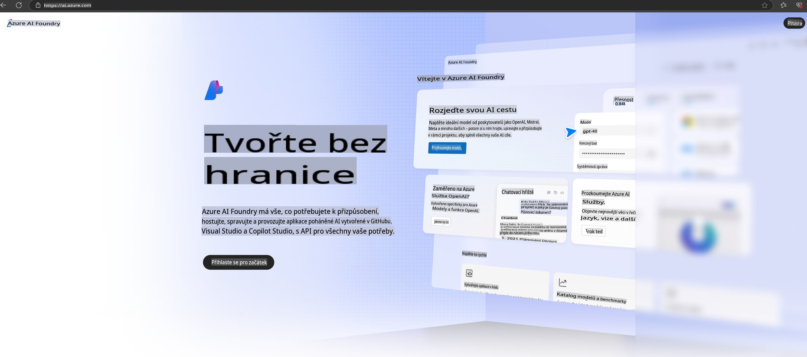

# **Použití Phi-3 v Azure AI Foundry**

S rozvojem generativní AI se snažíme využít sjednocenou platformu pro správu různých LLM a SLM, integraci podnikových dat, operace jemného doladění/RAG a hodnocení různých podnikových procesů po integraci LLM a SLM. To vše s cílem lépe implementovat chytré aplikace generativní AI. [Azure AI Foundry](https://ai.azure.com) je podniková platforma pro aplikace generativní AI.

S Azure AI Foundry můžete vyhodnocovat odpovědi velkých jazykových modelů (LLM) a orchestrace komponent aplikací pro výzvy pomocí prompt flow pro lepší výkon. Platforma usnadňuje škálování od konceptů až po plnohodnotné produkční nasazení. Neustálé monitorování a zdokonalování podporuje dlouhodobý úspěch.

Model Phi-3 lze rychle nasadit na Azure AI Foundry pomocí jednoduchých kroků a následně využít Azure AI Foundry k provádění souvisejících aktivit, jako jsou Playground/Chat, jemné doladění, hodnocení a další.

## **1. Příprava**

Pokud již máte na svém zařízení nainstalovaný [Azure Developer CLI](https://learn.microsoft.com/azure/developer/azure-developer-cli/overview?WT.mc_id=aiml-138114-kinfeylo), použití této šablony je tak jednoduché, jako spuštění tohoto příkazu v novém adresáři.

## Ruční vytvoření

Vytvoření projektu a hubu v Microsoft Azure AI Foundry je skvělý způsob, jak organizovat a spravovat svou práci s AI. Zde je průvodce krok za krokem, jak začít:

### Vytvoření projektu v Azure AI Foundry

1. **Přejděte na Azure AI Foundry**: Přihlaste se do portálu Azure AI Foundry.
2. **Vytvořte projekt**:
   - Pokud jste již v projektu, vyberte "Azure AI Foundry" v levém horním rohu stránky pro návrat na domovskou stránku.
   - Zvolte "+ Vytvořit projekt".
   - Zadejte název projektu.
   - Pokud již máte hub, bude vybrán výchozí. Pokud máte přístup k více hubům, můžete vybrat jiný z rozbalovací nabídky. Pokud chcete vytvořit nový hub, zvolte "Vytvořit nový hub" a zadejte jeho název.
   - Zvolte "Vytvořit".

### Vytvoření hubu v Azure AI Foundry

1. **Přejděte na Azure AI Foundry**: Přihlaste se pomocí svého Azure účtu.
2. **Vytvořte hub**:
   - Zvolte Centrum správy z levého menu.
   - Vyberte "Všechny zdroje", poté šipku dolů vedle "+ Nový projekt" a zvolte "+ Nový hub".
   - V dialogovém okně "Vytvořit nový hub" zadejte název svého hubu (např. contoso-hub) a upravte ostatní pole podle potřeby.
   - Zvolte "Další", zkontrolujte informace a poté zvolte "Vytvořit".

Pro podrobnější pokyny můžete navštívit oficiální [dokumentaci Microsoftu](https://learn.microsoft.com/azure/ai-studio/how-to/create-projects).

Po úspěšném vytvoření můžete přistupovat ke studiu, které jste vytvořili, přes [ai.azure.com](https://ai.azure.com/).

Na jednom AI Foundry může být více projektů. Vytvořte projekt v AI Foundry jako přípravu.

Vytvoření Azure AI Foundry [QuickStarts](https://learn.microsoft.com/azure/ai-studio/quickstarts/get-started-code)

## **2. Nasazení modelu Phi v Azure AI Foundry**

Klikněte na možnost Prozkoumat v projektu, vstupte do katalogu modelů a vyberte Phi-3.

Vyberte Phi-3-mini-4k-instruct.

Klikněte na 'Nasadit' pro nasazení modelu Phi-3-mini-4k-instruct.

> [!NOTE]
>
> Při nasazení můžete vybrat výpočetní výkon.

## **3. Playground Chat Phi v Azure AI Foundry**

Přejděte na stránku nasazení, vyberte Playground a chatujte s Phi-3 v Azure AI Foundry.

## **4. Nasazení modelu z Azure AI Foundry**

Pro nasazení modelu z katalogu modelů Azure postupujte podle těchto kroků:

- Přihlaste se do Azure AI Foundry.
- Vyberte model, který chcete nasadit, z katalogu modelů Azure AI Foundry.
- Na stránce s podrobnostmi o modelu vyberte Nasadit a poté vyberte Serverless API s Azure AI Content Safety.
- Vyberte projekt, do kterého chcete model nasadit. Pro použití Serverless API musí váš pracovní prostor patřit do oblasti East US 2 nebo Sweden Central. Můžete přizpůsobit název nasazení.
- V průvodci nasazením vyberte Ceny a podmínky, abyste se seznámili s cenami a podmínkami použití.
- Zvolte Nasadit. Počkejte, až bude nasazení připraveno, a budete přesměrováni na stránku Nasazení.
- Vyberte Otevřít v playgroundu pro zahájení interakce s modelem.
- Můžete se vrátit na stránku Nasazení, vybrat nasazení a poznamenat si cílovou URL koncového bodu a tajný klíč, které můžete použít k volání nasazení a generování odpovědí.
- Podrobnosti o koncovém bodu, URL a přístupových klíčích můžete kdykoli najít přechodem na kartu Build a výběrem Nasazení v sekci Komponenty.

> [!NOTE]
> Upozorňujeme, že váš účet musí mít oprávnění role Azure AI Developer v Resource Group, aby bylo možné tyto kroky provést.

## **5. Použití Phi API v Azure AI Foundry**

Můžete přistoupit na https://{Název vašeho projektu}.region.inference.ml.azure.com/swagger.json přes Postman GET a v kombinaci s klíčem zjistit dostupná rozhraní.

Velmi snadno získáte parametry požadavku i parametry odpovědi.

**Upozornění**:  
Tento dokument byl přeložen pomocí strojových AI překladatelských služeb. Ačkoli se snažíme o přesnost, mějte prosím na paměti, že automatizované překlady mohou obsahovat chyby nebo nepřesnosti. Původní dokument v jeho původním jazyce by měl být považován za závazný zdroj. Pro kritické informace doporučujeme profesionální lidský překlad. Neodpovídáme za žádné nedorozumění nebo nesprávné interpretace vyplývající z použití tohoto překladu.