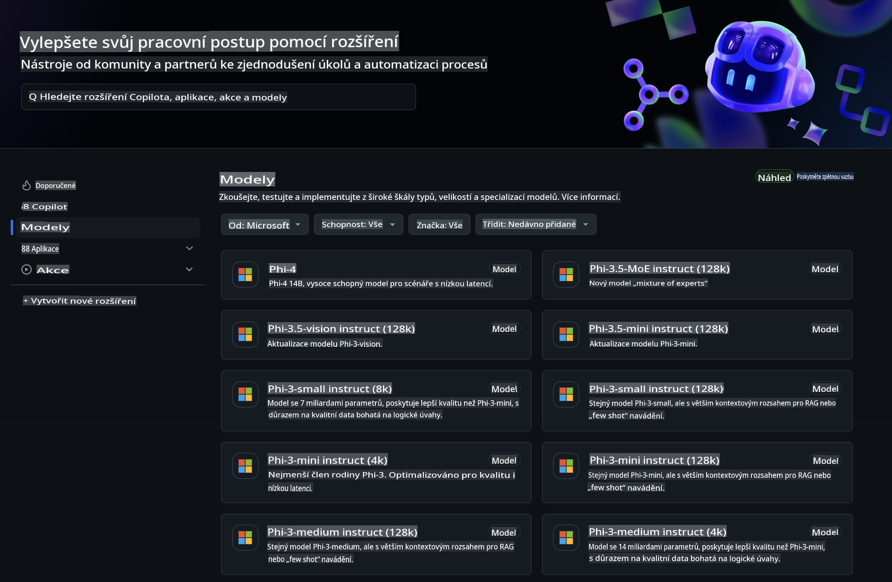
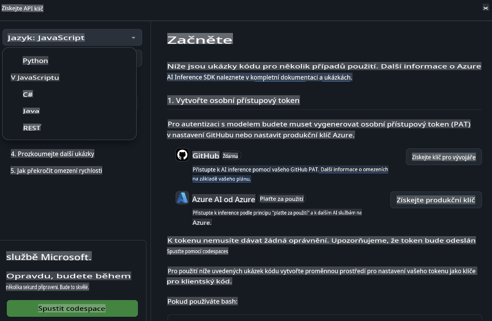
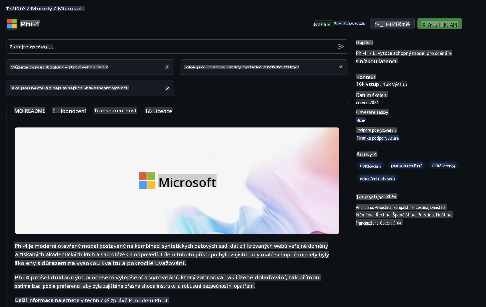

## GitHub Modely - Omezená Veřejná Beta

Vítejte na [GitHub Modelech](https://github.com/marketplace/models)! Máme vše připravené, abyste mohli objevovat AI modely hostované na Azure AI.



Pro více informací o modelech dostupných na GitHub Modelech navštivte [GitHub Model Marketplace](https://github.com/marketplace/models).

## Dostupné Modely

Každý model má vlastní playground a ukázkový kód.


### Phi-3 Modely v GitHub Model Catalog

[Phi-3-Medium-128k-Instruct](https://github.com/marketplace/models/azureml/Phi-3-medium-128k-instruct)

[Phi-3-medium-4k-instruct](https://github.com/marketplace/models/azureml/Phi-3-medium-4k-instruct)

[Phi-3-mini-128k-instruct](https://github.com/marketplace/models/azureml/Phi-3-mini-128k-instruct)

[Phi-3-mini-4k-instruct](https://github.com/marketplace/models/azureml/Phi-3-mini-4k-instruct)

[Phi-3-small-128k-instruct](https://github.com/marketplace/models/azureml/Phi-3-small-128k-instruct)

[Phi-3-small-8k-instruct](https://github.com/marketplace/models/azureml/Phi-3-small-8k-instruct)

## Začínáme

Máme pro vás připraveno několik základních příkladů, které můžete rovnou spustit. Najdete je ve složce se vzorovými příklady. Pokud chcete přejít přímo k vašemu oblíbenému jazyku, příklady jsou dostupné v následujících jazycích:

- Python
- JavaScript
- cURL

K dispozici je také dedikované prostředí Codespaces pro spouštění příkladů a modelů.



## Ukázkový Kód

Níže naleznete ukázky kódu pro několik scénářů. Pro další informace o Azure AI Inference SDK si projděte kompletní dokumentaci a příklady.

## Nastavení

1. Vytvořte osobní přístupový token  
Nemusíte tokenu přidělovat žádná oprávnění. Upozorňujeme, že token bude odeslán do služby Microsoft.

Pro použití níže uvedených ukázek kódu vytvořte proměnnou prostředí, která nastaví váš token jako klíč pro klientský kód.

Pokud používáte bash:  
```
export GITHUB_TOKEN="<your-github-token-goes-here>"
```  
Pokud používáte PowerShell:  

```
$Env:GITHUB_TOKEN="<your-github-token-goes-here>"
```  

Pokud používáte příkazový řádek Windows:  

```
set GITHUB_TOKEN=<your-github-token-goes-here>
```  

## Python Ukázka

### Instalace závislostí  
Nainstalujte Azure AI Inference SDK pomocí pip (Požadavek: Python >=3.8):  

```
pip install azure-ai-inference
```  

### Spuštění základního příkladu kódu  

Tento příklad ukazuje základní volání API pro dokončení chatu. Využívá inference endpoint GitHub AI modelu a váš GitHub token. Volání je synchronní.  

```
import os
from azure.ai.inference import ChatCompletionsClient
from azure.ai.inference.models import SystemMessage, UserMessage
from azure.core.credentials import AzureKeyCredential

endpoint = "https://models.inference.ai.azure.com"
# Replace Model_Name 
model_name = "Phi-3-small-8k-instruct"
token = os.environ["GITHUB_TOKEN"]

client = ChatCompletionsClient(
    endpoint=endpoint,
    credential=AzureKeyCredential(token),
)

response = client.complete(
    messages=[
        SystemMessage(content="You are a helpful assistant."),
        UserMessage(content="What is the capital of France?"),
    ],
    model=model_name,
    temperature=1.,
    max_tokens=1000,
    top_p=1.
)

print(response.choices[0].message.content)
```  

### Spuštění vícekrokové konverzace  

Tento příklad ukazuje vícekrokovou konverzaci s API pro dokončení chatu. Při použití modelu pro chatovací aplikaci budete muset spravovat historii konverzace a posílat modelu nejnovější zprávy.  

```
import os
from azure.ai.inference import ChatCompletionsClient
from azure.ai.inference.models import AssistantMessage, SystemMessage, UserMessage
from azure.core.credentials import AzureKeyCredential

token = os.environ["GITHUB_TOKEN"]
endpoint = "https://models.inference.ai.azure.com"
# Replace Model_Name
model_name = "Phi-3-small-8k-instruct"

client = ChatCompletionsClient(
    endpoint=endpoint,
    credential=AzureKeyCredential(token),
)

messages = [
    SystemMessage(content="You are a helpful assistant."),
    UserMessage(content="What is the capital of France?"),
    AssistantMessage(content="The capital of France is Paris."),
    UserMessage(content="What about Spain?"),
]

response = client.complete(messages=messages, model=model_name)

print(response.choices[0].message.content)
```  

### Streamování výstupu  

Pro lepší uživatelskou zkušenost budete chtít streamovat odpovědi modelu, aby se první token zobrazil dříve a nemuseli jste čekat na dlouhé odpovědi.  

```
import os
from azure.ai.inference import ChatCompletionsClient
from azure.ai.inference.models import SystemMessage, UserMessage
from azure.core.credentials import AzureKeyCredential

token = os.environ["GITHUB_TOKEN"]
endpoint = "https://models.inference.ai.azure.com"
# Replace Model_Name
model_name = "Phi-3-small-8k-instruct"

client = ChatCompletionsClient(
    endpoint=endpoint,
    credential=AzureKeyCredential(token),
)

response = client.complete(
    stream=True,
    messages=[
        SystemMessage(content="You are a helpful assistant."),
        UserMessage(content="Give me 5 good reasons why I should exercise every day."),
    ],
    model=model_name,
)

for update in response:
    if update.choices:
        print(update.choices[0].delta.content or "", end="")

client.close()
```  

## JavaScript  

### Instalace závislostí  

Nainstalujte Node.js.  

Zkopírujte následující řádky textu a uložte je jako soubor package.json ve své složce.  

```
{
  "type": "module",
  "dependencies": {
    "@azure-rest/ai-inference": "latest",
    "@azure/core-auth": "latest",
    "@azure/core-sse": "latest"
  }
}
```  

Poznámka: @azure/core-sse je potřeba pouze tehdy, pokud streamujete odpovědi z dokončení chatu.  

Otevřete terminál v této složce a spusťte npm install.  

Pro každý z níže uvedených příkladů zkopírujte obsah do souboru sample.js a spusťte pomocí node sample.js.  

### Spuštění základního příkladu kódu  

Tento příklad ukazuje základní volání API pro dokončení chatu. Využívá inference endpoint GitHub AI modelu a váš GitHub token. Volání je synchronní.  

```
import ModelClient from "@azure-rest/ai-inference";
import { AzureKeyCredential } from "@azure/core-auth";

const token = process.env["GITHUB_TOKEN"];
const endpoint = "https://models.inference.ai.azure.com";
// Update your modelname
const modelName = "Phi-3-small-8k-instruct";

export async function main() {

  const client = new ModelClient(endpoint, new AzureKeyCredential(token));

  const response = await client.path("/chat/completions").post({
    body: {
      messages: [
        { role:"system", content: "You are a helpful assistant." },
        { role:"user", content: "What is the capital of France?" }
      ],
      model: modelName,
      temperature: 1.,
      max_tokens: 1000,
      top_p: 1.
    }
  });

  if (response.status !== "200") {
    throw response.body.error;
  }
  console.log(response.body.choices[0].message.content);
}

main().catch((err) => {
  console.error("The sample encountered an error:", err);
});
```  

### Spuštění vícekrokové konverzace  

Tento příklad ukazuje vícekrokovou konverzaci s API pro dokončení chatu. Při použití modelu pro chatovací aplikaci budete muset spravovat historii konverzace a posílat modelu nejnovější zprávy.  

```
import ModelClient from "@azure-rest/ai-inference";
import { AzureKeyCredential } from "@azure/core-auth";

const token = process.env["GITHUB_TOKEN"];
const endpoint = "https://models.inference.ai.azure.com";
// Update your modelname
const modelName = "Phi-3-small-8k-instruct";

export async function main() {

  const client = new ModelClient(endpoint, new AzureKeyCredential(token));

  const response = await client.path("/chat/completions").post({
    body: {
      messages: [
        { role: "system", content: "You are a helpful assistant." },
        { role: "user", content: "What is the capital of France?" },
        { role: "assistant", content: "The capital of France is Paris." },
        { role: "user", content: "What about Spain?" },
      ],
      model: modelName,
    }
  });

  if (response.status !== "200") {
    throw response.body.error;
  }

  for (const choice of response.body.choices) {
    console.log(choice.message.content);
  }
}

main().catch((err) => {
  console.error("The sample encountered an error:", err);
});
```  

### Streamování výstupu  
Pro lepší uživatelskou zkušenost budete chtít streamovat odpovědi modelu, aby se první token zobrazil dříve a nemuseli jste čekat na dlouhé odpovědi.  

```
import ModelClient from "@azure-rest/ai-inference";
import { AzureKeyCredential } from "@azure/core-auth";
import { createSseStream } from "@azure/core-sse";

const token = process.env["GITHUB_TOKEN"];
const endpoint = "https://models.inference.ai.azure.com";
// Update your modelname
const modelName = "Phi-3-small-8k-instruct";

export async function main() {

  const client = new ModelClient(endpoint, new AzureKeyCredential(token));

  const response = await client.path("/chat/completions").post({
    body: {
      messages: [
        { role: "system", content: "You are a helpful assistant." },
        { role: "user", content: "Give me 5 good reasons why I should exercise every day." },
      ],
      model: modelName,
      stream: true
    }
  }).asNodeStream();

  const stream = response.body;
  if (!stream) {
    throw new Error("The response stream is undefined");
  }

  if (response.status !== "200") {
    stream.destroy();
    throw new Error(`Failed to get chat completions, http operation failed with ${response.status} code`);
  }

  const sseStream = createSseStream(stream);

  for await (const event of sseStream) {
    if (event.data === "[DONE]") {
      return;
    }
    for (const choice of (JSON.parse(event.data)).choices) {
        process.stdout.write(choice.delta?.content ?? ``);
    }
  }
}

main().catch((err) => {
  console.error("The sample encountered an error:", err);
});
```  

## REST  

### Spuštění základního příkladu kódu  

Vložte následující do shellu:  

```
curl -X POST "https://models.inference.ai.azure.com/chat/completions" \
    -H "Content-Type: application/json" \
    -H "Authorization: Bearer $GITHUB_TOKEN" \
    -d '{
        "messages": [
            {
                "role": "system",
                "content": "You are a helpful assistant."
            },
            {
                "role": "user",
                "content": "What is the capital of France?"
            }
        ],
        "model": "Phi-3-small-8k-instruct"
    }'
```  

### Spuštění vícekrokové konverzace  

Zavolejte API pro dokončení chatu a předejte historii chatu:  

```
curl -X POST "https://models.inference.ai.azure.com/chat/completions" \
    -H "Content-Type: application/json" \
    -H "Authorization: Bearer $GITHUB_TOKEN" \
    -d '{
        "messages": [
            {
                "role": "system",
                "content": "You are a helpful assistant."
            },
            {
                "role": "user",
                "content": "What is the capital of France?"
            },
            {
                "role": "assistant",
                "content": "The capital of France is Paris."
            },
            {
                "role": "user",
                "content": "What about Spain?"
            }
        ],
        "model": "Phi-3-small-8k-instruct"
    }'
```  

### Streamování výstupu  

Toto je příklad volání endpointu a streamování odpovědi.  

```
curl -X POST "https://models.inference.ai.azure.com/chat/completions" \
    -H "Content-Type: application/json" \
    -H "Authorization: Bearer $GITHUB_TOKEN" \
    -d '{
        "messages": [
            {
                "role": "system",
                "content": "You are a helpful assistant."
            },
            {
                "role": "user",
                "content": "Give me 5 good reasons why I should exercise every day."
            }
        ],
        "stream": true,
        "model": "Phi-3-small-8k-instruct"
    }'
```  

## Bezplatné Použití a Limity pro GitHub Modely  

  

[Limity pro playground a bezplatné používání API](https://docs.github.com/en/github-models/prototyping-with-ai-models#rate-limits) jsou určeny k tomu, aby vám pomohly experimentovat s modely a prototypovat vaši AI aplikaci. Pro použití nad rámec těchto limitů a pro škálování vaší aplikace musíte zřídit prostředky z Azure účtu a autentizovat se odtud místo použití vašeho osobního přístupového tokenu GitHub. V kódu nemusíte měnit nic jiného. Použijte tento odkaz, abyste zjistili, jak překročit limity bezplatné vrstvy v Azure AI.  

### Upozornění  

Pamatujte, že při interakci s modelem experimentujete s AI, takže je možné, že dojde k chybám v obsahu.  

Funkce podléhá různým limitům (včetně požadavků za minutu, požadavků za den, tokenů na požadavek a současných požadavků) a není navržena pro produkční případy použití.  

GitHub Modely využívají Azure AI Content Safety. Tyto filtry nelze v rámci GitHub Modely vypnout. Pokud se rozhodnete používat modely prostřednictvím placené služby, nakonfigurujte své filtry obsahu podle svých požadavků.  

Tato služba podléhá předběžným podmínkám GitHub.  

**Upozornění**:  
Tento dokument byl přeložen pomocí strojových překladových služeb založených na umělé inteligenci. Ačkoli se snažíme o přesnost, mějte prosím na paměti, že automatické překlady mohou obsahovat chyby nebo nepřesnosti. Původní dokument v jeho původním jazyce by měl být považován za závazný zdroj. Pro důležité informace se doporučuje profesionální lidský překlad. Nenese odpovědnost za jakékoli nedorozumění nebo mylné interpretace vyplývající z použití tohoto překladu.