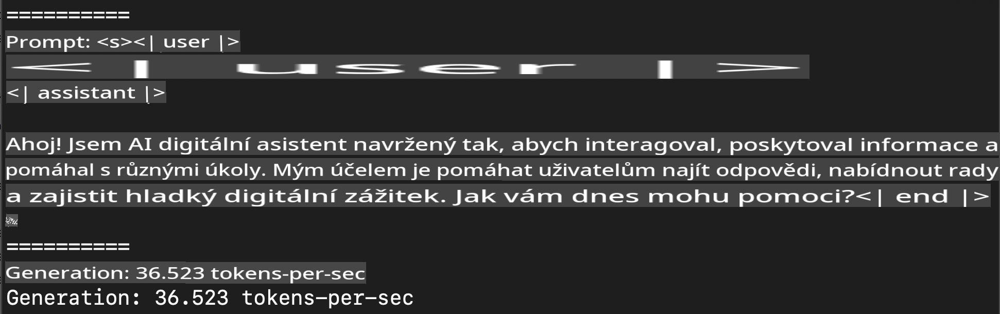
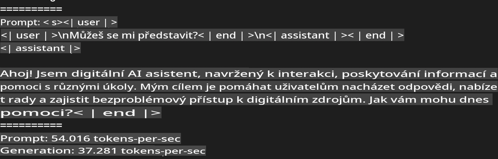

# **Inference Phi-3 s Apple MLX Framework**

## **Co je MLX Framework**

MLX je framework pro strojové učení zaměřený na zařízení s Apple silicon, vytvořený výzkumným týmem Apple pro strojové učení.

MLX je navržen výzkumníky strojového učení pro výzkumníky strojového učení. Framework je zamýšlen jako uživatelsky přívětivý, ale zároveň efektivní pro trénování a nasazování modelů. Samotný design frameworku je koncepčně jednoduchý. Naším cílem je usnadnit výzkumníkům rozšíření a vylepšení MLX, aby mohli rychle zkoumat nové nápady.

LLM modely lze akcelerovat na zařízeních s Apple Silicon prostřednictvím MLX, a modely lze spouštět lokálně velmi pohodlně.

## **Použití MLX pro inferenci Phi-3-mini**

### **1. Nastavení prostředí MLX**

1. Python 3.11.x  
2. Instalace knihovny MLX  

```bash

pip install mlx-lm

```

### **2. Spuštění Phi-3-mini v terminálu pomocí MLX**

```bash

python -m mlx_lm.generate --model microsoft/Phi-3-mini-4k-instruct --max-token 2048 --prompt  "<|user|>\nCan you introduce yourself<|end|>\n<|assistant|>"

```

Výsledek (moje prostředí je Apple M1 Max, 64 GB) je:



### **3. Kvantizace Phi-3-mini s MLX v terminálu**

```bash

python -m mlx_lm.convert --hf-path microsoft/Phi-3-mini-4k-instruct

```

***Poznámka:*** Model lze kvantizovat pomocí mlx_lm.convert, přičemž výchozí kvantizace je INT4. Tento příklad ukazuje kvantizaci Phi-3-mini na INT4.

Model lze kvantizovat pomocí mlx_lm.convert, přičemž výchozí kvantizace je INT4. Tento příklad ukazuje kvantizaci Phi-3-mini na INT4. Po kvantizaci bude uložen ve výchozím adresáři ./mlx_model.

Můžeme otestovat kvantizovaný model pomocí MLX z terminálu:

```bash

python -m mlx_lm.generate --model ./mlx_model/ --max-token 2048 --prompt  "<|user|>\nCan you introduce yourself<|end|>\n<|assistant|>"

```

Výsledek je:



### **4. Spuštění Phi-3-mini pomocí MLX v Jupyter Notebooku**


***Poznámka:*** Přečtěte si tento příklad [kliknutím na tento odkaz](../../../../../code/03.Inference/MLX/MLX_DEMO.ipynb)

## **Zdroje**

1. Další informace o Apple MLX Framework [https://ml-explore.github.io](https://ml-explore.github.io/mlx/build/html/index.html)

2. Apple MLX GitHub Repo [https://github.com/ml-explore](https://github.com/ml-explore)

**Upozornění**:  
Tento dokument byl přeložen pomocí strojových AI překladových služeb. I když se snažíme o přesnost, mějte prosím na paměti, že automatizované překlady mohou obsahovat chyby nebo nepřesnosti. Původní dokument v jeho rodném jazyce by měl být považován za závazný zdroj. Pro důležité informace se doporučuje profesionální lidský překlad. Neodpovídáme za žádná nedorozumění nebo nesprávné interpretace vyplývající z použití tohoto překladu.