# Vyladění Phi-3 pomocí Azure AI Foundry

Pojďme se podívat, jak vyladit jazykový model Microsoftu Phi-3 Mini pomocí Azure AI Foundry. Vyladění umožňuje přizpůsobit Phi-3 Mini konkrétním úkolům, čímž se model stává ještě výkonnějším a kontextově citlivějším.

## Úvahy

- **Schopnosti:** Které modely lze vyladit? Co může základní model po vyladění zvládnout?
- **Cena:** Jaký je cenový model pro vyladění?
- **Přizpůsobitelnost:** Do jaké míry mohu základní model upravit – a jakým způsobem?
- **Pohodlí:** Jak probíhá samotné vyladění – musím psát vlastní kód? Musím mít vlastní výpočetní kapacitu?
- **Bezpečnost:** Vyladěné modely mohou představovat bezpečnostní rizika – existují nějaké mechanismy na ochranu před nechtěnými škodami?

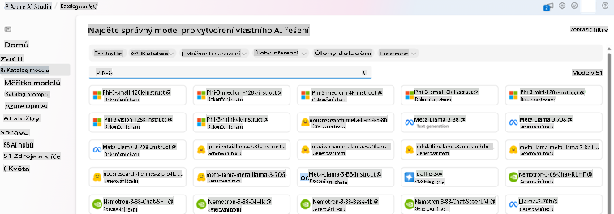

## Příprava na vyladění

### Požadavky

> [!NOTE]
> Pro modely rodiny Phi-3 je nabídka vyladění s modelem pay-as-you-go dostupná pouze v hubech vytvořených v regionech **East US 2**.

- Azure předplatné. Pokud ještě nemáte předplatné Azure, vytvořte si [placený účet Azure](https://azure.microsoft.com/pricing/purchase-options/pay-as-you-go), abyste mohli začít.

- [AI Foundry projekt](https://ai.azure.com?WT.mc_id=aiml-138114-kinfeylo).
- Azure role-based access controls (Azure RBAC) slouží k udělení přístupu k operacím v Azure AI Foundry. Pro provedení kroků uvedených v tomto článku musí být vašemu uživatelskému účtu přidělena role __Azure AI Developer__ ve skupině prostředků.

### Registrace poskytovatele služeb předplatného

Ověřte, že je vaše předplatné registrováno u poskytovatele `Microsoft.Network`.

1. Přihlaste se do [Azure portálu](https://portal.azure.com).
1. V levém menu vyberte **Subscriptions**.
1. Vyberte předplatné, které chcete použít.
1. V levém menu vyberte **AI project settings** > **Resource providers**.
1. Ověřte, že **Microsoft.Network** je v seznamu poskytovatelů služeb. Pokud není, přidejte ho.

### Příprava dat

Připravte svá trénovací a validační data pro vyladění modelu. Vaše trénovací a validační datové sady by měly obsahovat vstupní a výstupní příklady, které odpovídají tomu, jak chcete, aby model fungoval.

Ujistěte se, že všechny trénovací příklady odpovídají očekávanému formátu pro inference. Pro efektivní vyladění modelů zajistěte vyvážený a rozmanitý dataset.

To zahrnuje udržování rovnováhy dat, zahrnutí různých scénářů a pravidelné upravování trénovacích dat tak, aby odpovídala reálným očekáváním. To povede k přesnějším a vyváženějším odpovědím modelu.

Různé typy modelů vyžadují různé formáty trénovacích dat.

### Chat Completion

Trénovací a validační data **musí** být ve formátu JSON Lines (JSONL). Pro `Phi-3-mini-128k-instruct` musí být dataset pro vyladění ve formátu používaném Chat completions API.

### Ukázkový formát souboru

```json
    {"messages": [{"role": "system", "content": "You are an Xbox customer support agent whose primary goal is to help users with issues they are experiencing with their Xbox devices. You are friendly and concise. You only provide factual answers to queries, and do not provide answers that are not related to Xbox."}, {"role": "user", "content": "Is Xbox better than PlayStation?"}, {"role": "assistant", "content": "I apologize, but I cannot provide personal opinions. My primary job is to assist you with any issues related to your Xbox device. Do you have any Xbox-related issues that need addressing?"}]}
    {"messages": [{"role": "system", "content": "You are an Xbox customer support agent whose primary goal is to help users with issues they are experiencing with their Xbox devices. You are friendly and concise. You only provide factual answers to queries, and do not provide answers that are not related to Xbox."}, {"role": "user", "content": "Can I play PC games on my Xbox?"}, {"role": "assistant", "content": "While Xbox consoles don't natively support PC games, they can play an array of Xbox games, many of which are also available on PC. Can I assist you with finding games compatible with your Xbox device?"}]}
    {"messages": [{"role": "system", "content": "You are an Xbox customer support agent whose primary goal is to help users with issues they are experiencing with their Xbox devices. You are friendly and concise. You only provide factual answers to queries, and do not provide answers that are not related to Xbox."}, {"role": "user", "content": "I'm having trouble connecting my Xbox to the Wi-Fi."}, {"role": "assistant", "content": "No worries, let's go through the network settings on your Xbox. Can you please tell me what happens when you try to connect it to the Wi-Fi?"}]}
```

Podporovaný typ souboru je JSON Lines. Soubory jsou nahrány do výchozího datového úložiště a zpřístupněny ve vašem projektu.

## Vyladění Phi-3 pomocí Azure AI Foundry

Azure AI Foundry vám umožňuje přizpůsobit velké jazykové modely vašim osobním datasetům pomocí procesu známého jako vyladění. Vyladění přináší významnou hodnotu tím, že umožňuje přizpůsobení a optimalizaci pro specifické úkoly a aplikace. Výsledkem je lepší výkon, nákladová efektivita, snížená latence a přizpůsobené výstupy.


### Vytvoření nového projektu

1. Přihlaste se do [Azure AI Foundry](https://ai.azure.com).

1. Vyberte **+New project** pro vytvoření nového projektu v Azure AI Foundry.

    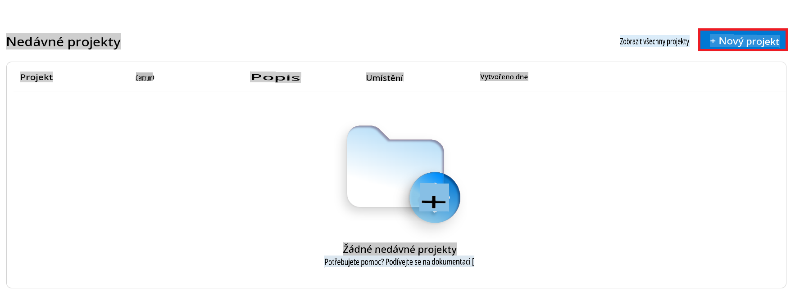

1. Proveďte následující kroky:

    - Zadejte **Hub name**. Musí být jedinečný.
    - Vyberte **Hub**, který chcete použít (vytvořte nový, pokud je potřeba).

    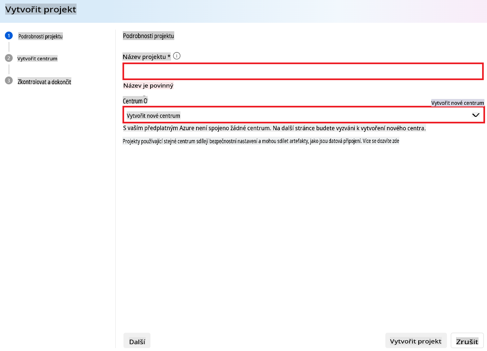

1. Pro vytvoření nového hubu proveďte následující kroky:

    - Zadejte **Hub name**. Musí být jedinečný.
    - Vyberte své Azure **Subscription**.
    - Vyberte **Resource group**, kterou chcete použít (vytvořte novou, pokud je potřeba).
    - Vyberte **Location**, kterou chcete použít.
    - Vyberte **Connect Azure AI Services** (vytvořte nové, pokud je potřeba).
    - Vyberte **Connect Azure AI Search** a nastavte na **Skip connecting**.

    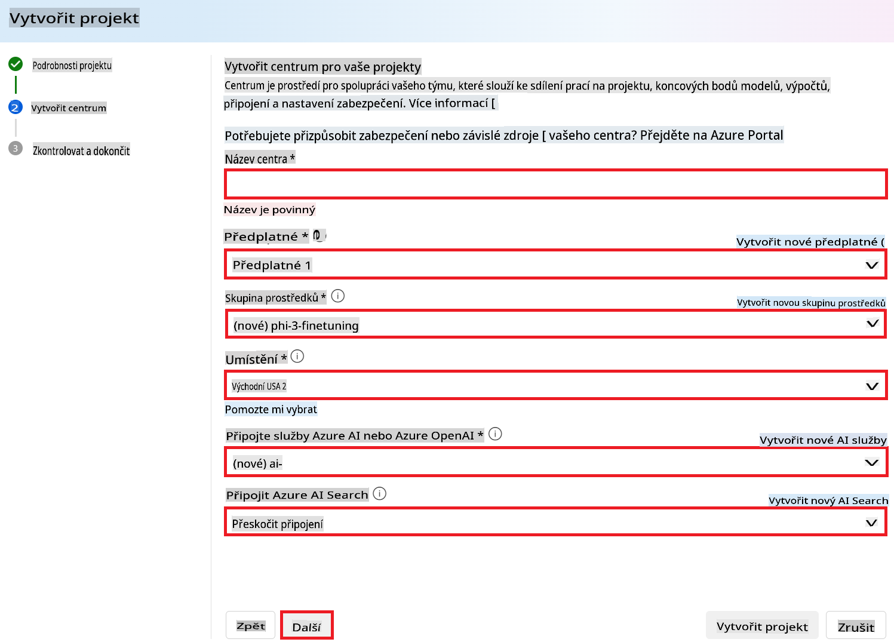

1. Vyberte **Next**.
1. Vyberte **Create a project**.

### Příprava dat

Před vyladěním shromážděte nebo vytvořte dataset relevantní pro váš úkol, například instrukce pro chat, otázky a odpovědi nebo jiný relevantní text. Vyčistěte a předzpracujte tato data odstraněním šumu, řešením chybějících hodnot a tokenizací textu.

### Vyladění modelů Phi-3 v Azure AI Foundry

> [!NOTE]
> Vyladění modelů Phi-3 je aktuálně podporováno pouze v projektech umístěných v East US 2.

1. V levém panelu vyberte **Model catalog**.

1. Do **vyhledávacího pole** zadejte *phi-3* a vyberte model phi-3, který chcete použít.

    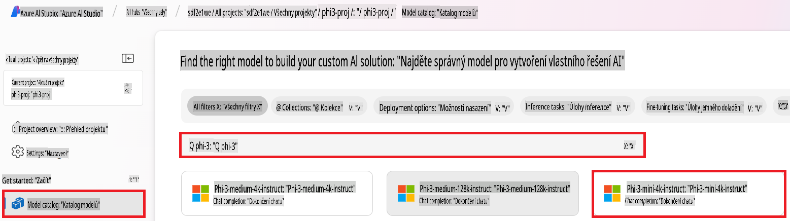

1. Vyberte **Fine-tune**.

    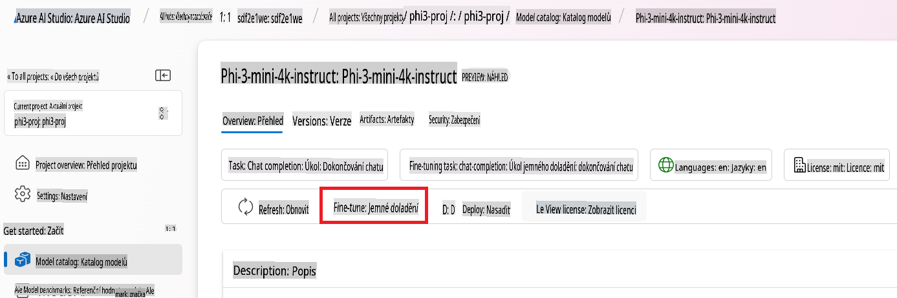

1. Zadejte **Fine-tuned model name**.

    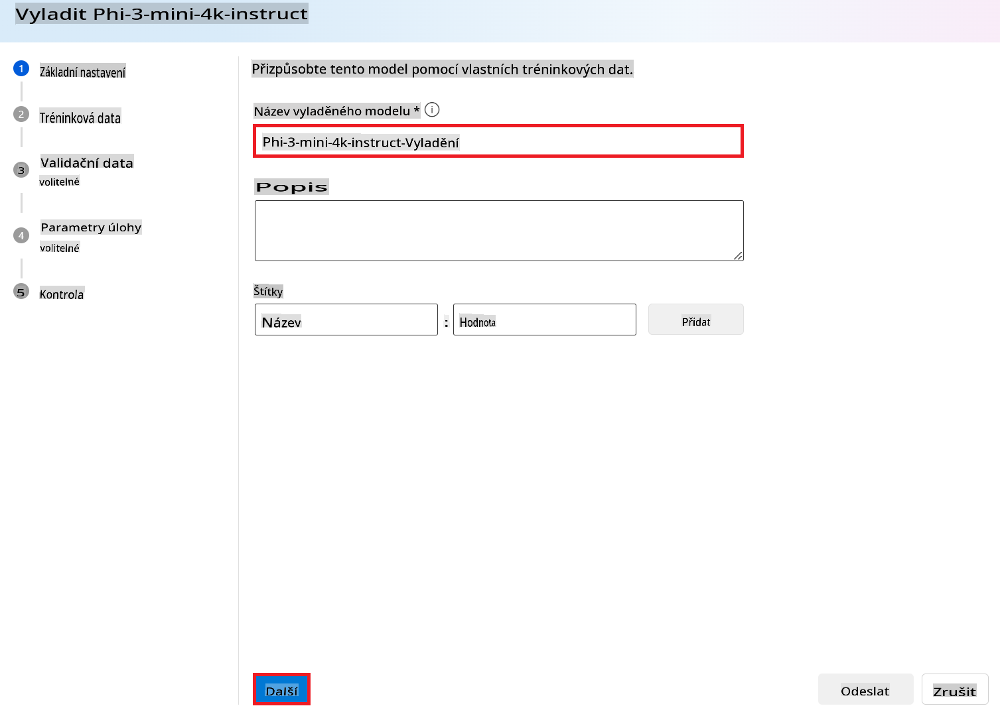

1. Vyberte **Next**.

1. Proveďte následující kroky:

    - Vyberte **task type** jako **Chat completion**.
    - Vyberte **Training data**, která chcete použít. Můžete je nahrát prostřednictvím Azure AI Foundry nebo ze svého lokálního prostředí.

    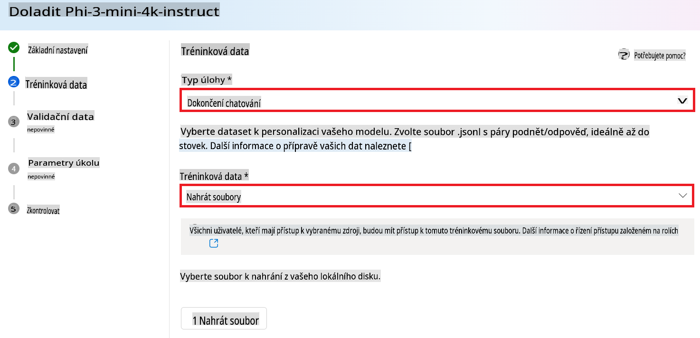

1. Vyberte **Next**.

1. Nahrajte **Validation data**, která chcete použít, nebo vyberte **Automatic split of training data**.

    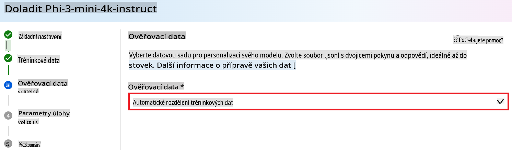

1. Vyberte **Next**.

1. Proveďte následující kroky:

    - Vyberte **Batch size multiplier**, kterou chcete použít.
    - Vyberte **Learning rate**, kterou chcete použít.
    - Vyberte **Epochs**, které chcete použít.

    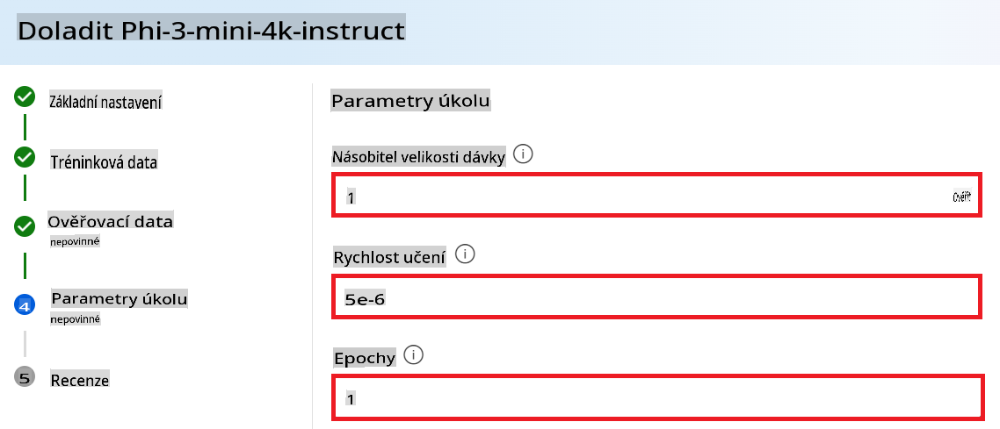

1. Vyberte **Submit** pro zahájení procesu vyladění.

    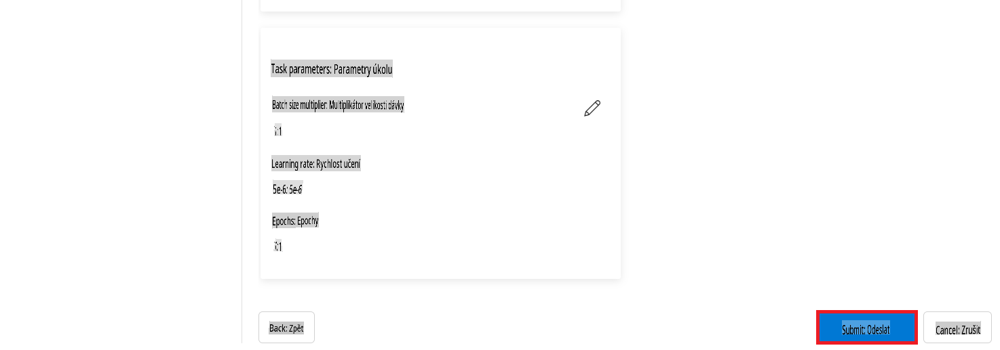

1. Po dokončení vyladění se stav zobrazí jako **Completed**, jak je znázorněno na obrázku níže. Nyní můžete model nasadit a používat jej ve své aplikaci, na playgroundu nebo v prompt flow. Další informace najdete v [Jak nasadit modely Phi-3 pomocí Azure AI Foundry](https://learn.microsoft.com/azure/ai-studio/how-to/deploy-models-phi-3?tabs=phi-3-5&pivots=programming-language-python).

    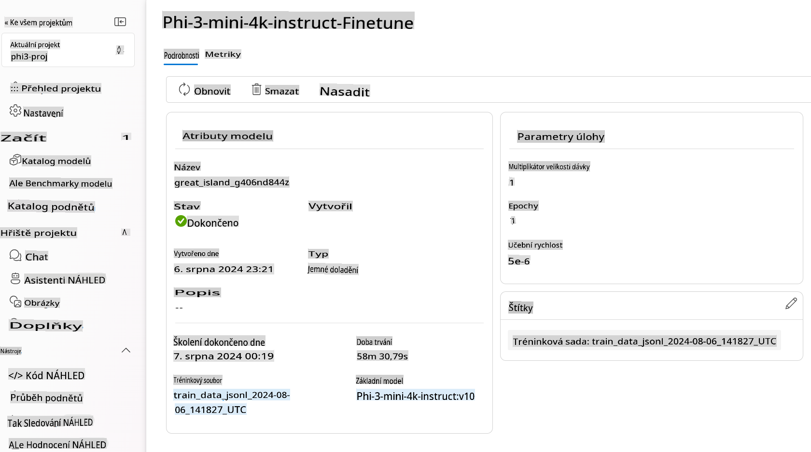

> [!NOTE]
> Pro podrobnější informace o vyladění Phi-3 navštivte [Vyladění modelů Phi-3 v Azure AI Foundry](https://learn.microsoft.com/azure/ai-studio/how-to/fine-tune-phi-3?tabs=phi-3-mini).

## Čištění vyladěných modelů

Vyladěný model můžete odstranit ze seznamu vyladěných modelů v [Azure AI Foundry](https://ai.azure.com) nebo ze stránky s detaily modelu. Vyberte vyladěný model, který chcete odstranit, a poté stiskněte tlačítko Smazat.

> [!NOTE]
> Nelze odstranit vlastní model, pokud má aktivní nasazení. Nejprve musíte odstranit nasazení modelu.

## Cena a kvóty

### Úvahy o nákladech a kvótách pro vyladěné modely Phi-3

Modely Phi vyladěné jako služba jsou nabízeny společností Microsoft a integrovány s Azure AI Foundry. Ceny najdete při [nasazování](https://learn.microsoft.com/azure/ai-studio/how-to/deploy-models-phi-3?tabs=phi-3-5&pivots=programming-language-python) nebo vyladění modelů v záložce Pricing and terms v průvodci nasazením.

## Filtrování obsahu

Modely nasazené jako služba s modelem pay-as-you-go jsou chráněny Azure AI Content Safety. Při nasazení na real-time endpoints můžete tuto funkci deaktivovat. S povolenou Azure AI Content Safety prochází jak prompt, tak výstup klasifikačními modely, které detekují a zabraňují výstupům škodlivého obsahu. Systém filtrování obsahu detekuje a zasahuje proti určitým kategoriím potenciálně škodlivého obsahu ve vstupních i výstupních datech. Další informace najdete v [Azure AI Content Safety](https://learn.microsoft.com/azure/ai-studio/concepts/content-filtering).

**Konfigurace vyladění**

Hyperparametry: Definujte hyperparametry jako rychlost učení, velikost batch a počet epoch trénování.

**Ztrátová funkce**

Vyberte vhodnou ztrátovou funkci pro váš úkol (např. cross-entropy).

**Optimalizátor**

Zvolte optimalizátor (např. Adam) pro aktualizaci gradientů během tréninku.

**Proces vyladění**

- Načtěte předtrénovaný model: Načtěte checkpoint Phi-3 Mini.
- Přidejte vlastní vrstvy: Přidejte vrstvy specifické pro úkol (např. klasifikační vrstvu pro chat instrukce).

**Trénink modelu**
Vyladěte model pomocí připraveného datasetu. Sledujte průběh tréninku a podle potřeby upravujte hyperparametry.

**Hodnocení a validace**

Validační sada: Rozdělte svá data na trénovací a validační sady.

**Vyhodnocení výkonu**

Použijte metriky jako přesnost, F1-skóre nebo perplexitu k hodnocení výkonu modelu.

## Uložení vyladěného modelu

**Checkpoint**
Uložte checkpoint vyladěného modelu pro budoucí použití.

## Nasazení

- Nasazení jako webová služba: Nasazení vyladěného modelu jako webové služby v Azure AI Foundry.
- Testování endpointu: Odesílejte testovací dotazy na nasazený endpoint, abyste ověřili jeho funkčnost.

## Iterace a zlepšení

Iterace: Pokud výkon není uspokojivý, proveďte iteraci úpravou hyperparametrů, přidáním více dat nebo prodloužením tréninku.

## Monitorování a zdokonalování

Průběžně sledujte chování modelu a podle potřeby jej upravujte.

## Přizpůsobení a rozšíření

Vlastní úkoly: Phi-3 Mini lze vyladit pro různé úkoly nad rámec chat instrukcí. Prozkoumejte další případy použití!
Experimentujte: Vyzkoušejte různé architektury, kombinace vrstev a techniky pro zlepšení výkonu.

> [!NOTE]
> Vyladění je iterativní proces. Experimentujte, učte se a přizpůsobujte model, abyste dosáhli nejlepších výsledků pro váš konkrétní úkol!

**Upozornění**:  
Tento dokument byl přeložen pomocí strojových AI překladových služeb. I když se snažíme o přesnost, mějte prosím na paměti, že automatizované překlady mohou obsahovat chyby nebo nepřesnosti. Původní dokument v jeho rodném jazyce by měl být považován za autoritativní zdroj. Pro důležité informace se doporučuje profesionální lidský překlad. Neodpovídáme za žádná nedorozumění nebo nesprávné interpretace vyplývající z použití tohoto překladu.