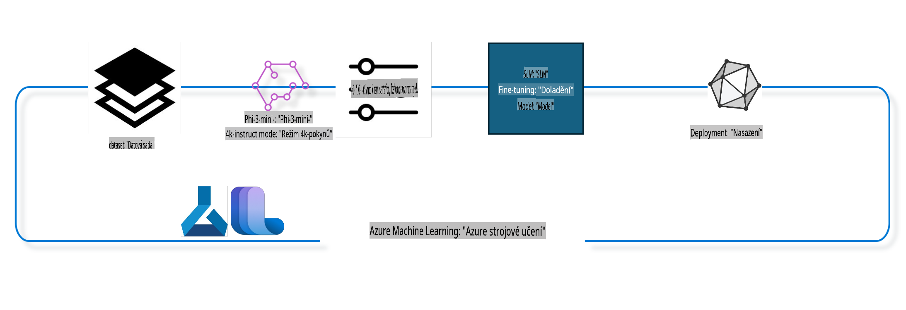

## Jak používat komponenty pro dokončování konverzací z registru Azure ML k doladění modelu

V tomto příkladu provedeme doladění modelu Phi-3-mini-4k-instruct pro dokončení konverzace mezi dvěma lidmi pomocí datasetu ultrachat_200k.



Tento příklad ukáže, jak doladit model pomocí Azure ML SDK a Pythonu a následně nasadit doladěný model na online endpoint pro inference v reálném čase.

### Trénovací data

Použijeme dataset ultrachat_200k. Jedná se o silně filtrovanou verzi datasetu UltraChat, která byla použita k trénování Zephyr-7B-β, špičkového chatovacího modelu s 7 miliardami parametrů.

### Model

Použijeme model Phi-3-mini-4k-instruct, abychom ukázali, jak může uživatel doladit model pro úkol dokončování konverzací. Pokud jste tento notebook otevřeli z konkrétní karty modelu, nezapomeňte nahradit název modelu odpovídajícím modelem.

### Úkoly

- Vybrat model k doladění.
- Vybrat a prozkoumat trénovací data.
- Nakonfigurovat úlohu doladění.
- Spustit úlohu doladění.
- Zkontrolovat metriky trénování a hodnocení.
- Zaregistrovat doladěný model.
- Nasadit doladěný model pro inference v reálném čase.
- Uklidit zdroje.

## 1. Nastavení předpokladů

- Nainstalujte závislosti.
- Připojte se k AzureML Workspace. Více informací najdete v nastavení autentizace SDK. Nahraďte <WORKSPACE_NAME>, <RESOURCE_GROUP> a <SUBSCRIPTION_ID>.
- Připojte se k registru systému AzureML.
- Nastavte volitelný název experimentu.
- Zkontrolujte nebo vytvořte výpočetní prostředky.

> [!NOTE]
> Požadavky: jeden GPU uzel může mít více GPU karet. Například uzel Standard_NC24rs_v3 obsahuje 4 NVIDIA V100 GPU, zatímco Standard_NC12s_v3 obsahuje 2 NVIDIA V100 GPU. Odkaz na dokumentaci s touto informací najdete zde. Počet GPU karet na uzel nastavte pomocí parametru gpus_per_node níže. Správné nastavení tohoto parametru zajistí plné využití všech GPU na uzlu. Doporučené SKU GPU výpočetů najdete zde a zde.

### Knihovny Pythonu

Nainstalujte závislosti spuštěním následující buňky. Tento krok není volitelný, pokud pracujete v novém prostředí.

```bash
pip install azure-ai-ml
pip install azure-identity
pip install datasets==2.9.0
pip install mlflow
pip install azureml-mlflow
```

### Interakce s Azure ML

1. Tento Python skript slouží k interakci se službou Azure Machine Learning (Azure ML). Co provádí:

    - Importuje potřebné moduly z balíčků azure.ai.ml, azure.identity a azure.ai.ml.entities. Také importuje modul time.

    - Pokusí se autentizovat pomocí DefaultAzureCredential(), což poskytuje zjednodušený způsob autentizace pro rychlý start vývoje aplikací běžících v Azure cloudu. Pokud selže, přepne na InteractiveBrowserCredential(), který zobrazí interaktivní přihlašovací okno.

    - Vytvoří instanci MLClient pomocí metody from_config, která čte konfiguraci z výchozího konfiguračního souboru (config.json). Pokud to selže, vytvoří instanci MLClient manuálním zadáním subscription_id, resource_group_name a workspace_name.

    - Vytvoří další instanci MLClient, tentokrát pro registr Azure ML s názvem "azureml". Tento registr obsahuje modely, pipeline pro doladění a prostředí.

    - Nastaví experiment_name na "chat_completion_Phi-3-mini-4k-instruct".

    - Generuje unikátní časové razítko převedením aktuálního času (v sekundách od epochy, jako desetinné číslo) na celé číslo a poté na řetězec. Toto časové razítko lze použít k vytvoření unikátních názvů a verzí.

    ```python
    # Import necessary modules from Azure ML and Azure Identity
    from azure.ai.ml import MLClient
    from azure.identity import (
        DefaultAzureCredential,
        InteractiveBrowserCredential,
    )
    from azure.ai.ml.entities import AmlCompute
    import time  # Import time module
    
    # Try to authenticate using DefaultAzureCredential
    try:
        credential = DefaultAzureCredential()
        credential.get_token("https://management.azure.com/.default")
    except Exception as ex:  # If DefaultAzureCredential fails, use InteractiveBrowserCredential
        credential = InteractiveBrowserCredential()
    
    # Try to create an MLClient instance using the default config file
    try:
        workspace_ml_client = MLClient.from_config(credential=credential)
    except:  # If that fails, create an MLClient instance by manually providing the details
        workspace_ml_client = MLClient(
            credential,
            subscription_id="<SUBSCRIPTION_ID>",
            resource_group_name="<RESOURCE_GROUP>",
            workspace_name="<WORKSPACE_NAME>",
        )
    
    # Create another MLClient instance for the Azure ML registry named "azureml"
    # This registry is where models, fine-tuning pipelines, and environments are stored
    registry_ml_client = MLClient(credential, registry_name="azureml")
    
    # Set the experiment name
    experiment_name = "chat_completion_Phi-3-mini-4k-instruct"
    
    # Generate a unique timestamp that can be used for names and versions that need to be unique
    timestamp = str(int(time.time()))
    ```

## 2. Vyberte základní model k doladění

1. Phi-3-mini-4k-instruct je lehký, špičkový otevřený model s 3,8 miliardami parametrů, postavený na datasetech použitých pro Phi-2. Model patří do rodiny modelů Phi-3 a verze Mini přichází ve dvou variantách: 4K a 128K, což je délka kontextu (v tokenech), kterou podporuje. Model je třeba doladit pro náš specifický účel, aby byl použitelný. Tyto modely můžete procházet v katalogu modelů v AzureML Studio, filtrováním podle úkolu dokončování konverzací. V tomto příkladu používáme model Phi-3-mini-4k-instruct. Pokud jste tento notebook otevřeli pro jiný model, nahraďte název a verzi modelu odpovídajícím modelem.

    > [!NOTE]
    > vlastnost model id. Tato vlastnost bude předána jako vstup do úlohy doladění. Je také dostupná jako pole Asset ID na stránce s detaily modelu v katalogu modelů AzureML Studio.

2. Tento Python skript interaguje se službou Azure Machine Learning (Azure ML). Co provádí:

    - Nastaví model_name na "Phi-3-mini-4k-instruct".

    - Používá metodu get vlastnosti models objektu registry_ml_client k načtení nejnovější verze modelu se zadaným názvem z registru Azure ML. Metoda get je volána se dvěma argumenty: názvem modelu a označením, že má být načtena nejnovější verze modelu.

    - Vytiskne zprávu do konzole, která uvádí název, verzi a id modelu, který bude použit pro doladění. Metoda format řetězce je použita k vložení názvu, verze a id modelu do zprávy. Název, verze a id modelu jsou přístupné jako vlastnosti objektu foundation_model.

    ```python
    # Set the model name
    model_name = "Phi-3-mini-4k-instruct"
    
    # Get the latest version of the model from the Azure ML registry
    foundation_model = registry_ml_client.models.get(model_name, label="latest")
    
    # Print the model name, version, and id
    # This information is useful for tracking and debugging
    print(
        "\n\nUsing model name: {0}, version: {1}, id: {2} for fine tuning".format(
            foundation_model.name, foundation_model.version, foundation_model.id
        )
    )
    ```

## 3. Vytvořte výpočetní prostředek pro úlohu

Úloha doladění funguje POUZE s výpočetními prostředky GPU. Velikost výpočetního prostředku závisí na velikosti modelu a často je složité určit správný prostředek pro úlohu. V této části uživatele navedeme, jak vybrat správný výpočetní prostředek.

> [!NOTE]
> Níže uvedené výpočetní prostředky fungují s nejoptimalizovanější konfigurací. Jakékoliv změny konfigurace mohou vést k chybě Cuda Out Of Memory. V takových případech zkuste upgradovat na větší výpočetní prostředek.

> [!NOTE]
> Při výběru compute_cluster_size níže se ujistěte, že je výpočetní prostředek dostupný ve vaší skupině zdrojů. Pokud není konkrétní prostředek dostupný, můžete požádat o přístup k těmto prostředkům.

### Kontrola podpory doladění u modelu

1. Tento Python skript interaguje s modelem Azure Machine Learning (Azure ML). Co provádí:

    - Importuje modul ast, který poskytuje funkce pro zpracování stromů gramatiky abstraktní syntaxe Pythonu.

    - Kontroluje, zda objekt foundation_model (který představuje model v Azure ML) má tag s názvem finetune_compute_allow_list. Tagy v Azure ML jsou páry klíč-hodnota, které můžete vytvořit a použít k filtrování a třídění modelů.

    - Pokud je tag finetune_compute_allow_list přítomen, použije funkci ast.literal_eval k bezpečnému převodu hodnoty tagu (řetězce) na Python seznam. Tento seznam je poté přiřazen proměnné computes_allow_list. Následně vytiskne zprávu, že by měl být vytvořen výpočetní prostředek ze seznamu.

    - Pokud tag finetune_compute_allow_list není přítomen, nastaví computes_allow_list na None a vytiskne zprávu, že tag finetune_compute_allow_list není součástí tagů modelu.

    - Ve zkratce, tento skript kontroluje specifický tag v metadatech modelu, převádí hodnotu tagu na seznam, pokud existuje, a poskytuje uživateli zpětnou vazbu.

    ```python
    # Import the ast module, which provides functions to process trees of the Python abstract syntax grammar
    import ast
    
    # Check if the 'finetune_compute_allow_list' tag is present in the model's tags
    if "finetune_compute_allow_list" in foundation_model.tags:
        # If the tag is present, use ast.literal_eval to safely parse the tag's value (a string) into a Python list
        computes_allow_list = ast.literal_eval(
            foundation_model.tags["finetune_compute_allow_list"]
        )  # convert string to python list
        # Print a message indicating that a compute should be created from the list
        print(f"Please create a compute from the above list - {computes_allow_list}")
    else:
        # If the tag is not present, set computes_allow_list to None
        computes_allow_list = None
        # Print a message indicating that the 'finetune_compute_allow_list' tag is not part of the model's tags
        print("`finetune_compute_allow_list` is not part of model tags")
    ```

### Kontrola instance výpočetního prostředku

1. Tento Python skript interaguje se službou Azure Machine Learning (Azure ML) a provádí několik kontrol na instanci výpočetního prostředku. Co provádí:

    - Pokusí se načíst instanci výpočetního prostředku se jménem uloženým v compute_cluster z Azure ML workspace. Pokud je stav zřizování instance "failed", vyvolá ValueError.

    - Kontroluje, zda computes_allow_list není None. Pokud není, převede všechny velikosti prostředků v seznamu na malá písmena a ověří, zda velikost aktuální instance je v seznamu. Pokud není, vyvolá ValueError.

    - Pokud computes_allow_list je None, ověří, zda velikost instance je v seznamu nepodporovaných velikostí GPU VM. Pokud je, vyvolá ValueError.

    - Načte seznam všech dostupných velikostí prostředků ve workspace. Poté iteruje přes tento seznam a pro každou velikost prostředku ověří, zda její jméno odpovídá velikosti aktuální instance. Pokud ano, načte počet GPU pro tuto velikost prostředku a nastaví gpu_count_found na True.

    - Pokud gpu_count_found je True, vytiskne počet GPU v instanci. Pokud gpu_count_found je False, vyvolá ValueError.

    - Ve zkratce, tento skript provádí několik kontrol na instanci výpočetního prostředku v Azure ML workspace, včetně kontroly jejího stavu zřizování, její velikosti vůči povolenému nebo nepovolenému seznamu a počtu GPU, které má.

    ```python
    # Print the exception message
    print(e)
    # Raise a ValueError if the compute size is not available in the workspace
    raise ValueError(
        f"WARNING! Compute size {compute_cluster_size} not available in workspace"
    )
    
    # Retrieve the compute instance from the Azure ML workspace
    compute = workspace_ml_client.compute.get(compute_cluster)
    # Check if the provisioning state of the compute instance is "failed"
    if compute.provisioning_state.lower() == "failed":
        # Raise a ValueError if the provisioning state is "failed"
        raise ValueError(
            f"Provisioning failed, Compute '{compute_cluster}' is in failed state. "
            f"please try creating a different compute"
        )
    
    # Check if computes_allow_list is not None
    if computes_allow_list is not None:
        # Convert all compute sizes in computes_allow_list to lowercase
        computes_allow_list_lower_case = [x.lower() for x in computes_allow_list]
        # Check if the size of the compute instance is in computes_allow_list_lower_case
        if compute.size.lower() not in computes_allow_list_lower_case:
            # Raise a ValueError if the size of the compute instance is not in computes_allow_list_lower_case
            raise ValueError(
                f"VM size {compute.size} is not in the allow-listed computes for finetuning"
            )
    else:
        # Define a list of unsupported GPU VM sizes
        unsupported_gpu_vm_list = [
            "standard_nc6",
            "standard_nc12",
            "standard_nc24",
            "standard_nc24r",
        ]
        # Check if the size of the compute instance is in unsupported_gpu_vm_list
        if compute.size.lower() in unsupported_gpu_vm_list:
            # Raise a ValueError if the size of the compute instance is in unsupported_gpu_vm_list
            raise ValueError(
                f"VM size {compute.size} is currently not supported for finetuning"
            )
    
    # Initialize a flag to check if the number of GPUs in the compute instance has been found
    gpu_count_found = False
    # Retrieve a list of all available compute sizes in the workspace
    workspace_compute_sku_list = workspace_ml_client.compute.list_sizes()
    available_sku_sizes = []
    # Iterate over the list of available compute sizes
    for compute_sku in workspace_compute_sku_list:
        available_sku_sizes.append(compute_sku.name)
        # Check if the name of the compute size matches the size of the compute instance
        if compute_sku.name.lower() == compute.size.lower():
            # If it does, retrieve the number of GPUs for that compute size and set gpu_count_found to True
            gpus_per_node = compute_sku.gpus
            gpu_count_found = True
    # If gpu_count_found is True, print the number of GPUs in the compute instance
    if gpu_count_found:
        print(f"Number of GPU's in compute {compute.size}: {gpus_per_node}")
    else:
        # If gpu_count_found is False, raise a ValueError
        raise ValueError(
            f"Number of GPU's in compute {compute.size} not found. Available skus are: {available_sku_sizes}."
            f"This should not happen. Please check the selected compute cluster: {compute_cluster} and try again."
        )
    ```
### Konfigurace Pipeline

Tento Python skript definuje a konfiguruje strojově učící pipeline pomocí Azure Machine Learning SDK. Zde je rozpis toho, co dělá:

1. Importuje potřebné moduly z Azure AI ML SDK.
2. Načítá komponentu pipeline s názvem "chat_completion_pipeline" z registru.
3. Definuje pipeline úlohu pomocí `@pipeline` decorator and the function `create_pipeline`. The name of the pipeline is set to `pipeline_display_name`.

1. Inside the `create_pipeline` function, it initializes the fetched pipeline component with various parameters, including the model path, compute clusters for different stages, dataset splits for training and testing, the number of GPUs to use for fine-tuning, and other fine-tuning parameters.

1. It maps the output of the fine-tuning job to the output of the pipeline job. This is done so that the fine-tuned model can be easily registered, which is required to deploy the model to an online or batch endpoint.

1. It creates an instance of the pipeline by calling the `create_pipeline` function.

1. It sets the `force_rerun` setting of the pipeline to `True`, meaning that cached results from previous jobs will not be used.

1. It sets the `continue_on_step_failure` setting of the pipeline to `False`, což znamená, že pipeline se zastaví, pokud některý krok selže.
4. Shrnutí: Tento skript definuje a konfiguruje strojově učící pipeline pro úlohu dokončování chatu pomocí Azure Machine Learning SDK.

```python
    # Import necessary modules from the Azure AI ML SDK
    from azure.ai.ml.dsl import pipeline
    from azure.ai.ml import Input
    
    # Fetch the pipeline component named "chat_completion_pipeline" from the registry
    pipeline_component_func = registry_ml_client.components.get(
        name="chat_completion_pipeline", label="latest"
    )
    
    # Define the pipeline job using the @pipeline decorator and the function create_pipeline
    # The name of the pipeline is set to pipeline_display_name
    @pipeline(name=pipeline_display_name)
    def create_pipeline():
        # Initialize the fetched pipeline component with various parameters
        # These include the model path, compute clusters for different stages, dataset splits for training and testing, the number of GPUs to use for fine-tuning, and other fine-tuning parameters
        chat_completion_pipeline = pipeline_component_func(
            mlflow_model_path=foundation_model.id,
            compute_model_import=compute_cluster,
            compute_preprocess=compute_cluster,
            compute_finetune=compute_cluster,
            compute_model_evaluation=compute_cluster,
            # Map the dataset splits to parameters
            train_file_path=Input(
                type="uri_file", path="./ultrachat_200k_dataset/train_sft.jsonl"
            ),
            test_file_path=Input(
                type="uri_file", path="./ultrachat_200k_dataset/test_sft.jsonl"
            ),
            # Training settings
            number_of_gpu_to_use_finetuning=gpus_per_node,  # Set to the number of GPUs available in the compute
            **finetune_parameters
        )
        return {
            # Map the output of the fine tuning job to the output of pipeline job
            # This is done so that we can easily register the fine tuned model
            # Registering the model is required to deploy the model to an online or batch endpoint
            "trained_model": chat_completion_pipeline.outputs.mlflow_model_folder
        }
    
    # Create an instance of the pipeline by calling the create_pipeline function
    pipeline_object = create_pipeline()
    
    # Don't use cached results from previous jobs
    pipeline_object.settings.force_rerun = True
    
    # Set continue on step failure to False
    # This means that the pipeline will stop if any step fails
    pipeline_object.settings.continue_on_step_failure = False
    ```

### Odeslání úlohy

1. Tento Python skript odesílá strojově učící pipeline úlohu do Azure Machine Learning workspace a poté čeká na její dokončení. Zde je rozpis toho, co dělá:

   - Volá metodu `create_or_update` objektu jobs v `workspace_ml_client` k odeslání pipeline úlohy. Pipeline, která se má spustit, je specifikována pomocí `pipeline_object`, a experiment, pod kterým je úloha spuštěna, je určen pomocí `experiment_name`.
   - Poté volá metodu `stream` objektu jobs v `workspace_ml_client`, aby počkal na dokončení pipeline úlohy. Úloha, na kterou čeká, je specifikována pomocí atributu `name` objektu `pipeline_job`.
   - Shrnutí: Tento skript odesílá strojově učící pipeline úlohu do Azure Machine Learning workspace a poté čeká na její dokončení.

```python
    # Submit the pipeline job to the Azure Machine Learning workspace
    # The pipeline to be run is specified by pipeline_object
    # The experiment under which the job is run is specified by experiment_name
    pipeline_job = workspace_ml_client.jobs.create_or_update(
        pipeline_object, experiment_name=experiment_name
    )
    
    # Wait for the pipeline job to complete
    # The job to wait for is specified by the name attribute of the pipeline_job object
    workspace_ml_client.jobs.stream(pipeline_job.name)
    ```

## 6. Registrace jemně doladěného modelu ve workspace

Zaregistrujeme model z výstupu jemně doladěné úlohy. Tím se vytvoří návaznost mezi jemně doladěným modelem a jemně doladěnou úlohou. Jemně doladěná úloha dále vytváří návaznost na základní model, data a trénovací kód.

### Registrace ML modelu

1. Tento Python skript registruje strojově učící model, který byl natrénován v Azure Machine Learning pipeline. Zde je rozpis toho, co dělá:

   - Importuje potřebné moduly z Azure AI ML SDK.
   - Kontroluje, zda je dostupný výstup `trained_model` z pipeline úlohy voláním metody `get` objektu jobs v `workspace_ml_client` a přístupem k jeho atributu `outputs`.
   - Vytváří cestu k natrénovanému modelu formátováním řetězce s názvem pipeline úlohy a názvem výstupu ("trained_model").
   - Definuje název jemně doladěného modelu přidáním "-ultrachat-200k" k původnímu názvu modelu a nahrazením lomítek pomlčkami.
   - Připravuje registraci modelu vytvořením objektu `Model` s různými parametry, včetně cesty k modelu, typu modelu (MLflow model), názvu a verze modelu a popisu modelu.
   - Registruje model voláním metody `create_or_update` objektu models v `workspace_ml_client` s objektem `Model` jako argumentem.
   - Vypisuje registrovaný model.

   - Shrnutí: Tento skript registruje strojově učící model, který byl natrénován v Azure Machine Learning pipeline.

```python
    # Import necessary modules from the Azure AI ML SDK
    from azure.ai.ml.entities import Model
    from azure.ai.ml.constants import AssetTypes
    
    # Check if the `trained_model` output is available from the pipeline job
    print("pipeline job outputs: ", workspace_ml_client.jobs.get(pipeline_job.name).outputs)
    
    # Construct a path to the trained model by formatting a string with the name of the pipeline job and the name of the output ("trained_model")
    model_path_from_job = "azureml://jobs/{0}/outputs/{1}".format(
        pipeline_job.name, "trained_model"
    )
    
    # Define a name for the fine-tuned model by appending "-ultrachat-200k" to the original model name and replacing any slashes with hyphens
    finetuned_model_name = model_name + "-ultrachat-200k"
    finetuned_model_name = finetuned_model_name.replace("/", "-")
    
    print("path to register model: ", model_path_from_job)
    
    # Prepare to register the model by creating a Model object with various parameters
    # These include the path to the model, the type of the model (MLflow model), the name and version of the model, and a description of the model
    prepare_to_register_model = Model(
        path=model_path_from_job,
        type=AssetTypes.MLFLOW_MODEL,
        name=finetuned_model_name,
        version=timestamp,  # Use timestamp as version to avoid version conflict
        description=model_name + " fine tuned model for ultrachat 200k chat-completion",
    )
    
    print("prepare to register model: \n", prepare_to_register_model)
    
    # Register the model by calling the create_or_update method of the models object in the workspace_ml_client with the Model object as the argument
    registered_model = workspace_ml_client.models.create_or_update(
        prepare_to_register_model
    )
    
    # Print the registered model
    print("registered model: \n", registered_model)
    ```

## 7. Nasazení jemně doladěného modelu na online endpoint

Online endpointy poskytují trvalé REST API, které lze použít k integraci s aplikacemi, jež potřebují používat model.

### Správa Endpointu

1. Tento Python skript vytváří spravovaný online endpoint v Azure Machine Learning pro registrovaný model. Zde je rozpis toho, co dělá:

   - Importuje potřebné moduly z Azure AI ML SDK.
   - Definuje jedinečný název pro online endpoint přidáním časového razítka k řetězci "ultrachat-completion-".
   - Připravuje vytvoření online endpointu vytvořením objektu `ManagedOnlineEndpoint` s různými parametry, včetně názvu endpointu, popisu endpointu a režimu autentizace ("key").
   - Vytváří online endpoint voláním metody `begin_create_or_update` objektu `workspace_ml_client` s objektem `ManagedOnlineEndpoint` jako argumentem. Poté čeká na dokončení operace vytvoření voláním metody `wait`.

   - Shrnutí: Tento skript vytváří spravovaný online endpoint v Azure Machine Learning pro registrovaný model.

```python
    # Import necessary modules from the Azure AI ML SDK
    from azure.ai.ml.entities import (
        ManagedOnlineEndpoint,
        ManagedOnlineDeployment,
        ProbeSettings,
        OnlineRequestSettings,
    )
    
    # Define a unique name for the online endpoint by appending a timestamp to the string "ultrachat-completion-"
    online_endpoint_name = "ultrachat-completion-" + timestamp
    
    # Prepare to create the online endpoint by creating a ManagedOnlineEndpoint object with various parameters
    # These include the name of the endpoint, a description of the endpoint, and the authentication mode ("key")
    endpoint = ManagedOnlineEndpoint(
        name=online_endpoint_name,
        description="Online endpoint for "
        + registered_model.name
        + ", fine tuned model for ultrachat-200k-chat-completion",
        auth_mode="key",
    )
    
    # Create the online endpoint by calling the begin_create_or_update method of the workspace_ml_client with the ManagedOnlineEndpoint object as the argument
    # Then wait for the creation operation to complete by calling the wait method
    workspace_ml_client.begin_create_or_update(endpoint).wait()
    ```

> [!NOTE]
> Zde najdete seznam SKU podporovaných pro nasazení - [Managed online endpoints SKU list](https://learn.microsoft.com/azure/machine-learning/reference-managed-online-endpoints-vm-sku-list)

### Nasazení ML modelu

1. Tento Python skript nasazuje registrovaný strojově učící model na spravovaný online endpoint v Azure Machine Learning. Zde je rozpis toho, co dělá:

   - Importuje modul `ast`, který poskytuje funkce pro zpracování stromů abstraktní gramatiky Pythonu.
   - Nastavuje typ instance pro nasazení na "Standard_NC6s_v3".
   - Kontroluje, zda je přítomný tag `inference_compute_allow_list` v základním modelu. Pokud ano, převádí hodnotu tagu z řetězce na seznam Pythonu a přiřazuje ji k `inference_computes_allow_list`. Pokud není přítomen, nastavuje `inference_computes_allow_list` na `None`.
   - Kontroluje, zda je specifikovaný typ instance v povoleném seznamu. Pokud není, vypisuje zprávu, aby uživatel vybral typ instance z povoleného seznamu.
   - Připravuje vytvoření nasazení vytvořením objektu `ManagedOnlineDeployment` s různými parametry, včetně názvu nasazení, názvu endpointu, ID modelu, typu a počtu instancí, nastavení liveness probe a nastavení požadavků.
   - Vytváří nasazení voláním metody `begin_create_or_update` objektu `workspace_ml_client` s objektem `ManagedOnlineDeployment` jako argumentem. Poté čeká na dokončení operace vytvoření voláním metody `wait`.
   - Nastavuje provoz endpointu tak, aby směřoval 100 % provozu na nasazení "demo".
   - Aktualizuje endpoint voláním metody `begin_create_or_update` objektu `workspace_ml_client` s objektem endpoint jako argumentem. Poté čeká na dokončení operace aktualizace voláním metody `result`.

   - Shrnutí: Tento skript nasazuje registrovaný strojově učící model na spravovaný online endpoint v Azure Machine Learning.

```python
    # Import the ast module, which provides functions to process trees of the Python abstract syntax grammar
    import ast
    
    # Set the instance type for the deployment
    instance_type = "Standard_NC6s_v3"
    
    # Check if the `inference_compute_allow_list` tag is present in the foundation model
    if "inference_compute_allow_list" in foundation_model.tags:
        # If it is, convert the tag value from a string to a Python list and assign it to `inference_computes_allow_list`
        inference_computes_allow_list = ast.literal_eval(
            foundation_model.tags["inference_compute_allow_list"]
        )
        print(f"Please create a compute from the above list - {computes_allow_list}")
    else:
        # If it's not, set `inference_computes_allow_list` to `None`
        inference_computes_allow_list = None
        print("`inference_compute_allow_list` is not part of model tags")
    
    # Check if the specified instance type is in the allow list
    if (
        inference_computes_allow_list is not None
        and instance_type not in inference_computes_allow_list
    ):
        print(
            f"`instance_type` is not in the allow listed compute. Please select a value from {inference_computes_allow_list}"
        )
    
    # Prepare to create the deployment by creating a `ManagedOnlineDeployment` object with various parameters
    demo_deployment = ManagedOnlineDeployment(
        name="demo",
        endpoint_name=online_endpoint_name,
        model=registered_model.id,
        instance_type=instance_type,
        instance_count=1,
        liveness_probe=ProbeSettings(initial_delay=600),
        request_settings=OnlineRequestSettings(request_timeout_ms=90000),
    )
    
    # Create the deployment by calling the `begin_create_or_update` method of the `workspace_ml_client` with the `ManagedOnlineDeployment` object as the argument
    # Then wait for the creation operation to complete by calling the `wait` method
    workspace_ml_client.online_deployments.begin_create_or_update(demo_deployment).wait()
    
    # Set the traffic of the endpoint to direct 100% of the traffic to the "demo" deployment
    endpoint.traffic = {"demo": 100}
    
    # Update the endpoint by calling the `begin_create_or_update` method of the `workspace_ml_client` with the `endpoint` object as the argument
    # Then wait for the update operation to complete by calling the `result` method
    workspace_ml_client.begin_create_or_update(endpoint).result()
    ```

## 8. Testování endpointu s ukázkovými daty

Načteme ukázková data z testovacího datasetu a odešleme je na online endpoint pro inferenci. Poté zobrazíme skórované štítky vedle skutečných štítků.

### Čtení výsledků

1. Tento Python skript načítá JSON Lines soubor do pandas DataFrame, vybírá náhodný vzorek a resetuje index. Zde je rozpis toho, co dělá:

   - Načítá soubor `./ultrachat_200k_dataset/test_gen.jsonl` do pandas DataFrame. Funkce `read_json` je použita s argumentem `lines=True`, protože soubor je ve formátu JSON Lines, kde každý řádek je samostatný JSON objekt.
   - Vybírá náhodný vzorek 1 řádku z DataFrame. Funkce `sample` je použita s argumentem `n=1` k určení počtu náhodně vybraných řádků.
   - Resetuje index DataFrame. Funkce `reset_index` je použita s argumentem `drop=True`, aby odstranila původní index a nahradila ho novým indexem s výchozími celočíselnými hodnotami.
   - Zobrazuje první 2 řádky DataFrame pomocí funkce `head` s argumentem 2. Nicméně, protože DataFrame obsahuje pouze jeden řádek po výběru vzorku, zobrazí pouze tento jeden řádek.

   - Shrnutí: Tento skript načítá JSON Lines soubor do pandas DataFrame, vybírá náhodný vzorek 1 řádku, resetuje index a zobrazuje první řádek.

```python
    # Import pandas library
    import pandas as pd
    
    # Read the JSON Lines file './ultrachat_200k_dataset/test_gen.jsonl' into a pandas DataFrame
    # The 'lines=True' argument indicates that the file is in JSON Lines format, where each line is a separate JSON object
    test_df = pd.read_json("./ultrachat_200k_dataset/test_gen.jsonl", lines=True)
    
    # Take a random sample of 1 row from the DataFrame
    # The 'n=1' argument specifies the number of random rows to select
    test_df = test_df.sample(n=1)
    
    # Reset the index of the DataFrame
    # The 'drop=True' argument indicates that the original index should be dropped and replaced with a new index of default integer values
    # The 'inplace=True' argument indicates that the DataFrame should be modified in place (without creating a new object)
    test_df.reset_index(drop=True, inplace=True)
    
    # Display the first 2 rows of the DataFrame
    # However, since the DataFrame only contains one row after the sampling, this will only display that one row
    test_df.head(2)
    ```

### Vytvoření JSON objektu

1. Tento Python skript vytváří JSON objekt s konkrétními parametry a ukládá jej do souboru. Zde je rozpis toho, co dělá:

   - Importuje modul `json`, který poskytuje funkce pro práci s JSON daty.
   - Vytváří slovník `parameters` s klíči a hodnotami, které reprezentují parametry pro strojově učící model. Klíče jsou "temperature", "top_p", "do_sample" a "max_new_tokens" a jejich odpovídající hodnoty jsou 0.6, 0.9, True a 200.
   - Vytváří další slovník `test_json` se dvěma klíči: "input_data" a "params". Hodnota "input_data" je další slovník s klíči "input_string" a "parameters". Hodnota "input_string" je seznam obsahující první zprávu z DataFrame `test_df`. Hodnota "parameters" je slovník `parameters` vytvořený dříve. Hodnota "params" je prázdný slovník.
   - Otevírá soubor s názvem `sample_score.json`.

```python
    # Import the json module, which provides functions to work with JSON data
    import json
    
    # Create a dictionary `parameters` with keys and values that represent parameters for a machine learning model
    # The keys are "temperature", "top_p", "do_sample", and "max_new_tokens", and their corresponding values are 0.6, 0.9, True, and 200 respectively
    parameters = {
        "temperature": 0.6,
        "top_p": 0.9,
        "do_sample": True,
        "max_new_tokens": 200,
    }
    
    # Create another dictionary `test_json` with two keys: "input_data" and "params"
    # The value of "input_data" is another dictionary with keys "input_string" and "parameters"
    # The value of "input_string" is a list containing the first message from the `test_df` DataFrame
    # The value of "parameters" is the `parameters` dictionary created earlier
    # The value of "params" is an empty dictionary
    test_json = {
        "input_data": {
            "input_string": [test_df["messages"][0]],
            "parameters": parameters,
        },
        "params": {},
    }
    
    # Open a file named `sample_score.json` in the `./ultrachat_200k_dataset` directory in write mode
    with open("./ultrachat_200k_dataset/sample_score.json", "w") as f:
        # Write the `test_json` dictionary to the file in JSON format using the `json.dump` function
        json.dump(test_json, f)
    ```

### Volání endpointu

1. Tento Python skript volá online endpoint v Azure Machine Learning pro skórování JSON souboru. Zde je rozpis toho, co dělá:

   - Volá metodu `invoke` vlastnosti `online_endpoints` objektu `workspace_ml_client`. Tato metoda se používá k odeslání požadavku na online endpoint a získání odpovědi.
   - Specifikuje název endpointu a nasazení pomocí argumentů `endpoint_name` a `deployment_name`. V tomto případě je název endpointu uložen v proměnné `online_endpoint_name` a název nasazení je "demo".
   - Specifikuje cestu k JSON souboru, který má být skórován, pomocí argumentu `request_file`. V tomto případě je soubor `./ultrachat_200k_dataset/sample_score.json`.
   - Ukládá odpověď z endpointu do proměnné `response`.
   - Vypisuje surovou odpověď.

   - Shrnutí: Tento skript volá online endpoint v Azure Machine Learning pro skórování JSON souboru a vypisuje odpověď.

```python
    # Invoke the online endpoint in Azure Machine Learning to score the `sample_score.json` file
    # The `invoke` method of the `online_endpoints` property of the `workspace_ml_client` object is used to send a request to an online endpoint and get a response
    # The `endpoint_name` argument specifies the name of the endpoint, which is stored in the `online_endpoint_name` variable
    # The `deployment_name` argument specifies the name of the deployment, which is "demo"
    # The `request_file` argument specifies the path to the JSON file to be scored, which is `./ultrachat_200k_dataset/sample_score.json`
    response = workspace_ml_client.online_endpoints.invoke(
        endpoint_name=online_endpoint_name,
        deployment_name="demo",
        request_file="./ultrachat_200k_dataset/sample_score.json",
    )
    
    # Print the raw response from the endpoint
    print("raw response: \n", response, "\n")
    ```

## 9. Smazání online endpointu

1. Nezapomeňte smazat online endpoint, jinak necháte běžet účtování za výpočetní prostředky použité endpointem. Tento řádek Python kódu maže online endpoint v Azure Machine Learning. Zde je rozpis toho, co dělá:

   - Volá metodu `begin_delete` vlastnosti `online_endpoints` objektu `workspace_ml_client`. Tato metoda se používá k zahájení mazání online endpointu.
   - Specifikuje název endpointu, který má být smazán, pomocí argumentu `name`. V tomto případě je název endpointu uložen v proměnné `online_endpoint_name`.
   - Volá metodu `wait`, aby počkal na dokončení operace mazání. Toto je blokující operace, což znamená, že zabrání pokračování skriptu, dokud nebude mazání dokončeno.

   - Shrnutí: Tento řádek kódu zahajuje mazání online endpointu v Azure Machine Learning a čeká na dokončení operace.

```python
    # Delete the online endpoint in Azure Machine Learning
    # The `begin_delete` method of the `online_endpoints` property of the `workspace_ml_client` object is used to start the deletion of an online endpoint
    # The `name` argument specifies the name of the endpoint to be deleted, which is stored in the `online_endpoint_name` variable
    # The `wait` method is called to wait for the deletion operation to complete. This is a blocking operation, meaning that it will prevent the script from continuing until the deletion is finished
    workspace_ml_client.online_endpoints.begin_delete(name=online_endpoint_name).wait()
    ```

**Prohlášení:**  
Tento dokument byl přeložen pomocí strojových překladových služeb založených na umělé inteligenci. I když usilujeme o přesnost, mějte prosím na paměti, že automatické překlady mohou obsahovat chyby nebo nepřesnosti. Původní dokument v jeho původním jazyce by měl být považován za závazný zdroj. Pro kritické informace se doporučuje profesionální překlad od lidského překladatele. Nenese odpovědnost za jakékoli nedorozumění nebo nesprávné interpretace vyplývající z použití tohoto překladu.