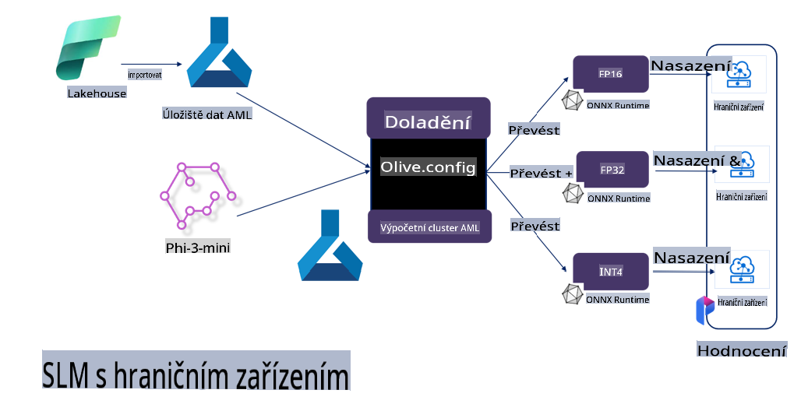

# **Doladění Phi-3 s Microsoft Olive**

[Olive](https://github.com/microsoft/OLive?WT.mc_id=aiml-138114-kinfeylo) je snadno použitelný nástroj pro optimalizaci modelů s ohledem na hardware, který spojuje špičkové techniky v oblasti komprese, optimalizace a kompilace modelů.

Je navržen tak, aby zjednodušil proces optimalizace strojově učících modelů a zajistil jejich co nejefektivnější využití specifických hardwarových architektur.

Ať už pracujete na aplikacích v cloudu nebo na zařízeních na okraji sítě, Olive vám umožní optimalizovat vaše modely snadno a efektivně.

## Klíčové vlastnosti:
- Olive sjednocuje a automatizuje optimalizační techniky pro požadované hardwarové cíle.
- Neexistuje jediná optimalizační technika, která by vyhovovala všem scénářům, a proto Olive umožňuje rozšiřitelnost tím, že odborníkům z průmyslu dovoluje přidávat vlastní inovace.

## Snížení náročnosti vývoje:
- Vývojáři často musí zvládnout a používat různé nástroje specifické pro dodavatele hardwaru, aby připravili a optimalizovali trénované modely pro nasazení.
- Olive tento proces zjednodušuje tím, že automatizuje optimalizační techniky pro požadovaný hardware.

## Připravené E2E řešení optimalizace:

Díky skládání a ladění integrovaných technik nabízí Olive jednotné řešení pro end-to-end optimalizaci.
Při optimalizaci modelů bere v úvahu omezení, jako je přesnost a latence.

## Použití Microsoft Olive pro doladění

Microsoft Olive je velmi snadno použitelný open-source nástroj pro optimalizaci modelů, který pokrývá jak doladění, tak referenci v oblasti generativní umělé inteligence. Stačí jednoduchá konfigurace v kombinaci s použitím open-source malých jazykových modelů a souvisejících runtime prostředí (AzureML / lokální GPU, CPU, DirectML). Automatická optimalizace vám umožní dokončit doladění nebo referenci modelu a najít nejlepší model pro nasazení do cloudu nebo na okrajová zařízení. Firmy tak mohou vytvářet vlastní vertikální modely na místě i v cloudu.


## Doladění Phi-3 s Microsoft Olive 



## Ukázkový kód a příklad pro Phi-3 Olive
V tomto příkladu použijete Olive k:

- Doladění LoRA adaptéru pro klasifikaci frází na Smutek, Radost, Strach, Překvapení.
- Sloučení vah adaptéru do základního modelu.
- Optimalizaci a kvantizaci modelu na int4.

[Ukázkový kód](../../code/03.Finetuning/olive-ort-example/README.md)

### Instalace Microsoft Olive

Instalace Microsoft Olive je velmi jednoduchá a je dostupná pro CPU, GPU, DirectML a Azure ML.

```bash
pip install olive-ai
```

Pokud chcete spustit ONNX model na CPU, můžete použít:

```bash
pip install olive-ai[cpu]
```

Pokud chcete spustit ONNX model na GPU, můžete použít:

```python
pip install olive-ai[gpu]
```

Pokud chcete použít Azure ML, použijte:

```python
pip install git+https://github.com/microsoft/Olive#egg=olive-ai[azureml]
```

**Poznámka**
Požadavky na OS: Ubuntu 20.04 / 22.04 

### **Config.json Microsoft Olive**

Po instalaci můžete prostřednictvím konfiguračního souboru nastavit různé modelově specifické parametry, včetně dat, výpočtů, trénování, nasazení a generování modelu.

**1. Data**

Na Microsoft Olive lze podporovat trénování na lokálních i cloudových datech, což lze nastavit v konfiguraci.

*Lokální nastavení dat*

Jednoduše nastavte datovou sadu, která se má použít pro doladění, obvykle ve formátu JSON, a přizpůsobte ji šabloně dat. To je třeba upravit podle požadavků modelu (například přizpůsobit formátu vyžadovanému Microsoft Phi-3-mini. Pokud máte jiné modely, řiďte se požadovanými formáty doladění těchto modelů).

```json

    "data_configs": [
        {
            "name": "dataset_default_train",
            "type": "HuggingfaceContainer",
            "load_dataset_config": {
                "params": {
                    "data_name": "json", 
                    "data_files":"dataset/dataset-classification.json",
                    "split": "train"
                }
            },
            "pre_process_data_config": {
                "params": {
                    "dataset_type": "corpus",
                    "text_cols": [
                            "phrase",
                            "tone"
                    ],
                    "text_template": "### Text: {phrase}\n### The tone is:\n{tone}",
                    "corpus_strategy": "join",
                    "source_max_len": 2048,
                    "pad_to_max_len": false,
                    "use_attention_mask": false
                }
            }
        }
    ],
```

**Nastavení cloudového zdroje dat**

Propojením datového úložiště Azure AI Studio/Azure Machine Learning Service s daty v cloudu můžete zvolit různé zdroje dat prostřednictvím Microsoft Fabric a Azure Data jako podporu pro doladění dat.

```json

    "data_configs": [
        {
            "name": "dataset_default_train",
            "type": "HuggingfaceContainer",
            "load_dataset_config": {
                "params": {
                    "data_name": "json", 
                    "data_files": {
                        "type": "azureml_datastore",
                        "config": {
                            "azureml_client": {
                                "subscription_id": "Your Azure Subscrition ID",
                                "resource_group": "Your Azure Resource Group",
                                "workspace_name": "Your Azure ML Workspaces name"
                            },
                            "datastore_name": "workspaceblobstore",
                            "relative_path": "Your train_data.json Azure ML Location"
                        }
                    },
                    "split": "train"
                }
            },
            "pre_process_data_config": {
                "params": {
                    "dataset_type": "corpus",
                    "text_cols": [
                            "Question",
                            "Best Answer"
                    ],
                    "text_template": "<|user|>\n{Question}<|end|>\n<|assistant|>\n{Best Answer}\n<|end|>",
                    "corpus_strategy": "join",
                    "source_max_len": 2048,
                    "pad_to_max_len": false,
                    "use_attention_mask": false
                }
            }
        }
    ],
    
```

**2. Konfigurace výpočtů**

Pokud chcete zůstat lokální, můžete přímo využít lokální datové zdroje. Pro využití zdrojů Azure AI Studio / Azure Machine Learning Service je třeba nastavit příslušné parametry Azure, název výpočetního výkonu atd.

```json

    "systems": {
        "aml": {
            "type": "AzureML",
            "config": {
                "accelerators": ["gpu"],
                "hf_token": true,
                "aml_compute": "Your Azure AI Studio / Azure Machine Learning Service Compute Name",
                "aml_docker_config": {
                    "base_image": "Your Azure AI Studio / Azure Machine Learning Service docker",
                    "conda_file_path": "conda.yaml"
                }
            }
        },
        "azure_arc": {
            "type": "AzureML",
            "config": {
                "accelerators": ["gpu"],
                "aml_compute": "Your Azure AI Studio / Azure Machine Learning Service Compute Name",
                "aml_docker_config": {
                    "base_image": "Your Azure AI Studio / Azure Machine Learning Service docker",
                    "conda_file_path": "conda.yaml"
                }
            }
        }
    },
```

***Poznámka***

Protože se spouští prostřednictvím kontejneru na Azure AI Studio / Azure Machine Learning Service, je třeba nastavit požadované prostředí. To se konfiguruje v souboru conda.yaml.

```yaml

name: project_environment
channels:
  - defaults
dependencies:
  - python=3.8.13
  - pip=22.3.1
  - pip:
      - einops
      - accelerate
      - azure-keyvault-secrets
      - azure-identity
      - bitsandbytes
      - datasets
      - huggingface_hub
      - peft
      - scipy
      - sentencepiece
      - torch>=2.2.0
      - transformers
      - git+https://github.com/microsoft/Olive@jiapli/mlflow_loading_fix#egg=olive-ai[gpu]
      - --extra-index-url https://aiinfra.pkgs.visualstudio.com/PublicPackages/_packaging/ORT-Nightly/pypi/simple/ 
      - ort-nightly-gpu==1.18.0.dev20240307004
      - --extra-index-url https://aiinfra.pkgs.visualstudio.com/PublicPackages/_packaging/onnxruntime-genai/pypi/simple/
      - onnxruntime-genai-cuda

    

```

**3. Výběr SLM**

Model můžete použít přímo z Hugging Face, nebo jej můžete kombinovat s Model Catalog Azure AI Studio / Azure Machine Learning pro výběr modelu. V níže uvedeném příkladu kódu použijeme jako příklad Microsoft Phi-3-mini.

Pokud máte model lokálně, použijte tento způsob:

```json

    "input_model":{
        "type": "PyTorchModel",
        "config": {
            "hf_config": {
                "model_name": "model-cache/microsoft/phi-3-mini",
                "task": "text-generation",
                "model_loading_args": {
                    "trust_remote_code": true
                }
            }
        }
    },
```

Pokud chcete použít model z Azure AI Studio / Azure Machine Learning Service, použijte tento způsob:

```json

    "input_model":{
        "type": "PyTorchModel",
        "config": {
            "model_path": {
                "type": "azureml_registry_model",
                "config": {
                    "name": "microsoft/Phi-3-mini-4k-instruct",
                    "registry_name": "azureml-msr",
                    "version": "11"
                }
            },
             "model_file_format": "PyTorch.MLflow",
             "hf_config": {
                "model_name": "microsoft/Phi-3-mini-4k-instruct",
                "task": "text-generation",
                "from_pretrained_args": {
                    "trust_remote_code": true
                }
            }
        }
    },
```

**Poznámka:**
Pro integraci s Azure AI Studio / Azure Machine Learning Service při nastavování modelu prosím zohledněte číslo verze a související pojmenování.

Všechny modely na Azure musí být nastaveny na PyTorch.MLflow.

Musíte mít účet na Hugging Face a propojit klíč s Key value v Azure AI Studio / Azure Machine Learning.

**4. Algoritmus**

Microsoft Olive velmi dobře integruje algoritmy pro doladění Lora a QLora. Stačí nakonfigurovat některé relevantní parametry. Zde uvádím příklad QLora.

```json
        "lora": {
            "type": "LoRA",
            "config": {
                "target_modules": [
                    "o_proj",
                    "qkv_proj"
                ],
                "double_quant": true,
                "lora_r": 64,
                "lora_alpha": 64,
                "lora_dropout": 0.1,
                "train_data_config": "dataset_default_train",
                "eval_dataset_size": 0.3,
                "training_args": {
                    "seed": 0,
                    "data_seed": 42,
                    "per_device_train_batch_size": 1,
                    "per_device_eval_batch_size": 1,
                    "gradient_accumulation_steps": 4,
                    "gradient_checkpointing": false,
                    "learning_rate": 0.0001,
                    "num_train_epochs": 3,
                    "max_steps": 10,
                    "logging_steps": 10,
                    "evaluation_strategy": "steps",
                    "eval_steps": 187,
                    "group_by_length": true,
                    "adam_beta2": 0.999,
                    "max_grad_norm": 0.3
                }
            }
        },
```

Pokud chcete provést kvantizační převod, hlavní větev Microsoft Olive již podporuje metodu onnxruntime-genai. Můžete ji nastavit podle svých potřeb:

1. Sloučení vah adaptéru do základního modelu.
2. Převod modelu na ONNX model s požadovanou přesností pomocí ModelBuilder.

Například převod na kvantizovaný INT4:

```json

        "merge_adapter_weights": {
            "type": "MergeAdapterWeights"
        },
        "builder": {
            "type": "ModelBuilder",
            "config": {
                "precision": "int4"
            }
        }
```

**Poznámka** 
- Pokud používáte QLoRA, kvantizační převod prostřednictvím ONNXRuntime-genai zatím není podporován.

- Je třeba zdůraznit, že výše uvedené kroky lze nastavit podle vlastních potřeb. Není nutné plně konfigurovat všechny výše uvedené kroky. V závislosti na vašich požadavcích můžete přímo použít kroky algoritmu bez doladění. Nakonec je třeba nakonfigurovat příslušné enginy.

```json

    "engine": {
        "log_severity_level": 0,
        "host": "aml",
        "target": "aml",
        "search_strategy": false,
        "execution_providers": ["CUDAExecutionProvider"],
        "cache_dir": "../model-cache/models/phi3-finetuned/cache",
        "output_dir" : "../model-cache/models/phi3-finetuned"
    }
```

**5. Dokončení doladění**

Na příkazové řádce spusťte v adresáři s olive-config.json:

```bash
olive run --config olive-config.json  
```

**Prohlášení**:  
Tento dokument byl přeložen pomocí strojových AI překladových služeb. I když se snažíme o přesnost, vezměte prosím na vědomí, že automatizované překlady mohou obsahovat chyby nebo nepřesnosti. Původní dokument v jeho původním jazyce by měl být považován za závazný zdroj. Pro kritické informace doporučujeme profesionální lidský překlad. Neodpovídáme za žádné nedorozumění nebo nesprávné výklady vyplývající z použití tohoto překladu.