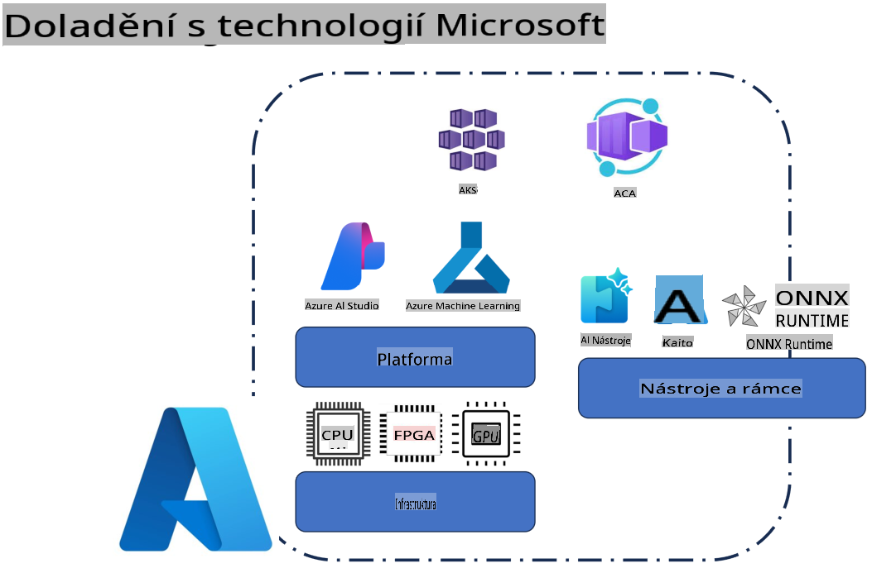
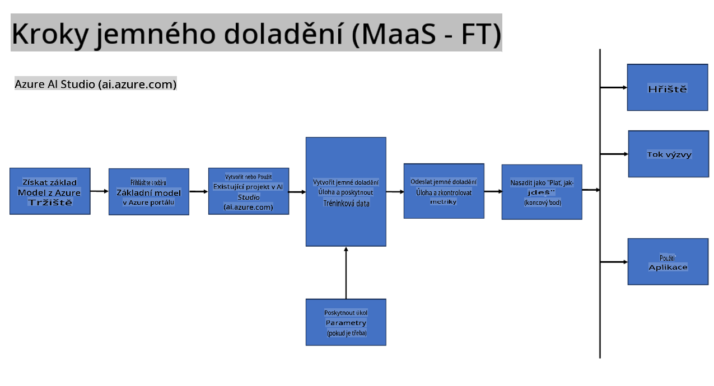
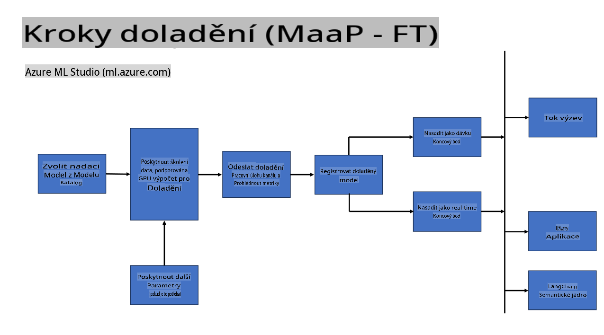
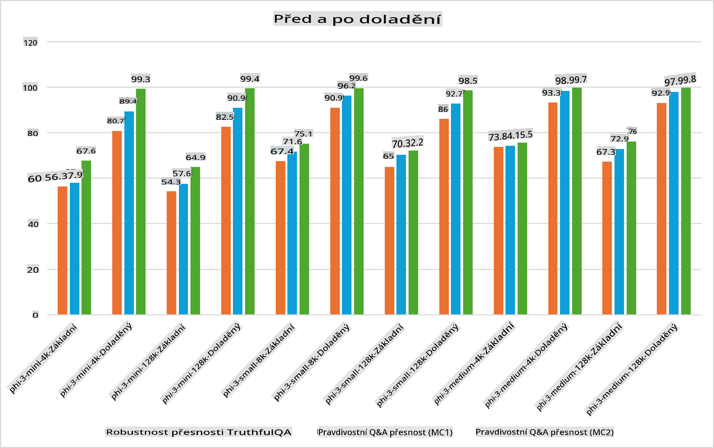

## Scénáře jemného doladění

**Platforma** Zahrnuje různé technologie, jako jsou Azure AI Foundry, Azure Machine Learning, AI Tools, Kaito a ONNX Runtime.

**Infrastruktura** Zahrnuje CPU a FPGA, které jsou klíčové pro proces jemného doladění. Ukážu vám ikony pro každou z těchto technologií.

**Nástroje a rámce** Zahrnuje ONNX Runtime a ONNX Runtime. Ukážu vám ikony pro každou z těchto technologií.  
[Vložit ikony pro ONNX Runtime a ONNX Runtime]

Proces jemného doladění pomocí technologií Microsoft zahrnuje různé komponenty a nástroje. Díky pochopení a využití těchto technologií můžeme efektivně doladit naše aplikace a vytvářet lepší řešení.

## Model jako služba

Doladění modelu pomocí hostovaného jemného doladění, bez nutnosti vytvářet a spravovat výpočetní prostředky.

Serverless jemné doladění je dostupné pro modely Phi-3-mini a Phi-3-medium, což vývojářům umožňuje rychle a snadno přizpůsobit modely pro cloudové a edge scénáře bez nutnosti zajišťovat výpočetní prostředky. Také jsme oznámili, že model Phi-3-small je nyní dostupný prostřednictvím naší nabídky Model-as-a-Service, což vývojářům umožňuje rychlý a snadný start s vývojem AI bez nutnosti spravovat podkladovou infrastrukturu.

## Model jako platforma

Uživatelé spravují vlastní výpočetní prostředky pro jemné doladění svých modelů.

[Ukázka jemného doladění](https://github.com/Azure/azureml-examples/blob/main/sdk/python/foundation-models/system/finetune/chat-completion/chat-completion.ipynb)

## Scénáře jemného doladění

| | | | | | | |
|-|-|-|-|-|-|-|
|Scénář|LoRA|QLoRA|PEFT|DeepSpeed|ZeRO|DORA|
|Přizpůsobení předtrénovaných LLM na specifické úkoly nebo domény|Ano|Ano|Ano|Ano|Ano|Ano|
|Jemné doladění pro NLP úkoly, jako je klasifikace textu, rozpoznávání pojmenovaných entit a strojový překlad|Ano|Ano|Ano|Ano|Ano|Ano|
|Jemné doladění pro úkoly otázek a odpovědí|Ano|Ano|Ano|Ano|Ano|Ano|
|Jemné doladění pro generování odpovědí podobných lidským v chatbotech|Ano|Ano|Ano|Ano|Ano|Ano|
|Jemné doladění pro generování hudby, umění nebo jiných forem kreativity|Ano|Ano|Ano|Ano|Ano|Ano|
|Snižování výpočetních a finančních nákladů|Ano|Ano|Ne|Ano|Ano|Ne|
|Snižování paměťových nároků|Ne|Ano|Ne|Ano|Ano|Ano|
|Použití menšího počtu parametrů pro efektivní jemné doladění|Ne|Ano|Ano|Ne|Ne|Ano|
|Paměťově efektivní forma paralelismu dat, která umožňuje přístup k agregované paměti GPU všech dostupných GPU zařízení|Ne|Ne|Ne|Ano|Ano|Ano|

## Příklady výkonu jemného doladění

**Upozornění**:  
Tento dokument byl přeložen pomocí strojových AI překladových služeb. Ačkoliv se snažíme o přesnost, mějte prosím na paměti, že automatické překlady mohou obsahovat chyby nebo nepřesnosti. Původní dokument v jeho původním jazyce by měl být považován za závazný zdroj. Pro důležité informace se doporučuje profesionální lidský překlad. Neodpovídáme za žádná nedorozumění nebo mylné interpretace vzniklé použitím tohoto překladu.