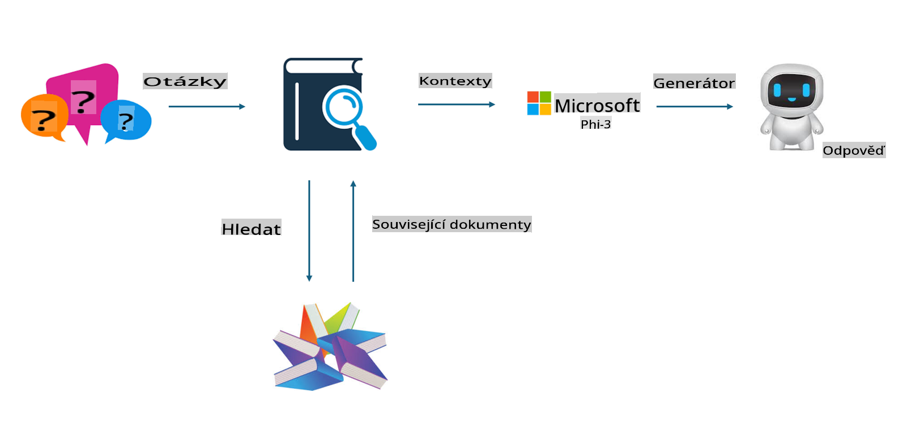

## Vyladění vs RAG

## Retrieval Augmented Generation

RAG kombinuje vyhledávání dat a generování textu. Strukturovaná a nestrukturovaná data společnosti jsou uložena ve vektorové databázi. Při vyhledávání relevantního obsahu se najde příslušné shrnutí a obsah, které vytvoří kontext, a poté se ve spojení s textovou dokončovací schopností LLM/SLM generuje výstup.

## Proces RAG

## Vyladění
Vyladění je založeno na zlepšení konkrétního modelu. Není nutné začínat od modelového algoritmu, ale je třeba neustále shromažďovat data. Pokud chcete přesnější terminologii a jazykový projev v průmyslových aplikacích, vyladění je lepší volbou. Pokud se však vaše data často mění, může být vyladění komplikované.

## Jak si vybrat
Pokud naše odpověď vyžaduje použití externích dat, RAG je nejlepší volba.

Pokud potřebujete výstup stabilních a přesných průmyslových znalostí, vyladění bude dobrou volbou. RAG upřednostňuje vyhledávání relevantního obsahu, ale nemusí vždy zachytit specifické nuance.

Vyladění vyžaduje vysoce kvalitní datovou sadu, a pokud se jedná jen o malý rozsah dat, nebude rozdíl příliš patrný. RAG je flexibilnější.  
Vyladění je jako černá skříňka, metafyzika, a je těžké pochopit jeho vnitřní mechanismus. Naopak RAG usnadňuje nalezení zdroje dat, čímž umožňuje efektivní úpravu halucinací nebo chyb v obsahu a poskytuje lepší transparentnost.

**Upozornění**:  
Tento dokument byl přeložen pomocí strojových AI překladatelských služeb. Přestože usilujeme o přesnost, mějte prosím na paměti, že automatizované překlady mohou obsahovat chyby nebo nepřesnosti. Původní dokument v jeho rodném jazyce by měl být považován za autoritativní zdroj. Pro kritické informace doporučujeme profesionální lidský překlad. Neneseme odpovědnost za jakékoli nedorozumění nebo nesprávné interpretace vyplývající z použití tohoto překladu.