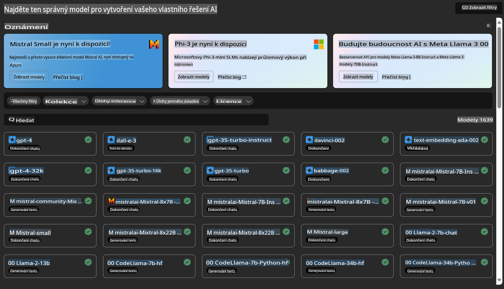

# **Představení služby Azure Machine Learning**

[Azure Machine Learning](https://ml.azure.com?WT.mc_id=aiml-138114-kinfeylo) je cloudová služba pro urychlení a správu životního cyklu projektů strojového učení (ML).

Odborníci na ML, datoví vědci a inženýři ji mohou využívat v rámci svých každodenních pracovních postupů k:

- Trénování a nasazování modelů.
Správě operací strojového učení (MLOps).
- Můžete vytvořit model v Azure Machine Learning nebo použít model vytvořený na open-source platformách, jako jsou PyTorch, TensorFlow nebo scikit-learn.
- Nástroje MLOps vám pomohou monitorovat, přeškolovat a znovu nasazovat modely.

## Pro koho je Azure Machine Learning určen?

**Datoví vědci a ML inženýři**

Mohou využívat nástroje k urychlení a automatizaci svých každodenních pracovních postupů.
Azure ML poskytuje funkce pro zajištění férovosti, vysvětlitelnosti, sledování a auditovatelnosti.

**Vývojáři aplikací**

Mohou hladce integrovat modely do aplikací nebo služeb.

**Platformní vývojáři**

Mají přístup k robustní sadě nástrojů, které jsou podpořeny odolnými API služby Azure Resource Manager.
Tyto nástroje umožňují vytvářet pokročilé nástroje pro ML.

**Podniky**

Práce v cloudovém prostředí Microsoft Azure přináší podnikům výhody známého zabezpečení a řízení přístupu na základě rolí.
Nastavte projekty tak, aby kontrolovaly přístup k chráněným datům a specifickým operacím.

## Produktivita pro všechny členy týmu
Projekty strojového učení často vyžadují tým s různorodými dovednostmi pro jejich vytvoření a údržbu.

Azure ML poskytuje nástroje, které vám umožní:
- Spolupracovat s vaším týmem prostřednictvím sdílených notebooků, výpočetních zdrojů, serverless výpočetů, dat a prostředí.
- Vyvíjet modely s férovostí, vysvětlitelností, sledovatelností a auditovatelností, aby splňovaly požadavky na sledovatelnost a auditní shodu.
- Rychle a snadno nasazovat ML modely ve velkém měřítku a efektivně je spravovat a řídit pomocí MLOps.
- Spouštět pracovní zátěže strojového učení kdekoli s vestavěným řízením, zabezpečením a shodou.

## Nástroje kompatibilní napříč platformami

Každý člen ML týmu může použít své preferované nástroje k dokončení práce.
Ať už provádíte rychlé experimenty, ladíte hyperparametry, vytváříte pipelines nebo spravujete inference, můžete využít známá rozhraní, včetně:
- Azure Machine Learning Studio
- Python SDK (v2)
- Azure CLI (v2)
- Azure Resource Manager REST API

Jak zdokonalujete modely a spolupracujete během vývojového cyklu, můžete sdílet a nalézat aktiva, zdroje a metriky v uživatelském rozhraní Azure Machine Learning Studio.

## **LLM/SLM v Azure ML**

Azure ML přidalo mnoho funkcí souvisejících s LLM/SLM, které kombinují LLMOps a SLMOps, a tím vytváří generativní technologickou platformu umělé inteligence pro celé podniky.

### **Katalog modelů**

Podnikoví uživatelé mohou nasazovat různé modely podle různých obchodních scénářů prostřednictvím Katalogu modelů a poskytovat služby jako Model as Service, aby k nim měli přístup podnikoví vývojáři nebo uživatelé.

Katalog modelů v Azure Machine Learning Studio je centrem pro objevování a používání široké škály modelů, které vám umožní vytvářet aplikace Generative AI. Katalog modelů zahrnuje stovky modelů od poskytovatelů, jako je Azure OpenAI Service, Mistral, Meta, Cohere, Nvidia, Hugging Face, včetně modelů trénovaných společností Microsoft. Modely od jiných poskytovatelů než Microsoft jsou definovány jako Produkty třetích stran podle Podmínek produktů Microsoft a podléhají podmínkám poskytovaným s modelem.

### **Job Pipeline**

Jádrem pipeline strojového učení je rozdělení kompletní úlohy strojového učení na vícestupňový pracovní postup. Každý krok je zvládnutelná komponenta, kterou lze samostatně vyvíjet, optimalizovat, konfigurovat a automatizovat. Kroky jsou propojeny prostřednictvím dobře definovaných rozhraní. Služba pipeline Azure Machine Learning automaticky orchestruje všechny závislosti mezi kroky pipeline.

Při doladění SLM / LLM můžeme spravovat naše data, tréninkové a generační procesy prostřednictvím Pipeline.

### **Prompt flow**

Výhody používání Azure Machine Learning prompt flow
Azure Machine Learning prompt flow nabízí řadu výhod, které uživatelům pomáhají přejít od nápadu k experimentování a nakonec k produkčně připraveným aplikacím založeným na LLM:

**Agilita v návrhu promptů**

Interaktivní prostředí pro tvorbu: Azure Machine Learning prompt flow poskytuje vizuální reprezentaci struktury flow, což uživatelům umožňuje snadno pochopit a navigovat jejich projekty. Nabízí také prostředí pro kódování podobné notebookům pro efektivní vývoj a ladění flow.
Varianty pro ladění promptů: Uživatelé mohou vytvářet a porovnávat více variant promptů, což usnadňuje iterativní proces zdokonalování.

Hodnocení: Vestavěné hodnoticí flow umožňují uživatelům posoudit kvalitu a účinnost jejich promptů a flow.

Komplexní zdroje: Azure Machine Learning prompt flow zahrnuje knihovnu vestavěných nástrojů, ukázek a šablon, které slouží jako výchozí bod pro vývoj, inspirují kreativitu a urychlují proces.

**Podniková připravenost pro aplikace založené na LLM**

Spolupráce: Azure Machine Learning prompt flow podporuje týmovou spolupráci, což umožňuje více uživatelům pracovat společně na projektech návrhu promptů, sdílet znalosti a udržovat kontrolu verzí.

All-in-one platforma: Azure Machine Learning prompt flow zjednodušuje celý proces návrhu promptů, od vývoje a hodnocení až po nasazení a monitorování. Uživatelé mohou snadno nasadit své flow jako koncové body Azure Machine Learning a monitorovat jejich výkon v reálném čase, což zajišťuje optimální provoz a neustálé zlepšování.

Řešení podnikové připravenosti Azure Machine Learning: Prompt flow využívá robustní řešení podnikové připravenosti Azure Machine Learning, která poskytují bezpečný, škálovatelný a spolehlivý základ pro vývoj, experimentování a nasazení flow.

S Azure Machine Learning prompt flow mohou uživatelé uvolnit svou agilitu v návrhu promptů, efektivně spolupracovat a využívat podniková řešení pro úspěšný vývoj a nasazení aplikací založených na LLM.

Kombinací výpočetního výkonu, dat a různých komponent Azure ML mohou podnikoví vývojáři snadno vytvářet své vlastní aplikace umělé inteligence.

**Upozornění**:  
Tento dokument byl přeložen pomocí strojových AI překladových služeb. Přestože se snažíme o přesnost, vezměte prosím na vědomí, že automatické překlady mohou obsahovat chyby nebo nepřesnosti. Původní dokument v jeho rodném jazyce by měl být považován za autoritativní zdroj. Pro důležité informace se doporučuje profesionální lidský překlad. Neodpovídáme za jakékoli nedorozumění nebo nesprávné interpretace vyplývající z použití tohoto překladu.