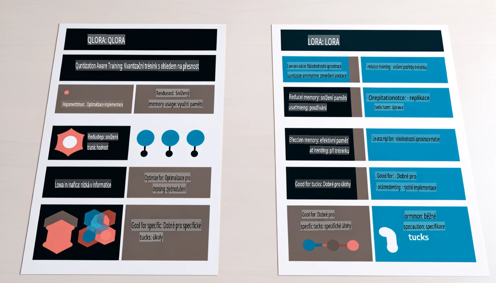

# **Nechte Phi-3 stát se odborníkem v oboru**

Abyste mohli model Phi-3 začlenit do průmyslového prostředí, je třeba do něj přidat obchodní data z daného odvětví. Máme dvě různé možnosti: první je RAG (Retrieval Augmented Generation) a druhá je Fine Tuning.

## **RAG vs Fine-Tuning**

### **Retrieval Augmented Generation**

RAG kombinuje vyhledávání dat s generováním textu. Strukturovaná i nestrukturovaná data podniku jsou uložena ve vektorové databázi. Při vyhledávání relevantního obsahu se nalezne odpovídající souhrn a obsah, které vytvoří kontext, a následně se využije schopnost LLM/SLM generovat text.

### **Fine-tuning**

Fine-tuning je založen na vylepšení konkrétního modelu. Není nutné začínat od základního algoritmu modelu, ale je potřeba průběžně shromažďovat data. Pokud chcete dosáhnout přesnější terminologie a jazykového vyjádření v průmyslových aplikacích, fine-tuning je lepší volbou. Pokud se však vaše data často mění, může se fine-tuning stát složitým.

### **Jak si vybrat**

1. Pokud naše odpověď vyžaduje zapojení externích dat, RAG je nejlepší volbou.

2. Pokud potřebujete stabilní a přesné odborné znalosti z oboru, fine-tuning bude vhodnější. RAG se zaměřuje na vyhledání relevantního obsahu, ale nemusí vždy dokonale vystihnout specializované nuance.

3. Fine-tuning vyžaduje vysoce kvalitní datovou sadu, a pokud jde pouze o malý rozsah dat, nebude mít velký přínos. RAG je flexibilnější.

4. Fine-tuning je jako černá skříňka, obtížně pochopitelná, zatímco RAG umožňuje snadněji dohledat zdroj dat, čímž efektivně snižuje halucinace nebo chyby v obsahu a zvyšuje transparentnost.

### **Scénáře**

1. Vertikální průmyslová odvětví, která vyžadují specifickou odbornou terminologii a vyjadřování, ***Fine-tuning*** bude nejlepší volbou.

2. Systémy otázek a odpovědí, které zahrnují syntézu různých znalostních bodů, ***RAG*** bude nejlepší volbou.

3. Kombinace automatizovaného obchodního toku ***RAG + Fine-tuning*** je nejlepší volbou.

## **Jak používat RAG**

Vektorová databáze je sbírka dat uložených v matematické formě. Vektorové databáze usnadňují modelům strojového učení zapamatovat si předchozí vstupy, což umožňuje využití strojového učení pro případy použití, jako je vyhledávání, doporučování a generování textu. Data lze identifikovat na základě metrik podobnosti místo přesných shod, což umožňuje modelům lépe pochopit kontext dat.

Vektorová databáze je klíčem k realizaci RAG. Data můžeme převést do vektorového úložiště pomocí vektorových modelů, jako jsou text-embedding-3, jina-ai-embedding atd.

Více informací o vytváření RAG aplikací naleznete na [https://github.com/microsoft/Phi-3CookBook](https://github.com/microsoft/Phi-3CookBook?WT.mc_id=aiml-138114-kinfeylo).

## **Jak používat Fine-tuning**

Mezi běžně používané algoritmy pro Fine-tuning patří Lora a QLora. Jak si vybrat?
- [Více informací v tomto ukázkovém notebooku](../../../../code/04.Finetuning/Phi_3_Inference_Finetuning.ipynb)
- [Příklad Python FineTuning Sample](../../../../code/04.Finetuning/FineTrainingScript.py)

### **Lora a QLora**

LoRA (Low-Rank Adaptation) a QLoRA (Quantized Low-Rank Adaptation) jsou techniky používané k dolaďování velkých jazykových modelů (LLMs) pomocí efektivního ladění parametrů (PEFT). PEFT techniky jsou navrženy tak, aby umožnily efektivnější trénování modelů než tradiční metody.  
LoRA je samostatná technika dolaďování, která snižuje paměťové nároky použitím aproximace nízkého řádu na matici aktualizace vah. Nabízí rychlé časy trénování a zachovává výkon blízký tradičním metodám dolaďování.

QLoRA je rozšířená verze LoRA, která zahrnuje kvantizační techniky pro další snížení paměťových nároků. QLoRA kvantizuje přesnost váhových parametrů v předtrénovaném LLM na 4bitovou přesnost, což je paměťově úspornější než LoRA. Nicméně trénování QLoRA je přibližně o 30 % pomalejší než u LoRA kvůli dodatečným krokům kvantizace a dekvantizace.

QLoRA využívá LoRA jako doplněk k opravě chyb zavedených během kvantizace. QLoRA umožňuje dolaďování masivních modelů s miliardami parametrů na relativně malých, snadno dostupných GPU. Například QLoRA dokáže dolaďovat model s 70 miliardami parametrů, který by jinak vyžadoval 36 GPU, s použitím pouze 2.

**Upozornění**:  
Tento dokument byl přeložen pomocí strojových AI překladatelských služeb. I když se snažíme o přesnost, vezměte prosím na vědomí, že automatické překlady mohou obsahovat chyby nebo nepřesnosti. Původní dokument v jeho původním jazyce by měl být považován za závazný zdroj. Pro kritické informace se doporučuje profesionální lidský překlad. Neodpovídáme za jakékoli nedorozumění nebo chybné interpretace vyplývající z použití tohoto překladu.