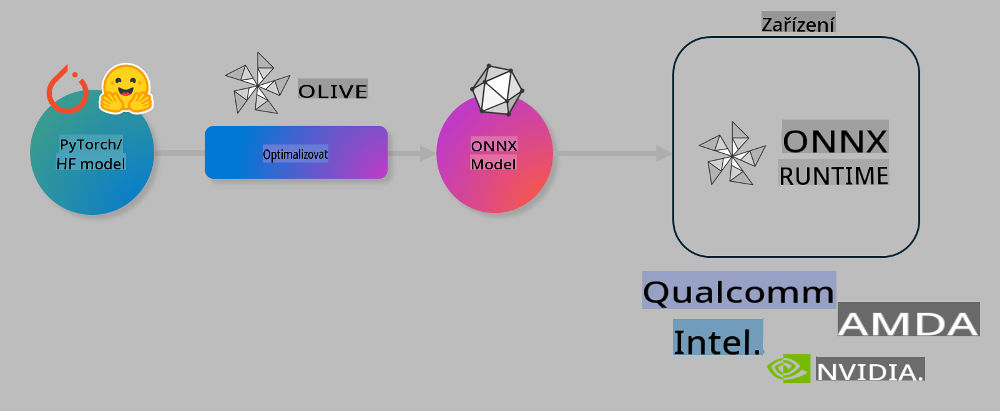

# Lab. Optimalizace AI modelů pro inference na zařízení

## Úvod

> [!IMPORTANT]
> Tento lab vyžaduje **Nvidia A10 nebo A100 GPU** s nainstalovanými odpovídajícími ovladači a CUDA toolkitem (verze 12+).

> [!NOTE]
> Jedná se o **35minutový** lab, který vám poskytne praktický úvod do základních konceptů optimalizace modelů pro inference na zařízení pomocí nástroje OLIVE.

## Cíle učení

Na konci tohoto labu budete schopni používat OLIVE k:

- Kvantizaci AI modelu pomocí metody kvantizace AWQ.
- Doladění AI modelu pro specifický úkol.
- Generování LoRA adaptérů (doladěný model) pro efektivní inference na zařízení pomocí ONNX Runtime.

### Co je Olive

Olive (*O*NNX *live*) je nástroj pro optimalizaci modelů s přiloženým CLI, který umožňuje nasazení modelů pro ONNX runtime +++https://onnxruntime.ai+++ s vysokou kvalitou a výkonem.



Vstupem pro Olive je obvykle model PyTorch nebo Hugging Face a výstupem je optimalizovaný ONNX model, který se spouští na zařízení (cílové nasazení) běžícím na ONNX runtime. Olive optimalizuje model pro AI akcelerátor cílového zařízení (NPU, GPU, CPU) poskytovaný hardwarovým výrobcem, jako je Qualcomm, AMD, Nvidia nebo Intel.

Olive provádí *workflow*, což je uspořádaná sekvence jednotlivých úkolů optimalizace modelu nazývaných *passes* – příklady zahrnují: kompresi modelu, zachycení grafu, kvantizaci, optimalizaci grafu. Každý průchod má sadu parametrů, které lze ladit za účelem dosažení nejlepších metrik, například přesnosti a latence, které jsou hodnoceny příslušným hodnotitelem. Olive využívá vyhledávací strategii, která používá algoritmus pro automatické ladění jednotlivých průchodů nebo jejich skupin.

#### Výhody Olive

- **Snižuje frustraci a čas** spojený s ručním experimentováním různých technik optimalizace grafu, komprese a kvantizace. Definujte své požadavky na kvalitu a výkon a nechte Olive automaticky najít nejlepší model.
- **Více než 40 vestavěných komponent pro optimalizaci modelu**, pokrývajících nejmodernější techniky kvantizace, komprese, optimalizace grafu a doladění.
- **Jednoduché CLI** pro běžné úkoly optimalizace modelu. Například olive quantize, olive auto-opt, olive finetune.
- Vestavěné balení a nasazení modelů.
- Podpora generování modelů pro **Multi LoRA serving**.
- Možnost vytvářet workflow pomocí YAML/JSON pro orchestraci úkolů optimalizace a nasazení modelu.
- Integrace s **Hugging Face** a **Azure AI**.
- Vestavěný mechanismus **cachování** pro **úsporu nákladů**.

## Instrukce k labu
> [!NOTE]
> Ujistěte se, že máte připravený Azure AI Hub a Projekt a nastavili jste svůj A100 výpočetní uzel podle Labu 1.

### Krok 0: Připojení k Azure AI Compute

Připojíte se k Azure AI Compute pomocí vzdálené funkce v **VS Code.**

1. Otevřete svou desktopovou aplikaci **VS Code**:
1. Otevřete **Command Palette** pomocí **Shift+Ctrl+P**.
1. V Command Palette vyhledejte **AzureML - remote: Connect to compute instance in New Window**.
1. Postupujte podle pokynů na obrazovce pro připojení k výpočetnímu uzlu. To bude zahrnovat výběr vašeho Azure Subscription, Resource Group, Project a Compute name, které jste nastavili v Labu 1.
1. Jakmile budete připojeni k Azure ML Compute, bude to zobrazeno v **levém dolním rohu Visual Code** `><Azure ML: Compute Name`.

### Krok 1: Klonování tohoto repozitáře

V VS Code otevřete nový terminál pomocí **Ctrl+J** a klonujte tento repozitář:

V terminálu byste měli vidět prompt

```
azureuser@computername:~/cloudfiles/code$ 
```
Klonujte řešení

```bash
cd ~/localfiles
git clone https://github.com/microsoft/phi-3cookbook.git
```

### Krok 2: Otevření složky v VS Code

Pro otevření VS Code ve správné složce spusťte následující příkaz v terminálu, který otevře nové okno:

```bash
code phi-3cookbook/code/04.Finetuning/Olive-lab
```

Alternativně můžete složku otevřít výběrem **File** > **Open Folder**.

### Krok 3: Závislosti

Otevřete okno terminálu v VS Code na vašem Azure AI Compute Instance (tip: **Ctrl+J**) a spusťte následující příkazy pro instalaci závislostí:

```bash
conda create -n olive-ai python=3.11 -y
conda activate olive-ai
pip install -r requirements.txt
az extension remove -n azure-cli-ml
az extension add -n ml
```

> [!NOTE]
> Instalace všech závislostí zabere přibližně ~5 minut.

V tomto labu budete stahovat a nahrávat modely do katalogu modelů Azure AI. Abyste mohli přistupovat ke katalogu modelů, budete se muset přihlásit do Azure pomocí:

```bash
az login
```

> [!NOTE]
> Při přihlášení budete vyzváni k výběru svého předplatného. Ujistěte se, že jste nastavili předplatné na to, které bylo poskytnuto pro tento lab.

### Krok 4: Spuštění příkazů Olive 

Otevřete okno terminálu v VS Code na vašem Azure AI Compute Instance (tip: **Ctrl+J**) a ujistěte se, že je aktivováno conda prostředí `olive-ai`:

```bash
conda activate olive-ai
```

Poté spusťte následující příkazy Olive na příkazové řádce.

1. **Prohlédněte si data:** V tomto příkladu budete doladit model Phi-3.5-Mini tak, aby byl specializovaný na odpovídání na otázky týkající se cestování. Následující kód zobrazí první záznamy datasetu ve formátu JSON lines:
   
    ```bash
    head data/data_sample_travel.jsonl
    ```
1. **Kvantizujte model:** Před trénováním modelu nejprve proveďte kvantizaci pomocí následujícího příkazu, který využívá techniku nazvanou Active Aware Quantization (AWQ) +++https://arxiv.org/abs/2306.00978+++. AWQ kvantizuje váhy modelu s ohledem na aktivace produkované během inference. To znamená, že proces kvantizace bere v úvahu skutečné rozložení dat v aktivacích, což vede k lepšímu zachování přesnosti modelu ve srovnání s tradičními metodami kvantizace vah.
    
    ```bash
    olive quantize \
       --model_name_or_path microsoft/Phi-3.5-mini-instruct \
       --trust_remote_code \
       --algorithm awq \
       --output_path models/phi/awq \
       --log_level 1
    ```
    
    Kvantizace pomocí AWQ zabere **~8 minut** a **zmenší velikost modelu z ~7,5 GB na ~2,5 GB**.
   
   V tomto labu vám ukážeme, jak zadat modely z Hugging Face (například: `microsoft/Phi-3.5-mini-instruct`). However, Olive also allows you to input models from the Azure AI catalog by updating the `model_name_or_path` argument to an Azure AI asset ID (for example:  `azureml://registries/azureml/models/Phi-3.5-mini-instruct/versions/4`). 

1. **Train the model:** Next, the `olive finetune` příkaz doladí kvantizovaný model. Kvantizace modelu *před* doladěním místo po něm poskytuje lepší přesnost, protože proces doladění obnoví část ztráty z kvantizace.
    
    ```bash
    olive finetune \
        --method lora \
        --model_name_or_path models/phi/awq \
        --data_files "data/data_sample_travel.jsonl" \
        --data_name "json" \
        --text_template "<|user|>\n{prompt}<|end|>\n<|assistant|>\n{response}<|end|>" \
        --max_steps 100 \
        --output_path ./models/phi/ft \
        --log_level 1
    ```
    
    Doladění (s 100 kroky) zabere **~6 minut**.

1. **Optimalizujte:** S trénovaným modelem nyní optimalizujte model pomocí příkazu Olive `auto-opt` command, which will capture the ONNX graph and automatically perform a number of optimizations to improve the model performance for CPU by compressing the model and doing fusions. It should be noted, that you can also optimize for other devices such as NPU or GPU by just updating the `--device` and `--provider` argumenty - ale pro účely tohoto labu použijeme CPU.

    ```bash
    olive auto-opt \
       --model_name_or_path models/phi/ft/model \
       --adapter_path models/phi/ft/adapter \
       --device cpu \
       --provider CPUExecutionProvider \
       --use_ort_genai \
       --output_path models/phi/onnx-ao \
       --log_level 1
    ```
    
    Optimalizace zabere **~5 minut**.

### Krok 5: Rychlý test inference modelu

Pro otestování inference modelu vytvořte Python soubor ve své složce s názvem **app.py** a zkopírujte a vložte následující kód:

```python
import onnxruntime_genai as og
import numpy as np

print("loading model and adapters...", end="", flush=True)
model = og.Model("models/phi/onnx-ao/model")
adapters = og.Adapters(model)
adapters.load("models/phi/onnx-ao/model/adapter_weights.onnx_adapter", "travel")
print("DONE!")

tokenizer = og.Tokenizer(model)
tokenizer_stream = tokenizer.create_stream()

params = og.GeneratorParams(model)
params.set_search_options(max_length=100, past_present_share_buffer=False)
user_input = "what is the best thing to see in chicago"
params.input_ids = tokenizer.encode(f"<|user|>\n{user_input}<|end|>\n<|assistant|>\n")

generator = og.Generator(model, params)

generator.set_active_adapter(adapters, "travel")

print(f"{user_input}")

while not generator.is_done():
    generator.compute_logits()
    generator.generate_next_token()

    new_token = generator.get_next_tokens()[0]
    print(tokenizer_stream.decode(new_token), end='', flush=True)

print("\n")
```

Spusťte kód pomocí:

```bash
python app.py
```

### Krok 6: Nahrání modelu do Azure AI

Nahrání modelu do repozitáře modelů Azure AI umožňuje sdílení modelu s ostatními členy vašeho vývojového týmu a také zajišťuje verzování modelu. Pro nahrání modelu spusťte následující příkaz:

> [!NOTE]
> Aktualizujte `{}` placeholders with the name of your resource group and Azure AI Project Name. 

To find your resource group `"resourceGroup"a název Azure AI projektu, spusťte následující příkaz 

```
az ml workspace show
```

Nebo přejděte na +++ai.azure.com+++ a vyberte **management center** **project** **overview**.

Aktualizujte zástupné symboly `{}` názvem své Resource Group a názvem Azure AI Projektu.

```bash
az ml model create \
    --name ft-for-travel \
    --version 1 \
    --path ./models/phi/onnx-ao \
    --resource-group {RESOURCE_GROUP_NAME} \
    --workspace-name {PROJECT_NAME}
```
Poté můžete vidět svůj nahraný model a nasadit jej na https://ml.azure.com/model/list

**Upozornění**:  
Tento dokument byl přeložen pomocí strojových AI překladatelských služeb. I když se snažíme o přesnost, vezměte prosím na vědomí, že automatické překlady mohou obsahovat chyby nebo nepřesnosti. Původní dokument v jeho původním jazyce by měl být považován za autoritativní zdroj. Pro kritické informace se doporučuje profesionální lidský překlad. Nezodpovídáme za žádné nedorozumění nebo nesprávné interpretace vyplývající z použití tohoto překladu.