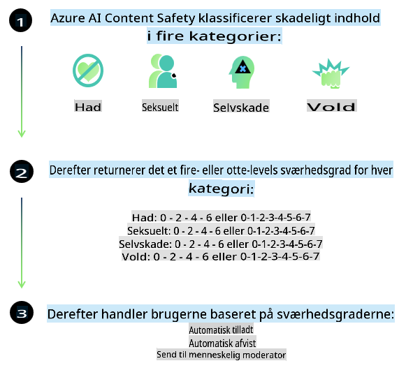
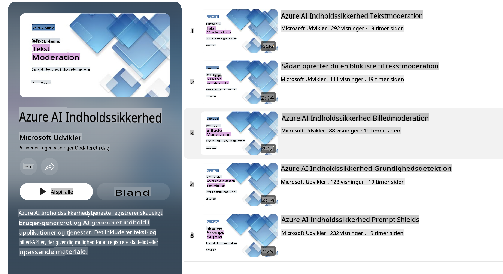

# AI-sikkerhed for Phi-modeller  
Phi-familien af modeller er udviklet i overensstemmelse med [Microsoft Responsible AI Standard](https://query.prod.cms.rt.microsoft.com/cms/api/am/binary/RE5cmFl), som er et virksomhedsdækkende sæt af krav baseret på følgende seks principper: ansvarlighed, gennemsigtighed, retfærdighed, pålidelighed og sikkerhed, privatliv og sikkerhed samt inklusion, som udgør [Microsofts principper for ansvarlig AI](https://www.microsoft.com/ai/responsible-ai).  

Ligesom de tidligere Phi-modeller blev en flerstrenget sikkerhedsevaluering og en sikkerhedsefteruddannelse anvendt, med yderligere tiltag for at tage højde for de flersprogede kapaciteter i denne udgivelse. Vores tilgang til sikkerhedstræning og evaluering, herunder test på tværs af flere sprog og risikokategorier, er beskrevet i [Phi Safety Post-Training Paper](https://arxiv.org/abs/2407.13833). Selvom Phi-modellerne drager fordel af denne tilgang, bør udviklere anvende bedste praksis for ansvarlig AI, herunder kortlægning, måling og afbødning af risici forbundet med deres specifikke anvendelsestilfælde og kulturelle og sproglige kontekst.  

## Bedste praksis  

Ligesom andre modeller kan Phi-familien af modeller potentielt opføre sig på måder, der er uretfærdige, upålidelige eller stødende.  

Nogle af de begrænsninger i SLM og LLM, som du skal være opmærksom på, inkluderer:  

- **Kvalitet af service:** Phi-modellerne er primært trænet på engelske tekster. Andre sprog end engelsk vil opleve dårligere ydeevne. Engelske sprogvarianter med mindre repræsentation i træningsdata kan opleve dårligere ydeevne end standardamerikansk engelsk.  
- **Repræsentation af skade og forstærkning af stereotyper:** Disse modeller kan over- eller underrepræsentere grupper af mennesker, slette repræsentationen af visse grupper eller forstærke nedværdigende eller negative stereotyper. På trods af sikkerhedsefteruddannelse kan disse begrænsninger stadig være til stede på grund af forskellige niveauer af repræsentation af forskellige grupper eller udbredelsen af eksempler på negative stereotyper i træningsdata, der afspejler virkelige mønstre og samfundsmæssige skævheder.  
- **Upassende eller stødende indhold:** Disse modeller kan producere andre typer upassende eller stødende indhold, hvilket kan gøre dem uegnede til anvendelse i følsomme sammenhænge uden yderligere afbødninger, der er specifikke for anvendelsestilfældet.  
- **Informationspålidelighed:** Sproglige modeller kan generere meningsløst indhold eller fabrikere indhold, der måske lyder rimeligt, men som er unøjagtigt eller forældet.  
- **Begrænset anvendelsesområde for kode:** Størstedelen af Phi-3 træningsdata er baseret på Python og bruger almindelige pakker som "typing, math, random, collections, datetime, itertools". Hvis modellen genererer Python-scripts, der bruger andre pakker eller scripts på andre sprog, anbefaler vi kraftigt, at brugere manuelt verificerer alle API-anvendelser.  

Udviklere bør anvende bedste praksis for ansvarlig AI og er ansvarlige for at sikre, at et specifikt anvendelsestilfælde overholder gældende love og regler (f.eks. privatliv, handel osv.).  

## Overvejelser om ansvarlig AI  

Ligesom andre sproglige modeller kan Phi-seriens modeller potentielt opføre sig på måder, der er uretfærdige, upålidelige eller stødende. Nogle af de begrænsninger, du skal være opmærksom på, inkluderer:  

**Kvalitet af service:** Phi-modellerne er primært trænet på engelske tekster. Andre sprog end engelsk vil opleve dårligere ydeevne. Engelske sprogvarianter med mindre repræsentation i træningsdata kan opleve dårligere ydeevne end standardamerikansk engelsk.  

**Repræsentation af skade og forstærkning af stereotyper:** Disse modeller kan over- eller underrepræsentere grupper af mennesker, slette repræsentationen af visse grupper eller forstærke nedværdigende eller negative stereotyper. På trods af sikkerhedsefteruddannelse kan disse begrænsninger stadig være til stede på grund af forskellige niveauer af repræsentation af forskellige grupper eller udbredelsen af eksempler på negative stereotyper i træningsdata, der afspejler virkelige mønstre og samfundsmæssige skævheder.  

**Upassende eller stødende indhold:** Disse modeller kan producere andre typer upassende eller stødende indhold, hvilket kan gøre dem uegnede til anvendelse i følsomme sammenhænge uden yderligere afbødninger, der er specifikke for anvendelsestilfældet.  
**Informationspålidelighed:** Sproglige modeller kan generere meningsløst indhold eller fabrikere indhold, der måske lyder rimeligt, men som er unøjagtigt eller forældet.  

**Begrænset anvendelsesområde for kode:** Størstedelen af Phi-3 træningsdata er baseret på Python og bruger almindelige pakker som "typing, math, random, collections, datetime, itertools". Hvis modellen genererer Python-scripts, der bruger andre pakker eller scripts på andre sprog, anbefaler vi kraftigt, at brugere manuelt verificerer alle API-anvendelser.  

Udviklere bør anvende bedste praksis for ansvarlig AI og er ansvarlige for at sikre, at et specifikt anvendelsestilfælde overholder gældende love og regler (f.eks. privatliv, handel osv.). Vigtige områder for overvejelse inkluderer:  

**Tildeling:** Modellerne er muligvis ikke egnede til scenarier, der kan have en betydelig indvirkning på juridisk status eller tildeling af ressourcer eller livsmuligheder (f.eks. bolig, beskæftigelse, kredit osv.) uden yderligere vurderinger og afbalanceringsmetoder.  

**Højrisiko-scenarier:** Udviklere bør vurdere, om modellerne er egnede til brug i højrisiko-scenarier, hvor uretfærdige, upålidelige eller stødende outputs kan være ekstremt kostbare eller føre til skade. Dette inkluderer at give rådgivning i følsomme eller ekspertområder, hvor nøjagtighed og pålidelighed er kritiske (f.eks. juridisk eller sundhedsmæssig rådgivning). Yderligere sikkerhedsforanstaltninger bør implementeres på applikationsniveau afhængigt af implementeringskonteksten.  

**Misinformation:** Modeller kan producere unøjagtige oplysninger. Udviklere bør følge bedste praksis for gennemsigtighed og informere slutbrugere om, at de interagerer med et AI-system. På applikationsniveau kan udviklere bygge feedback-mekanismer og pipelines for at forankre svar i brugsspecifik, kontekstuel information, en teknik kendt som Retrieval Augmented Generation (RAG).  

**Generering af skadeligt indhold:** Udviklere bør vurdere outputs i forhold til deres kontekst og bruge tilgængelige sikkerhedsklassifikatorer eller skræddersyede løsninger, der er passende for deres anvendelsestilfælde.  

**Misbrug:** Andre former for misbrug såsom svindel, spam eller produktion af malware kan være mulige, og udviklere bør sikre, at deres applikationer ikke overtræder gældende love og regler.  

### Finetuning og AI-indholdssikkerhed  

Efter finetuning af en model anbefaler vi kraftigt at benytte [Azure AI Content Safety](https://learn.microsoft.com/azure/ai-services/content-safety/overview) foranstaltninger til at overvåge det indhold, der genereres af modellerne, og identificere og blokere potentielle risici, trusler og kvalitetsproblemer.  

  

[Azure AI Content Safety](https://learn.microsoft.com/azure/ai-services/content-safety/overview) understøtter både tekst- og billedindhold. Det kan implementeres i skyen, frakoblede containere og på edge/embedded-enheder.  

## Oversigt over Azure AI Content Safety  

Azure AI Content Safety er ikke en universalløsning; det kan tilpasses til at være i overensstemmelse med virksomheders specifikke politikker. Derudover gør dets flersprogede modeller det muligt at forstå flere sprog samtidigt.  

  

- **Azure AI Content Safety**  
- **Microsoft Developer**  
- **5 videoer**  

Azure AI Content Safety-tjenesten registrerer skadeligt bruger- og AI-genereret indhold i applikationer og tjenester. Den inkluderer tekst- og billed-API'er, der gør det muligt at registrere skadeligt eller upassende materiale.  

[AI Content Safety Playlist](https://www.youtube.com/playlist?list=PLlrxD0HtieHjaQ9bJjyp1T7FeCbmVcPkQ)  

**Ansvarsfraskrivelse**:  
Dette dokument er blevet oversat ved hjælp af maskinbaserede AI-oversættelsestjenester. Selvom vi bestræber os på nøjagtighed, skal du være opmærksom på, at automatiserede oversættelser kan indeholde fejl eller unøjagtigheder. Det originale dokument på dets oprindelige sprog bør betragtes som den autoritative kilde. For kritisk information anbefales professionel menneskelig oversættelse. Vi påtager os intet ansvar for misforståelser eller fejltolkninger, der måtte opstå ved brug af denne oversættelse.