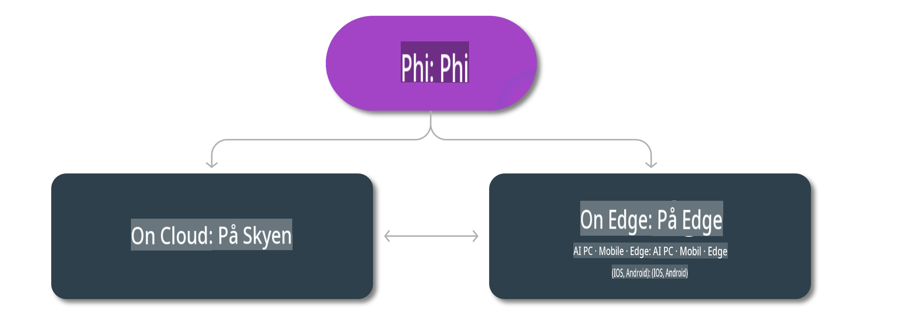

# Phi-modeller & Tilgængelighed på tværs af platforme

## Edge- og Cloud-scenarier

## Modeltilgængelighed og ressourcer

| | | | | | | | | |
|-|-|-|-|-|-|-|-|-|
|Model|Input|Indholdslængde|Azure AI (MaaS)|Azure ML (MaaP)|ONNX|Hugging Face|Ollama|Nvidia NIM|
|Phi-3-vision-128k-instruct|Tekst+Billede|128k|[Playground & Udrulning](https://ai.azure.com/explore/models/Phi-3-vision-128k-instruct/version/2/registry/azureml)|[Playground, Udrulning & Finetuning](https://ml.azure.com/registries/azureml/models/Phi-3-vision-128k-instruct/version/2)|[CUDA](https://huggingface.co/microsoft/Phi-3-vision-128k-instruct-onnx-cuda/tree/main),[CPU](https://huggingface.co/microsoft/Phi-3-vision-128k-instruct-onnx-cpu/tree/main), [DirectML](https://huggingface.co/microsoft/Phi-3-vision-128k-instruct-onnx-directml/tree/main)|[Download](https://huggingface.co/microsoft/Phi-3-vision-128k-instruct)|-NA-|[NIM API'er](https://build.nvidia.com/microsoft/phi-3-vision-128k-instruct)|
|Phi-3-mini-4k-instruct|Tekst|4k|[Playground & Udrulning](https://aka.ms/phi3-mini-4k-azure-ml)|[Playground, Udrulning](https://aka.ms/phi3-mini-4k-azure-ml) & Finetuning|[CUDA](https://huggingface.co/microsoft/Phi-3-mini-4k-instruct-onnx), [Web](https://huggingface.co/microsoft/Phi-3-mini-4k-instruct-onnx)|[Playground & Download](https://huggingface.co/chat/models/microsoft/Phi-3-mini-4k-instruct)|[GGUF](https://huggingface.co/microsoft/Phi-3-mini-4k-instruct-gguf)|[NIM API'er](https://build.nvidia.com/microsoft/phi-3-mini-4k)|
|Phi-3-mini-128k-instruct|Tekst|128k|[Playground & Udrulning](https://ai.azure.com/explore/models/Phi-3-mini-128k-instruct/version/9/registry/azureml)|[Playground, Udrulning](https://ai.azure.com/explore/models/Phi-3-mini-128k-instruct/version/9/registry/azureml) & Finetuning|[CUDA](https://huggingface.co/microsoft/Phi-3-mini-128k-instruct-onnx)|[Download](https://huggingface.co/microsoft/Phi-3-mini-128k-instruct-onnx)|-NA-|[NIM API'er](https://build.nvidia.com/microsoft/phi-3-mini)|
|Phi-3-small-8k-instruct|Tekst|8k|[Playground & Udrulning](https://ml.azure.com/registries/azureml/models/Phi-3-small-8k-instruct/version/2)|[Playground, Udrulning](https://ai.azure.com/explore/models/Phi-3-small-8k-instruct/version/2/registry/azureml) & Finetuning|[CUDA](https://huggingface.co/microsoft/Phi-3-small-8k-instruct-onnx-cuda)|[Download](https://huggingface.co/microsoft/Phi-3-small-8k-instruct-onnx-cuda)|-NA-|[NIM API'er](https://build.nvidia.com/microsoft/phi-3-small-8k-instruct?docker=false)|
|Phi-3-small-128k-instruct|Tekst|128k|[Playground & Udrulning](https://ai.azure.com/explore/models/Phi-3-small-128k-instruct/version/2/registry/azureml)|[Playground, Udrulning](https://ml.azure.com/registries/azureml/models/Phi-3-small-128k-instruct/version/2) & Finetuning|[CUDA](https://huggingface.co/microsoft/Phi-3-medium-128k-instruct-onnx-cuda)|[Download](https://huggingface.co/microsoft/Phi-3-small-128k-instruct)|-NA-|[NIM API'er](https://build.nvidia.com/microsoft/phi-3-small-128k-instruct?docker=false)|
|Phi-3-medium-4k-instruct|Tekst|4k|[Playground & Udrulning](https://huggingface.co/microsoft/Phi-3-medium-4k-instruct)|[Playground, Udrulning](https://ml.azure.com/registries/azureml/models/Phi-3-medium-4k-instruct/version/2) & Finetuning|[CUDA](https://huggingface.co/microsoft/Phi-3-medium-4k-instruct-onnx-cuda/tree/main), [CPU](https://huggingface.co/microsoft/Phi-3-medium-4k-instruct-onnx-cpu/tree/main), [DirectML](https://huggingface.co/microsoft/Phi-3-medium-4k-instruct-onnx-directml/tree/main)|[Download](https://huggingface.co/microsoft/Phi-3-medium-4k-instruct)|-NA-|[NIM API'er](https://build.nvidia.com/microsoft/phi-3-medium-4k-instruct?docker=false)|
|Phi-3-medium-128k-instruct|Tekst|128k|[Playground & Udrulning](https://ai.azure.com/explore/models/Phi-3-medium-128k-instruct/version/2)|[Playground, Udrulning](https://ml.azure.com/registries/azureml/models/Phi-3-medium-128k-instruct/version/2) & Finetuning|[CUDA](https://huggingface.co/microsoft/Phi-3-medium-128k-instruct-onnx-cuda/tree/main), [CPU](https://huggingface.co/microsoft/Phi-3-medium-128k-instruct-onnx-cpu/tree/main), [DirectML](https://huggingface.co/microsoft/Phi-3-medium-128k-instruct-onnx-directml/tree/main)|[Download](https://huggingface.co/microsoft/Phi-3-medium-128k-instruct)|-NA-|-NA-|

**Ansvarsfraskrivelse**:  
Dette dokument er blevet oversat ved hjælp af AI-baserede maskinoversættelsestjenester. Selvom vi bestræber os på nøjagtighed, skal det bemærkes, at automatiserede oversættelser kan indeholde fejl eller unøjagtigheder. Det oprindelige dokument på dets oprindelige sprog bør betragtes som den autoritative kilde. For kritisk information anbefales professionel menneskelig oversættelse. Vi påtager os intet ansvar for misforståelser eller fejltolkninger, der måtte opstå som følge af brugen af denne oversættelse.