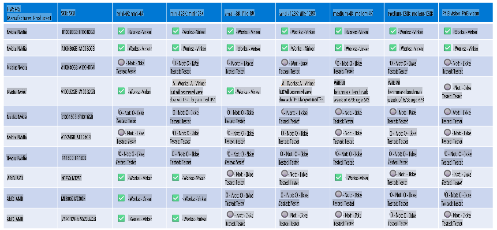

# Phi Hardware Support

Microsoft Phi er optimeret til ONNX Runtime og understøtter Windows DirectML. Det fungerer godt på tværs af forskellige hardwaretyper, herunder GPU'er, CPU'er og endda mobile enheder.

## Enhedshardware
Specifikt inkluderer den understøttede hardware:

- GPU SKU: RTX 4090 (DirectML)
- GPU SKU: 1 A100 80GB (CUDA)
- CPU SKU: Standard F64s v2 (64 vCPU'er, 128 GiB hukommelse)

## Mobile SKU

- Android - Samsung Galaxy S21
- Apple iPhone 14 eller nyere A16/A17-processor

## Phi Hardware Specifikation

- Minimumskonfiguration krævet.
- Windows: DirectX 12-kompatibel GPU og mindst 4 GB kombineret RAM

CUDA: NVIDIA GPU med Compute Capability >= 7.02



## Kørsel af onnxruntime på flere GPU'er

De aktuelt tilgængelige Phi ONNX-modeller er kun til 1 GPU. Det er muligt at understøtte multi-gpu for Phi-modeller, men ORT med 2 GPU'er garanterer ikke, at det vil give mere gennemløb sammenlignet med 2 instanser af ORT. Se venligst [ONNX Runtime](https://onnxruntime.ai/) for de seneste opdateringer.

Ved [Build 2024 annoncerede GenAI ONNX Team](https://youtu.be/WLW4SE8M9i8?si=EtG04UwDvcjunyfC), at de havde aktiveret multi-instans i stedet for multi-gpu til Phi-modeller.

I øjeblikket gør dette det muligt for dig at køre en onnxruntime- eller onnxruntime-genai-instans med CUDA_VISIBLE_DEVICES-miljøvariablen som dette.

```Python
CUDA_VISIBLE_DEVICES=0 python infer.py
CUDA_VISIBLE_DEVICES=1 python infer.py
```

Du er velkommen til at udforske Phi yderligere i [Azure AI Foundry](https://ai.azure.com)

**Ansvarsfraskrivelse**:  
Dette dokument er blevet oversat ved hjælp af maskinbaserede AI-oversættelsestjenester. Selvom vi bestræber os på nøjagtighed, skal det bemærkes, at automatiserede oversættelser kan indeholde fejl eller unøjagtigheder. Det originale dokument på dets oprindelige sprog bør betragtes som den autoritative kilde. For kritisk information anbefales professionel human oversættelse. Vi påtager os ikke ansvar for misforståelser eller fejltolkninger, der måtte opstå ved brug af denne oversættelse.