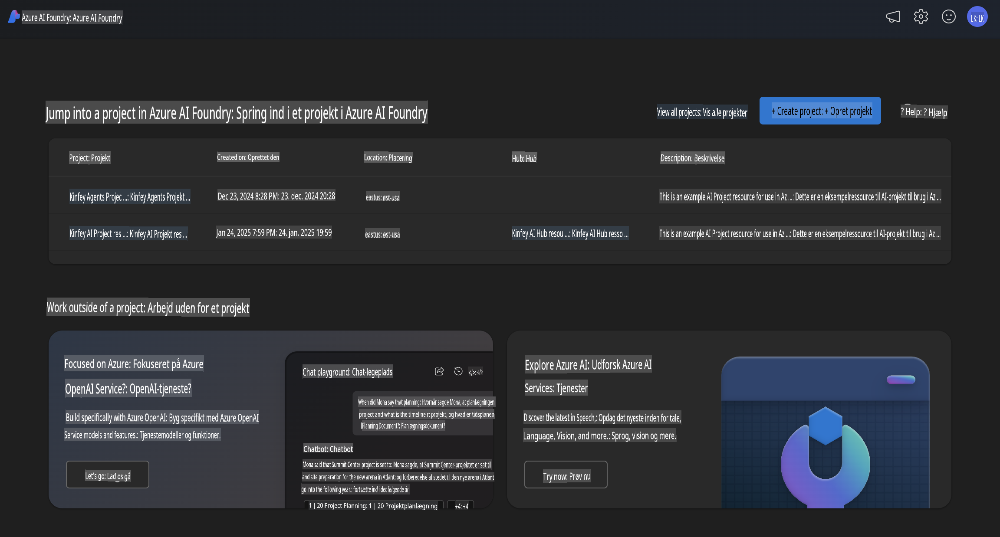
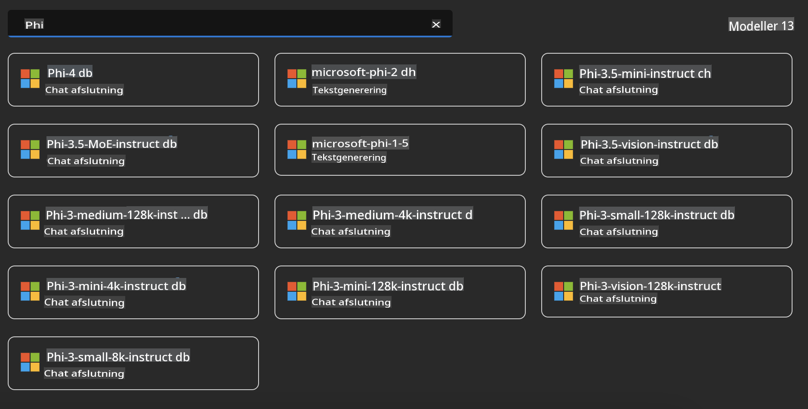
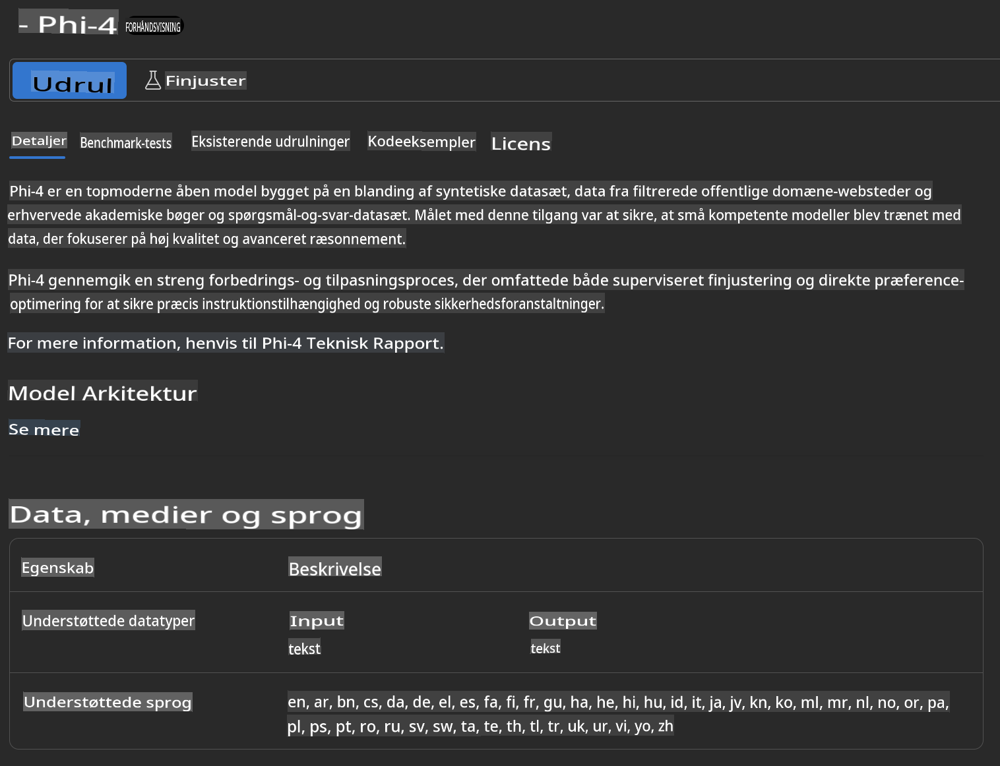
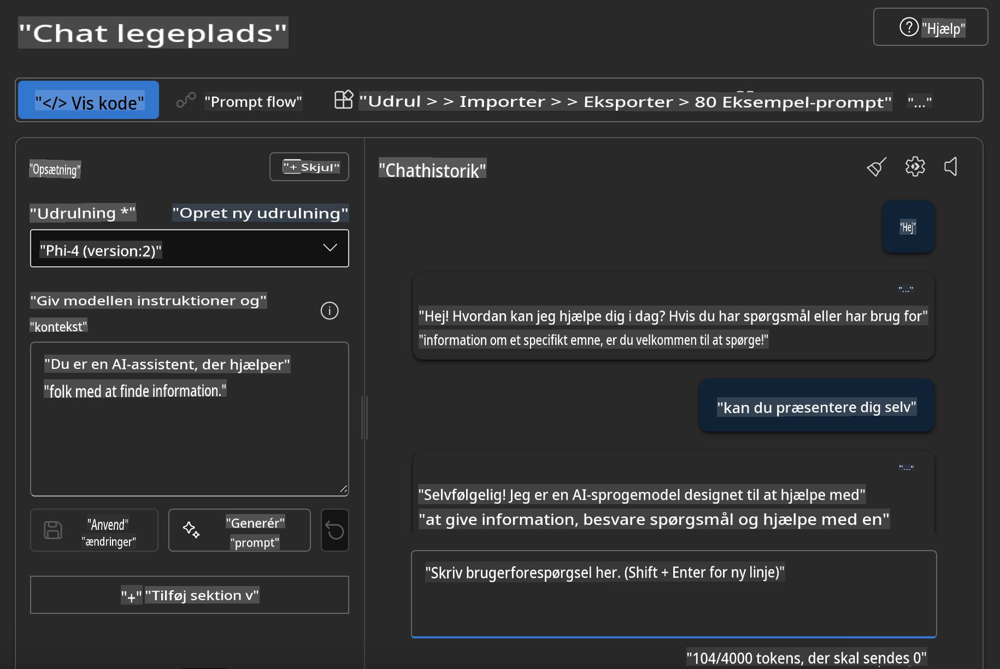

## Phi-familien i Azure AI Foundry

[Azure AI Foundry](https://ai.azure.com) er en pålidelig platform, der giver udviklere mulighed for at drive innovation og forme fremtiden med AI på en sikker, tryg og ansvarlig måde.

[Azure AI Foundry](https://ai.azure.com) er designet til udviklere, så de kan:

- Bygge generative AI-applikationer på en platform i virksomhedsklasse.
- Udforske, udvikle, teste og implementere ved hjælp af avancerede AI-værktøjer og ML-modeller, baseret på ansvarlige AI-principper.
- Samarbejde med et team gennem hele applikationsudviklingens livscyklus.

Med Azure AI Foundry kan du udforske et bredt udvalg af modeller, tjenester og funktioner og begynde at bygge AI-applikationer, der bedst opfylder dine mål. Azure AI Foundry-platformen understøtter skalering, så du nemt kan omdanne proof of concepts til fuldt udviklede produktionsapplikationer. Kontinuerlig overvågning og optimering sikrer langsigtet succes.



Ud over at bruge Azure AOAI Service i Azure AI Foundry kan du også bruge tredjepartsmodeller i Azure AI Foundry Model Catalog. Dette er et godt valg, hvis du ønsker at bruge Azure AI Foundry som din AI-løsningsplatform.

Vi kan hurtigt implementere Phi-familiemodeller via Model Catalog i Azure AI Foundry.



### **Implementer Phi-4 i Azure AI Foundry**



### **Test Phi-4 i Azure AI Foundry Playground**



### **Kør Python-kode for at kalde Azure AI Foundry Phi-4**

```python

import os  
import base64
from openai import AzureOpenAI  
from azure.identity import DefaultAzureCredential, get_bearer_token_provider  
        
endpoint = os.getenv("ENDPOINT_URL", "Your Azure AOAI Service Endpoint")  
deployment = os.getenv("DEPLOYMENT_NAME", "Phi-4")  
      
token_provider = get_bearer_token_provider(  
    DefaultAzureCredential(),  
    "https://cognitiveservices.azure.com/.default"  
)  
  
client = AzureOpenAI(  
    azure_endpoint=endpoint,  
    azure_ad_token_provider=token_provider,  
    api_version="2024-05-01-preview",  
)  
  

chat_prompt = [
    {
        "role": "system",
        "content": "You are an AI assistant that helps people find information."
    },
    {
        "role": "user",
        "content": "can you introduce yourself"
    }
] 
    
# Include speech result if speech is enabled  
messages = chat_prompt 

completion = client.chat.completions.create(  
    model=deployment,  
    messages=messages,
    max_tokens=800,  
    temperature=0.7,  
    top_p=0.95,  
    frequency_penalty=0,  
    presence_penalty=0,
    stop=None,  
    stream=False  
)  
  
print(completion.to_json())  

```

**Ansvarsfraskrivelse**:  
Dette dokument er blevet oversat ved hjælp af AI-baserede maskinoversættelsestjenester. Selvom vi bestræber os på nøjagtighed, bedes du være opmærksom på, at automatiserede oversættelser kan indeholde fejl eller unøjagtigheder. Det originale dokument på dets oprindelige sprog bør betragtes som den autoritative kilde. For kritisk information anbefales professionel menneskelig oversættelse. Vi påtager os intet ansvar for misforståelser eller fejltolkninger, der måtte opstå som følge af brugen af denne oversættelse.