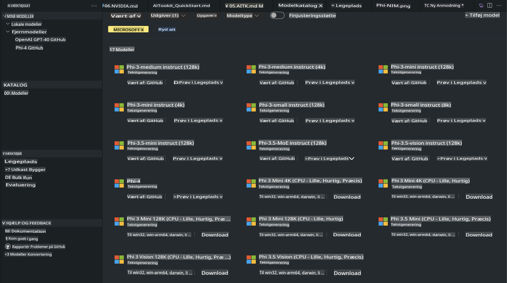

# Phi-familien i AITK

[AI Toolkit for VS Code](https://marketplace.visualstudio.com/items?itemName=ms-windows-ai-studio.windows-ai-studio) gør udviklingen af generative AI-apps nemmere ved at samle avancerede AI-udviklingsværktøjer og modeller fra Azure AI Foundry Catalog og andre kataloger som Hugging Face. Du kan gennemse AI-modelkataloger drevet af GitHub Models og Azure AI Foundry Model Catalogs, downloade dem lokalt eller eksternt, finjustere, teste og bruge dem i din applikation.

AI Toolkit Preview kører lokalt. Lokal inferens eller finjustering afhænger af den model, du vælger, og du kan få brug for en GPU, som fx NVIDIA CUDA GPU. Du kan også køre GitHub-modeller direkte med AITK.

## Kom godt i gang

[Lær mere om, hvordan du installerer Windows Subsystem for Linux](https://learn.microsoft.com/windows/wsl/install?WT.mc_id=aiml-137032-kinfeylo)

og [ændrer standarddistributionen](https://learn.microsoft.com/windows/wsl/install#change-the-default-linux-distribution-installed).

[AI Toolkit GitHub Repo](https://github.com/microsoft/vscode-ai-toolkit/)

- Windows, Linux, macOS
  
- For finjustering på både Windows og Linux skal du bruge en Nvidia GPU. Derudover kræver **Windows** et subsystem for Linux med Ubuntu-distro 18.4 eller nyere. [Lær mere om, hvordan du installerer Windows Subsystem for Linux](https://learn.microsoft.com/windows/wsl/install) og [ændrer standarddistributionen](https://learn.microsoft.com/windows/wsl/install#change-the-default-linux-distribution-installed).

### Installér AI Toolkit

AI Toolkit leveres som en [Visual Studio Code-udvidelse](https://code.visualstudio.com/docs/setup/additional-components#_vs-code-extensions), så du skal først installere [VS Code](https://code.visualstudio.com/docs/setup/windows?WT.mc_id=aiml-137032-kinfeylo) og derefter downloade AI Toolkit fra [VS Marketplace](https://marketplace.visualstudio.com/items?itemName=ms-windows-ai-studio.windows-ai-studio).  
[AI Toolkit er tilgængelig i Visual Studio Marketplace](https://marketplace.visualstudio.com/items?itemName=ms-windows-ai-studio.windows-ai-studio) og kan installeres som enhver anden VS Code-udvidelse.

Hvis du ikke er bekendt med installation af VS Code-udvidelser, kan du følge disse trin:

### Log ind

1. Vælg **Extensions** i Aktivitetslinjen i VS Code.
2. Indtast "AI Toolkit" i søgefeltet for udvidelser.
3. Vælg "AI Toolkit for Visual Studio Code".
4. Klik på **Install**.

Nu er du klar til at bruge udvidelsen!

Du vil blive bedt om at logge ind på GitHub, så klik på "Allow" for at fortsætte. Du vil blive omdirigeret til GitHubs login-side.

Log ind og følg trinnene i processen. Når du har gennemført det, vil du blive omdirigeret tilbage til VS Code.

Når udvidelsen er installeret, vil AI Toolkit-ikonet dukke op i din Aktivitetslinje.

Lad os udforske de tilgængelige handlinger!

### Tilgængelige handlinger

Den primære sidebjælke i AI Toolkit er organiseret i  

- **Models**
- **Resources**
- **Playground**  
- **Fine-tuning**
- **Evaluation**

Disse er tilgængelige i sektionen Resources. For at komme i gang skal du vælge **Model Catalog**.

### Download en model fra kataloget

Når du starter AI Toolkit fra sidebjælken i VS Code, kan du vælge mellem følgende muligheder:



- Find en understøttet model fra **Model Catalog** og download den lokalt.
- Test modelinferens i **Model Playground**.
- Finjuster modellen lokalt eller eksternt i **Model Fine-tuning**.
- Udrul finjusterede modeller til skyen via kommandopaletten for AI Toolkit.
- Evaluer modeller.

> [!NOTE]
>
> **GPU vs CPU**
>
> Du vil bemærke, at modelkortene viser modelstørrelsen, platformen og accelerator-typen (CPU, GPU). For optimeret ydeevne på **Windows-enheder med mindst én GPU**, skal du vælge modelversioner, der kun er målrettet mod Windows.
>
> Dette sikrer, at du har en model optimeret til DirectML-acceleratoren.
>
> Modelnavnene er i formatet
>
> - `{model_name}-{accelerator}-{quantization}-{format}`.
>
>For at tjekke, om du har en GPU på din Windows-enhed, skal du åbne **Task Manager** og derefter vælge fanen **Performance**. Hvis du har GPU’er, vil de være listet under navne som "GPU 0" eller "GPU 1".

### Kør modellen i playground

Når alle parametre er indstillet, skal du klikke på **Generate Project**.

Når din model er downloadet, skal du vælge **Load in Playground** på modelkortet i kataloget:

- Start model-download.
- Installér alle nødvendige forudsætninger og afhængigheder.
- Opret en VS Code-arbejdsplads.


### Brug REST API'en i din applikation 

AI Toolkit leveres med en lokal REST API-webserver **på port 5272**, som bruger [OpenAI chat completions format](https://platform.openai.com/docs/api-reference/chat/create).  

Dette gør det muligt for dig at teste din applikation lokalt uden at være afhængig af en cloud AI-modeltjeneste. For eksempel viser følgende JSON-fil, hvordan du konfigurerer body’en af forespørgslen:

```json
{
    "model": "Phi-4",
    "messages": [
        {
            "role": "user",
            "content": "what is the golden ratio?"
        }
    ],
    "temperature": 0.7,
    "top_p": 1,
    "top_k": 10,
    "max_tokens": 100,
    "stream": true
}
```

Du kan teste REST API’en ved at bruge fx [Postman](https://www.postman.com/) eller CURL (Client URL)-værktøjet:

```bash
curl -vX POST http://127.0.0.1:5272/v1/chat/completions -H 'Content-Type: application/json' -d @body.json
```

### Brug af OpenAI-klientbiblioteket til Python

```python
from openai import OpenAI

client = OpenAI(
    base_url="http://127.0.0.1:5272/v1/", 
    api_key="x" # required for the API but not used
)

chat_completion = client.chat.completions.create(
    messages=[
        {
            "role": "user",
            "content": "what is the golden ratio?",
        }
    ],
    model="Phi-4",
)

print(chat_completion.choices[0].message.content)
```

### Brug af Azure OpenAI-klientbiblioteket til .NET

Tilføj [Azure OpenAI-klientbiblioteket til .NET](https://www.nuget.org/packages/Azure.AI.OpenAI/) til dit projekt via NuGet:

```bash
dotnet add {project_name} package Azure.AI.OpenAI --version 1.0.0-beta.17
```

Tilføj en C#-fil kaldet **OverridePolicy.cs** til dit projekt, og indsæt følgende kode:

```csharp
// OverridePolicy.cs
using Azure.Core.Pipeline;
using Azure.Core;

internal partial class OverrideRequestUriPolicy(Uri overrideUri)
    : HttpPipelineSynchronousPolicy
{
    private readonly Uri _overrideUri = overrideUri;

    public override void OnSendingRequest(HttpMessage message)
    {
        message.Request.Uri.Reset(_overrideUri);
    }
}
```

Indsæt derefter følgende kode i din **Program.cs**-fil:

```csharp
// Program.cs
using Azure.AI.OpenAI;

Uri localhostUri = new("http://localhost:5272/v1/chat/completions");

OpenAIClientOptions clientOptions = new();
clientOptions.AddPolicy(
    new OverrideRequestUriPolicy(localhostUri),
    Azure.Core.HttpPipelinePosition.BeforeTransport);
OpenAIClient client = new(openAIApiKey: "unused", clientOptions);

ChatCompletionsOptions options = new()
{
    DeploymentName = "Phi-4",
    Messages =
    {
        new ChatRequestSystemMessage("You are a helpful assistant. Be brief and succinct."),
        new ChatRequestUserMessage("What is the golden ratio?"),
    }
};

StreamingResponse<StreamingChatCompletionsUpdate> streamingChatResponse
    = await client.GetChatCompletionsStreamingAsync(options);

await foreach (StreamingChatCompletionsUpdate chatChunk in streamingChatResponse)
{
    Console.Write(chatChunk.ContentUpdate);
}
```


## Finjustering med AI Toolkit

- Kom i gang med modelopdagelse og playground.
- Finjustering og inferens ved brug af lokale computerressourcer.
- Fjernfinjustering og inferens ved brug af Azure-ressourcer.

[Finjustering med AI Toolkit](../../03.FineTuning/Finetuning_VSCodeaitoolkit.md)

## AI Toolkit Q&A Ressourcer

Se venligst vores [Q&A-side](https://github.com/microsoft/vscode-ai-toolkit/blob/main/archive/QA.md) for de mest almindelige problemer og løsninger.

**Ansvarsfraskrivelse**:  
Dette dokument er blevet oversat ved hjælp af AI-baserede maskinoversættelsestjenester. Selvom vi bestræber os på nøjagtighed, skal det bemærkes, at automatiserede oversættelser kan indeholde fejl eller unøjagtigheder. Det originale dokument på dets oprindelige sprog bør betragtes som den autoritative kilde. For kritisk information anbefales professionel menneskelig oversættelse. Vi påtager os intet ansvar for eventuelle misforståelser eller fejltolkninger, der måtte opstå ved brugen af denne oversættelse.