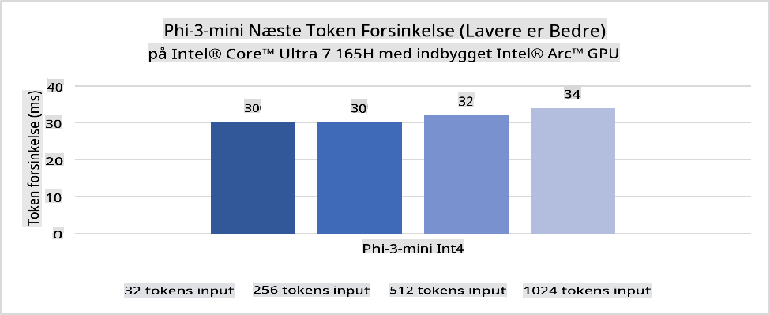
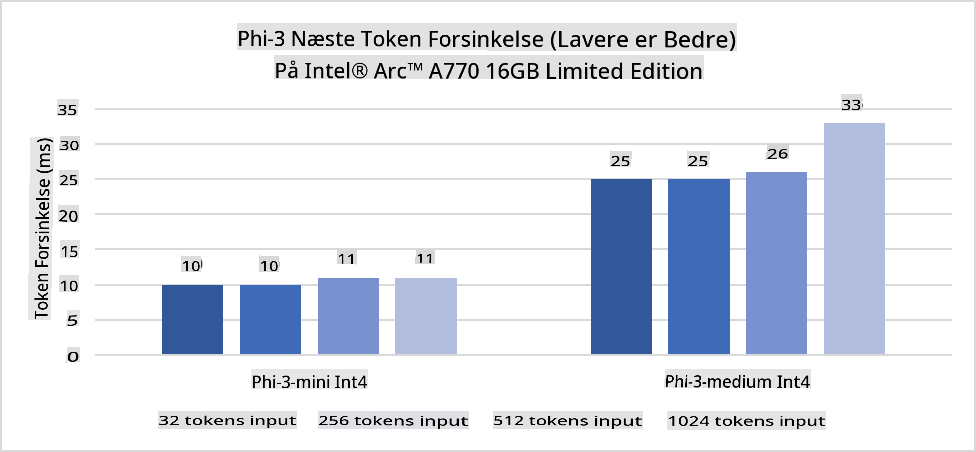
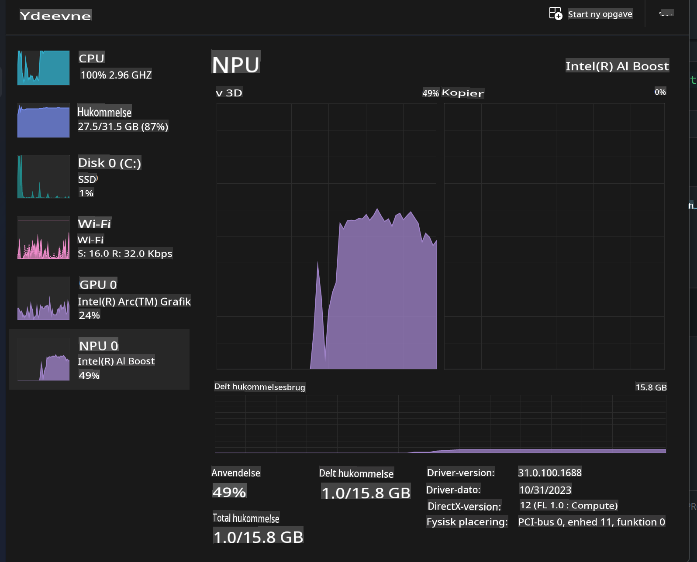
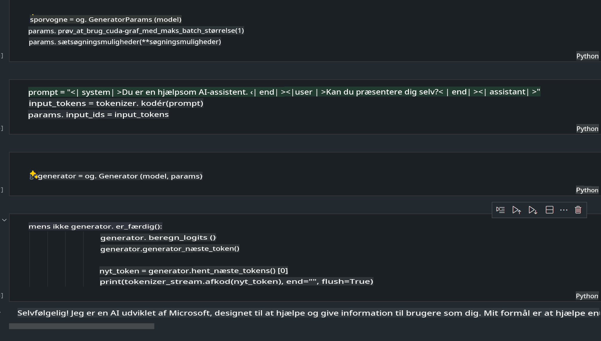
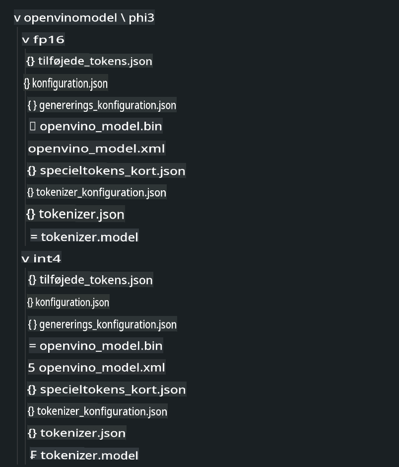
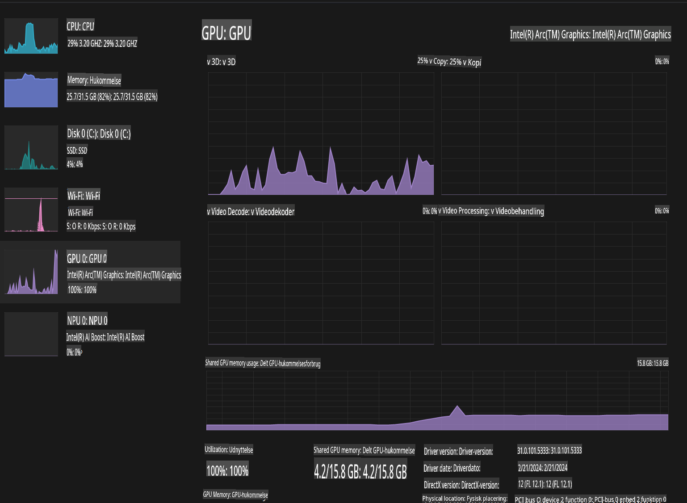

# **Inference Phi-3 i AI PC**

Med udviklingen af generativ AI og forbedringer i hardwarekapaciteten på edge-enheder kan et stigende antal generative AI-modeller nu integreres i brugernes egne enheder (BYOD). AI-PC'er er blandt disse modeller. Fra og med 2024 har Intel, AMD og Qualcomm samarbejdet med PC-producenter om at introducere AI-PC'er, der muliggør implementering af lokale generative AI-modeller gennem hardwaremodifikationer. I denne diskussion fokuserer vi på Intel AI-PC'er og undersøger, hvordan man implementerer Phi-3 på en Intel AI-PC.

### Hvad er en NPU

En NPU (Neural Processing Unit) er en dedikeret processor eller behandlingsenhed på en større SoC, der er designet specifikt til at accelerere neurale netværksoperationer og AI-opgaver. I modsætning til generelle CPU'er og GPU'er er NPUs optimeret til datadrevet parallel computing, hvilket gør dem meget effektive til at behandle store mængder multimediedata som videoer og billeder samt til at bearbejde data til neurale netværk. De er særligt gode til at håndtere AI-relaterede opgaver som talegenkendelse, baggrundssløring i videoopkald og foto- eller videoredigeringsprocesser som objektgenkendelse.

## NPU vs GPU

Mens mange AI- og maskinlæringsopgaver kører på GPU'er, er der en væsentlig forskel mellem GPU'er og NPU'er.  
GPU'er er kendt for deres evne til parallel computing, men ikke alle GPU'er er lige effektive ud over grafisk behandling. NPU'er er derimod specialbygget til komplekse beregninger, der er involveret i neurale netværksoperationer, hvilket gør dem yderst effektive til AI-opgaver.

Kort sagt er NPU'er de matematiske genier, der turbooplader AI-beregninger, og de spiller en nøglerolle i den nye æra af AI-PC'er!

***Dette eksempel er baseret på Intels nyeste Intel Core Ultra-processor***

## **1. Brug NPU til at køre Phi-3-modellen**

Intel® NPU-enheden er en AI-inferensaccelerator integreret med Intels klient-CPU'er, begyndende med Intel® Core™ Ultra-generationen af CPU'er (tidligere kendt som Meteor Lake). Den muliggør energieffektiv udførelse af kunstige neurale netværksopgaver.





**Intel NPU Acceleration Library**

Intel NPU Acceleration Library [https://github.com/intel/intel-npu-acceleration-library](https://github.com/intel/intel-npu-acceleration-library) er et Python-bibliotek designet til at øge effektiviteten af dine applikationer ved at udnytte kraften i Intel Neural Processing Unit (NPU) til at udføre hurtige beregninger på kompatibel hardware.

Eksempel på Phi-3-mini på en AI-PC drevet af Intel® Core™ Ultra-processorer.


Installer Python-biblioteket med pip

```bash

   pip install intel-npu-acceleration-library

```

***Note*** Projektet er stadig under udvikling, men referencemodellen er allerede meget komplet.

### **Kør Phi-3 med Intel NPU Acceleration Library**

Ved at bruge Intel NPU-acceleration påvirker dette bibliotek ikke den traditionelle kodningsproces. Du skal blot bruge dette bibliotek til at kvantisere den oprindelige Phi-3-model, såsom FP16, INT8, INT4, som

```python
from transformers import AutoTokenizer, pipeline,TextStreamer
from intel_npu_acceleration_library import NPUModelForCausalLM, int4
from intel_npu_acceleration_library.compiler import CompilerConfig
import warnings

model_id = "microsoft/Phi-3-mini-4k-instruct"

compiler_conf = CompilerConfig(dtype=int4)
model = NPUModelForCausalLM.from_pretrained(
    model_id, use_cache=True, config=compiler_conf, attn_implementation="sdpa"
).eval()

tokenizer = AutoTokenizer.from_pretrained(model_id)

text_streamer = TextStreamer(tokenizer, skip_prompt=True)
```

Efter kvantiseringen er gennemført, fortsæt med at kalde NPU'en for at køre Phi-3-modellen.

```python
generation_args = {
   "max_new_tokens": 1024,
   "return_full_text": False,
   "temperature": 0.3,
   "do_sample": False,
   "streamer": text_streamer,
}

pipe = pipeline(
   "text-generation",
   model=model,
   tokenizer=tokenizer,
)

query = "<|system|>You are a helpful AI assistant.<|end|><|user|>Can you introduce yourself?<|end|><|assistant|>"

with warnings.catch_warnings():
    warnings.simplefilter("ignore")
    pipe(query, **generation_args)
```

Når koden udføres, kan vi se NPU'ens kørselsstatus via Jobliste.



***Eksempler*** : [AIPC_NPU_DEMO.ipynb](../../../../../code/03.Inference/AIPC/AIPC_NPU_DEMO.ipynb)

## **2. Brug DirectML + ONNX Runtime til at køre Phi-3-modellen**

### **Hvad er DirectML**

[DirectML](https://github.com/microsoft/DirectML) er et højtydende, hardwareaccelereret DirectX 12-bibliotek til maskinlæring. DirectML leverer GPU-acceleration til almindelige maskinlæringsopgaver på en bred vifte af understøttet hardware og drivere, herunder alle DirectX 12-kompatible GPU'er fra leverandører som AMD, Intel, NVIDIA og Qualcomm.

Når det bruges alene, er DirectML API et lavniveau DirectX 12-bibliotek og er velegnet til højtydende, lav-latens applikationer som rammeværk, spil og andre realtidsapplikationer. DirectML's problemfri interoperabilitet med Direct3D 12 samt dets lave overhead og ensartethed på tværs af hardware gør det ideelt til at accelerere maskinlæring, når både høj ydeevne og pålidelighed er afgørende.

***Note*** : Den nyeste DirectML understøtter allerede NPU (https://devblogs.microsoft.com/directx/introducing-neural-processor-unit-npu-support-in-directml-developer-preview/)

### DirectML og CUDA i forhold til deres kapaciteter og ydeevne:

**DirectML** er et maskinlæringsbibliotek udviklet af Microsoft. Det er designet til at accelerere maskinlæringsopgaver på Windows-enheder, herunder desktops, laptops og edge-enheder.
- DX12-baseret: DirectML er bygget oven på DirectX 12 (DX12), hvilket giver bred hardwareunderstøttelse på tværs af GPU'er, inklusive både NVIDIA og AMD.
- Bredere understøttelse: Da det udnytter DX12, kan DirectML arbejde med enhver GPU, der understøtter DX12, selv integrerede GPU'er.
- Billedbehandling: DirectML behandler billeder og andre data ved hjælp af neurale netværk, hvilket gør det velegnet til opgaver som billedgenkendelse, objektgenkendelse og mere.
- Nem opsætning: Opsætning af DirectML er ligetil og kræver ikke specifikke SDK'er eller biblioteker fra GPU-producenter.
- Ydeevne: I nogle tilfælde præsterer DirectML godt og kan være hurtigere end CUDA, især til visse arbejdsbyrder.
- Begrænsninger: Der er dog tilfælde, hvor DirectML kan være langsommere, især for float16-store batchstørrelser.

**CUDA** er NVIDIAs parallelle computingsplatform og programmeringsmodel. Den giver udviklere mulighed for at udnytte kraften i NVIDIA GPU'er til generel computing, herunder maskinlæring og videnskabelige simuleringer.
- NVIDIA-specifik: CUDA er tæt integreret med NVIDIA GPU'er og er specifikt designet til dem.
- Meget optimeret: Det giver fremragende ydeevne til GPU-accelererede opgaver, især når man bruger NVIDIA GPU'er.
- Udbredt: Mange maskinlæringsrammeværk og biblioteker (såsom TensorFlow og PyTorch) understøtter CUDA.
- Tilpasning: Udviklere kan finjustere CUDA-indstillinger til specifikke opgaver, hvilket kan føre til optimal ydeevne.
- Begrænsninger: CUDAs afhængighed af NVIDIA-hardware kan være en begrænsning, hvis man ønsker bredere kompatibilitet på tværs af forskellige GPU'er.

### Valg mellem DirectML og CUDA

Valget mellem DirectML og CUDA afhænger af din specifikke brugssituation, hardwaretilgængelighed og præferencer.  
Hvis du leder efter bredere kompatibilitet og nem opsætning, kan DirectML være et godt valg. Men hvis du har NVIDIA GPU'er og har brug for stærkt optimeret ydeevne, er CUDA stadig en stærk kandidat. Sammenfattende har både DirectML og CUDA deres styrker og svagheder, så overvej dine krav og tilgængelige hardware, når du træffer en beslutning.

### **Generativ AI med ONNX Runtime**

I AI-æraen er portabiliteten af AI-modeller meget vigtig. ONNX Runtime gør det nemt at implementere trænede modeller på forskellige enheder. Udviklere behøver ikke at bekymre sig om inferensrammeværket og kan bruge en ensartet API til at udføre modelinferens. I den generative AI-æra har ONNX Runtime også udført kodeoptimering (https://onnxruntime.ai/docs/genai/). Gennem den optimerede ONNX Runtime kan den kvantiserede generative AI-model køres på forskellige terminaler. Med Generative AI og ONNX Runtime kan du udføre AI-model-API'er via Python, C#, C / C++. Selvfølgelig kan deployment på iPhone drage fordel af C++'s Generative AI med ONNX Runtime API.

[Eksempelkode](https://github.com/Azure-Samples/Phi-3MiniSamples/tree/main/onnx)

***Kompilér generativ AI med ONNX Runtime-bibliotek***

```bash

winget install --id=Kitware.CMake  -e

git clone https://github.com/microsoft/onnxruntime.git

cd .\onnxruntime\

./build.bat --build_shared_lib --skip_tests --parallel --use_dml --config Release

cd ../

git clone https://github.com/microsoft/onnxruntime-genai.git

cd .\onnxruntime-genai\

mkdir ort

cd ort

mkdir include

mkdir lib

copy ..\onnxruntime\include\onnxruntime\core\providers\dml\dml_provider_factory.h ort\include

copy ..\onnxruntime\include\onnxruntime\core\session\onnxruntime_c_api.h ort\include

copy ..\onnxruntime\build\Windows\Release\Release\*.dll ort\lib

copy ..\onnxruntime\build\Windows\Release\Release\onnxruntime.lib ort\lib

python build.py --use_dml


```

**Installer bibliotek**

```bash

pip install .\onnxruntime_genai_directml-0.3.0.dev0-cp310-cp310-win_amd64.whl

```

Dette er kørselsresultatet 



***Eksempler*** : [AIPC_DirectML_DEMO.ipynb](../../../../../code/03.Inference/AIPC/AIPC_DirectML_DEMO.ipynb)

## **3. Brug Intel OpenVino til at køre Phi-3-modellen**

### **Hvad er OpenVINO**

[OpenVINO](https://github.com/openvinotoolkit/openvino) er et open-source værktøjssæt til optimering og implementering af dybe læringsmodeller. Det giver forbedret dyb læringsydelse til modeller inden for vision, lyd og sprog fra populære rammeværk som TensorFlow, PyTorch og flere. Kom i gang med OpenVINO. OpenVINO kan også bruges i kombination med CPU og GPU til at køre Phi-3-modellen.

***Note***: OpenVINO understøtter i øjeblikket ikke NPU.

### **Installer OpenVINO-bibliotek**

```bash

 pip install git+https://github.com/huggingface/optimum-intel.git

 pip install git+https://github.com/openvinotoolkit/nncf.git

 pip install openvino-nightly

```

### **Kør Phi-3 med OpenVINO**

Ligesom med NPU fuldfører OpenVINO kørslen af generative AI-modeller ved at køre kvantiserede modeller. Vi skal først kvantisere Phi-3-modellen og fuldføre modelkvantiseringen via kommandolinjen med optimum-cli.

**INT4**

```bash

optimum-cli export openvino --model "microsoft/Phi-3-mini-4k-instruct" --task text-generation-with-past --weight-format int4 --group-size 128 --ratio 0.6  --sym  --trust-remote-code ./openvinomodel/phi3/int4

```

**FP16**

```bash

optimum-cli export openvino --model "microsoft/Phi-3-mini-4k-instruct" --task text-generation-with-past --weight-format fp16 --trust-remote-code ./openvinomodel/phi3/fp16

```

Det konverterede format ser sådan ud



Indlæs modelstier (model_dir), relaterede konfigurationer (ov_config = {"PERFORMANCE_HINT": "LATENCY", "NUM_STREAMS": "1", "CACHE_DIR": ""}) og hardwareaccelererede enheder (GPU.0) gennem OVModelForCausalLM.

```python

ov_model = OVModelForCausalLM.from_pretrained(
     model_dir,
     device='GPU.0',
     ov_config=ov_config,
     config=AutoConfig.from_pretrained(model_dir, trust_remote_code=True),
     trust_remote_code=True,
)

```

Når koden udføres, kan vi se GPU'ens kørselsstatus via Jobliste.



***Eksempler*** : [AIPC_OpenVino_Demo.ipynb](../../../../../code/03.Inference/AIPC/AIPC_OpenVino_Demo.ipynb)

### ***Note*** : De tre ovenstående metoder har hver deres fordele, men det anbefales at bruge NPU-acceleration til AI-PC-inferens.

**Ansvarsfraskrivelse**:  
Dette dokument er blevet oversat ved hjælp af AI-baserede maskinoversættelsestjenester. Selvom vi bestræber os på at sikre nøjagtighed, skal du være opmærksom på, at automatiserede oversættelser kan indeholde fejl eller unøjagtigheder. Det originale dokument på dets oprindelige sprog bør betragtes som den autoritative kilde. For kritisk information anbefales professionel menneskelig oversættelse. Vi påtager os intet ansvar for misforståelser eller fejltolkninger, der opstår som følge af brugen af denne oversættelse.