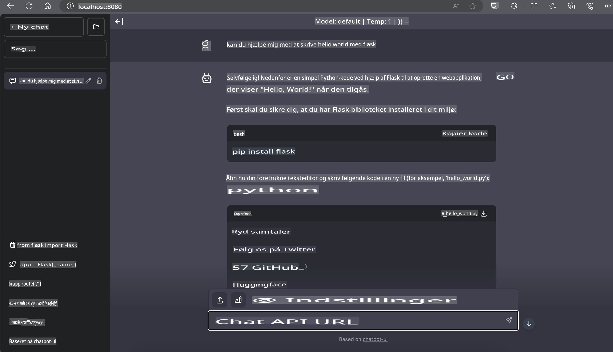

# **Inference Phi-3 på Nvidia Jetson**

Nvidia Jetson er en serie af indlejrede computerenheder fra Nvidia. Jetson TK1, TX1 og TX2 modellerne er alle udstyret med en Tegra-processor (eller SoC) fra Nvidia, som integrerer en central behandlingsenhed (CPU) med ARM-arkitektur. Jetson er et lavenergisystem designet til at accelerere maskinlæringsapplikationer. Nvidia Jetson bruges af professionelle udviklere til at skabe banebrydende AI-produkter på tværs af alle industrier og af studerende og entusiaster til praktisk AI-læring og spændende projekter. SLM implementeres i edge-enheder som Jetson, hvilket muliggør bedre anvendelse af industrielle generative AI-scenarier.

## Implementering på NVIDIA Jetson:
Udviklere, der arbejder med autonome robotter og indlejrede enheder, kan drage fordel af Phi-3 Mini. Phi-3's relativt lille størrelse gør den ideel til edge-implementering. Parametrene er blevet omhyggeligt finjusteret under træning, hvilket sikrer høj præcision i svarene.

### TensorRT-LLM Optimering:
NVIDIA's [TensorRT-LLM-bibliotek](https://github.com/NVIDIA/TensorRT-LLM?WT.mc_id=aiml-138114-kinfeylo) optimerer inferens af store sprogmodeller. Det understøtter Phi-3 Mini's lange kontekstvindue og forbedrer både throughput og latenstid. Optimeringerne inkluderer teknikker som LongRoPE, FP8 og inflight batching.

### Tilgængelighed og Implementering:
Udviklere kan udforske Phi-3 Mini med det 128K kontekstvindue på [NVIDIA's AI](https://www.nvidia.com/en-us/ai-data-science/generative-ai/). Det leveres som en NVIDIA NIM, en mikrotjeneste med et standard-API, der kan implementeres hvor som helst. Desuden findes [TensorRT-LLM-implementeringerne på GitHub](https://github.com/NVIDIA/TensorRT-LLM).

## **1. Forberedelse**

a. Jetson Orin NX / Jetson NX

b. JetPack 5.1.2+

c. Cuda 11.8

d. Python 3.8+

## **2. Kørsel af Phi-3 på Jetson**

Vi kan vælge [Ollama](https://ollama.com) eller [LlamaEdge](https://llamaedge.com).

Hvis du ønsker at bruge gguf i både cloud- og edge-enheder samtidig, kan LlamaEdge forstås som WasmEdge (WasmEdge er en letvægts, højtydende og skalerbar WebAssembly-runtime, der er velegnet til cloud-native, edge og decentraliserede applikationer. Den understøtter serverløse applikationer, indlejrede funktioner, mikrotjenester, smartkontrakter og IoT-enheder). Du kan implementere gguf's kvantitative model på edge-enheder og i skyen via LlamaEdge.


Her er trinene til at bruge det:

1. Installer og download relaterede biblioteker og filer

```bash

curl -sSf https://raw.githubusercontent.com/WasmEdge/WasmEdge/master/utils/install.sh | bash -s -- --plugin wasi_nn-ggml

curl -LO https://github.com/LlamaEdge/LlamaEdge/releases/latest/download/llama-api-server.wasm

curl -LO https://github.com/LlamaEdge/chatbot-ui/releases/latest/download/chatbot-ui.tar.gz

tar xzf chatbot-ui.tar.gz

```

**Bemærk**: llama-api-server.wasm og chatbot-ui skal være i samme mappe.

2. Kør scripts i terminalen

```bash

wasmedge --dir .:. --nn-preload default:GGML:AUTO:{Your gguf path} llama-api-server.wasm -p phi-3-chat

```

Her er kørselsresultatet:



***Eksempelkode*** [Phi-3 mini WASM Notebook Eksempel](https://github.com/Azure-Samples/Phi-3MiniSamples/tree/main/wasm)

Sammenfattende repræsenterer Phi-3 Mini et stort fremskridt inden for sprogmodellering og kombinerer effektivitet, kontekstforståelse og NVIDIA's optimeringsstyrke. Uanset om du bygger robotter eller edge-applikationer, er Phi-3 Mini et kraftfuldt værktøj, du bør kende til.

**Ansvarsfraskrivelse**:  
Dette dokument er blevet oversat ved hjælp af maskinbaserede AI-oversættelsestjenester. Selvom vi bestræber os på nøjagtighed, skal det bemærkes, at automatiserede oversættelser kan indeholde fejl eller unøjagtigheder. Det originale dokument på dets oprindelige sprog bør betragtes som den autoritative kilde. For kritisk information anbefales professionel menneskelig oversættelse. Vi påtager os intet ansvar for misforståelser eller fejltolkninger, der måtte opstå som følge af brugen af denne oversættelse.