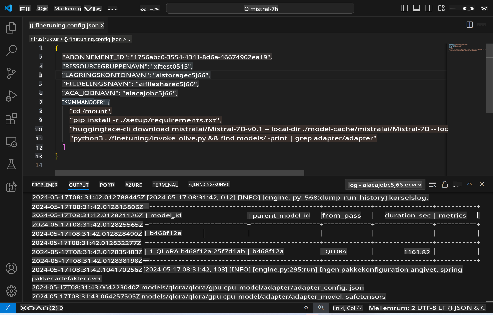
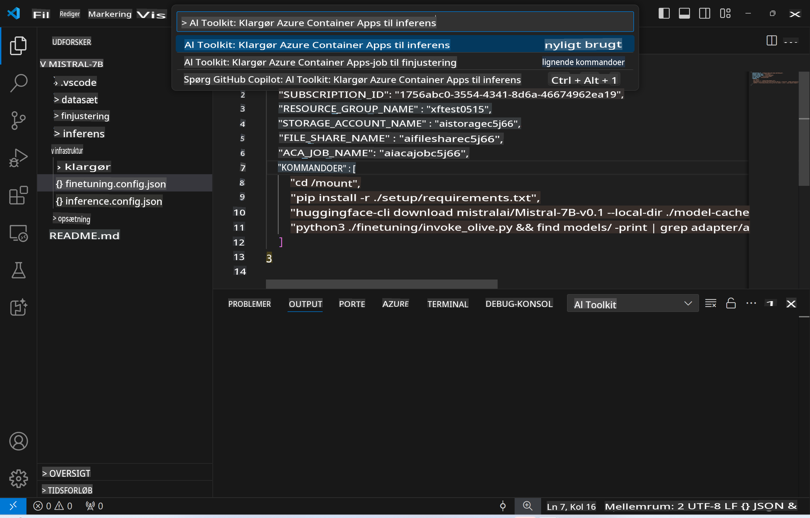
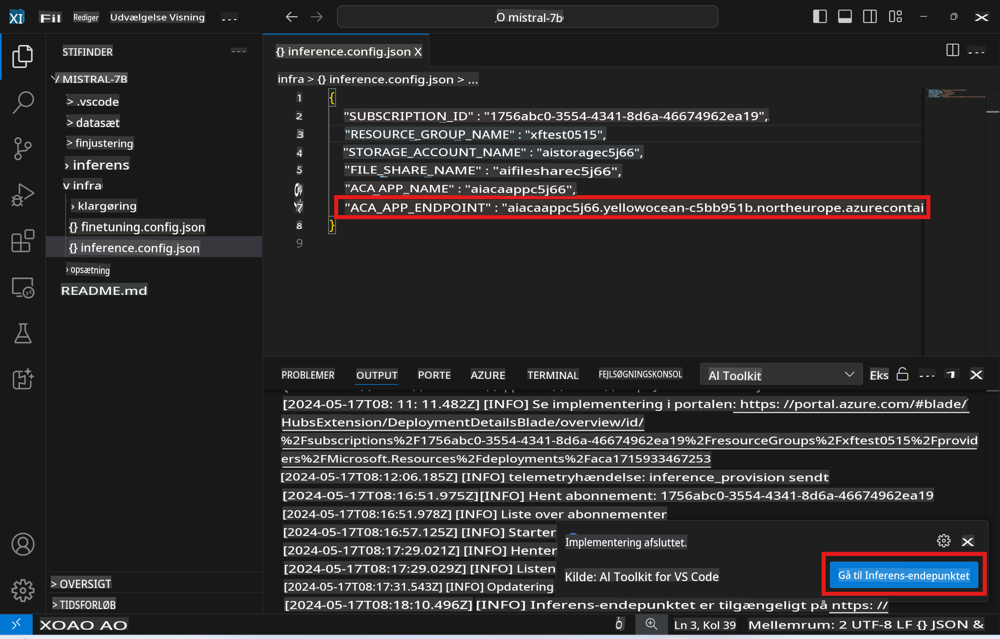

# Fjerninferens med den finjusterede model

Når adapterne er trænet i det fjernmiljø, kan du bruge en simpel Gradio-applikation til at interagere med modellen.



### Opret Azure-ressourcer
Du skal opsætte Azure-ressourcerne til fjerninferens ved at udføre `AI Toolkit: Provision Azure Container Apps for inference` fra kommandopaletten. Under opsætningen vil du blive bedt om at vælge dit Azure-abonnement og ressourcegruppe.  


Som standard skal abonnementet og ressourcegruppen til inferens matche dem, der blev brugt til finjustering. Inferensen vil bruge det samme Azure Container App-miljø og få adgang til modellen og modeladapteren, der er gemt i Azure Files, og som blev genereret under finjusteringsprocessen.

## Brug af AI Toolkit 

### Udrulning til inferens  
Hvis du ønsker at revidere inferenskoden eller genindlæse inferensmodellen, skal du udføre kommandoen `AI Toolkit: Deploy for inference`. Dette vil synkronisere din seneste kode med ACA og genstarte replikaen.


Når udrulningen er fuldført, er modellen klar til evaluering via denne endpoint.

### Adgang til inferens-API'en

Du kan få adgang til inferens-API'en ved at klikke på knappen "*Gå til inferens-endpoint*" i VSCode-meddelelsen. Alternativt kan web-API-endpointet findes under `ACA_APP_ENDPOINT` i `./infra/inference.config.json` og i output-panelet.



> **Bemærk:** Det kan tage et par minutter, før inferens-endpointet er fuldt operationelt.

## Inferenskomponenter inkluderet i skabelonen
 
| Mappe | Indhold |
| ------ |--------- |
| `infra` | Indeholder alle nødvendige konfigurationer til fjernoperationer. |
| `infra/provision/inference.parameters.json` | Indeholder parametre til bicep-skabelonerne, der bruges til at oprette Azure-ressourcer til inferens. |
| `infra/provision/inference.bicep` | Indeholder skabeloner til oprettelse af Azure-ressourcer til inferens. |
| `infra/inference.config.json` | Konfigurationsfilen, der genereres af kommandoen `AI Toolkit: Provision Azure Container Apps for inference`. Den bruges som input til andre fjernkommando-paletter. |

### Brug af AI Toolkit til at konfigurere Azure-ressourceoprettelse
Konfigurer [AI Toolkit](https://marketplace.visualstudio.com/items?itemName=ms-windows-ai-studio.windows-ai-studio)

Opret Azure Container Apps til inferens` command.

You can find configuration parameters in `./infra/provision/inference.parameters.json` file. Here are the details:
| Parameter | Description |
| --------- |------------ |
| `defaultCommands` | This is the commands to initiate a web API. |
| `maximumInstanceCount` | This parameter sets the maximum capacity of GPU instances. |
| `location` | This is the location where Azure resources are provisioned. The default value is the same as the chosen resource group's location. |
| `storageAccountName`, `fileShareName` `acaEnvironmentName`, `acaEnvironmentStorageName`, `acaAppName`,  `acaLogAnalyticsName` | These parameters are used to name the Azure resources for provision. By default, they will be same to the fine-tuning resource name. You can input a new, unused resource name to create your own custom-named resources, or you can input the name of an already existing Azure resource if you'd prefer to use that. For details, refer to the section [Using existing Azure Resources](../../../../../md/01.Introduction/03). |

### Using Existing Azure Resources

By default, the inference provision use the same Azure Container App Environment, Storage Account, Azure File Share, and Azure Log Analytics that were used for fine-tuning. A separate Azure Container App is created solely for the inference API. 

If you have customized the Azure resources during the fine-tuning step or want to use your own existing Azure resources for inference, specify their names in the `./infra/inference.parameters.json` filen. Kør derefter kommandoen `AI Toolkit: Provision Azure Container Apps for inference` fra kommandopaletten. Dette opdaterer de angivne ressourcer og opretter eventuelle manglende.

For eksempel, hvis du allerede har et eksisterende Azure-container-miljø, skal din `./infra/finetuning.parameters.json` se sådan ud:

```json
{
    "$schema": "https://schema.management.azure.com/schemas/2019-04-01/deploymentParameters.json#",
    "contentVersion": "1.0.0.0",
    "parameters": {
      ...
      "acaEnvironmentName": {
        "value": "<your-aca-env-name>"
      },
      "acaEnvironmentStorageName": {
        "value": null
      },
      ...
    }
  }
```

### Manuel oprettelse  
Hvis du foretrækker manuelt at konfigurere Azure-ressourcerne, kan du bruge de medfølgende bicep-filer i `./infra/provision` folders. If you have already set up and configured all the Azure resources without using the AI Toolkit command palette, you can simply enter the resource names in the `inference.config.json` filen.

For eksempel:

```json
{
  "SUBSCRIPTION_ID": "<your-subscription-id>",
  "RESOURCE_GROUP_NAME": "<your-resource-group-name>",
  "STORAGE_ACCOUNT_NAME": "<your-storage-account-name>",
  "FILE_SHARE_NAME": "<your-file-share-name>",
  "ACA_APP_NAME": "<your-aca-name>",
  "ACA_APP_ENDPOINT": "<your-aca-endpoint>"
}
```

**Ansvarsfraskrivelse**:  
Dette dokument er blevet oversat ved hjælp af AI-baserede maskinoversættelsestjenester. Selvom vi bestræber os på at sikre nøjagtighed, bedes du være opmærksom på, at automatiserede oversættelser kan indeholde fejl eller unøjagtigheder. Det oprindelige dokument på dets oprindelige sprog bør betragtes som den autoritative kilde. For kritisk information anbefales professionel menneskelig oversættelse. Vi påtager os intet ansvar for eventuelle misforståelser eller fejltolkninger, der måtte opstå ved brug af denne oversættelse.