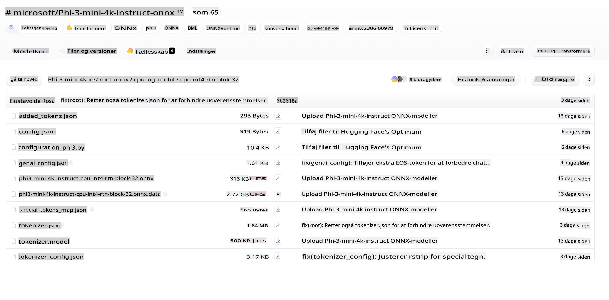
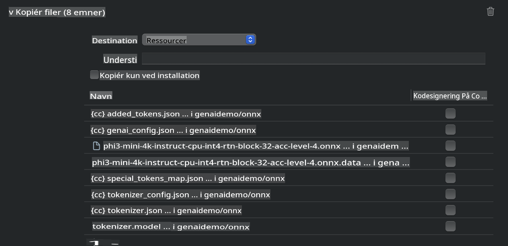
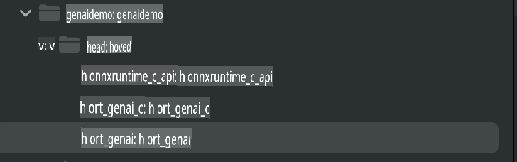
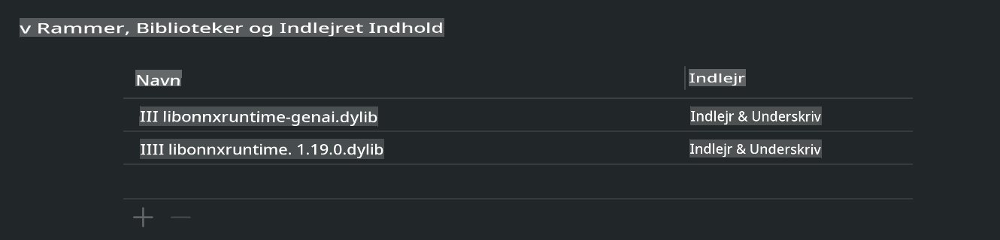
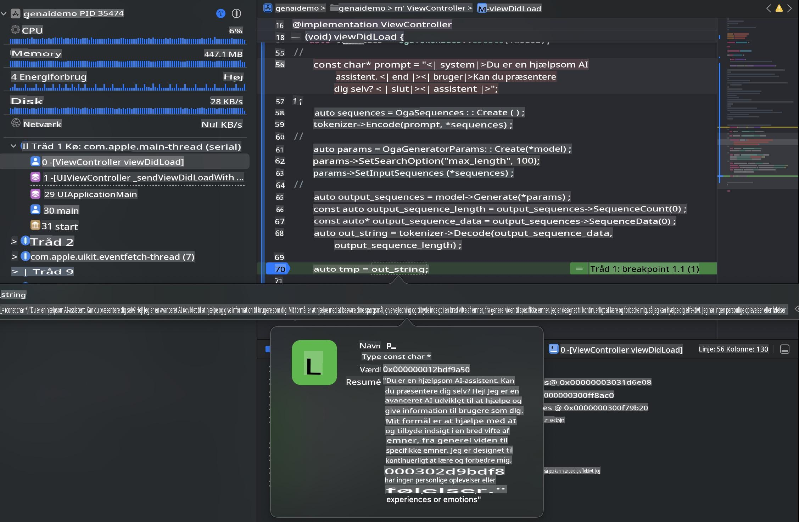

# **Inference Phi-3 på iOS**

Phi-3-mini er en ny serie af modeller fra Microsoft, der muliggør implementering af Large Language Models (LLMs) på edge-enheder og IoT-enheder. Phi-3-mini er tilgængelig til iOS, Android og edge-enheder, hvilket gør det muligt at implementere generativ AI i BYOD-miljøer. Følgende eksempel viser, hvordan man implementerer Phi-3-mini på iOS.

## **1. Forberedelse**

- **a.** macOS 14+
- **b.** Xcode 15+
- **c.** iOS SDK 17.x (iPhone 14 A16 eller nyere)
- **d.** Installer Python 3.10+ (Conda anbefales)
- **e.** Installer Python-biblioteket: `python-flatbuffers`
- **f.** Installer CMake

### Semantic Kernel og inferens

Semantic Kernel er et applikationsframework, der giver dig mulighed for at skabe applikationer, der er kompatible med Azure OpenAI Service, OpenAI-modeller og endda lokale modeller. Ved at tilgå lokale tjenester gennem Semantic Kernel kan du nemt integrere din selvhostede Phi-3-mini modelserver.

### Kald af kvantiserede modeller med Ollama eller LlamaEdge

Mange brugere foretrækker at bruge kvantiserede modeller til at køre modeller lokalt. [Ollama](https://ollama.com) og [LlamaEdge](https://llamaedge.com) giver brugere mulighed for at kalde forskellige kvantiserede modeller:

#### **Ollama**

Du kan køre `ollama run phi3` direkte eller konfigurere det offline. Opret en Modelfile med stien til din `gguf` fil. Eksempel på kode til at køre Phi-3-mini kvantiseret model:

```gguf
FROM {Add your gguf file path}
TEMPLATE \"\"\"<|user|> .Prompt<|end|> <|assistant|>\"\"\"
PARAMETER stop <|end|>
PARAMETER num_ctx 4096
```

#### **LlamaEdge**

Hvis du ønsker at bruge `gguf` både i skyen og på edge-enheder samtidig, er LlamaEdge en fremragende mulighed.

## **2. Kompilering af ONNX Runtime til iOS**

```bash

git clone https://github.com/microsoft/onnxruntime.git

cd onnxruntime

./build.sh --build_shared_lib --ios --skip_tests --parallel --build_dir ./build_ios --ios --apple_sysroot iphoneos --osx_arch arm64 --apple_deploy_target 17.5 --cmake_generator Xcode --config Release

cd ../

```

### **Bemærk**

- **a.** Før kompilering skal du sikre dig, at Xcode er korrekt konfigureret, og indstil det som den aktive udviklerdirectory i terminalen:

    ```bash
    sudo xcode-select -switch /Applications/Xcode.app/Contents/Developer
    ```

- **b.** ONNX Runtime skal kompileres til forskellige platforme. For iOS kan du kompilere til `arm64` or `x86_64`.

- **c.** Det anbefales at bruge den nyeste iOS SDK til kompilering. Du kan dog også bruge en ældre version, hvis du har brug for kompatibilitet med tidligere SDK'er.

## **3. Kompilering af Generativ AI med ONNX Runtime til iOS**

> **Note:** Da Generativ AI med ONNX Runtime er i preview, skal du være opmærksom på potentielle ændringer.

```bash

git clone https://github.com/microsoft/onnxruntime-genai
 
cd onnxruntime-genai
 
mkdir ort
 
cd ort
 
mkdir include
 
mkdir lib
 
cd ../
 
cp ../onnxruntime/include/onnxruntime/core/session/onnxruntime_c_api.h ort/include
 
cp ../onnxruntime/build_ios/Release/Release-iphoneos/libonnxruntime*.dylib* ort/lib
 
export OPENCV_SKIP_XCODEBUILD_FORCE_TRYCOMPILE_DEBUG=1
 
python3 build.py --parallel --build_dir ./build_ios --ios --ios_sysroot iphoneos --ios_arch arm64 --ios_deployment_target 17.5 --cmake_generator Xcode --cmake_extra_defines CMAKE_XCODE_ATTRIBUTE_CODE_SIGNING_ALLOWED=NO

```

## **4. Opret en App-applikation i Xcode**

Jeg valgte Objective-C som udviklingsmetode for appen, fordi Generativ AI med ONNX Runtime C++ API er bedre kompatibelt med Objective-C. Selvfølgelig kan du også gennemføre relaterede kald via Swift bridging.


## **5. Kopiér ONNX kvantiseret INT4-model til app-projektet**

Vi skal importere INT4-kvantiseringsmodellen i ONNX-format, som først skal downloades.



Efter download skal du tilføje den til projektets Resources-mappe i Xcode.



## **6. Tilføjelse af C++ API i ViewControllers**

> **Bemærk:**

- **a.** Tilføj de tilsvarende C++ headerfiler til projektet.

  

- **b.** Inkluder `onnxruntime-genai` dynamic library in Xcode.

  

- **c.** Use the C Samples code for testing. You can also add additional features like ChatUI for more functionality.

- **d.** Since you need to use C++ in your project, rename `ViewController.m` to `ViewController.mm` for at aktivere Objective-C++ support.

```objc

    NSString *llmPath = [[NSBundle mainBundle] resourcePath];
    char const *modelPath = llmPath.cString;

    auto model =  OgaModel::Create(modelPath);

    auto tokenizer = OgaTokenizer::Create(*model);

    const char* prompt = "<|system|>You are a helpful AI assistant.<|end|><|user|>Can you introduce yourself?<|end|><|assistant|>";

    auto sequences = OgaSequences::Create();
    tokenizer->Encode(prompt, *sequences);

    auto params = OgaGeneratorParams::Create(*model);
    params->SetSearchOption("max_length", 100);
    params->SetInputSequences(*sequences);

    auto output_sequences = model->Generate(*params);
    const auto output_sequence_length = output_sequences->SequenceCount(0);
    const auto* output_sequence_data = output_sequences->SequenceData(0);
    auto out_string = tokenizer->Decode(output_sequence_data, output_sequence_length);
    
    auto tmp = out_string;

```

## **7. Kørsel af applikationen**

Når opsætningen er færdig, kan du køre applikationen for at se resultaterne af Phi-3-mini modelinferensen.



For mere eksempel-kode og detaljerede instruktioner, besøg [Phi-3 Mini Samples repository](https://github.com/Azure-Samples/Phi-3MiniSamples/tree/main/ios).

**Ansvarsfraskrivelse**:  
Dette dokument er blevet oversat ved hjælp af maskinbaserede AI-oversættelsestjenester. Selvom vi bestræber os på nøjagtighed, skal du være opmærksom på, at automatiserede oversættelser kan indeholde fejl eller unøjagtigheder. Det originale dokument på dets oprindelige sprog bør betragtes som den autoritative kilde. For kritisk information anbefales professionel menneskelig oversættelse. Vi påtager os intet ansvar for misforståelser eller fejltolkninger, der måtte opstå som følge af brugen af denne oversættelse.