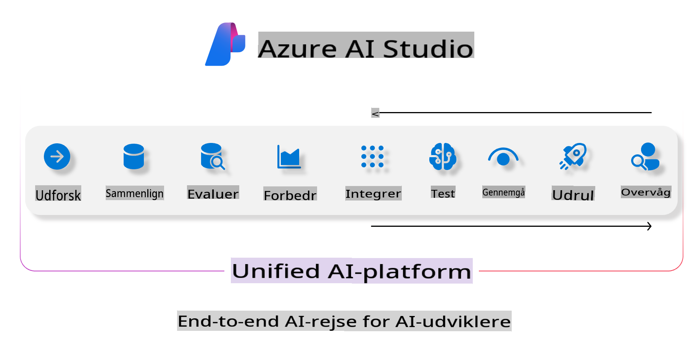
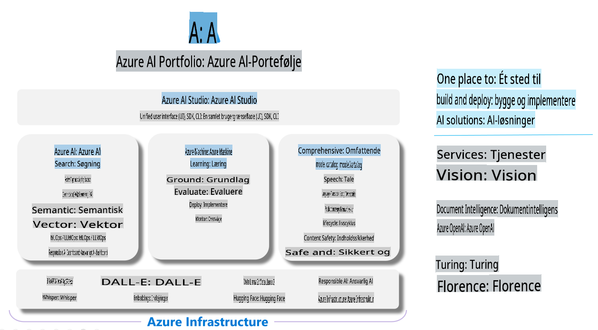

# **Brug af Azure AI Foundry til evaluering**

Sådan evaluerer du din generative AI-applikation ved hjælp af [Azure AI Foundry](https://ai.azure.com?WT.mc_id=aiml-138114-kinfeylo). Uanset om du vurderer enkelt-turn eller multi-turn samtaler, tilbyder Azure AI Foundry værktøjer til at evaluere modelpræstation og sikkerhed.

## Sådan evaluerer du generative AI-apps med Azure AI Foundry
For mere detaljerede instruktioner, se [Azure AI Foundry Dokumentationen](https://learn.microsoft.com/azure/ai-studio/how-to/evaluate-generative-ai-app?WT.mc_id=aiml-138114-kinfeylo)

Her er trinnene for at komme i gang:

## Evaluering af generative AI-modeller i Azure AI Foundry

**Forudsætninger**

- Et testdatasæt i enten CSV- eller JSON-format.
- En implementeret generativ AI-model (såsom Phi-3, GPT 3.5, GPT 4 eller Davinci-modeller).
- En runtime med en compute-instans til at køre evalueringen.

## Indbyggede evalueringsmetrikker

Azure AI Foundry giver dig mulighed for at evaluere både enkelt-turn og komplekse, multi-turn samtaler.  
For Retrieval Augmented Generation (RAG)-scenarier, hvor modellen er baseret på specifikke data, kan du vurdere præstationen ved hjælp af indbyggede evalueringsmetrikker.  
Derudover kan du evaluere generelle enkelt-turn spørgsmål-svar-scenarier (ikke-RAG).

## Oprettelse af en evalueringskørsel

Fra Azure AI Foundry UI skal du navigere til enten Evaluate-siden eller Prompt Flow-siden.  
Følg guiden til oprettelse af evalueringen for at opsætte en evalueringskørsel. Giv en valgfri titel til din evaluering.  
Vælg det scenarie, der passer til din applikations mål.  
Vælg en eller flere evalueringsmetrikker til at vurdere modellens output.

## Tilpasset evalueringsflow (valgfrit)

For større fleksibilitet kan du etablere et tilpasset evalueringsflow. Tilpas evalueringsprocessen baseret på dine specifikke behov.

## Visning af resultater

Efter at have kørt evalueringen kan du logge, se og analysere detaljerede evalueringsmetrikker i Azure AI Foundry. Få indsigt i din applikations kapaciteter og begrænsninger.

**Bemærk** Azure AI Foundry er i øjeblikket i offentlig preview, så brug det til eksperimentering og udviklingsformål. Til produktionsarbejdsbelastninger bør du overveje andre muligheder. Udforsk den officielle [AI Foundry dokumentation](https://learn.microsoft.com/azure/ai-studio/?WT.mc_id=aiml-138114-kinfeylo) for flere detaljer og trin-for-trin instruktioner.

**Ansvarsfraskrivelse**:  
Dette dokument er blevet oversat ved hjælp af AI-baserede maskinoversættelsestjenester. Selvom vi bestræber os på nøjagtighed, skal det bemærkes, at automatiserede oversættelser kan indeholde fejl eller unøjagtigheder. Det originale dokument på dets oprindelige sprog bør betragtes som den autoritative kilde. For kritisk information anbefales professionel menneskelig oversættelse. Vi påtager os intet ansvar for misforståelser eller fejltolkninger, der måtte opstå som følge af brugen af denne oversættelse.